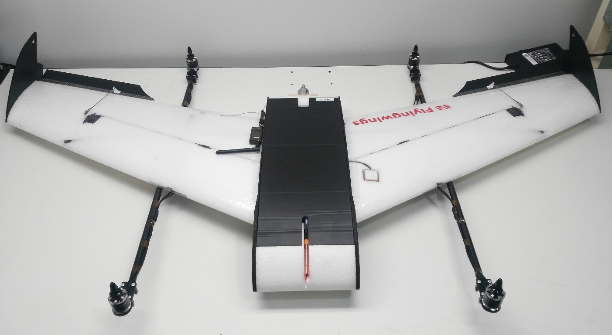
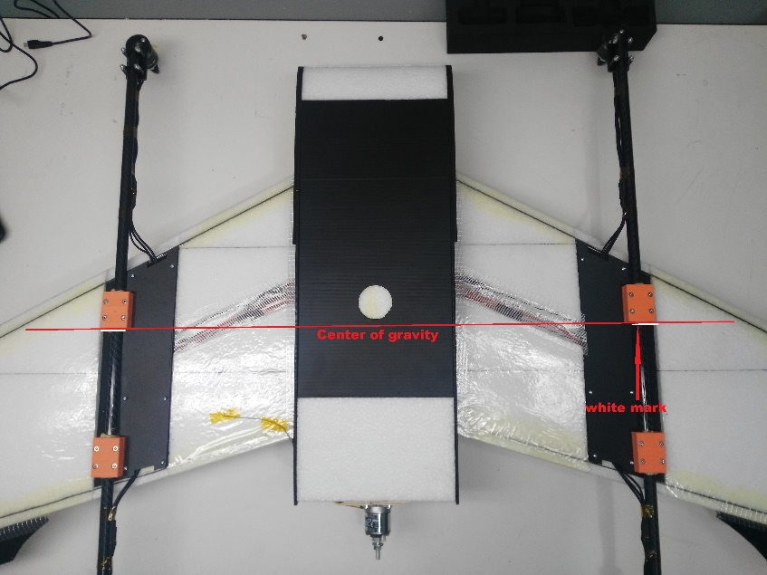
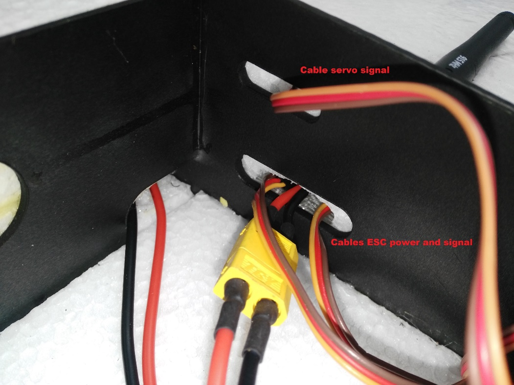
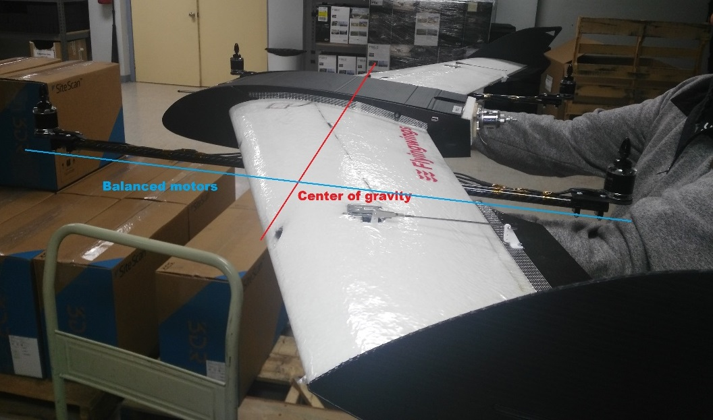

# 단종 : Falcon Vertigo Hybrid VTOL RTF (Dropix)

:::warning
Discontinued
The Falcon Venturi FPV Wing frame on which this vehicle is based is no longer available.
:::

The _Falcon Vertigo Hybrid VTOL_ is a quadplane VTOL aircraft that has been designed to work with PX4 and the Dropix (Pixhawk compatible) flight controller. 소형 GoPro 카메라를 장착할 수 있습니다.

RTF 키트에는 RC 수신기와 텔레메트리를 제외하고, 시스템에 필요한 부품들이 포함되어 있습니다.
부품들을 별도로 구매할 수 있습니다.

주요 정보:

- **Frame:** Falcon Vertigo Hybrid VTOL
- **Flight controller:** Dropix
- **Wing span:** 1.3m

## 부품 명세서

필요한 대부분의 부품들이 RTF 키트에 포함되어 있습니다. 부품을 별도 구매하는 경우에는, 아래 부품 목록의 링크를 참고하십시오.

- 사전 적층 EPP 날개
- 윙팁 및 전체 하드웨어
- Dropix flight controller (discontinued) with
  - GPS u-blox M8N
  - 전원 센서:
  - [Airspeed Sensor](https://store-drotek.com/793-digital-differential-airspeed-sensor-kit-.html)
- Quad power set  [Tiger Motor MT-2216-11 900kv V2](https://www.getfpv.com/tiger-motor-mt-2216-11-900kv-v2.html) (discontinued)
- 4 x 프로펠러 10”x 5”(쿼드 모터)
- 4 x [ESC 25A](http://www.getfpv.com/tiger-motor-flame-25a-esc.html)
- 프로펠러 10”x 5”1 개 (푸셔 모터)
- 1 x ESC 30A
- 푸셔 모터 전원 시스템
- 탄소 섬유 튜브 및 마운트
- G10 모터 마운트
- 1 x [3700mah 4S 30C Lipo battery](https://www.overlander.co.uk/batteries/lipo-batteries/power-packs/3700mah-4s-14-8v-25c-lipo-battery-overlander-sport.html)
- Dropix power distribution board and cable

이 키트는 라디오 수신기 또는 텔레메트리(선택 사항)는 제공하지 않습니다.
다음의 부품을 사용하여 조립하였습니다.

- Receiver: [FrSSKY D4R-II](https://www.frsky-rc.com/product/d4r-ii/)
- Telemetry: [Holybro 100mW 915MHz modules](https://www.getfpv.com/holybro-100mw-fpv-transceiver-telemetry-radio-set-915mhz.html) (Discontinued)

## 필요한 공구들

아래의 도구들을 사용하여 기체를 조립하였습니다.

- 필립스 스크류드라이버
- 5.5 mm 육각 스크류드라이버
- 전선 커터
- 납땜 인두 및 땜납
- 취미 스테인리스 핀셋
- 고릴라 접착제
- 유리 섬유 강화 테이프

## 조립 단계

RTF 키트는 아래와 같이 조립하여야 합니다.

### 1 단계 : 모터 마운트 부착

1. 그림과 같이 윙 브래킷 내부에 고릴라 접착제를 펴서 바릅니다.

  

2. 브래킷에 카본 튜브를 부착합니다. 브래킷과 튜브는 흰색 표시를 사용하여 정렬합니다 (그림 참조).

  ::: info
  This is very important because the white mark indicates the center of gravity.

:::

  

3. 다음 이미지는 다른 관점에서 막대들의 정렬을 보여줍니다.

  
  

### 2 단계 : 날개 부착

1. 두 탄소 튜브를 동체에 삽입합니다.

  

2. 각 튜브에있는 두 개의 흰색 표시 사이에 고릴라 접착제를 바릅니다 (빨간색 화살표로 표시됨). 중앙의 흰색 표시 (파란색 화살표)는 동체 중앙에 배치되고, 다른 표시는 측면에 배치됩니다.

  

3. 탄소 튜브가 동체 내부에 있으면, 튜브의 나머지 부분에 고릴라 접착제를 바르고 날개를 부착하십시오.

4. 동체에는 모터와 서보 케이블을 위한 두 개의 구멍이 있습니다. 구멍으로 케이블을 통과시킨 다음 날개를 동체에 연결합니다.

  

5. 동체 내에 제공된 커넥터를 사용하여 방금 날개에서 ESC로 통과한 신호 케이블을 연결합니다. ESC는 이미 모터에 연결되어 있으며, 올바른 순서로 회전하도록 설정되어 있습니다 (나중 단계에서 ESC PDB를 전원 모듈에 연결해야 함).

  

6. ESC와 마찬가지로 서보는 이미 설치되어 있습니다. 날개 (동체를 통과)에서 비행 컨트롤러로 신호 케이블을 연결합니다.

  

7. 다른 날개에 이 단계를 반복합니다.

### 3 단계 : 전자 장치 연결

이 키트에는 필요한 전자 장치가 대부분 미리 연결된 Dropix 비행 컨트롤러가 포함되어 있습니다 (다른 Pixhawk 호환 비행 컨트롤러를 사용하는 경우 연결이 유사함).

:::info
General information about connecting Dropix can be found in [Dropix Flight Controller](../flight_controller/dropix.md).
:::

#### ESC 전원 커넥터를 연결하고, 신호 케이블을 비행 컨트롤러에 연결합니다.

1. XT60 커넥터를 사용하여 ESC를 전원 모듈에 연결합니다.

  

2. 신호 케이블을 비행 컨트롤러로 연결합니다.

  

#### 모터 배선

Motor and servo wiring is nearly entirely up to you, but should match the [Generic Standard VTOL](../airframes/airframe_reference.md#vtol_standard_vtol_generic_standard_vtol) configuration, as shown in the airframe reference.
The geometry and output assignment can be configured in the [Actuators Configuration](../config/actuators.md#actuator-outputs)

For example, you might wire it up like this example (orientation as if "sitting in the plane"):

| 포트     | 연결                     |
| ------ | ---------------------- |
| MAIN 1 | Front right motor, CCW |
| MAIN 2 | 후방 촤즉 모터, 반시계 방향       |
| MAIN 3 | 전방 좌측 모터, 시계방향         |
| MAIN 4 | 후방 우측 모터, 시계 방향        |
| AUX 1  | 좌측 보조익                 |
| AUX 2  | 우측 보조익                 |
| AUX 3  | 승강타                    |
| AUX 4  | 방향타                    |
| AUX 5  | 스로틀                    |

#### 비행 컨트롤러 연결 : 모터, 서보, RC 수신기, 전류 센서

아래 이미지는 dropix 비행 컨트롤러의 뒷면을 보여, 주며 쿼드 모터 케이블, 에일러론 신호 케이블, 스로틀 모터, 전류 센서 및 수신기 (RC IN) 입력 핀을 연결하기위한 출력 핀을 강조하여 표시합니다.

1. 쿼드 모터 신호 케이블을 연결합니다.

2. 보조 출력에 에일러론 케이블과 스로틀 모터를 연결합니다.

3. ESC의 스로틀 모터 신호 케이블을 적절한 비행 컨트롤러 보조 포트에 연결합니다. ESC를 스로틀 모터에 연결합니다.

  

4. 수신기를 RC IN에 연결합니다.

#### 비행 컨트롤러 연결 : 원격 측정, 대기 속도 센서, GPS, 부저 및 안전 스위치

센서 입력, 원격 측정, 부저 및 안전 스위치는 아래 연결 다이어그램과 같이 비행 컨트롤러의 전면에 위치합니다.

1. 그림과 같이 원격 측정, 대기 속도 센서, GPS, 부저 및 안전 스위치를 연결합니다.

  

#### 비행 컨트롤러 : 전원 모듈 및 외부 USB 연결

USB 포트, 전원 모듈 및 외부 USB에 대한 입력은 비행 컨트롤러의 오른쪽에 있습니다.

1. 그림과 같이 전원과 USB를 연결합니다.

  

:::tip
The external USB is optional.
비행 컨트롤러를 장착 후, USB 포트에 액세스하기 어려운 경우에 사용하여야 합니다.
:::

#### -- 피토 튜브 (대기 속도 센서) 설치

피토 튜브는 비행기 전면에 설치되며 튜브를 통해 대기 속도 센서에 연결됩니다.

:::warning
It is important that nothing obstructs airflow to the Pitot tube. 이것은 고정익 비행과 쿼드에서 비행기로의 전환에 매우 중요합니다.
:::

1. 비행기 전면에 피토 튜브를 설치합니다

  

2. 연결 튜브를 고정하고 구부러 지거나 꼬이지 않았는 지 확인합니다.

  

3. 튜브를 대기 속도 센서에 연결합니다.

  

#### 수신기 및 원격 측정 모듈 설치 / 연결

1. 수신기와 원격 측정 모듈을 차량 프레임 외부에 붙여 넣습니다.

  

2. Connect the receiver to the RC IN port on the _back_ of the dropix, as shown above (also see the [flight controller instructions](#dropix_back)).

3. Connect the telemetry module to the _front_ of the flight controller as shown below (see the [flight controller instructions](#dropix_front) for more detail on the pins).

  

#### GPS / 나침반 모듈

GPS / 나침반 모듈은 기본 방향으로 날개에 이미 장착되어 있습니다. 이를 위해 추가 작업을 할 필요가 없습니다!

#### 비행 컨트롤러 장착 및 방향 설정

1. 비행 컨트롤러 방향을 270도로 설정합니다.

  

2. 진동 감쇠폼을 사용하여 컨트롤러를 제자리에 고정합니다.

### 4 단계 : 최종 조립 확인

마지막 조립 단계는 차량이 안정적이고 모터가 올바르게 설정되었는 지 확인하는 것입니다.

1. 모터가 올바른 방향으로 회전하는지 확인하십시오 (아래 QuadX 다이어그램 참조).

  

  ::: info
  If necessary the servo direction can be reversed using the `Rev Range (for servos)` checkbox associated with each servo output in the QGroundControl [Actuator Output](../config/actuators.md#actuator-outputs) configuration (for servos only) (this sets the [PWM_AUX_REV](../advanced_config/parameter_reference.md#PWM_AUX_REV) or [PWM_AUX_MAIN](../advanced_config/parameter_reference.md#PWM_MAIN_REV) parameter).

:::

2. 차량이 예상 무게 중심 주변에서 균형을 이루는 지 확인하십시오.

  - 손가락으로 기체의 무게 중심을 잡고 차량이 안정적인지 확인하십시오.

    

  - 차량이 앞이나 뒤로 기울면 모터를 움직여 균형을 잡으십시오.

    

## 설정

Perform the normal [Basic Configuration](../config/index.md).

참고:

1. For [Airframe](../config/airframe.md) select the vehicle group/type as _Standard VTOL_ and the specific vehicle as [Generic Standard VTOL](../airframes/airframe_reference.md#vtol_standard_vtol_generic_standard_vtol) as shown below.

  

2. Set the [Autopilot Orientation](../config/flight_controller_orientation.md) to `ROTATION_YAW_270` as the autopilot is mounted [sideways](#flight_controller_orientation) with respect to the front of the vehicle. The compass is oriented forward, so you can leave that at the default (`ROTATION_NONE`).

3. Configure the outputs and geometry following the instructions in [Actuators Configuration](../config/actuators.md)

4. The default parameters are often sufficient for stable flight. For more detailed tuning information see [Standard VTOL Wiring and Configuration](../config_vtol/vtol_quad_configuration.md).

보정을 마치면 VTOL이 비행할 준비가 됩니다.

## 비디오

<lite-youtube videoid="h7OHTigtU0s" title="PX4 Vtol test"/>

## 지원

If you have any questions regarding your VTOL conversion or configuration please visit <https://discuss.px4.io/c/px4/vtol>.
