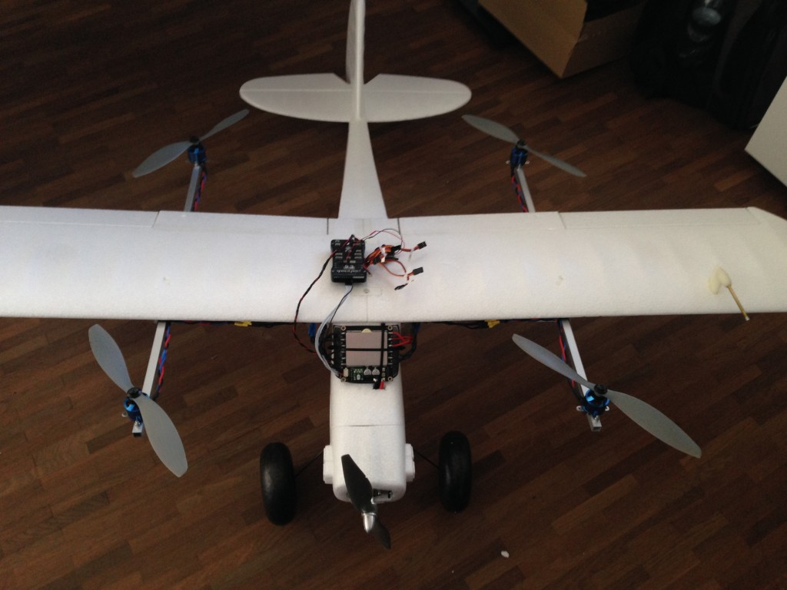
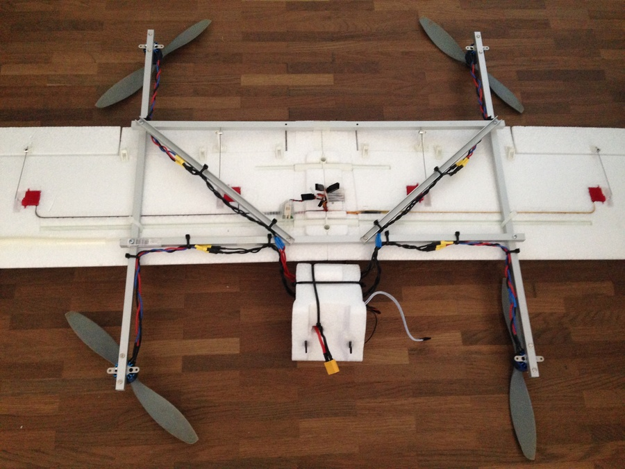
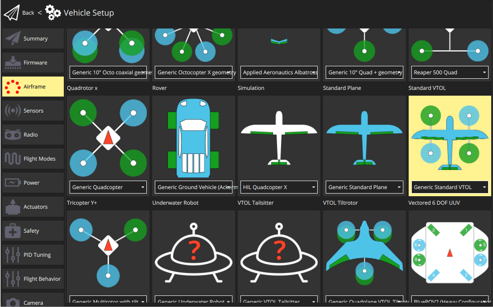

# FunCub QuadPlane (Pixhawk)

Fun Cub QuadPlane VTOL은 쿼드콥터로 개조된 표준 테일 플레인 항공기(Multiplex FunCub)입니다.

주요 정보:

- **Frame:** Multiplex FunCub
- **Flight controller:** Pixhawk

수정되지 않은 Fun Cub는 가격이 비교적 저렴하며, 비행방법도 비교적 쉬운 편입니다.
조립 후의 비행기는 비교적 무겁우며, 비행이 간단하지 않습니다.
비행 기능은 우수하지만, 전진 비행시에는 약 75 %의 추진력이 필요합니다.

## 부품 명세서

실제 평면도는 위의 이미지와 비슷합니다 (다른 유사한 모델도 잘 작동합니다. 이것은 Multiplex Fun Cub입니다).

필요한 최소 장비는 다음과 같습니다.

- Multiplex FunCub (또는 유사 제품)
- Pixhawk 또는 호환 제품
- 디지털 풍속 센서
- 900kV 모터(예 : Iris 추진 세트 - 모터 및 ESC)
- 쿼드 모터용 10 " 프로펠러(10x45 또는 10x47)
- 고정익 모터용 10" 프로펠러(10 × 7)
- GPS 모듈
- 4S 배터리
- 쿼드 모터 장착용 알루미늄 프레임 (10x10mm 사각 튜브, 벽 두께 1mm)
- TOW는 4200mAh 4S 배터리로 중량은 약  2.3kg입니다.

## 구조

구조는 아래와 같은 알루미늄 재질로 만들어집니다.

## 배선

Motor and servo wiring is nearly entirely up to you, but should match the [Generic Standard VTOL](../airframes/airframe_reference.md#vtol_standard_vtol_generic_standard_vtol) configuration, as shown in the airframe reference.
The geometry and output assignment can be configured in the [Actuators Configuration](../config/actuators.md#actuator-outputs)

For example, you might wire it up like this example (orientation as if "sitting in the plane"):

| 포트     | 연결                                  |
| ------ | ----------------------------------- |
| MAIN 1 | 전방 우측(반시계 방향)    |
| MAIN 2 | 후방 좌측 모터(반시계 방향) |
| MAIN 3 | 전방 좌측 모터(시계 방향)  |
| MAIN 4 | 후방 우측 모터(시계 방향)  |
| AUX 1  | 좌측 보조익 TODO                         |
| AUX 2  | 우측 보조익                              |
| AUX 3  | 승강타                                 |
| AUX 4  | 방향타                                 |
| AUX 5  | 스로틀                                 |

For further instructions on wiring and configurations please see:
[Standard VTOL Wiring and Configuration](../config_vtol/vtol_quad_configuration.md). <!-- replace with Pixhawk Wiring Quickstart -->

## 기체 설정

1. For [Airframe](../config/airframe.md) select the vehicle group/type as _Standard VTOL_ and the specific vehicle as [Generic Standard VTOL](../airframes/airframe_reference.md#vtol_standard_vtol_generic_standard_vtol) as shown below (do not forget to click **Apply and Restart** in the top).

   

2. Configure the outputs and geometry following the instructions in [Actuators Configuration](../config/actuators.md)

3. The default parameters are often sufficient for stable flight. For more detailed tuning information see [Standard VTOL Wiring and Configuration](../config_vtol/vtol_quad_configuration.md).

보정을 마치면 VTOL이 비행할 준비가 됩니다.

## 비디오

<lite-youtube videoid="4K8yaa6A0ks" title="Fun Cub PX4 VTOL Maiden"/>

## 지원

If you have any questions regarding your VTOL conversion or configuration please visit <https://discuss.px4.io/c/px4/vtol>.

