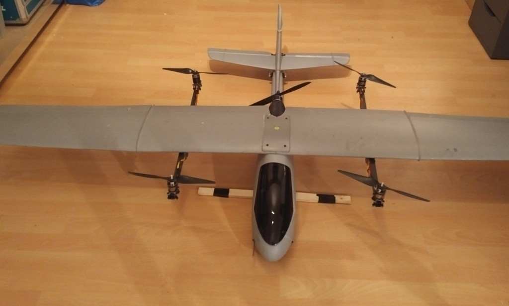
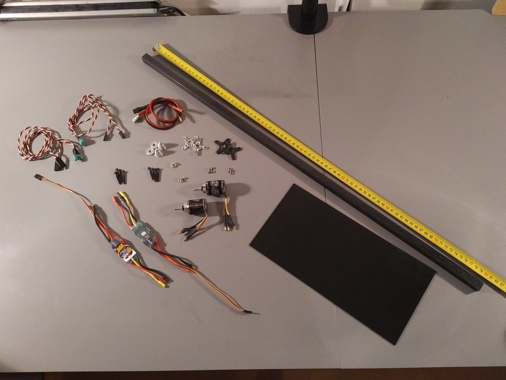
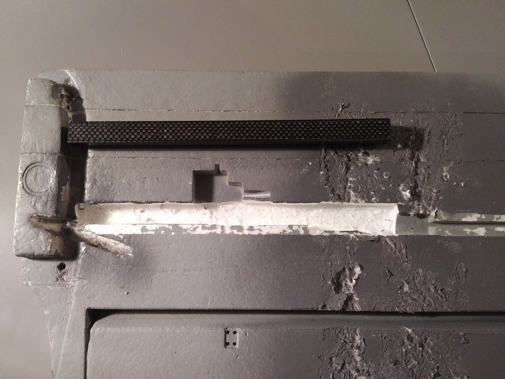
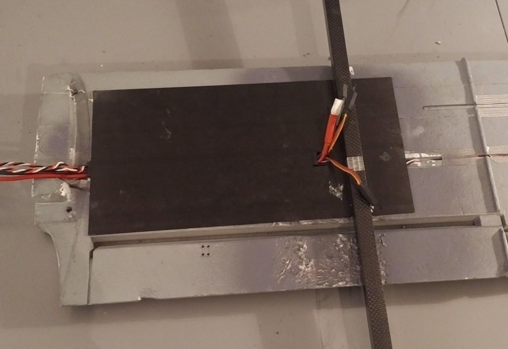
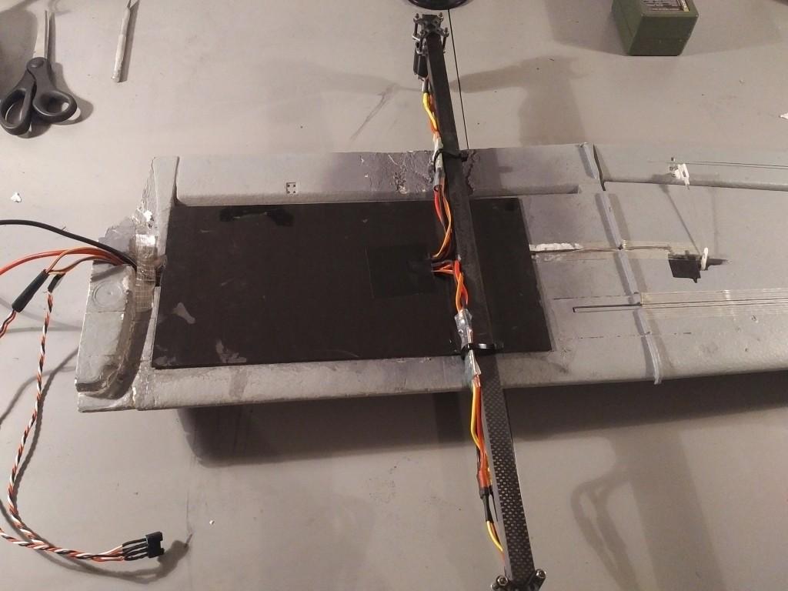
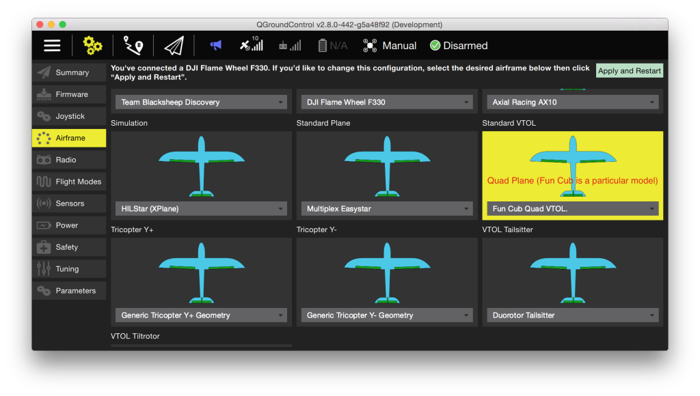

# Volantex Ranger-Ex QuadPlane VTOL(Pixhawk)

QuadRanger VTOL은 QuadCopter 시스템으로 설계된 Volantex Ranger-Ex를 기반의 표준 꼬리 비행기입니다.
Ranger-Ex는 비행법이 간단한 범용적인 FPV 플랫폼입니다.
HobbyKing에서 구매할 수 있으며, Quanum Observer로 제품명이 변경되었습니다.
플라스틱 동체와 2m EPO 날개는 탑재 하중이 높은 견고한 기체입니다.

주요 정보:

- **Frame:** Volantex Ranger-Ex or _Quanum Observer_
- **Flight controller:** Pixhawk

VTOL 변환된 비행기의 중량은 LiPo를 포함하여 약 3.5kg 정도 증가합니다.
변환된 비행기는 약 65%의 추진력으로 순항할 수 있습니다.
The suggested quad setup provides a thrust of 7.5kg and the airframe can fly with a total weight of around 4.5kg.
FPV 장비와 카메라를 탑재에 충분한 하중 용량을 가지고 있습니다.

The conversion is designed to minimize impact on the aerodynamics and provide additional strength minimize wing flexing.

## 부품 명세서

- Volantex Ranger-Ex 혹은 Quanum Observer
- 1200KV 530W 모터
- 30A 속도 컨트롤러
- 4S 배터리
- APC Electric 11x5 프로펠러

## 변환 키트

- 필요한 기본 부품은 다음과 같습니다.
- Pixhawk 또는 호환 제품
- 디지털 풍속 센서
- 3DR 호환 전원 모듈
- GPS

For a full parts list with links to Hobbyking EU and International warehouse see:
[QuadRanger-VTOL-partslist](https://px4.io/wp-content/uploads/2016/01/QuadRanger-VTOL-partslist-1.xlsx)

아래 이미지는 한 날개에 필요한 부품을 보여줍니다.

The tools required for the conversion are;

- Dremel 또는 유사한 회전 도구
- 취미용 칼
- UHU POR 접착제
- CA 접착제
- 줄자
- 테이프

## 날개 변환

:::info
Please note that the conversion in this build log is performed on a wing that shows damage from a previous conversion.
:::

Cut both 800mm square carbon tubes to a length of 570mm and 230mm.

Making a slot in the Styrofoam wing 1.5cm deep using a rotary tool with some form of guidance to keep a fixed depth.
슬롯은 230mm 정사각형 탄소 튜브 1 개의 길이, 깊이 및 너비를 유지하여야 합니다.
아래 표시된 위치에 있어야합니다.

CA 접착제를 사용하여 300x150x1.5mm 탄소 시트를 230mm 탄소 튜브에 붙이고 전선을 통과할 구멍을 만듭니다.
전원 및 신호용 전선을 ESC에 삽입합니다.
UHU POR를 사용하여 시트와 탄소 튜브를 아래 표시된대로 스티로폼 날개에 붙입니다.

Using CA glue, glue the 570mm square carbon tube to the carbon sheet.
It should be located 285mm from where the wings join.
튜브는 날개의 수직 영역을 기준으로 중앙에 있어야 합니다.
양쪽에서 정확히 165mm 연장되어야합니다.

모터 마운트를 모터에 부착합니다.
With another motor mount plate and 4 M3x25mm screws clamp the motor on the end of the square carbon tube as indicated below.
타이 랩이있는 ESC를 카본 튜브에 부착합니다.
Afro ESC를 사용할 때는 최소한 신호와 접지선을 연결하십시오.

## 배선

Pixhawk의 출력은 다음과 같이 연결되어야합니다 ( "평면에 앉아 있음"과 같은 방향)

| 포트     | 연결                     |
| ------ | ---------------------- |
| MAIN 1 | Front right motor, CCW |
| MAIN 2 | 후방 촤즉 모터, 반시계 방향       |
| MAIN 3 | 전방 좌측 모터, 시계방향         |
| MAIN 4 | 후방 우측 모터, 시계 방향        |
| AUX 1  | 좌측 보조익                 |
| AUX 2  | 우측 보조익                 |
| AUX 3  | 승강타                    |
| AUX 4  | 방향타                    |
| AUX 5  | 스로틀                    |

:::info
The servo direction can be reversed using the PWM\_REV parameters in the PWM\_OUTPUT group of QGroundControl (cogwheel tab, last item in the left menu)
:::

For further instructions on wiring and configurations please see: [Standard VTOL Wiring and Configuration](../config_vtol/vtol_quad_configuration.md)

## 설정

Configure the frame as shown in QGroundControl below (do not forget to click **Apply and Restart** in the top).

## 지원

If you have any questions regarding your VTOL conversion or configuration please visit <https://discuss.px4.io/c/px4/vtol>.

