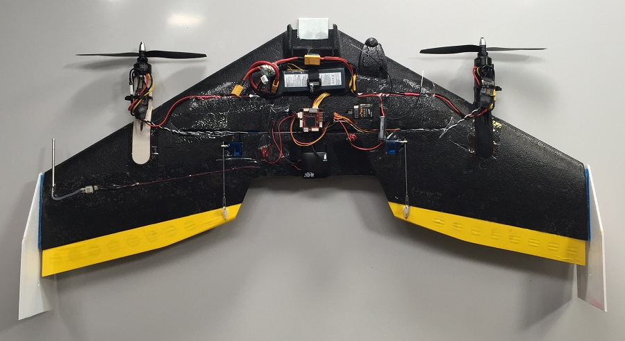
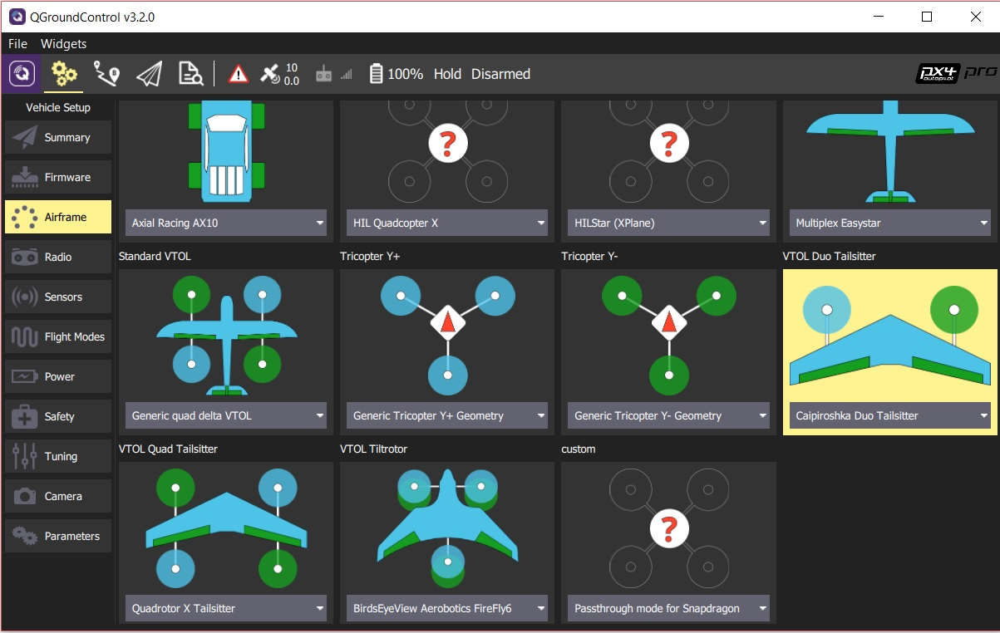

# TBS Caipiroshka

The Caipiroshka VTOL is a slightly modified _TBS Caipirinha_.

:::info
The _TBS Caipirinha_ has been superseded and is no longer available.
These instructions _should_ work with the updated vehicle: [TBS Caipirinha 2](https://team-blacksheep.com/products/prod:tbs_caipi2_pnp).
부품 목록에서 다른 여러 구성 요소도 업데이트 되었습니다.
:::

<lite-youtube videoid="acG0aTuf3f8" title="PX4 VTOL - Call for Testpilots"/>

## 부품 목록

- TBS Caipirinha Wing (no longer available - try [TBS Caipirinha 2](https://team-blacksheep.com/products/prod:tbs_caipi2_pnp))
- Left and right 3D-printed motor mount (<a href="https://github.com/PX4/PX4-user_guide/raw/main/assets/airframes/vtol/caipiroshka/motor_mounts.zip" target="_blank">design files</a>)
- CW 8045 propeller ([Eflight store](https://www.banggood.com/GEMFAN-Carbon-Nylon-8045-CWCCW-Propeller-For-Quadcopters-1-Pair-p-950874.html))
- CCW 8045 propeller ([Eflight store](https://www.banggood.com/GEMFAN-Carbon-Nylon-8045-CWCCW-Propeller-For-Quadcopters-1-Pair-p-950874.html))
- 2x 1800 kV 120-180W 모터
  - [ePower 2208](https://www.galaxus.ch/en/s5/product/epower-22081400-fuer-2-3-lipo-imax-rc-motors-8355913)
  - [Armattan 2208 1800kV Multirotor Motor](https://www.amazon.com/Armattan-2208-1800kV-Multirotor-Motor/dp/B00UWLW0C8)
    <!-- equivalent replacement must match: kV (1800), motor size (2208) and number of LiPo cells (3S). -->
- 2x 20-30S ESC
  - [GetFPV](https://www.getfpv.com/lumenier-30a-blheli-s-esc-opto-2-4s.html)
- BEC (3A, 5-5.3V) (출력 레일 용 5V 전원 공급 장치로 작동 할 수없는 ESC를 사용하는 경우에만 필요)
- 3S 2200 mA 리포 배터리
  - Team Orion 3S 11.1V 50 C ([Hobbyshop store](https://www.hobbyshop.ch/modellbau-elektronik/akku/team-orion-lipo-2200-3s-11-1v-50c-xt60-ori60163.html))
- [Pixracer autopilot board + power module](../flight_controller/pixracer.md)
- [Digital airspeed sensor](https://hobbyking.com/en_us/hkpilot-32-digital-air-speed-sensor-and-pitot-tube-set.html)

## 조립

아래 그림은 조립이 완료된 Caipiroshka 모습입니다.

다음에서는 기체 조립에 관련된 몇 가지 팁을 제공합니다.

### 오토파일럿

기체의 무게 중심에 가까운 곳에 자동조종장치를 장착합니다.

### 모터 장착

STL 파일에 대한 링크가 부품 목록에 지정된 모터 마운트 (2 회)를 인쇄합니다.
모터 축이 대략 엘레 본의 중심을 통과하도록 각 날개 측면에 하나의 모터 마운트를 부착합니다 (그림 참조).
위 그림에서 두 모터 마운트 사이의 수평 거리는 56cm입니다.
날개에 올바른 위치를 표시 한 후에는 상단 및 하단 날개 측면 모두에 투명 테이프로 마운트와 접촉 영역을 덮을 수 있습니다.
그런 다음 이 부분에 뜨거운 접착제를 바르고 모터 마운트를 날개에 붙입니다.
날개 표면과 뜨거운 접착제 사이에 테이프가 있는 이유는 손상없이 날개에서 테이프를 떼어 냄으로써 모터 마운트를 매우 쉽게 제거할 수 있기 때문입니다.
손상된 모터 마운트 교체시에 유용합니다.

### 모터 컨트롤러

모터 컨트롤러는 접착제 또는 케이블 바인더를 사용하여 모터 마운트의 평평한 표면에 직접 장착할 수 있습니다.
전원 케이블을 배터리 베이에 연결하여야 합니다. 오래된 납땜 인두를 사용하여 채널을 폼에 녹일 수 있습니다.
배터리 베이에있는 두 모터 컨트롤러의 전원 케이블을 연결하고 끝에 플러그를 납땜합니다.
이렇게 하면 두 모터 컨트롤러를 전원 모듈에 연결할 수 있습니다.
자동 조종 장치의 출력 레일에 5V를 제공 할 수있는 모터 컨트롤러가 없는 경우 외부 전원 공급 장치 (BEC)를 사용하여야 합니다.

### GPS

GPS는 기체의 맨 뒤쪽 중앙에 장착 가능합니다. 이것은 두 개의 모터, 카메라 및 용량이 큰 배터리로 인하여 비행기가 상당히 무거워 질 수 있기 때문에 비행기의 무게를 뒤로 옮기는 데 도움이됩니다.
또한 12V 전원 케이블과의 거리가 멀기 때문에 외부 자력계의 자기 간섭을 줄이는 데 도움이됩니다.

### 풍속 센서

날개 측면 중 하나의 바깥 쪽 가장자리에 가까운 피토 튜브를 부착합니다.
프로펠러의 기류에 영향을 받지 않는지 확인하십시오.
튜브에서 모터 축까지의 수평 거리가 프로펠러의 반경보다 크면 괜찮습니다.
오래된 납땜 인두를 사용하여 피토 튜브, 튜브 및 실제 센서를위한 홈을 만듭니다 (그림 참조).
날개를 가로 질러 다른 구성 요소로 케이블을 라우팅하기 위한 채널을 만듭니다.

### I2C 버스 센서 연결

속도 센서와 외부 자력계(GPS 하우징에 있음)는 자동 조종 장치의 I2C 버스에 연결되어야합니다.
따라서 부품 목록에 표시된 것과 같은 I2C 스플리터를 사용하여야 합니다.
자동조종장치의 I2C 버스와 분배기 보드를 연결합니다.
그런 다음 표준 I2C 케이블을 사용하여 외부 자력계와 대기 속도 센서를 분배기 보드에 연결합니다.
위 그림에서 분할기 보드는 GPS 장치의 왼쪽에 있습니다.

### Elevons

Elevon은 투명 테이프를 사용하여 날개의 뒷면에 부착할 수 있습니다. TBS Caiprinha 기체의 조립 매뉴얼에서 Team Blacksheep이 제공하는 지침을 참고하십시오.

### 일반 조립 규칙

모든 구성 요소를 날개에 장착하기 전에 테이프를 사용하여 대략적인 위치에 고정하고, 날개의 CG가 TBS Caipirinha의 제작 설명서에 지정된 권장 범위에 있는지 확인하십시오.
내장하려는 추가 구성 요소(예 : GoPro 전면 또는 더 큰 배터리)에 따라 구성 요소의 위치를 이동하여야 합니다.

## 기체 설정

Switch to the configuration section in [QGroundControl](../config/airframe.md) and select the airframe tab.
Scroll down the list to find the _VTOL Duo Tailsitter_ icon. Select the _Caipiroshka Duo Tailsitter_ from the drop-down list.

## 서보 연결

아래 표에서는 기체가 테이블 위에 평평하게 놓여있을 때 사용자가 기체의 전면을 마주 보고 있는 경우에 설정입니다.

| 출력    | 주파수    | 액추에이터                               |
| ----- | ------ | ----------------------------------- |
| MAIN1 | 400 Hz | 오른쪽 (우현) 모터 컨트롤러 |
| MAIN2 | 400 Hz | 왼쪽 (좌현) 모터 컨트롤러  |
| MAIN3 | 400 Hz | 비어 있음                               |
| MAIN4 | 400 Hz | 비어 있음                               |
| MAIN5 | 50 Hz  | 오른쪽 (우현) 에일러론 서보 |
| MAIN6 | 50 Hz  | 왼쪽 (포트) 에일러론 서보  |
