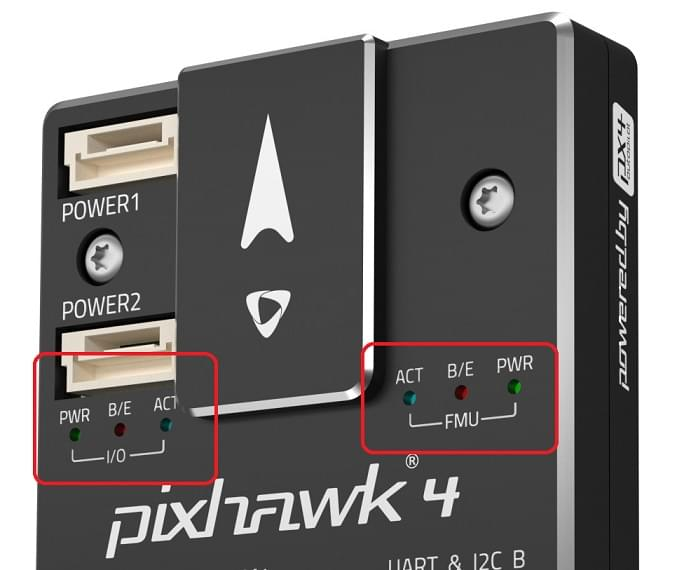

# LED 신호 설명 (Pixhawk 시리즈)

[Pixhawk-series flight controllers](../flight_controller/pixhawk_series.md) use LEDs to indicate the current status of the vehicle.

- The [UI LED](#ui_led) provides user-facing status information related to _readiness for flight_.
- The [Status LEDs](#status_led) provide status for the PX4IO and FMU SoC.
  전원, 부트 로더 모드, 활동 및 오류에 관련된 정보를 표시합니다.

## UI LED

The RGB _UI LED_ indicates the current _readiness for flight_ status of the vehicle.
This is typically a superbright I2C peripheral, which may or may not be mounted on the flight controller board (i.e. FMUv4 does not have one on board, and typically uses an LED mounted on the GPS).

아래 이미지는 LED와 차량 상태의 관계를 나타냅니다.

:::warning
It is possible to have a GPS lock (Green LED) and still not be able to arm the vehicle because PX4 has not yet [passed preflight checks](../flying/pre_flight_checks.md). **A valid global position estimate is required to takeoff!**
:::

:::tip
In the event of an error (blinking red), or if the vehicle can't achieve GPS lock (change from blue to green),   check for more detailed status information in _QGroundControl_ including calibration status, and errors messages reported by the [Preflight Checks (Internal)](../flying/pre_flight_checks.md).
또한 GPS 모듈이 연결 여부, Pixhawk와 GPS 연동 여부, 정확한 GPS 위치를 전송 여부를 확인하십시오.
:::

- **[Solid Blue] Armed, No GPS Lock:** Indicates vehicle has been armed and has no position lock from a GPS unit.
  기체에 시동을 걸면, PX4는 모터를 제어하여 드론을 조종합니다.
  고속 회전하는 프로펠러는 항상 위험하므로, 시동시에 조심하여야 합니다.
  이 모드에서는 차량이 안내 임무를 수행 할 수 없습니다.

- **[Pulsing Blue] Disarmed, No GPS Lock:** Similar to above, but your vehicle is disarmed.
  모터를 제어할 수 없지만, 다른 하위 시스템들은 작동한다는 것을 의미합니다.

- **[Solid Green] Armed, GPS Lock:** Indicates vehicle has been armed and has a valid position lock from a GPS unit.
  기체에 시동을 걸면, PX4는 모터를 제어하여 드론을 조종합니다.
  고속 회전하는 프로펠러는 항상 위험하므로, 시동시에 조심하여야 합니다.
  이 모드에서 기체는 안내 임무를 수행할 수 있습니다.

- **[Pulsing Green] Disarmed, GPS Lock:** Similar to above, but your vehicle is disarmed.
  모터는 제어할 수 없지만, GPS 위치 잠금을 포함한 다른 하위 시스템들은 작동합니다.

- **[Solid Purple] Failsafe Mode:** This mode will activate whenever vehicle encounters an issue during flight,
  such as losing manual control, a critically low battery, or an internal error.
  사고 방지 모드에서는 기체는 이륙 위치로 복귀하거나, 현재 위치에 착륙할 수 있습니다.

- **[Solid Amber] Low Battery Warning:** Indicates your vehicle's battery is running dangerously low.
  특정 시점이 지나면, 차량은 안전 방지 모드로 전환됩니다. 그러나, 이 모드는 종료시점에는 경고 메시지를 표시합니다.

- **[Blinking Red] Error / Setup Required:** Indicates that your autopilot needs to be configured or calibrated before flying.
  자동조종장치를 지상관제국에 연결하여 무슨 문제인지를 확인하십시오.
  설정 프로세스를 완료후에도, 자동조종장치가 여전히 빨간색으로 깜박이면 다른 오류가 있음을 나타냅니다.

## LED 상태

Three _Status LEDs_ provide status for the FMU SoC, and three more provide status for the PX4IO (if present).
전원, 부트 로더 모드, 활동 및 오류에 관련된 정보를 표시합니다.

전원이 켜지면 FMU와 PX4IO CPU는 먼저 부트로더를 실행후 응용 프로그램을 실행합니다.
아래 표는 부트로더와 앱의 LED를 상태를 표시 방법을 설명합니다.

| 색상    | 라벨      | 부트로더 사용법           | 앱 사용법    |
| ----- | ------- | ------------------ | -------- |
| 청색    | 활동      | 부트로더가 데이터를 수신시 깜빡임 | 시동 상태 표시 |
| 적색/황색 | 부트로더 에러 | 부트로더에서 깜빡임         | 에러 표시    |
| 녹색    | 파워      | 부트로더에서 사용되지 않음     | 시동 상태 표시 |

:::info
The LED labels shown above are commonly used, but might differ on some boards.
:::

LED가 의미하는 메시지에 관한  자세한 정보는 아래에서 설명합니다( "x"는 "모든 상태"를 의미).

| 적색/황색 | 청색  | 녹색    | 설명                                                                                                                                                                                   |
| ----- | --- | ----- | ------------------------------------------------------------------------------------------------------------------------------------------------------------------------------------ |
| 10Hz  | x   | x     | Overload CPU load > 80%, or RAM usage > 98%                                                                                                                                          |
| OFF   | x   | x     | Overload CPU load <= 80%, or RAM usage <= 98%                                                                                      |
| NA    | OFF | 4 Hz  | actuator_armed->armed && failsafe                                                                                       |
| NA    | ON  | 4 Hz  | actuator_armed->armed && !failsafe                                                                                      |
| NA    | OFF | 1 Hz  | !actuator_armed-> armed && actuator_armed->ready_to_arm  |
| NA    | OFF | 10 Hz | !actuator_armed->armed  && !actuator_armed->ready_to_arm |
