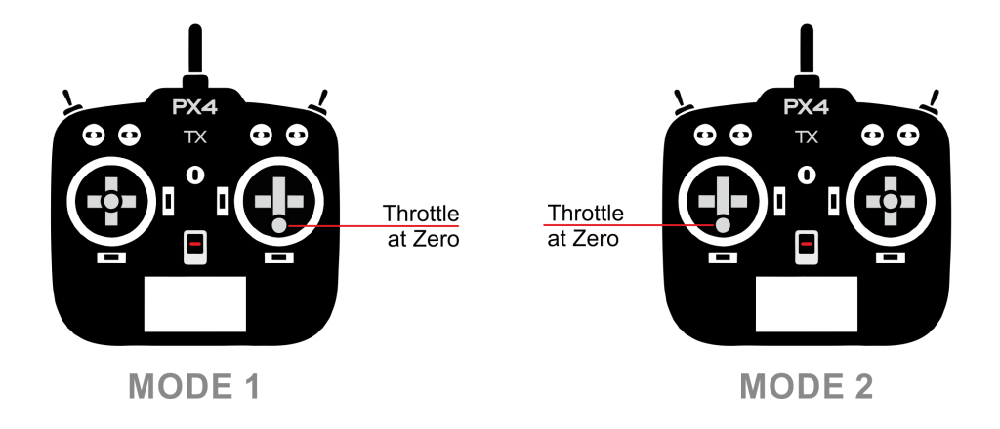

# 무선 조종기(RC)

A Radio Control (RC) system can be used to _manually_ control your vehicle from a handheld RC controller.
This topic provides an overview of how RC works, how to choose an appropriate radio system for your vehicle, and how to connect it to your flight controller.

:::tip
PX4 can also be manually controlled using a [Joystick](../config/joystick.md) or gamepad-like controller: this is different to an RC system!
The [COM_RC_IN_MODE](../advanced_config/parameter_reference.md#COM_RC_IN_MODE) parameter [can be set](../advanced_config/parameters.md) to choose whether RC (default), Joystick, both, or neither, are enabled.
:::

:::info
PX4 does not require a remote control system for autonomous flight modes.
:::

## 무선 조종기 작동 방법

An _RC system_ has a ground-based _remote control unit_ that is used by the operator to command the vehicle.
The remote has physical controls that can be used to specify vehicle movement (e.g. speed, direction, throttle, yaw, pitch, roll, etc.) and to enable autopilot [flight modes](../flight_modes/index.md) (e.g. takeoff, land, return to land, mission etc.).
On _telemetry-enabled_ RC systems, the remote control unit can also receive and display information from the vehicle, such as battery level, flight mode, and warnings.

The ground based RC controller contains a radio module that is bound to, and communicates with, a (compatible) radio module on the vehicle.
차량 기반 장치는 비행 콘트롤러에 연결됩니다.
비행 콘트롤러는 현재의 자동 비행 모드와 차량 상태를 기준으로 명령어 해석하는 방법을 결정하고, 차량 모터와 액추에이터를 구동합니다.

<!-- image showing the different parts here would be nice -->

:::info
The ground- and vehicle- based radio modules are referred to as the transmitter and receiver respectively (even if they support bidirectional communication) and are collectively referred to as a _transmitter/receiver pair_.
The RC controller and it's included radio module are commonly referred to as a "transmitter".
:::

무선 조종기의 중요한 품질중의 하나는 지원 채널수 입니다.
채널 수는 차량에 명령을 전송시에 사용 가능한 리모콘의 물리적 컨트롤 수를 정의합니다 (예 : 실제로 사용할 수있는 스위치, 다이얼, 콘트롤 스틱 갯수).

항공기는 최소 4개 채널(롤, 피치, 요, 스로틀)을 지원하는 무선 조종기를 사용하여야 합니다.
지상 차량에는 최소 2개의 채널(조향, 스로틀)이 필요합니다. An 8 or 16 channel transmitter provides additional channels that can be used to control other mechanisms or activate different [flight modes](../flight_modes/index.md) provided by the autopilot.

## Types of Remote Controllers

### 항공기 전용 무선 조종기

The most popular _form_ of remote control unit for UAVs is shown below.
롤/피치/스로틀/요를 제어하는 별도의 조종 스틱이 있습니다.
수신기에는 최소 4 개의 채널이 필요합니다.

조종 스틱, 스위치의 배치 방식은 다양합니다.
모드 번호로 많이 사용되는 송신기의 레이아웃을 지칭합니다. _Mode 1_ and _Mode 2_ (shown below) differ only in the placement of the throttle.

:::info
The choice of mode is largely one of taste (_Mode 2_ is more popular).
:::

## 지상 차량용 무선 조종기

무인 지상 차량(UGV)은 조향 및 속도 값을 전송하기 위하여, 최소 2 채널의 송신기가 필요합니다.
일반적으로 송신기는 휠과 트리거, 2개의 단일 축 컨트롤 스틱 또는 단일 이중 축 컨트롤 스틱을 사용하여 위의 값들을 설정합니다.

더 많은 채널과 제어 메커니즘을 사용할 수 있으며, 추가 액추에이터와 자동 조종 모드를 사용하는 데 매우 유용합니다.

## 무선 조종기 부품 선택

호환되는 송신기와 수신기를 구매하여야 합니다.
In addition, receivers have to be [compatible with PX4](#compatible_receivers) and the flight controller hardware.

콘트롤러와 호환되는 무선 조종기는 보통 한 묶음으로 판매됩니다.
For example, [FrSky Taranis X9D and FrSky X8R](https://hobbyking.com/en_us/frsky-2-4ghz-accst-taranis-x9d-plus-and-x8r-combo-digital-telemetry-radio-system-mode-2.html?___store=en_us) are a popular combination.

### 송수신기 조합

One of the most popular RC units is the _FrSky Taranis X9D_.
It has an internal transmitter module can be used with the recommended _FrSky X4R-SB_ (S-BUS, low delay) or _X4R_ (PPM-Sum, legacy) receivers out of the box.
그리고, 맞춤형 라디오 송신기 모듈 슬롯과 맞춤형 오픈 소스 OpenTX 펌웨어가 있습니다.

:::info
This remote control unit can display vehicle telemetry when used with [FrSky](../peripherals/frsky_telemetry.md) or [TBS Crossfire](../telemetry/crsf_telemetry.md) radio modules.
:::

기타 인기 있는 송수신기 조합

- 예를 들어 FrSky 송수신기 모듈을 사용하는 Turnigy 송수신기
- Futaba 송신기와 호환 가능한 Futaba S-Bus 수신기
- 장거리(약 900MHz), 낮은 대기 시간 : 호환되는 리모컨(예 : Taranis)으로 설정된 "Team Black Sheep Crossfire"또는 "Crossfire Micro"
- 장거리(약 433MHz) : 호환 리모콘 (예 : Taranis)으로 설정된 ImmersionRC EzUHF

### PX4-Compatible Receivers {#compatible_receivers}

수신기는 송신기 뿐만 아니라 PX4와 비행 콘트롤러에도 호환되어야 합니다.

_PX4_ and _Pixhawk_ have been validated with:

- PPM sum receivers

- S.BUS and S.BUS2 receivers from:

  - Futaba
  - FrSky S.BUS and PPM models
  - TBS Crossfire with SBUS as output protocol
  - Herelink

- TBS Crossfire with ([CRSF protocol](../telemetry/crsf_telemetry.md))

- Express LRS with ([CRSF protocol](../telemetry/crsf_telemetry.md))

- TBS Ghost with (GHST protocol)

- Spektrum DSM

- Graupner HoTT

Receivers from other vendors that use a supported protocol are likely to work but have not been tested.

:::info
Historically there were differences and incompatibilities between receiver models, largely due to a lack of detailed specification of protocols.
The receivers we have tested all now appear to be compatible, but it is possible that others may not be.
:::

## 수신기 연결

수신기는 프로토콜에 적합한 포트를 사용하여 비행 콘트롤러에 연결합니다.

- Spektrum/DSM receivers connect to the "DSM" input.
  Pixhawk flight controllers variously label this as: `SPKT/DSM`, `DSM`, `DSM/SBUS RC`, `DSM RC`, `DSM/SBUS/RSSI`.
- Graupner HoTT receivers: SUMD output must connect to a **SPKT/DSM** input (as above).
- PPM-Sum and S.BUS receivers must connect directly to the **RC** ground, power and signal pins.
  This is typically labeled: `RC IN`, `RCIN` or `RC`, but has in some FCs has been labeled `PPM RC` or `PPM`.
- PPM receivers that have an individual wire for each channel must connect to the RCIN channel _via_ a PPM encoder [like this one](http://www.getfpv.com/radios/radio-accessories/holybro-ppm-encoder-module.html) (PPM-Sum receivers use a single signal wire for all channels).
- TBS Crossfire/Express LRS Receivers using [CRSF Telemetry](../telemetry/crsf_telemetry.md) connect via a spare UART.

Flight controllers usually include appropriate cables for connecting common receiver types.

Instructions for connecting to specific flight controllers are given in their [quick-start](../assembly/index.md) guides (such as [CUAV Pixhawk V6X Wiring Quick Start: Radio Control](../assembly/quick_start_cuav_pixhawk_v6x.md#radio-control) or [Holybro Pixhawk 6X Wiring Quick Start: Radio Control](../assembly/quick_start_pixhawk6x.md#radio-control)).

:::tip
See the manufacturer's flight controller setup guide for additional information.
:::

## 송수신기 바인딩

Before you can calibrate/use a radio system you must _bind_ the receiver and transmitter so that they communicate only with each other.
송신기와 수신기를 바인딩하는 방법은 하드웨어에 따라 조금씩 차이가 납니다.
자세한 방법은은 제품 설명서를 참조하십시오.

If you are using a _Spektrum_ receiver, you can put it into bind mode using _QGroundControl_: [Radio Setup > Spectrum Bind](../config/radio.md#spectrum-bind).

## 신호 손실 동작 설정

RC 수신기에는 신호 손실을 나타내는 여러가지 방법이 있습니다.

- 아무것도 출력하지 않음 (PX4에서 자동으로 감지됨)
- Output a low throttle value (you can [configure PX4 to detect this](../config/radio.md#rc-loss-detection)).
- 마지막으로 수신된 신호를 출력합니다. 이 경우는 PX4에서 처리할 수 없습니다.

RC 손실이 발생하면 대부분 아무 신호도 전송하지 않는 수신기를 선택하지만, 낮은 스로틀 값을 전송하는 수신기를 선택할 수도 있습니다.
이 동작은 수신기의 설정이 필요할 수 있습니다(설명서 확인).

For more information see [Radio Control Setup > RC Loss Detection](../config/radio.md#rc-loss-detection).

## 관련 내용

- [Radio Control Setup](../config/radio.md) - Configuring your radio with PX4.
- Manual Flying on [multicopter](../flying/basic_flying_mc.md) or [fixed wing](../flying/basic_flying_fw.md) - Learn how to fly with a remote control.
- [TBS Crossfire (CRSF) Telemetry](../telemetry/crsf_telemetry.md)
- [FrSky Telemetry](../peripherals/frsky_telemetry.md)
