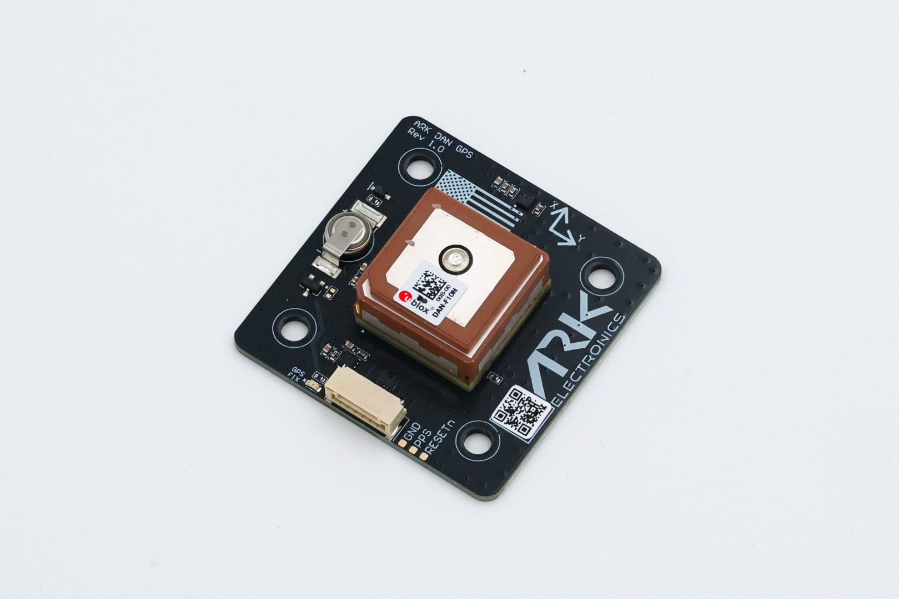

# ARK DAN GPS

[ARK DAN GPS](https://arkelectron.gitbook.io/ark-documentation/gps/ark-dan-gps) is a made in the USA and NDAA-compliant [GNSS/GPS](../gps_compass/index.md) u-blox DAN-F10N GPS and industrial magnetometer.

## 구매처

Order this module from:

- [ARK Electronics](https://arkelectron.com/product/ark-dan-gps/) (US)

## Hardware Specifications

- [Open Source Schematic and BOM](https://github.com/ARK-Electronics/ARK_DAN_GPS)
- 센서
  - [u-blox DAN-F10N](https://www.u-blox.com/en/product/dan-f10n-module)
    - L1/L5/E5a/B2a bands
    - Consistently strong performance regardless of installation
    - Integrated SAW-LNA-SAW for exceptional out-of-band jamming immunity
    - u-blox F10 proprietary dual-band multipath mitigation technology
  - [ST IIS2MDC Magnetometer](https://www.st.com/en/mems-and-sensors/iis2mdc.html)
- Pixhawk Standard UART/I2C Connector (6 Pin JST SH)
- Power Requirements
  - 5V
  - 25mA Average
  - 44mA Max
- LED Indicators
  - GPS Fix
- USA Built
- NDAA Compliant
- 6 Pin Pixhawk Standard UART/I2C Cable

## 하드웨어 설정

The module comes with a Pixhawk-standard 6pin connector that will plug into the `GPS2` port on recent Pixhawk flight controllers.
It should be mounted front facing, as far away from the flight controller and other electronics as possible.

For more information see [Mounting the GNSS/Compass](../gps_compass/index.md#mounting-the-gnss-compass) and [Hardware Setup](../gps_compass/index.md#hardware-setup).

## PX4 설정

The module should be plug-n-play when used with the `GPS2` port on most flight controllers.

[Secondary GPS Configuration (UART)](../gps_compass/index.md#secondary-gps-configuration-uart) explains how you can configure the port if the GPS is not detected (note, that the configuration is the same, even if you are using GPS 2 as the primary compass).

## 핀배열

### Pixhawk Standard UART/I2C Connector - 6 Pin JST-SH

| Pin Number | Signal Name | 전압                   |
| ---------- | ----------- | -------------------- |
| 1          | 5V          | 5.0V |
| 2          | RX          | 3.3V |
| 3          | TX          | 3.3V |
| 4          | SCL         | 3.3V |
| 5          | SDA         | 3.3V |
| 6          | GND         | GND                  |

## See Also

- [ARK DAN GPS Documentation](https://arkelectron.gitbook.io/ark-documentation/gps/ark-dan-gps) (ARK Docs)
