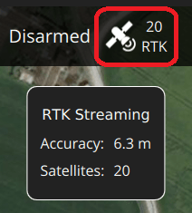

# RTK GPS

[Real Time Kinematic (RTK)](https://en.wikipedia.org/wiki/Real_Time_Kinematic) GNSS/GPS systems provide centimeter-level accuracy, allowing PX4 to be used in applications like precision surveying (where pinpoint accuracy is essential).

This feature requires _QGroundControl_ running on a laptop/PC and a vehicle with a WiFi or Telemetry radio link to the ground station laptop.

:::info
Some RTK GNSS setups can provide yaw/heading information, as an alternative to the compass:

- [RTK GPS Heading with Dual u-blox F9P](../gps_compass/u-blox_f9p_heading.md).
- GPS directly output yaw (see table below).

:::

## 지원되는 RTK 장치

PX4 supports the [u-blox M8P](https://www.u-blox.com/en/product/neo-m8p), [u-blox F9P](https://www.u-blox.com/en/product/zed-f9p-module) and the [Trimble MB-Two](https://www.trimble.com/Precision-GNSS/MB-Two-Board.aspx) GPS, and products that incorporate them.

:::note
일부 RTK 모듈은 특정 기능(베이스 또는 로버)으로만 사용할 수 있는 반면, 다른 모듈은 서로 교환하여 사용할 수 있습니다.
The table indicates devices that also output yaw, and that can provide yaw when two on-vehicle units are used.
It also highlights devices that connect via the CAN bus, and those which support PPK (Post-Processing Kinematic).

| 장치                                                                                                                   |          GPS         |    나침반   | [DroneCAN](../dronecan/index.md) | [GPS Yaw](#configuring-gps-as-yaw-heading-source) | PPK |
| :------------------------------------------------------------------------------------------------------------------- | :------------------: | :------: | :------------------------------: | :-----------------------------------------------: | :-: |
| [ARK RTK GPS](../dronecan/ark_rtk_gps.md)                                                                            |          F9P         |  BMM150  |                 ✓                |                [Dual F9P][DualF9P]                |     |
| [ARK MOSAIC-X5 RTK GPS](../dronecan/ark_mosaic__rtk_gps.md)                                                          |       Mosaic-X5      |  IIS2MDC |                 ✓                |       [Septentrio Dual Antenna][SeptDualAnt]      |     |
| [CUAV C-RTK GPS](../gps_compass/rtk_gps_cuav_c-rtk.md)                                                               |        M8P/M8N       |     ✓    |                                  |                                                   |     |
| [CUAV C-RTK2](../gps_compass/rtk_gps_cuav_c-rtk2.md)                                                                 |          F9P         |     ✓    |                                  |                [Dual F9P][DualF9P]                |     |
| [CUAV C-RTK 9Ps GPS](../gps_compass/rtk_gps_cuav_c-rtk-9ps.md)                                                       |          F9P         |  RM3100  |                                  |                [Dual F9P][DualF9P]                |     |
| [CUAV C-RTK2 PPK/RTK GNSS](../gps_compass/rtk_gps_cuav_c-rtk.md)                                                     |          F9P         |  RM3100  |                                  |                                                   |  ✓  |
| [CubePilot Here+ RTK GPS](../gps_compass/rtk_gps_hex_hereplus.md)                                                    |          M8P         |  HMC5983 |                                  |                                                   |     |
| [CubePilot Here3 CAN GNSS GPS (M8N)](https://www.cubepilot.org/#/here/here3)                      |          M8P         | ICM20948 |                 ✓                |                                                   |     |
| [Drotek SIRIUS RTK GNSS ROVER (F9P)](https://store-drotek.com/911-sirius-rtk-gnss-rover-f9p.html) |          F9P         |  RM3100  |                                  |                [Dual F9P][DualF9P]                |     |
| [DATAGNSS GEM1305 RTK Receiver][DATAGNSS GEM1305 RTK]                                                                |        TAU951M       |     ✘    |                                  |                         ✘                         |     |
| [Femtones MINI2 Receiver](../gps_compass/rtk_gps_fem_mini2.md)                                                       |     FB672, FB6A0     |     ✓    |                                  |                                                   |     |
| [Freefly RTK GPS](../gps_compass/rtk_gps_freefly.md)                                                                 |          F9P         |  IST8310 |                                  |                                                   |     |
| [Holybro H-RTK ZED-F9P RTK Rover (DroneCAN variant)](../dronecan/holybro_h_rtk_zed_f9p_gps.md)    |          F9P         |  RM3100  |                 ✓                |                [Dual F9P][DualF9P]                |     |
| [Holybro H-RTK ZED-F9P RTK Rover](https://holybro.com/collections/h-rtk-gps/products/h-rtk-zed-f9p-rover)            |          F9P         |  RM3100  |                                  |                [Dual F9P][DualF9P]                |     |
| [Holybro H-RTK F9P Ultralight](https://holybro.com/products/h-rtk-f9p-ultralight)                                    |          F9P         |  IST8310 |                                  |                [Dual F9P][DualF9P]                |     |
| [Holybro H-RTK F9P Helical or Base](../gps_compass/rtk_gps_holybro_h-rtk-f9p.md)                                     |          F9P         |  IST8310 |                                  |                [Dual F9P][DualF9P]                |     |
| [Holybro DroneCAN H-RTK F9P Helical](https://holybro.com/products/dronecan-h-rtk-f9p-helical)                        |          F9P         |  BMM150  |                 ✓                |                [Dual F9P][DualF9P]                |     |
| [Holybro H-RTK F9P Rover Lite](../gps_compass/rtk_gps_holybro_h-rtk-f9p.md)                                          |          F9P         |  IST8310 |                                  |                                                   |     |
| [Holybro DroneCAN H-RTK F9P Rover](https://holybro.com/products/dronecan-h-rtk-f9p-rover)                            |          F9P         |  BMM150  |                                  |                [Dual F9P][DualF9P]                |     |
| [Holybro H-RTK M8P GNSS](../gps_compass/rtk_gps_holybro_h-rtk-m8p.md)                                                |          M8P         |  IST8310 |                                  |                                                   |     |
| [Holybro H-RTK Unicore UM982 GPS](../gps_compass/rtk_gps_holybro_unicore_um982.md)                                   |         UM982        |  IST8310 |                                  |       [Unicore Dual Antenna][UnicoreDualAnt]      |     |
| [LOCOSYS Hawk R1](../gps_compass/rtk_gps_locosys_r1.md)                                                              |      MC-1612-V2b     |          |                                  |                                                   |     |
| [LOCOSYS Hawk R2](../gps_compass/rtk_gps_locosys_r2.md)                                                              |      MC-1612-V2b     |  IST8310 |                                  |                                                   |     |
| [mRo u-blox ZED-F9 RTK L1/L2 GPS](https://store.mrobotics.io/product-p/m10020d.htm)                                  |          F9P         |     ✓    |                                  |                [Dual F9P][DualF9P]                |     |
| [Navisys L1/L2 ZED-F9P RTK - Base only](https://www.navisys.com.tw/productdetail?name=GR901&class=RTK)         |          F9P         |          |                                  |                                                   |     |
| [RaccoonLab L1/L2 ZED-F9P][RaccoonLab L1/L2 ZED-F9P]                                                                 |          F9P         |  RM3100  |                 ✓                |                                                   |     |
| [RaccoonLab L1/L2 ZED-F9P with external antenna][RaccnLabL1L2ZED-F9P ext_ant]                                        |          F9P         |  RM3100  |                 ✓                |                                                   |     |
| [Septentrio AsteRx-m3 Pro](../gps_compass/septentrio_asterx-rib.md)                                                  |        AsteRx        |     ✓    |                                  |       [Septentrio Dual Antenna][SeptDualAnt]      |  ✓  |
| [Septentrio mosaic-go](../gps_compass/septentrio_mosaic-go.md)                                                       | mosaic X5 / mosaic H |     ✓    |                                  |       [Septentrio Dual Antenna][SeptDualAnt]      |  ✓  |
| [SIRIUS RTK GNSS ROVER (F9P)](https://store-drotek.com/911-sirius-rtk-gnss-rover-f9p.html)        |          F9P         |     ✓    |                                  |                [Dual F9P][DualF9P]                |     |
| [SparkFun GPS-RTK2 Board - ZED-F9P](https://www.sparkfun.com/products/15136)                                         |          F9P         |     ✓    |                                  |                [Dual F9P][DualF9P]                |     |
| [Trimble MB-Two](../gps_compass/rtk_gps_trimble_mb_two.md)                                                           |          F9P         |     ✓    |                                  |                         ✓                         |     |

<!-- links used in above table -->

[RaccnLabL1L2ZED-F9P ext_ant]: https://docs.raccoonlab.co/guide/gps_mag_baro/gnss_external_antenna_f9p_v320.html
[RaccoonLab L1/L2 ZED-F9P]: https://docs.raccoonlab.co/guide/gps_mag_baro/gps_l1_l2_zed_f9p.html
[DualF9P]: ../gps_compass/u-blox_f9p_heading.md
[SeptDualAnt]: ../gps_compass/septentrio.md#gnss-based-heading
[UnicoreDualAnt]: ../gps_compass/rtk_gps_holybro_unicore_um982.md#enable-gps-heading-yaw
[DATAGNSS GEM1305 RTK]: ../gps_compass/rtk_gps_gem1305.md

참고:

- ✓ or a specific part number indicate that a features is supported, while ✘ or empty show that the feature is not supported.
  "?"는 "알 수 없음"을 나타냅니다.
- Where possible and relevant the part name is used (i.e. ✓ in the GPS column indicates that a GPS module is present but the part is not known).
- Some RTK modules can only be used in a particular role (base or rover), while others can be used interchangeably.
- The list may omit some discontinued hardware that is still supported.
  For example [CubePilot Here+ RTK GPS](../gps_compass/rtk_gps_hex_hereplus.md) is discontinued and may be removed from the list in a future release.
  Check earlier versions if a discontinued module is not mentioned here.

## 포지셔닝 설정

RTK positioning requires a _pair_ of [RTK GNSS devices](#supported-devices): a "base" for the ground station and a "rover" for the vehicle.

추가로 다음과 같은 것들이 필요합니다.

- A _laptop/PC_ with QGroundControl (QGroundControl for Android/iOS do not support RTK)
- 노트북에 WiFi 또는 원격 텔레메트리 링크가 있는 기체.

:::info
_QGroundControl_ with a base module can theoretically enable RTK GPS for multiple vehicles/rover modules.
이 문서 작성 시점에서 이것의 사용 사례는 테스트되지 않았습니다.
:::

### 하드웨어 설정

#### 로버 RTK 모듈 (차량)

The connection method and cables/connectors required depends on the selected RTK module (and on the [flight controller](../flight_controller/index.md)).

대부분은 다른 GPS 모듈과 같은 방식으로 비행 콘트롤러의 GPS 포트를 통해 연결됩니다.
Some are connected to the [CAN](../can/index.md) bus (i.e. using [DroneCAN](../dronecan/index.md)).

See [documentation for the selected device](#supported-devices), general [GNSS Hardware/Configuration Setup](../gps_compass/index.md#hardware-setup), and [DroneCAN](../dronecan/index.md) for more information on wiring and configuration.

#### 기본 RTK 모듈 (접지)

Connect the base module to _QGroundControl_ via USB.
기본 모듈을 사용하는 동안 이동하면 안됩니다.

:::tip
Choose a position where the base module won't need to be moved, has a clear view of the sky, and is well separated from any buildings.
삼각대를 사용하거나 지붕에 장착하여 기본 GPS의 위치를 높이는 것이 도움이되는 경우가 많이 있습니다.
:::

#### 텔레메트리 라디오/WiFi

The vehicle and ground control laptop must be connected via [wifi or a radio telemetry link](../telemetry/index.md).

The link _must_ use the MAVLink 2 protocol as it makes more efficient use of the channel.
This should be set by default, but if not, follow the [MAVLink2 configuration instructions](#mavlink2) below.

### RTK 연결 프로세스

RTK GPS 연결은 기본적으로 플러그앤플레이입니다.

1. Start _QGroundControl_ and attach the base RTK GPS via USB to the ground station.
  장치가 자동으로 인식됩니다.

2. Start the vehicle and make sure it is connected to _QGroundControl_.

  :::tip
  _QGroundControl_ displays an RTK GPS status icon in the top icon bar while an RTK GPS device is connected (in addition to the normal GPS status icon).
  RTK가 설정되는 동안 아이콘은 빨간색으로 표시되고, RTK GPS가 활성화되면 흰색으로 바뀝니다.
  아이콘을 클릭하여 현재 상태와 RTK 정확도를 확인할 수 있습니다.

:::

3. _QGroundControl_ then starts the RTK setup process (known as "Survey-In").

  Survey-In은 기지국의 정확한 위치 추정치를 획득을 위한 시작 절차입니다.
  The process typically takes several minutes (it ends after reaching the minimum time and accuracy specified in the [RTK settings](#rtk-gps-settings)).

  RTK GPS 상태 아이콘을 클릭하여 진행 상황을 추적할 수 있습니다.

  

4. Survey-in이 완료되면 :

  - The RTK GPS icon changes to white and _QGroundControl_ starts to stream position data to the vehicle:

    

  - 기체의 GPS가 RTK 모드로 전환됩니다.
    The new mode is displayed in the _normal_ GPS status icon (`3D RTK GPS Lock`):

    

### GPS를 Yaw/Heading 소스로 설정

GPS can be used as a source for yaw fusion when using a single device with two antenna where _yaw output is supported by the device_, or when using some [RTK GPS Setups with Dual u-blox F9P](../gps_compass/u-blox_f9p_heading.md).
Using GPS as a heading source has the benefit that yaw calculations are not impacted by magnetic interference.

Both approaches work comparing the time taken for a GNSS signal to reach two separated antennas.
The minimum distance between antenna depends on the device but is of the order of 50 cm (check manufacturer documentation).

The devices that can be used are listed in this way are listed in the **GPS Yaw** column of the table above, such as [Septentrio AsteRx-m3 Pro](../gps_compass/septentrio_asterx-rib.md), [Holybro H-RTK Unicore UM982 GPS](../gps_compass/rtk_gps_holybro_unicore_um982.md), and [Trimble MB-Two](../gps_compass/rtk_gps_trimble_mb_two.md).
The links in the table take you to the device-specific PX4 configuration.

Generally when using a GNSS as a source of yaw information you will need to configure the following parameters:

| 매개변수                               | 설정                                                                                                                                                          |
| ---------------------------------- | ----------------------------------------------------------------------------------------------------------------------------------------------------------- |
| [GPS\_YAW\_OFFSET][GPS_YAW_OFFSET] | The angle made by the _baseline_ (the line between the two GPS antennas) relative to the vehicle x-axis (front/back axis, as shown [here][fc_orientation]). |
| [EKF2\_GPS\_CTRL][EKF2_GPS_CTRL]   | Set bit position 3 "Dual antenna heading" to `1` (i.e. add 8 to the parameter value).    |

<!-- links used in table above -->

[GPS_YAW_OFFSET]: ../advanced_config/parameter_reference.md#GPS_YAW_OFFSET
[EKF2_GPS_CTRL]: ../advanced_config/parameter_reference.md#EKF2_GPS_CTRL
[fc_orientation]: ../config/flight_controller_orientation.md#calculating-orientation

:::tip
If using this feature, all other configuration should be setup up as normal (e.g. [RTK Positioning](../gps_compass/rtk_gps.md#positioning-setup-configuration)).
:::

### 선택적 PX4 구성

The following settings may need to be changed (using _QGroundControl_).

#### RTK GPS 설정

The RTK GPS settings are specified in the _QGroundControl_ [General Settings](https://docs.qgroundcontrol.com/master/en/qgc-user-guide/settings_view/general.html#rtk_gps) (**SettingsView > General Settings > RTK GPS**).

이러한 설정은 RTK GPS 설정 프로세스 ( "Survey-In) 완료를 위한 최소 기간과 최소 정확도를 정의합니다.

:::tip
You can save and reuse a base position in order to save time: perform Survey-In once, select _Use Specified Base Position_ and press **Save Current Base Position** to copy in the values for the last survey.
그러면 값이 변경시까지 QGC 재부팅시에도 유지됩니다.
:::

#### MAVLink2

MAVLink2 프로토콜은 낮은 대역폭 채널을 보다 효율적으로 사용하기 때문에 사용하여야합니다.
이것은 최근 빌드에서 기본적으로 활성화되어야 합니다.

MAVLink2가 사용되는 지 확인하려면 :

- Update the telemetry module firmware to the latest version (see [QGroundControl > Setup > Firmware](https://docs.qgroundcontrol.com/master/en/qgc-user-guide/setup_view/firmware.html)).
- Set [MAV_PROTO_VER](../advanced_config/parameter_reference.md#MAV_PROTO_VER) to 2 (see [QGroundControl Setup > Parameters](https://docs.qgroundcontrol.com/master/en/qgc-user-guide/setup_view/parameters.html))

#### 튜닝

GPS 정확도를 센티미터가 아닌 미터 단위로 가정하여 기본 매개변수가 조정되므로 일부 매개변수를 조정하여야 할 수도 있습니다.
For example, you can decrease [EKF2_GPS_V_NOISE](../advanced_config/parameter_reference.md#EKF2_GPS_V_NOISE) and [EKF2_GPS_P_NOISE](../advanced_config/parameter_reference.md#EKF2_GPS_P_NOISE) to 0.2.

#### 이중 수신기

두 번째 GPS 수신기는 백업으로 사용할 수 있습니다 (RTK 또는 비 RTK).
See the [Using PX4's Navigation Filter (EKF2) > GPS](../advanced_config/tuning_the_ecl_ekf.md#gps) section.

<!--
- Video demonstration would be nice.
- something that shows positioning of base, connection of RTK rover, survey in process. Some sort of short precision survey.
-->

## 추가 정보

- [RTK-GPS (PX4-Integration)](../advanced/rtk_gps.md): Developer information about integrating RTK-GPS support into PX4.
- [Real Time Kinematic](https://en.wikipedia.org/wiki/Real_Time_Kinematic) (Wikipedia)
