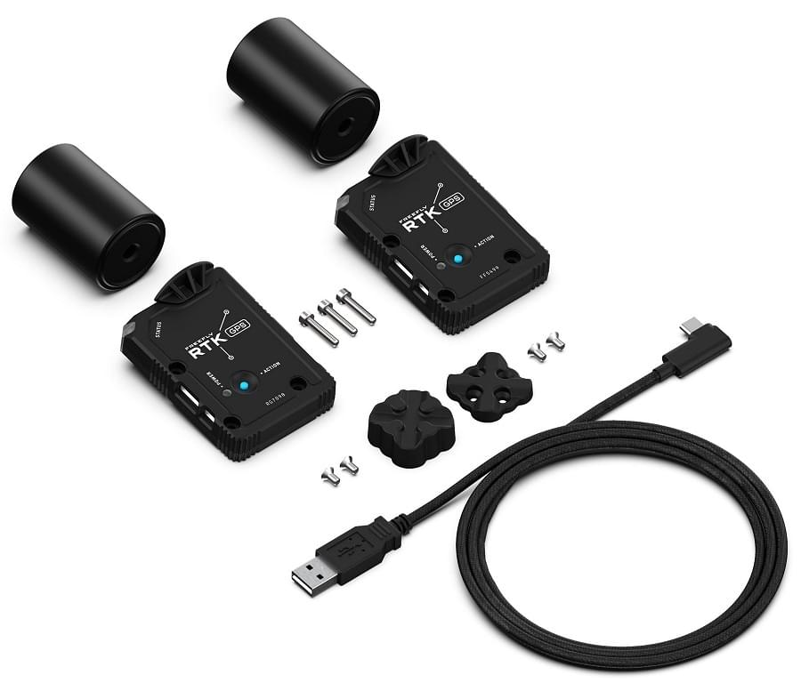

# Freefly Systems RTK GPS

The [Freefly Systems RTK GPS Module](https://store.freeflysystems.com/products/rtk-gps-ground-station) is a multiband [RTK GPS module](../gps_compass/rtk_gps.md) from Freefly Systems that provides highly reliable navigation.
모듈은 로버(항공기에 설치된 경우) 또는 기지국(컴퓨터에 연결된 경우)으로 작동할 수 있습니다.

주요 특징은 다음과 같습니다.

- Multiband (L1/L2) 수신기 (u-blox ZED-F9P)
- 최대 4 개의 GNSS(GPS, Galileo, GLONASS, BeiDou) 동시 수신
- 내장형 자력계(IST8310), 기압계(BMP388), RGB LED, 안전 스위치 및 안전 LED

:::info
This module can be used with PX4 v1.9 or above (support for the u-blox ZED-F9P was added in PX4 v1.9).
:::

## 구매처

- [Freefly Store](https://store.freeflysystems.com/products/rtk-gps-ground-station)

## 키트 내용물

RTK GPS 키트에는 다음 내용물들이 포함됩니다.

- 안테나가 있는 GPS 모듈 2개
- 3m USB C to A 케이블
- 베이스 스테이션 모듈용 마그네틱 퀵 마운트 (삼각대 마운트용 1/ 4-20 스레드)
- Freefly AltaX에 장착하는 나사

## 설정

RTK setup and use on PX4 via _QGroundControl_ is largely plug and play (see [RTK GPS](../gps_compass/rtk_gps.md) for more information).

For the aircraft, you should set the parameter [SER_GPS1_BAUD](../advanced_config/parameter_reference.md#SER_GPS1_BAUD) to 115200 8N1 to ensure that PX4 configures the correct baudrate.

## 배선

Freefly RTK GPS는 PixHawk 자동조종장치에 연결할 수있는 8핀 JST-GH 커넥터와 함께 제공됩니다.
모듈에는 베이스 스테이션용  USB-C 커넥터가 있습니다.

### 핀배열

Freefly GPS 핀배열은 아래와 같습니다.
For some autopilots, like the [Hex Cube](../flight_controller/pixhawk-2.md) and [PixRacer](../flight_controller/pixracer.md), all that is needed is a 1-1 8-pin JST-GH cable.

| 핀 | Freefly GPS                     |
| - | ------------------------------- |
| 1 | VCC_5V     |
| 2 | GPS_RX     |
| 3 | GPS_TX     |
| 4 | I2C_SCL    |
| 5 | I2C_SDA    |
| 6 | BUTTON                          |
| 7 | BUTTON_LED |
| 8 | GND                             |

## 사양

- u-blox ZED-F9P GPS 수신기
  - 빠른 (핫 스타트) 재시작을 위한 Ultracap 백업 전원
  - 향상된 EMI 내성을 위한 수신기를 통한 EMI 차폐
- IST8310 자력계
- 안전 스위치 및 안전 LED
- 상태표시용 RGB LED
  - NCP5623CMUTBG I2C 드라이버
- I2C 버스의 BMP388 기압계
- 외부 활성 안테나(Maxtena M7HCT)
  - SMA 커넥터
- 미래의 CAN 기반 통신을 위한 STM32 MCU
  - USB 커넥터를 통한 펨웨어 업데이트
- Connectivity:
  - USB-C
  - MCU 및 F9P에 대한 양방향 USB 스위치
  - 활성 안테나용 SMA (최대 20mA)
  - 4핀 JST-GH CAN 버스(드론코드 준수)
  - 8-pin JST-GH UART/I2C
    -\*\* Power:
  - Input from either (diode OR'd):
  - USB (5V)
  - CAN (4.7 ~ 25.2V)
  - (4.7 ~ 25.2V)
  - Power consumption <1W

## 추가 정보

More information can be found on [Freefly's Wiki](https://freefly.gitbook.io/freefly-public/products/rtk-gps)
