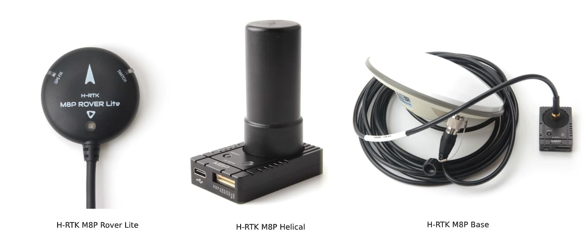

# Holybro H-RTK M8P GNSS (Discontinued)

:::warning
This GNSS has been discontinued, and is no longer commercially available.
:::

The [Holybro H-RTK M8P GNSS](https://holybro.com/collections/standard-h-rtk-series/products/h-rtk-m8p-gnss-series) is an [RTK GNSS module](../gps_compass/rtk_gps.md) series for the mass market.
This family is similar to the [H-RTK M9P](../gps_compass/rtk_gps_holybro_h-rtk-f9p.md) series but uses the smaller, lighter, and less expensive M8P u-blox RTK GNSS module (which still provides far superior position resolution than previous generations\_.

Holybro H-RTK M8P에는 세 가지 모델이 있으며, 각각 다른 요구 사항을 충족하기 위해 서로 다른 안테나 디자인을 사용합니다.
Refer to the [Specification and Model Comparison section](#specification-and-model-comparison) for more details.

RTK를 사용하면 PX4는 일반 GPS에서 제공하는 것 보다 훨씬 더 정확한 센티미터 수준의 정확도로 위치를 파악할 수 있습니다.

## 구매처

- [H-RTK M8P (GPS RTK Mounts)](https://holybro.com/products/vertical-mount-for-h-rtk-helical)

## 설정

RTK setup and use on PX4 via _QGroundControl_ is largely plug and play \(see [RTK GPS](../gps_compass/rtk_gps.md) for more information\).

## 배선

All H-RTK GNSS models come with a GH 10-pin connector/cable that is compatible with [Pixhawk 4](../flight_controller/pixhawk4.md).

:::info
The cables/connectors may need to be modified in order to connect to other flight controller boards (see [pin map](#pin_map)below).
:::

## 핀 맵

## 사양 및 모델 비교

## GPS 소품

[GPS Accessories (Holybro Website)](https://holybro.com/collections/gps-accessories)

