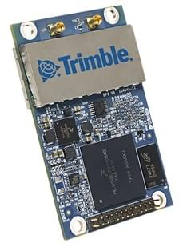
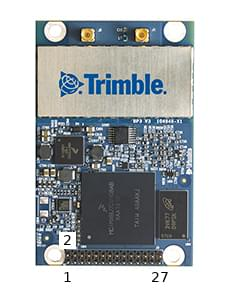

# Trimble MB-Two

The [Trimble MB-Two RTK GPS receiver](https://oemgnss.trimble.com/en/products/receiver-modules/mb-two) is a high-end, dual-frequency [RTK GPS module](../gps_compass/rtk_gps.md) that can be configured as either base or rover.

## 필수 펌웨어 옵션

장치 구매시 다음 펌웨어 옵션을 선택하여야 합니다.

- \[X\] \[2\] \[N\] \[G\] \[W\] \[Y\] \[J\]  : 20Hz 위치 업데이트 및 RTK 지원, 수평 1cm 및 수직 2cm 위치 정확도
- \[L\] LBAND
- \[D\] DUO - 이중 안테나 방향각
- \[B\] BEIDOU + \[O\] GALILEO, 필요시

## 안테나 케이블

Trimble MB-Two에는 2개의 이중 주파수(L1/L2) 안테나가 필요합니다.
A good example is the [Maxtenna M1227HCT-A2-SMA](https://www.maxtena.com/products/helicore/m1227hct-a2-sma/)
(which can be bought, for instance, from [Farnell](https://uk.farnell.com/maxtena/m1227hct-a2-sma/antenna-1-217-1-25-1-565-1-61ghz/dp/2484959)).

장치의 안테나 커넥터 유형은 MMCX입니다.
위의 안테나(SMA 커넥터)에 적합한 케이블은 아래에서 참고하십시오.

- [30 cm version](https://www.digikey.com/products/en?mpart=415-0073-012&v=24)
- [45 cm version](https://www.digikey.com/products/en?mpart=415-0073-018&v=24)

## 배선

Trimble MB-Two는 비행 콘트롤러(GPS 포트)의 UART에 연결됩니다.

모듈에 전원을 공급용 3.3V 전원공급장치가 별도로 필요합니다 (최대 소비량은 360mA).

:::info
The module cannot be powered from a Pixhawk.
:::

28핀 커넥터 핀은 아래와 같은 번호가 지정됩니다:

| 핀  | 명칭                       | 설명                                             |
| -- | ------------------------ | ---------------------------------------------- |
| 6  | Vcc 3.3V | 전원 공급                                          |
| 14 | GND                      | Autopilot의 전원과 GND에 전원을 연결합니다. |
| 15 | TXD1                     | Autopilot의 RX에 연결                              |
| 16 | RXD1                     | Autopilot의 TX에 연결                              |

## 설정

First set the GPS protocol to Trimble ([GPS_x_PROTOCOL=3](../advanced_config/parameter_reference.md#GPS_1_PROTOCOL)).

[Configure the serial port](../peripherals/serial_configuration.md) on which the Trimple will run using [GPS_1_CONFIG](../advanced_config/parameter_reference.md#GPS_1_CONFIG), and set the baud rate to 115200 using [SER_GPS1_BAUD](../advanced_config/parameter_reference.md#SER_GPS1_BAUD).

:::info
PX4 doesn't use the MB-Two's dual-antenna heading.
:::
