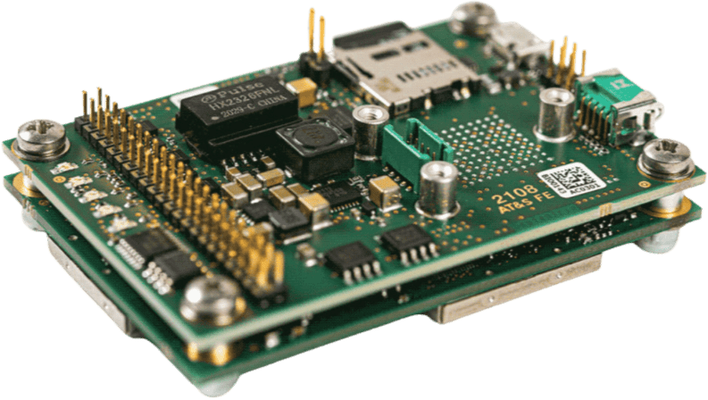
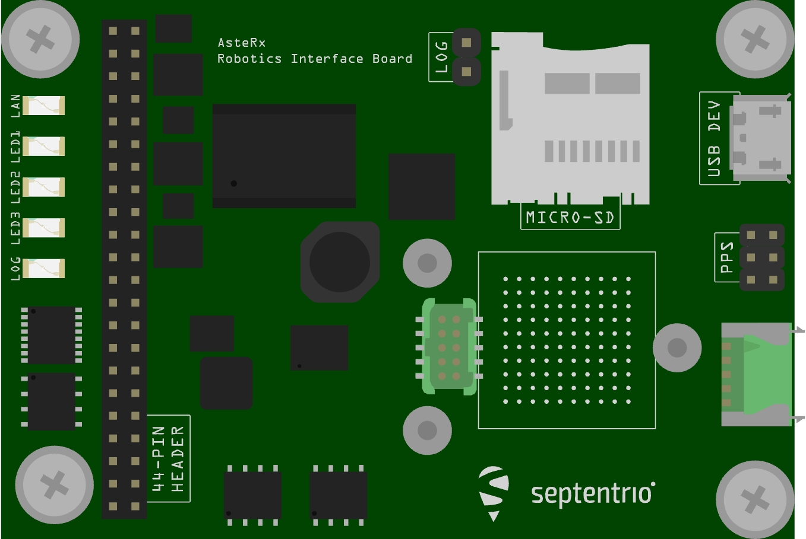
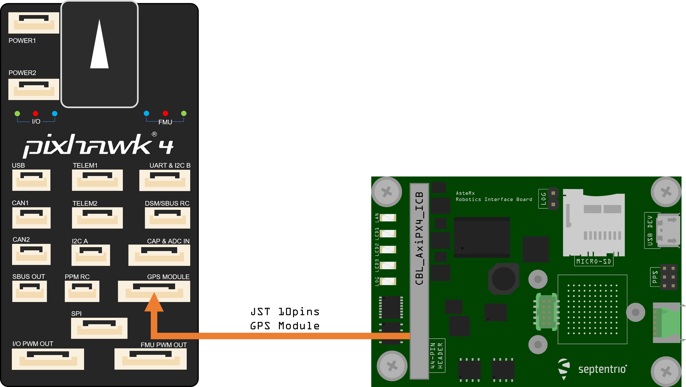
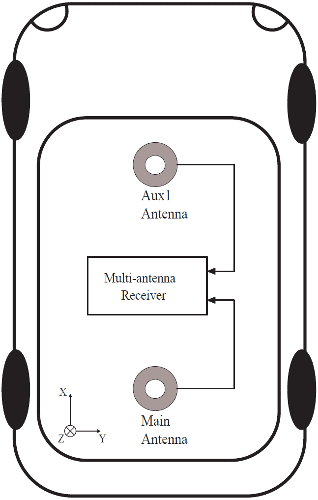
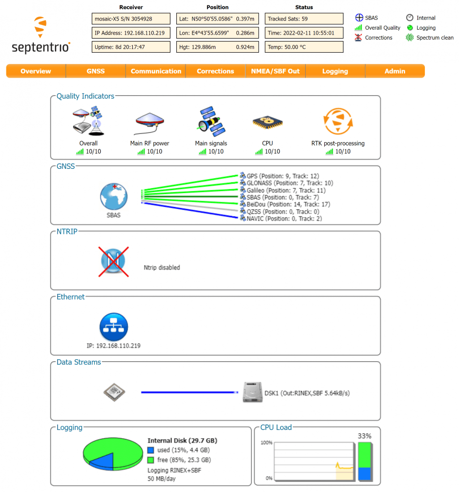

# Septentrio AsteRx-m3 Pro With RIB Board

Septentrio is the leading worldwide supplier of OEM GPS/GNSS receivers.
Septentrio OEM receivers deliver accurate and reliable positions to demanding industrial applications in a small, light-weight form factor.
There are several dual-antenna receiver options that allows for GPS information to be fused into the heading (other attitude information can also be determined, but is not fused by PX4).

Inertial sensor integration of the AsteRx-m3 Pro family offers a full attitude solution (heading, pitch and roll) synchronized with accurate positioning.

The Robotics Interface Board coupled with Septentrio GNSS receiver boards provides common interfaces like USB, ethernet, on-board logging and other functionalities designed for rapid prototyping, product evaluation or efficient integration.
The features include the following:

- Ultra-low-power credit-card size boards
- Easy integration into any system
- Best-in-class RTK performance with true multi-constellation, multi-frequency GNSS technology
- Advanced Interference Mitigation (AIM+) anti-jamming and anti-spoofing technology
- Resilient to vibration and shocks
- 44 pins I/O connector for autopilots such as Pixhawk
- On-board logging
- USB Micro-B connector
- Size: 71.53 x 47.5 x 18.15 mm
- Weight: 50g

## Purchase

All AsteRx receivers and Robotic Interface Boards can be purchased from the Septentrio webshop:

- [AsteRx-m3 Pro](https://web.septentrio.com/l/858493/2022-04-19/xgrrz)
- [AsteRx-m3 Pro+](https://web.septentrio.com/l/858493/2022-04-19/xgrs3)

Other PX4 supported devices from Septentrio:

- [mosaic-go evaluation kit](../gps_compass/septentrio_mosaic-go.md)

## 인터페이스

### USB

_Connector type: micro-USB type B._

The micro USB type B connector can be attached to a PC to power the receiver and to communicate with it over its USB port.

### 44-pin header

_Connector type: SAMTEC TMM-122-03-S-D, 2-mm pitch._

The 44-pin header can be used to connect multiple GPIO devices.
Refer to the [hardware manual](https://web.septentrio.com/l/858493/2022-04-19/xgrsw) for the pinout.

### LED's

The LED pins can be used to monitor the receiver status.
They can be used to drive external LEDs (max drive current 10mA).
It is assumed that the LED lights when the electrical level of the corresponding pin is high.
The general-purpose LED (GPLED pin) is configured with the setLEDMode command.

### Log Button Header

Putting a jumper on the LOG Button header (.100" vertical header) is equivalent to pressing a "log button".
The interface board takes care of debouncing.

### PPS/Event Header

_Connector type: SAMTEC TMM-103-03-G-D, 2-mm pitch._

The 6-pin 2mm header next to the micro USB connector exposes the first PPS signal.

### Power Supply Options

When a USB cable is connected to the USB Micro-B connector, the interface board is powered from the computer through the USB connector.
Alternatively, the power can be applied from the `PWR_IN` pins of the 44-pin connector.
The voltage range when powering from the `PWR_IN` pins is 4.5V to 30V.
Power can be applied from both sources at the same time.
On-board diodes prevent short circuits.
The interface board provides the 3V3 supply to the AsteRx-m3 OEM receiver and a 5V DC voltage to the `VANT` pin of the AsteRx-m3 OEM.

## PX4 설정

PX4 configuration is covered in [Septentrio GNSS Receivers](../gps_compass/septentrio.md).

## 하드웨어 설정

1. Make sure the receiver is powered with at least 3.3V. You can use the micro USB connector or the open ended supply (labeled "PWR & GND") on the 44 pin cable for this.
2. Connect one or two GNSS antennas to the external antenna ports on the AsteRx-m3 Pro board.
3. Connect the 44-pin cable to the AsteRx-m3 Pro board on RIB and connect the 10-pin JST connector to the _GPS MODULE_ port on the Pixhawk 4 as shown in the diagram above.

:::info
PX4 will ensure that the GNSS module is automatically configured. However, if you have a dual
antenna setup, you will need to set the layout as accurately as possible in the web app.
:::

### Dual-Antenna

The attitude (heading/pitch) can be computed from the orientation of the baseline between the main and the aux1 GNSS antennas.

To enable multi-antenna attitude determination, follow the following procedure:

1. Attach two antennas to your vehicle, using cables of approximately the same length.
   The default antenna configuration is as depicted in the figure.
   It consists in placing the antennas aligned with the longitudinal axis of the vehicle, main antenna behind `AUX1`.
   For best accuracy, try to maximize the distance between the antennas, and avoid significant height difference between the antenna ARPs.
2. In practice, the two antenna ARPs may not be exactly at the same height in the vehicle frame, or the main-aux1 baseline may not be exactly parallel or perpendicular to the longitudinal axis of the vehicle.
   This leads to offsets in the computed attitude angles.
   These can be compensated for with the heading parameters provided by the Septentrio driver in PX4.

:::info
For optimal heading results, the two antennas should be separated by at least 30cm / 11.8 in (ideally 50cm / 19.7in or more).

For additional configuration of the dual antenna setup, please refer to our [Knowledge Base](https://support.septentrio.com/l/858493/2022-04-19/xgrsh) or the [hardware manual](https://web.septentrio.com/l/858493/2022-04-19/xgrsl).
:::

### Web App

mosaic-H GPS/GNSS receiver module with heading comes with fully documented interfaces, commands and data messages.
The included GNSS receiver control and analysis software [RxTools](https://web.septentrio.com/l/858493/2022-04-19/xgrss) allows receiver configuration,
monitoring as well as data logging and analysis.

The receiver includes an intuitive web user interface for easy operation and monitoring allowing you to control the receiver from any mobile device or computer.
The web interface also uses easy-to-read quality indicators ideal to monitor the receiver operation during the job at hand.

:::tip
If you want more detailed information about the AsteRx and the Robotics Interface Board, please refer to the [hardware manual](https://web.septentrio.com/l/858493/2022-04-19/xgrsw) or the [Septentrio Support](https://support.septentrio.com/l/858493/2022-04-19/xgrsz) page.
:::
