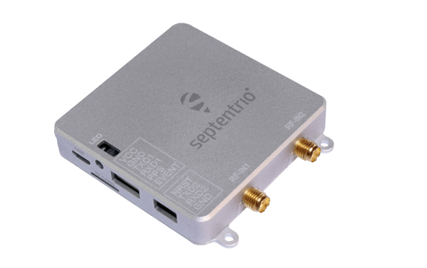
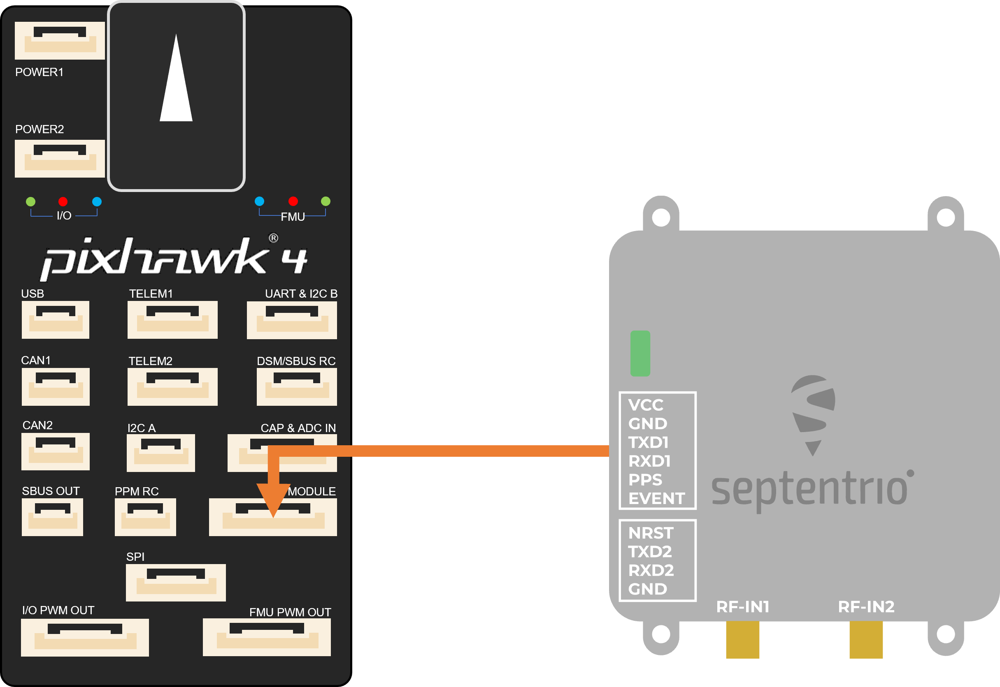
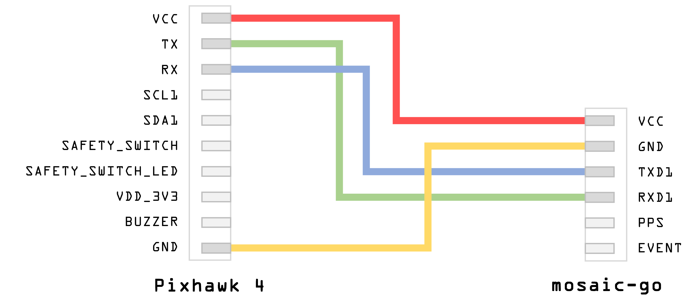

# Septentrio mosaic-go

The Septentrio mosaic-go receivers are evaluation kits for their mosaic-X5 and mosaic-H receiver modules.
Because of their small size and low weight, they are ideal for autopilot applications.
The available variants are the [mosaic-go](https://www.septentrio.com/en/products/gps/gnss-receiver-modules/mosaic-go-evaluation-kit)
and [mosaic-go heading](https://www.septentrio.com/en/products/gps/gnss-receiver-modules/mosaic-h-evaluation-kit).

Their features include the following:

- High update rate (>100 Hz) and low latency, both crucial for control systems of autonomous applications
- Reliable centimetre-level positioning
- Full L2 support via P(Y) code
- Size: 71 x 59 x 12 mm ± 1mm
- Weight: 58g ± 1g

## Purchase

The mosaic-go kit is available on Septentrio's [official store](https://web.septentrio.com/l/858493/2022-04-19/xgrnz):

- [mosaic-go heading GNSS module evaluation kit](https://web.septentrio.com/l/858493/2022-04-19/xgrp9)
- [mosaic-go GNSS module receiver evaluation kit](https://web.septentrio.com/l/858493/2022-04-19/xgrpd)

Other PX4 supported devices from Septentrio:

- [AsteRx OEM with Robotics Interface Board](../gps_compass/septentrio_asterx-rib.md)

## mosaic-go Evaluation Kit Contents

- 1 mosaic-H or mosaic-X5 module soldered on an interface board inside a metallic housing.
- 1 USB cable
- 6-pin COM1 open-ended cable
- 4-pin COM2 open-ended cable
- Help user guide card

## Physical Interfaces

| 형식              | 라벨             | Use                                                         |
| --------------- | -------------- | ----------------------------------------------------------- |
| USB Micro-B     | USB            | USB communication and power                                 |
| RSV USB Micro-B | RSV            | Reserved and should not be used                             |
| SMA             | RF-IN\{1,2\} | Main (and auxiliary) antenna connections |
| 6-pin JST       | 직렬             | Serial communication and power                              |
| 4-pin JST       | 직렬             | Serial communication                                        |
| microSD         | TF CARD        | Serial communication                                        |

> Dual-antenna is only available on mosaic-H-based receivers.

### 6-pin Connector

_Connector type: GH connector, 1.25mm pitch, 6 way. Mating connector housing: GHR-06V-S._

| Pin Name | 방향  | 단계                                         | 설명                        | 설명                                                                |
| -------- | --- | ------------------------------------------ | ------------------------- | ----------------------------------------------------------------- |
| VCC      | PWR | 4.75V-5.5V | Main power supply         |                                                                   |
| GND      |     | 0                                          | 접지                        |                                                                   |
| TXD1     | Out | 3V3_LVTTL             | Serial COM1 transmit line | Directly connects to TXD1 of internal mosaic                      |
| RXD1     | In  | 3V3_LVTTL             | Serial COM1 receive line  | Directly connects to RXD1 of internal mosaic                      |
| PPS      | Out | 3V3_LVTTL             | PPSoutput                 | PPSO from mosaic converted to 3.3V                |
| EVENT    | In  | 3V3_LVTTL             | Event timer input         | Connects to EVENTA of mosaic through a 3V3to 1V8 level translator |

### 4-pin Connector

_Connector type: GH connector, 1.25mm pitch, 4way. Mating connector housing: GHR-04V-S._

| Pin Name | 방향  | 단계                             | 설명                        | 설명                                                                   |
| -------- | --- | ------------------------------ | ------------------------- | -------------------------------------------------------------------- |
| NRST     | In  | 3V3_LVTTL | Reset input               | Directly connects to nRST_IN of internal mosaic |
| TXD2     | Out | 3V3_LVTTL | Serial COM2 transmit line | Directly connects to TXD2 of internal mosaic                         |
| RXD2     | In  | 3V3_LVTTL | Serial COM2 receive line  | Directly connects to RXD2 of internal mosaic                         |
| GND      |     | 0                              | 접지                        |                                                                      |

## PX4 설정

PX4 configuration is covered in [Septentrio GNSS Receivers](../gps_compass/septentrio.md).

## Hardware Connection Example Pixhawk 4

1. Make sure the receiver is powered with at least 3.3V. You can use the USB Micro-B connector or the 6-pin JST connector.
2. Connect one or two GNSS antennas to the RF-IN ports on the mosaic-go.
3. Connect the 6-pin connector (COM1) to the Pixhawk's _GPS MODULE_ port.
   This will provide power to the mosaic-go and with this single connection it will be able to send single and dual-antenna
   information to the Pixhawk 4.

:::warning
Make sure the JST cable is wired correctly since this is not a standard cable:

:::

### Dual-Antenna

The attitude (heading/pitch) can be computed from the orientation of the baseline between the main and the aux1 GNSS antennas.

To enable multi-antenna attitude determination, follow the following procedure:

1. Attach two antennas to your vehicle, using cables of approximately the same length.
   The default antenna configuration is as depicted in the figure.
   It consists in placing the antennas aligned with the longitudinal axis of the vehicle, main antenna behind AUX1.
   For best accuracy, try to maximize the distance between the antennas, and avoid significant height difference between the antenna ARPs.
2. In practice, the two antenna ARPs may not be exactly at the same height in the vehicle frame, or the main-aux1 baseline may not be exactly parallel or perpendicular to the longitudinal axis of the vehicle.
   This leads to offsets in the computed attitude angles.
   These can be compensated for with the heading parameters provided by the Septentrio driver in PX4.

:::info
For optimal heading results, the two antennas should be seperated by at least 30cm / 11.8 in (ideally 50cm / 19.7in or more).

For additional configuration of the dual antenna setup, please refer to our [Knowledge Base](https://support.septentrio.com/l/858493/2022-04-19/xgrqd) or the [hardware manual](https://web.septentrio.com/l/858493/2022-04-19/xgrql).
:::

### Web App

mosaic-H GPS/GNSS receiver module with heading comes with fully documented interfaces, commands and data messages.
The included GNSS receiver control and analysis software [RxTools](https://web.septentrio.com/l/858493/2022-04-19/xgrqp) allows receiver configuration, monitoring as well as data logging and analysis.

The receiver includes an intuitive web user interface for easy operation and monitoring allowing you to control the receiver from any mobile device or computer.
The web interface also uses easy-to-read quality indicators ideal to monitor the receiver operation during the job at hand.

## LED Status

| LED Color     | Powered | SD card mounted | PVT Solution | Logging enabled |
| ------------- | :-----: | :-------------: | :----------: | :-------------: |
| 빨강            |    ✓    |                 |              |                 |
| 녹색            |    ✓    |        ✓        |              |                 |
| 청색            |    ✓    |        ✓        |       ✓      |                 |
| Purple        |    ✓    |                 |       ✓      |                 |
| Purple + Blue |    ✓    |        ✓        |       ✓      |        ✓        |
| Red + Green   |    ✓    |        ✓        |              |        ✓        |

:::tip
For more detailed information about the mosaic-go and its module, please refer to the [hardware manual](https://web.septentrio.com/l/858493/2022-04-19/xgrrd) or the [Septentrio Support](https://support.septentrio.com/l/858493/2022-04-19/xgrrl) page.
:::
