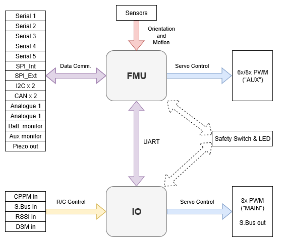

# PX4 참조 비행 콘트롤러 디자인

The PX4 reference design is the [Pixhawk series](../flight_controller/pixhawk_series.md) of flight controllers. First released in 2011, this design is now in its 5th [generation](#reference_design_generations) (with the 6th generation board design in progress).

## 바이너리 호환성

특정 디자인으로 제조된 모든 보드는 바이너리 호환이 되어야 합니다(즉, 동일한 펌웨어를 실행하여야 함). 2018년부터 우리는 이 호환성을 확인하고 인증할 수 있는 바이너리 호환성 테스트 제품군을 제공할 것입니다.

FMU 1~3세대는 개방형 하드웨어로 설계되었으나, FMU 4세대와 5세대는 핀아웃 및 전원 공급 사양만 제공했습니다(개략도는 개별 제조업체에서 작성하였습니다). 우수한 호환성을 위하여 FMUv6 이상은 완전한 참조 디자인 모델링합니다.

## 레퍼런스 디자인 세대

- FMUv1: Development board \(STM32F407, 128 KB RAM, 1MB flash, [schematics](https://github.com/PX4/Hardware/tree/master/FMUv1)\) (no longer supported by PX4)
- FMUv2: Pixhawk \(STM32F427, 168 MHz, 192 KB RAM, 1MB flash, [schematics](https://github.com/PX4/Hardware/tree/master/FMUv2)\)
- FMUv3: Pixhawk variants with 2MB flash \(3DR Pixhawk 2 \(Solo\), Hex Pixhawk 2.1, Holybro Pixfalcon, 3DR Pixhawk Mini, STM32F427, 168 MHz, 256 KB RAM, 2 MB flash, [schematics](https://github.com/PX4/Hardware/tree/master/FMUv3_REV_D)\)
- FMUv4: Pixracer \(STM32F427, 168 MHz, 256 KB RAM, 2 MB flash, [pinout](https://docs.google.com/spreadsheets/d/1raRRouNsveQz8cj-EneWG6iW0dqGfRAifI91I2Sr5E0/edit#gid=1585075739)\)
- FMUv4 PRO: Drotek Pixhawk 3 PRO \(STM32F469, 180 MHz, 384 KB RAM, 2 MB flash, [pinout](https://docs.google.com/spreadsheets/d/1raRRouNsveQz8cj-EneWG6iW0dqGfRAifI91I2Sr5E0/edit#gid=1585075739)\)
- FMUv5: Holybro Pixhawk 4 \(STM32F765, 216 MHz, 512 KB RAM, 2 MB flash, [pinout](https://docs.google.com/spreadsheets/d/1-n0__BYDedQrc_2NHqBenG1DNepAgnHpSGglke-QQwY/edit#gid=912976165)\)
- FMUv5X: (Multiple Products) \(STM32F765, 400 MHz, 512KB RAM, 2 MB flash\)  ([standard](https://github.com/pixhawk/Pixhawk-Standards/blob/master/DS-011%20Pixhawk%20Autopilot%20v5X%20Standard.pdf))
- FMUv6X: (Multiple Products) \(STM32H753, 480 MHz, 1 MB RAM, 2 MB flash\) and variant 6i \(i.MX RT1050, 600 MHz, 512 KB RAM, external flash\) ([standard](https://github.com/pixhawk/Pixhawk-Standards/blob/master/DS-012%20Pixhawk%20Autopilot%20v6X%20Standard.pdf))
- FMUv6C: (Multiple Products) \(STM32H743V, 480 MHz, 1 MB RAM, 2 MB flash\) ([standard](https://github.com/pixhawk/Pixhawk-Standards/blob/master/DS-018%20Pixhawk%20Autopilot%20v6C%20Standard.pdf))
- FMUv6U: (Multiple Products) \(STM32H753, 400 MHz, 1 MB RAM, 2 MB flash\) ([standard](https://github.com/pixhawk/Pixhawk-Standards/blob/master/DS-016%20Pixhawk%20Autopilot%20v6U%20Standard.pdf))
- FMUv6X-RT: (Multiple Products) \(NXP i.MX RT1176, 32 Bit Arm® Cortex®-M7, 1GHz 32 Bit Arm® Cortex®-M4, 400MHz secondary core, 2 MB RAM, 64 MB flash\) and variant 6i \(i.MX RT1050, 600 MHz, 512 KB RAM, external flash\) ([standard](https://github.com/pixhawk/Pixhawk-Standards/blob/master/DS-020%20Pixhawk%20Autopilot%20v6X-RT%20Standard.pdf))

Starting with FMUv5X all new standards are published on GitHub under [Pixhawk/Pixhawk-Standards](https://github.com/pixhawk/Pixhawk-Standards). See [Pixhawk.org](https://pixhawk.org) for more info.

## 메인 IO 기능 분석

아래 다이어그램은 Pixhawk 시리즈 비행 콘트롤러의  FMU와 I/O 보드간 기능과 버스 분할을 나타냅니다(보드는 단일 물리적 모듈에 통합됨).

<!-- Draw.io version of file can be found here: https://drive.google.com/file/d/1H0nK7Ufo979BE9EBjJ_ccVx3fcsilPS3/view?usp=sharing -->

일부 Pixhawk 시리즈 컨트롤러는 공간이나 복잡성을 줄이기 위하여 특정 보드 의 기능 향상을 위하여 I/O 보드 없이 제작됩니다.
In this case the I/O driver is not started.

:::info
Manufacturer flight controller variants without an I/O board are often named as a "diminutive" of a version that includes the I/O board: e.g. _Pixhawk 4_ **Mini**_, \_CUAV v5 **nano**_.
:::

Build targets that must run on flight controllers with an I/O board map the FMU outputs to `AUX` and the I/0 outputs to `MAIN` (see diagram above).
If the target is run on hardware where I/O board is not present or has been disabled, the PWM MAIN outputs will not be present.
You might see this, for example, by running `px4_fmu-v5_default` on [Pixhawk 4](../flight_controller/pixhawk4.md) (with IO) and [Pixhawk 4 Mini](../flight_controller/pixhawk4_mini.md) (without I/O).

:::warning
On [Pixhawk 4 Mini](../flight_controller/pixhawk4_mini.md) this results in a mismatch between the `MAIN` label screenprinted on the flight controller and the `AUX` bus shown during [Actuator Configuration](../config/actuators.md).
::: info that if a build target is only ever intended to run on a flight controller that does not have an I/0 board, then the FMU outputs are mapped to `MAIN` (for example, the `px4_fmu-v4_default` target for [Pixracer](../flight_controller/pixracer.md)).

PX4 PWM outputs are mapped to either `MAIN` or `AUX` ports in [Actuator Configuration](../config/actuators.md).
