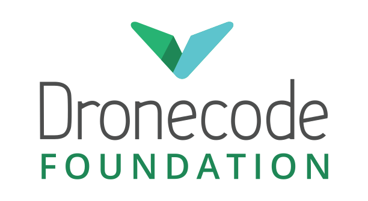

# PX4 Autopilot 사용자 안내서

  

PX4 is an open-source autopilot for drones and autonomous vehicles. It runs on multirotors, fixed-wing, VTOL, helicopters, rovers, and more. This guide covers everything from assembly and configuration to flight operations and development.

:::warning

This guide is for the _development_ version of PX4 (`main` branch).
Use the **Version** selector to find the current _stable_ version.

Documented changes since the stable release are captured in the evolving [release note](releases/main.md).
:::

## For Developers

:::tip
Building on PX4 or extending the platform? Start here: [Development Guide](development/development.md). Set up your [dev environment](dev_setup/config_initial.md), [build from source](dev_setup/building_px4.md), run [SITL simulation](simulation/index.md), or integrate via [ROS 2](ros2/index.md) and [MAVSDK](https://mavsdk.mavlink.io/).
:::

## 시작하기

Start with [Basic Concepts](getting_started/px4_basic_concepts.md) for an overview of the flight stack, flight modes, safety features, and supported hardware.

## Build a Vehicle

Pick your frame type: [Multicopter](frames_multicopter/index.md), [Fixed-Wing](frames_plane/index.md), [VTOL](frames_vtol/index.md), [Helicopter](frames_helicopter/index.md), or [Rover](frames_rover/index.md). Each section covers complete vehicles, kits, and DIY builds. For assembly instructions see [Assembling a Multicopter](assembly/assembly_mc.md) or the equivalent for your frame.

## Configure and Tune

Once assembled, follow the configuration guide for your vehicle type (e.g. [Multicopter Configuration](config_mc/index.md)). This covers sensor calibration, flight mode setup, and tuning.

## 하드웨어

The [Hardware Selection & Setup](hardware/drone_parts.md) section covers flight controllers, sensors, telemetry, RC systems, and payloads. See [Payloads](payloads/index.md) for camera and delivery integrations.

## Fly

Read [Operations](config/operations.md) to understand safety features and failsafe behavior before your first flight. Then see [Basic Flying (Multicopter)](flying/basic_flying_mc.md) or the equivalent for your frame type.

## 지원

Get help on the [discussion forums](https://discuss.px4.io/) or [Discord](https://discord.gg/dronecode). See the [Support](contribute/support.md) page for diagnosing problems, reporting bugs, and joining the [weekly dev call](contribute/dev_call.md).

## 기여

See the [Contributing](contribute/index.md) section for code, [documentation](contribute/docs.md), and [translation](contribute/translation.md) guidelines.

## 번역

There are several [translations](contribute/translation.md) of this guide. Use the language selector in the top navigation.

<!--@include: _contributors.md-->

## 라이선스

PX4 code is free to use and modify under the terms of the permissive [BSD 3-clause license](https://opensource.org/license/BSD-3-Clause).
This documentation is licensed under [CC BY 4.0](https://creativecommons.org/licenses/by/4.0/).
For more information see: [Licences](contribute/licenses.md).

## Calendar & Events

The _Dronecode Calendar_ shows important community events for platform users and developers.
사용자의 시간대와 맞는 달력을 보려면 아래 링크를 선택하십시오.
사용자 달력에 추가할 수 있습니다.

- [Switzerland – Zurich](https://calendar.google.com/calendar/embed?src=linuxfoundation.org_g21tvam24m7pm7jhev01bvlqh8%40group.calendar.google.com&ctz=Europe%2FZurich)
- [Pacific Time – Tijuana](https://calendar.google.com/calendar/embed?src=linuxfoundation.org_g21tvam24m7pm7jhev01bvlqh8%40group.calendar.google.com&ctz=America%2FTijuana)
- [Australia – Melbourne/Sydney/Hobart](https://calendar.google.com/calendar/embed?src=linuxfoundation.org_g21tvam24m7pm7jhev01bvlqh8%40group.calendar.google.com&ctz=Australia%2FSydney)

:::tip
The calendar default timezone is Central European Time (CET).

:::

<iframe src="https://calendar.google.com/calendar/embed?title=Dronecode%20Calendar&amp;mode=WEEK&amp;height=600&amp;wkst=1&amp;bgcolor=%23FFFFFF&amp;src=linuxfoundation.org_g21tvam24m7pm7jhev01bvlqh8%40group.calendar.google.com&amp;color=%23691426&amp;ctz=Europe%2FZurich" style="border-width:0" width="800" height="600" frameborder="0" scrolling="no"></iframe>

### 아이콘

이 라이브러리에서 사용하는 다음 아이콘들은 별도의 라이센스를 적용합니다. 아래 그림을 참고하십시오.

 _placeholder_ icon made by <a href="https://www.flaticon.com/authors/smashicons" title="Smashicons">Smashicons</a> from <a href="https://www.flaticon.com/" title="Flaticon">www.flaticon.com</a> is licensed by <a href="https://creativecommons.org/licenses/by/3.0/" title="Creative Commons BY 3.0" target="_blank">CC 3.0 BY</a>.

 _camera-automatic-mode_ icon made by <a href="https://www.freepik.com" title="Freepik">Freepik</a> from <a href="https://www.flaticon.com/" title="Flaticon">www.flaticon.com</a> is licensed by <a href="https://creativecommons.org/licenses/by/3.0/" title="Creative Commons BY 3.0" target="_blank">CC 3.0 BY</a>.

## 운영 방법

The PX4 Autopilot project is hosted by the [Dronecode Foundation](https://www.dronecode.org/), a [Linux Foundation](https://www.linuxfoundation.org/) Collaborative Project. Dronecode holds all PX4 trademarks and serves as the project's legal guardian, ensuring vendor-neutral stewardship. No single company owns the name or controls the roadmap. The source code is licensed under the [BSD 3-Clause](https://opensource.org/license/BSD-3-Clause) license, so you are free to use, modify, and distribute it in your own projects.

 

&nbsp;

Doc build time: {{ $buildTime }}
