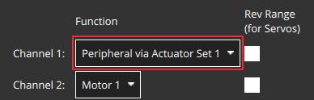
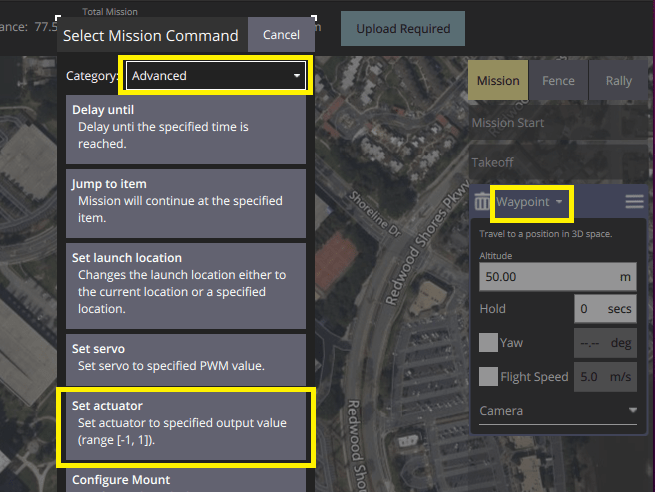
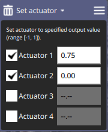

# Generic Actuator Control

You can connect arbitrary hardware to unused PX4 outputs and control it using [RC Control](#generic-actuator-control-with-rc) or [MAVLink](#generic-actuator-control-with-mavlink) (either as commands or in a [mission](#generic-actuator-control-in-missions)).

This is useful when you need to use a payload type for which there is no associated MAVLink command, or for which PX4 doesn't have any specific integration.

:::info
Prefer using integrated hardware and hardware-specific MAVLink commands, such as those for [Grippers](../peripherals/gripper.md), to generic actuator control when possible.
Using integrated hardware allows optimised [mission planning and behaviour](../flying/package_delivery_mission.md) because the mission can know key facts about the hardware, such as how long it takes to trigger.
:::

## Generic Actuator Control with MAVLink

[MAV_CMD_DO_SET_ACTUATOR](https://mavlink.io/en/messages/common.html#MAV_CMD_DO_SET_ACTUATOR) can be used to set the value of up to 6 actuators (at a time).
This command can be used in [missions](#generic-actuator-control-in-missions) by creating a "Set actuator" mission item, or as a stand alone command.

The outputs that are to be controlled are specified in the [Actuators](../config/actuators.md#actuator-outputs) configuration screen by assigning the functions `Peripheral via Actuator Set 1` to `Peripheral via Actuator Set 6` to the desired [actuator outputs](../config/actuators.md#actuator-outputs).



`MAV_CMD_DO_SET_ACTUATOR` `param1` to `param6` control the outputs mapped by `Peripheral via Actuator Set 1` to `Peripheral via Actuator Set 6` respectively.

For example, in the image above, the `AUX5` output is assigned the function `Peripheral via Actuator Set 1` function.
To control the actuator attached to `AUX5` you would set the value of `MAV_CMD_DO_SET_ACTUATOR.param1`.

<!-- PX4 v1.14 bug https://github.com/PX4/PX4-Autopilot/issues/21966 -->

## Generic Actuator Control with RC

Up to 6 autopilot PWM or CAN outputs can be controlled using RC channels.
The outputs that are to be controlled are specified in the [Actuators](../config/actuators.md#actuator-outputs) configuration screen by assigning the functions `RC AUX 1` to `RC AUX 6` to the desired [actuator outputs](../config/actuators.md#actuator-outputs).

To map a particular RC channel to an output function `RC AUX n` (and hence it's assigned output) you use the [RC_MAP_AUXn](../advanced_config/parameter_reference.md#RC_MAP_AUX1) parameter that has the same `n` number.

For example, to control an actuator attached to AUX pin 3 (say) you would assign the output function `RC AUX 5` to the output `AUX3`.
You could then use set the RC channel to control the `AUX3` output using `RC_MAP_AUX5`.

## Generic Actuator Control in Missions

To use generic actuator control in a mission you must first [configure the outputs that you want to control using MAVLink](#generic-actuator-control-with-mavlink).

Then in _QGroundControl_ you can set the value of actuator outputs in a mission using the **Set actuator** mission item (this adds a [MAV_CMD_DO_SET_ACTUATOR](https://mavlink.io/en/messages/common.html#MAV_CMD_DO_SET_ACTUATOR) to the uploaded mission plan).

It is important to note that with generic actuator control, neither _QGroundControl_ or PX4 know anything about the hardware being triggered.
When processing the mission item, PX4 will simply set the outputs to the specified values and then immediately proceed to the next mission item.
If the hardware requires time to activate and you need to pause at the current waypoint for this to happen, then you will need to plan the mission with additional items to achieve the desired behaviour.

:::info
This is one reason why integrated hardware is preferred!
It allows missions to be written generically, with any hardware-specific behaviour or timing managed by the flight stack configuration.
:::

To use a generic actuator in a mission:

1. Create a waypoint mission item where you want the actuator command.

2. Change the waypoint mission item to a "Set actuator" mission item:

   

   - Select the header on the waypoint mission editor to open the **Select Mission Command** editor.
   - Select the category **Advanced**, and then the **Set actuator** item (if the item is not present, try a more recent version of _QGroundControl_ or a daily build).
      This will change the mission item type to "Set actuator".

3. Select the actuators that are connected and set their values (these are normalized between -1 and 1).

   

## MAVSDK (Example script)

The following [MAVSDK](https://mavsdk.mavlink.io/main/en/index.html) [example code](https://github.com/mavlink/MAVSDK/blob/main/examples/set_actuator/set_actuator.cpp) shows how to trigger payload release using the MAVSDK Action plugin's [`set_actuator()`](https://mavsdk.mavlink.io/main/en/cpp/api_reference/classmavsdk_1_1_action.html#classmavsdk_1_1_action_1ad30beac27f05c62dcf6a3d0928b86e4c) method.

The `set_actuator()` index values map to the MAVLink payload outputs defined for your airframe.

:::info
MAVSDK sends the [MAV_CMD_DO_SET_ACTUATOR](https://mavlink.io/en/messages/common.html#MAV_CMD_DO_SET_ACTUATOR) MAVLink command under the hood.
:::

```cpp
#include <mavsdk/mavsdk.h>
#include <mavsdk/plugins/action/action.h>
#include <chrono>
#include <cstdint>
#include <iostream>
#include <future>

using namespace mavsdk;

void usage(const std::string& bin_name)
{
    std::cerr << "Usage :" << bin_name << " <connection_url> <actuator_index> <actuator_value>\n"
              << "Connection URL format should be :\n"
              << " For TCP : tcp://[server_host][:server_port]\n"
              << " For UDP : udp://[bind_host][:bind_port]\n"
              << " For Serial : serial:///path/to/serial/dev[:baudrate]\n"
              << "For example, to connect to the simulator use URL: udp://:14540\n";
}

int main(int argc, char** argv)
{
    if (argc != 4) {
        usage(argv[0]);
        return 1;
    }

    const std::string connection_url = argv[1];
    const int index = std::stod(argv[2]);
    const float value = std::stof(argv[3]);

    Mavsdk mavsdk;
    const ConnectionResult connection_result = mavsdk.add_any_connection(connection_url);

    if (connection_result != ConnectionResult::Success) {
        std::cerr << "Connection failed: " << connection_result << '\n';
        return 1;
    }

    std::cout << "Waiting to discover system...\n";
    auto prom = std::promise<std::shared_ptr<System>>{};
    auto fut = prom.get_future();

    // We wait for new systems to be discovered, once we find one that has an
    // autopilot, we decide to use it.
    mavsdk.subscribe_on_new_system([&mavsdk, &prom]() {
        auto system = mavsdk.systems().back();

        if (system->has_autopilot()) {
            std::cout << "Discovered autopilot\n";

            // Unsubscribe again as we only want to find one system.
            mavsdk.subscribe_on_new_system(nullptr);
            prom.set_value(system);
        }
    });

    // We usually receive heartbeats at 1Hz, therefore we should find a
    // system after around 3 seconds max, surely.
    if (fut.wait_for(std::chrono::seconds(3)) == std::future_status::timeout) {
        std::cerr << "No autopilot found, exiting.\n";
        return 1;
    }

    // Get discovered system now.
    auto system = fut.get();

    // Instantiate plugins.
    auto action = Action{system};

    std::cout << "Setting actuator...\n";
    const Action::Result set_actuator_result = action.set_actuator(index, value);

    if (set_actuator_result != Action::Result::Success) {
        std::cerr << "Setting actuator failed:" << set_actuator_result << '\n';
        return 1;
    }

    return 0;
}
```

## 시험

Payloads that are triggered by servos and other actuators, such as grippers, can be tested in the [pre-arm state](../getting_started/px4_basic_concepts.md#arming-and-disarming), which disables motors but allows actuators to move.

This is safer than testing when the vehicle is armed.

Camera payloads can be triggered and tested at any time.