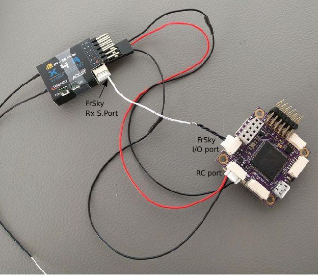

# FrSky 텔레메트리

FrSky telemetry allows you to access vehicle [telemetry/status](#messages) information on a compatible RC transmitter.

Available [telemetry is listed here](#messages), and includes: flight mode, battery level, RC signal strength, speed, altitude etc.
일부 송신기는 가청 및 진동 피드백을 추가로 제공 할 수 있으며, 이는 배터리부족과 기타 안전 관련 경고시에 매우 유용합니다.

PX4 supports both [S.Port](#s_port) (new) and D (old) FrSky telemetry ports.

## 하드웨어 설정

FrSky 텔레메트리의 요구사항은 다음과 같습니다.

- An [FrSky-compatible RC transmitter](#transmitters) like the FrSky Taranis X9D Plus.
- An [FrSky telemetry-capable receiver](#receivers) like the XSR and X8R.
- FrSky 수신기 스마트 포트(SPort)는 비행 콘트롤러 UART에 연결 케이블입니다.

First [connect the receiver for RC channels](../getting_started/rc_transmitter_receiver.md#connecting-receivers), e.g. connect the S.Bus ports on the receiver and the flight controller.

Then set up FrSky telemetry by separately connecting the SPort on the receiver to any free UART on the flight controller, and then [configure PX4 to run FrSky telemetry on that UART](#configure).

이것은 SPort 수신기에 반전되지 않은 출력용 핀 유무와 Pixhawk 버전에 따라 약간 다르게 수행됩니다.

### Pixhawk FMUv4 (및 이전)

For Pixhawk FMUv4 and earlier, UART ports and receiver telemetry ports are typically incompatible (with the exception of [Pixracer](../flight_controller/pixracer.md)).

Generally SPort receivers have an _inverted_ S.Port signal and you have to use a converter cable to split the S.Port into uninverted TX and RX for connecting to the Pixhawk UART.
예시는 다음과 같습니다.


:::tip
When connecting to an inverted S.Port it is usually cheaper and easier to buy a [ready made cable](#ready_made_cable) that contains this adapter and has the appropriate connectors for the autopilot and receiver.
Creating a [DIY cable](#diy_cables) requires electronics assembly expertise.
:::

If using an S.Port receiver with a pin for _uninverted output_ you can simply attach one of the UART's TX pins.

<!-- FYI only: The uninverted output can be used in single-wire mode so you don't need both RX and TX wires.
Discussion of that here: https://github.com/PX4/PX4-user_guide/pull/755#pullrequestreview-464046128 -->

Then [configure PX4](#configure).

### Pixhawk FMUv5/STM32F7 이후

Pixhawk FMUv5와 이후 버전에서는 PX4는 반전된(또는 반전되지 않은) S.Port 신호를 직접 읽을 수 있으며, 특별한 케이블이 필요하지 않습니다.

:::info
More generally this is true on autopilots with STM32F7 or later (e.g. [Durandal](../flight_controller/durandal.md) has a STM32H7 and can read inverted or uninverted S.Port signals directly).
:::

UART의 TX핀중 하나를 SPort 반전 또는 비반전 핀에 연결하면됩니다 (PX4는 두 유형 중 하나를 자동으로 감지합니다).
Then [configure PX4](#configure).

<a id="configure"></a>

## PX4 설정

[Configure the serial port](../peripherals/serial_configuration.md) on which FrSky will run using [TEL_FRSKY_CONFIG](../advanced_config/parameter_reference.md#TEL_FRSKY_CONFIG).
포트 전송속도는 드라이버에 의해 설정되므로, 추가로 설정하지 않아도 됩니다.

:::info
You can use any free UART, but typically `TELEM 2` is used for FrSky telemetry (except for [Pixracer](../flight_controller/pixracer.md), which is pre-configured to use the _FrSky_ port by default).
:::

:::tip
If the configuration parameter is not available in _QGroundControl_ then you may need to [add the driver to the firmware](../peripherals/serial_configuration.md#parameter_not_in_firmware):

```
drivers/telemetry/frsky_telemetry
```

:::

추가 설정이 필요하지 않습니다.
FrSky 텔레메트리는 연결되면 자동으로 시작되고 D 또는 S 모드를 감지합니다.

<a id="transmitters"></a>

## 호환 RC 송신기

텔레메트리 스트림을 수신 기능한 (FrSky 수신기에 바인딩된) RC 송신기가 필요합니다.

많이 사용되는 제품들은 다음과 같습니다.

- FrSky Taranis X9D Plus (추천)
- FrSky Taranis X9D
- FrSky Taranis X9E
- FrSky Taranis Q X7
- Turnigy 9XR Pro

위의 송신기는 추가 설정없이, 텔레메트리 데이터를 출력합니다. 다음 섹션에서는 텔레메트리 디스플레이를 설정 방법(예 : 더 나은 UI/UX 생성)을 설명합니다.

### Taranis - LuaPilot 설정

OpenTX 2.1.6 이상을 실행하는 Taranis 호환 수신기(예 : X9D Plus)는 LuaPilot 스크립트를 사용하여 원격 측정 출력을 수정할 수 있습니다 (아래 스크린 샷 참조).


Instructions for installing the script can be found here: [LuaPilot Taranis Telemetry script > Taranis Setup OpenTX 2.1.6 or newer](http://ilihack.github.io/LuaPilot_Taranis_Telemetry/)

If you open the `LuaPil.lua` script with a text editor, you can edit the configuration. 제안된 수정 사항은 다음과 같습니다.

- `local BattLevelmAh = -1` - Use the battery level calculation from the vehicle
- `local SayFlightMode = 0` - There are no WAV files for the PX4 flight modes

<a id="messages"></a>

## 텔레메트리 메시지

FrSky Telemetry는 PX4 유용한 상태 정보 대부분을 전송합니다.
S-Port 및 D-Port 수신기는 다음 섹션에 나열된대로 서로 다른 메시지 세트를 전송합니다.

<a id="s_port"></a>

### S-Port

S-Port receivers transmit the following messages from PX4 (from [here](https://github.com/iNavFlight/inav/blob/master/docs/Telemetry.md#available-smartport-sport-sensors)):

- **AccX, AccY, AccZ:** Accelerometer values.
- **Alt:** Barometer based altitude, relative to home location.
- **Curr:** Actual current consumption (Amps).
- **Fuel:** Remaining battery percentage if `battery_capacity` variable set and variable `smartport_fuel_percent = ON`, mAh drawn otherwise.
- **GAlt:** GPS altitude, sea level is zero.
- **GPS:** GPS coordinates.
- **GSpd:** Current horizontal ground speed, calculated by GPS.
- **Hdg:** Heading (degrees - North is 0°).
- **VFAS:** Actual battery voltage value (Voltage FrSky Ampere Sensor).
- **VSpd:** Vertical speed (cm/s).
- **Tmp1:** [Flight mode](../flight_modes/index.md#flight-modes), sent as an integer: 18 - Manual, 23 - Altitude, 22 - Position, 27 - Mission, 26 - Hold, 28 - Return, 19 - Acro, 24 0 Offboard, 20 - Stabilized, 25 - Takeoff, 29 - Land, 30 - Follow Me.
- **Tmp2:** GPS information. 가장 오른쪽 숫자는 GPS 수정 유형입니다 (0 = 없음, 2 = 2D, 3 = 3D). 다른 숫자는 위성의 수입니다.

:::info
The following "standard" S-Port messages are not supported by PX4: **ASpd**, **A4**.
:::

<!-- FYI:
Values of FRSKY_ID_TEMP1 and FRSKY_ID_TEMP1 set:
- https://github.com/PX4/PX4-Autopilot/blob/main/src/drivers/telemetry/frsky_telemetry/frsky_telemetry.cpp#L85  (get_telemetry_flight_mode)
- https://github.com/PX4/PX4-Autopilot/blob/main/src/drivers/telemetry/frsky_telemetry/frsky_data.cpp#L234-L237
Lua map of flight modes:
- https://github.com/ilihack/LuaPilot_Taranis_Telemetry/blob/master/SCRIPTS/TELEMETRY/LuaPil.lua#L790
-->

### D-port

D-Port receivers transmit the following messages (from [here](https://github.com/cleanflight/cleanflight/blob/master/docs/Telemetry.md)):

- **AccX, AccY, AccZ:** Accelerometer values.
- **Alt:** Barometer based altitude, init level is zero.
- **Cels:** Average cell voltage value (battery voltage divided by cell number).
- **Curr:** Actual current consumption (Amps).
- **Fuel:** Remaining battery percentage if capacity is set, mAh drawn otherwise.
- **Date:** Time since powered.
- **GAlt:** GPS altitude, sea level is zero.
- **GPS:** GPS coordinates.
- **GSpd:** Current speed, calculated by GPS.
- **Hdg:** Heading (degrees - North is 0°).
- **RPM:** Throttle value if armed, otherwise battery capacity. Taranis에서 블레이드 번호는 12로 설정하여야 합니다.
- **Tmp1:** Flight mode (as for S-Port).
- **Tmp2:** GPS information (as for S-Port).
- **VFAS:** Actual battery voltage value (Voltage FrSky Ampere Sensor).
- **Vspd:** Vertical speed (cm/s).

<a id="receivers"></a>

## FrSky 텔레메트리 수신기

Pixhawk/PX4는 D (이전) 및 S (신규) FrSky 텔레메트리를 지원합니다. 아래 표는 D/S.PORT 텔레메트리를 지원하는 FrSky 수신기들입니다 (이론상 모두 작동함).

:::tip
Note that the X series receivers listed below are recommended (e.g. XSR, X8R). R 및 G 시리즈는 테스트팀에 의해 검증되지 않았지만 작동하여야 합니다.
:::

| 수신기         | 범위                    | 복합 출력                                                                       | 디지털 텔레메트리 입력                  | 크기                                                                    | 중량                    |
| ----------- | --------------------- | --------------------------------------------------------------------------- | ----------------------------- | --------------------------------------------------------------------- | --------------------- |
| D4R-II      | 1.5km | CPPM (8)                                                 | D.Port        | 40x22.5x6mm                                           | 5.8g  |
| D8R-XP      | 1.5km | CPPM (8)                                                 | D.Port        | 55x25x14mm                                                            | 12.4g |
| D8R-II Plus | 1.5km | 없음                                                                          | D.Port        | 55x25x14mm                                                            | 12.4g |
| X4R         | 1.5km | CPPM (8)                                                 | Smart Port                    | 40x22.5x6mm                                           | 5.8g  |
| X4R-SB      | 1.5km | S.Bus (16)                               | Smart Port                    | 40x22.5x6mm                                           | 5.8g  |
| X6R / S6R   | 1.5km | S.Bus (16)                               | Smart Port                    | 47.42×23.84×14.7mm    | 15.4g |
| X8R / S8R   | 1.5km | S.Bus (16)                               | Smart Port                    | 46.25 x 26.6 x 14.2mm | 16.6g |
| XSR / XSR-M | 1.5km | S.Bus (16) / CPPM (8) | Smart Port                    | 26x19.2x5mm                                           | 3.8g  |
| RX8R        | 1.5km | S.Bus (16)                               | Smart Port                    | 46.25x26.6x14.2mm     | 12.1g |
| RX8R PRO    | 1.5km | S.Bus (16)                               | Smart Port                    | 46.25x26.6x14.2mm     | 12.1g |
| R-XSR       | 1.5km | S.Bus (16) / CPPM (8) | Smart Port                    | 16x11x5.4mm                                           | 1.5g  |
| G-RX8       | 1.5km | S.Bus (16)                               | Smart Port + integrated vario | 55.26_17_8mm                                          | 5.8g  |
| R9          | 10km                  | S.Bus (16)                               | Smart Port                    | 43.3x26.8x13.9mm      | 15.8g |
| R9 slim     | 10km                  | S.Bus (16)                               | Smart Port                    | 43.3x26.8x13.9mm      | 15.8g |

:::info
The above table originates from http://www.redsilico.com/frsky-receiver-chart and FrSky [product documentation](https://www.frsky-rc.com/product-category/receivers/).
:::

<a id="ready_made_cable"></a>

## 기성품 케이블

Pixhawk FMUv4와 이전 버전 (Pixracer 제외)의 기성품 케이블은 아래에서 구매가능합니다.

- [Craft and Theory](http://www.craftandtheoryllc.com/telemetry-cable). Versions are available with DF-13 compatible _PicoBlade connectors_ (for FMUv2/3DR Pixhawk, FMUv2/HKPilot32) and _JST-GH connectors_ (for FMUv3/Pixhawk 2 "The Cube" and FMUv4/PixRacer v1).

  <a href="http://www.craftandtheoryllc.com/telemetry-cable"></a>

<a id="diy_cables"></a>

## DIY 케이블

자신만의 어댑터 케이블을 만들 수 있습니다.
You will need connectors that are appropriate for your autopilot (e.g. _JST-GH connectors_ for FMUv3/Pixhawk 2 "The Cube" and FMUv4/PixRacer v1, and DF-13 compatible _PicoBlade connectors_ for older autopilots).

Pixracer에는 S.PORT와 UART 간의 신호 변환 장치가 포함되어 있지만, 다른 보드의 경우 UART-S.PORT 어댑터가 필요합니다.
아래에서 구매 가능합니다.

- [FrSky FUL-1](https://www.frsky-rc.com/product/ful-1/): [unmannedtech.co.uk](https://www.unmannedtechshop.co.uk/frsky-transmitter-receiver-upgrade-adapter-ful-1/)
- SPC: [getfpv.com](http://www.getfpv.com/frsky-smart-port-converter-cable.html), [unmannedtechshop.co.uk](https://www.unmannedtechshop.co.uk/frsky-smart-port-converter-spc/)

다른 보드에서의 연결 방법은 아래에 기술되어 있습니다.

### Pixracer to S-port 변환 수신기

Pixracer FrSky TX와 RX 라인을 X 시리즈 수신기의 S.port 핀에 함께 연결합니다 (전선을 함께 납땜).
GND는 S.Bus(일반 RC 연결)에 연결시 수행되므로 연결할 필요가 없습니다.

S-port 연결은 아래와 같습니다 (제공된 I/O 커넥터 사용).




### Pixracer to D-port  변환 수신기

:::tip
The vast majority of users now prefer to use S.PORT.
:::

Pixracer FrSky TX 라인 (FS 출력)을 수신기의 RX 라인에 연결합니다.
Pixracer FrSky RX 라인 (FS 입력)을 수신기 TX 라인에 연결합니다.
GND는 RC/SBus (일반 RC의 경우)에 연결할 때 수행되므로 연결할 필요 없습니다.

<!-- Image would be nice -->

### Pixhawk  Pro

[Pixhawk 3 Pro](../flight_controller/pixhawk3_pro.md) can be connected to TELEM4 (no additional software configuration is needed).
You will need to connect via a UART to S.PORT adapter board, or a [ready-made cable](#ready_made_cable).

### Pixhawk FMUv5 이후

UART의 TX핀중 하나를 SPort 반전 또는 비반전 핀에 연결하면됩니다 (PX4는 두 유형 중 하나를 자동으로 감지합니다).

### 기타 보드

대부분의 다른 보드는 TELEM2 UART를 통해 FrSky 텔레메트리 수신기에 연결합니다.
This includes, for example: [Pixhawk 1](../flight_controller/pixhawk.md), [mRo Pixhawk](../flight_controller/mro_pixhawk.md), Pixhawk2.

You will need to connect via a UART to S.PORT adapter board, or a [ready-made cable](#ready_made_cable).

<!-- ideally add diagram here -->

## 추가 정보

추가 정보는 다음 링크를 참고하십시오.

- [FrSky Taranis Telemetry](https://github.com/Clooney82/MavLink_FrSkySPort/wiki/1.2.-FrSky-Taranis-Telemetry)
- [Taranis X9D: Setting Up Telemetry](https://www.youtube.com/watch?v=x14DyvOU0Vc) (Video Tutorial)
- [Px4 FrSky Telemetry Setup with Pixhawk2 and X8R Receiver](https://discuss.px4.io//t/px4-frsky-telemetry-setup-with-pixhawk2-and-x8r-receiver/6362) (DIY Cables)
