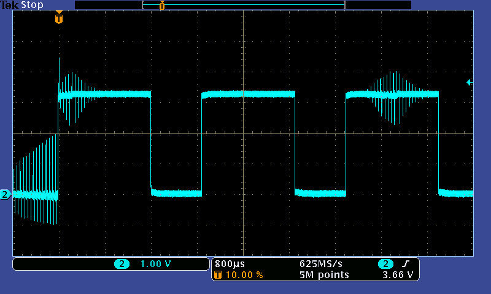

# PWM 서보 및 ESC (모터 컨트롤러)

PWM 기반 브러시리스 모터 컨트롤러, 서보를 연결 방법과 전원 공급 방법을 설명합니다.

## ESC 연결 개요

각 PWM ESC에는 최소한 다음과 같은 전선들을 가지고 있습니다.

- Power VBAT (일반적으로 두껍고 빨간색)
- Power GND (보통 두껍고 검정색)

그리고 서보 플러그에서:

- PWM 신호 (일반적으로 흰색 또는 노란색)
- GND (일반적으로 검정색 또는 갈색)

The servo plug _may_ also have a +5V wire (usually red or orange).
이 와이어의 목적과 연결 방법은 ESC와 기체 유형에 따라 달라집니다.

:::tip
In some cases (see below)the +5V line is not needed.
+5V 라인을 절단하는 대신 해당 핀용 서보 커넥터 플라스틱 하우징의 잠금 탭을 부드럽게 들어 올린 다음 (예 : 커터 블레이드 또는 소형 스크루 드라이버 사용) 핀을 빼낼 수 있습니다.
전기 절연 테이프로 분리하고 서보 케이블에 테이프로 붙입니다.
This allows you to easily undo the wire later if needed
:::

## 전원 연결

항상 Power VBAT 및 GND를 배터리에 연결하고, PWM 신호 및 GND를 서보 플러그에서 모터로 연결하십시오.

:::tip
There is **no setup** that does not require signal ground to be connected!
:::

+5V 와이어 (있는 경우)에 대한 연결은 ESC/기체에 따라 달라집니다.

### Fixed-wing / VTOL

On a fixed-wing (or VTOL) ESC, the +5V line usually provides the output of a Battery Elimination Circuit (BEC).:

- 이것은 Pixhawk 서보 레일에 연결되어 플랩, 에일러론 등의 서보에 전원을 공급에 사용할 수 있습니다.

  ::: info
  It is unsafe to power servos or ESCs from the autopilot's avionics power supply.
  This is why **Pixhawk series** flight controllers do not provide power for the servo rail (the AUX servo rail is unpowered and is limited to 1A).

:::

- As a rule of thumb you should only connect the _output of only one BEC_ to the Pixhawk servo rail.
  여러 +5V 출력을 레일에 연결할 수 있지만, ESC 모델에 따라 다릅니다.

### 멀티콥터

멀티 콥터에서 +5V 라인이 없거나 (있는 경우) 연결되지 않을 수 있습니다.

- 멀티 콥터는 종종 서보가 필요하지 않으므로, Pixhawk 서보 레일에 전원을 공급할 필요가 없습니다 (모터는 일반적으로 배전 보드에서 별도로 전원이 공급됨).
- 와이어를 서보 레일에 연결하여도 단점이나 장점은 없습니다.
- DJI ESC는 일반적으로 이 와이어가 포함되어 있지만, 연결되어 있지는 않습니다.

### 광절연 ESC

On an opto-isolated ESC **without** BEC, the +5V line might need to be connected and powered (in order to provide power to the ESC microcontroller).
이 경우 와이어는 일반적으로 비행 콘트롤러 서보 레일에 연결되며, 서보 레일은 추가 BEC에서 전원을 공급하여야 합니다.

## PX4 설정

PWM motors and servos are configured using the [Actuator Configuration](../config/actuators.md) screen in QGroundControl.

After assigning outputs and basic calibration, you may then wish to peform an [ESC Calibration](../advanced_config/esc_calibration.md).

Additional PX4 PWM configuration parameters can be found here: [PWM Outputs](../advanced_config/parameter_reference.md#pwm-outputs).

## 문제 해결

Pixhawk is compatible with all _PWM ESCs_ on the market.
If a particular ESC is not operational, it is incorrectly wired up or configured.

### 접지 연결

Check that the ground (black wire) of the ESC servo connector is connected to Pixhawk (there is no valid wiring setup that does not have a ground reference).

:::warning
It is unsafe to fly without ground connected.
This is because for every positive pulse (the ESC signal) there needs to be an adjacent ground return path for a clean signal shape.

The image below shows how noisy the signal becomes if GND is not connected.

:::

### 전원 연결 / 광절연 ESC

If using an opto-isolated ESC that does not provide a BEC / power output, please ensure that the ESC does not need its +5V line powered for the opto-isolator.

See the first section of this page explains for other power connection considerations.

### 잘못된 최소치

Some ESCs need to see a special low value pulse before switching on (to protect users who have the throttle stick in the middle position on power-up).

PX4 sends a pulse when the vehicle is disarmed, which silences the ESCs when they are disarmed and ensures that ESCs initialise correctly.
Appropriate values are determined and set as part of the [actuator configuration/testing](../config/actuators.md#actuator-testing) process (internally these set the per-output parameters [PWM_MAIN_DISn](../advanced_config/parameter_reference.md#PWM_MAIN_DIS1) and [PWM_AUX_DISn](../advanced_config/parameter_reference.md#PWM_AUX_DIS1)).

### 시간 초과

Some ESCs may time out (preventing motor activation) if they have not received a valid low pulse within a few seconds of power on.

PX4 sends an idle/disarmed pulse right after power on to stop ESCs timing out.
Appropriate values are determined and set as part of the [actuator configuration/testing](../config/actuators.md#actuator-testing) process (internally these set the per-output parameters [PWM_MAIN_DISn](../advanced_config/parameter_reference.md#PWM_MAIN_DIS1) and [PWM_AUX_DISn](../advanced_config/parameter_reference.md#PWM_AUX_DIS1)).

### 유효한 펄스 모양, 전압 및 업데이트 속도

:::info
This should not be a problem, but is included for completeness
:::

Pixhawk uses active high pulses, as used by all the major brands (Futaba, Spektrum, FrSky).

PWM interfaces are not formally standardised, however, the normal micro controllers all use TTL or CMOS voltage levels.
TTL is defined as low < 0.8V and high > 2.0V with some manufacturers using > 2.4V for additional noise margin.
CMOS logic is defined with similar voltage levels.
5V levels are **never** required to successfully switch to an _on_ state.

:::tip
Futaba, FrSky and Spektrum receivers output 3.3V or 3.0V voltage levels, as they are well above 2.4V.
Pixhawk has adopted this common industry pattern and outputs 3.3V levels on recent boards.
:::
