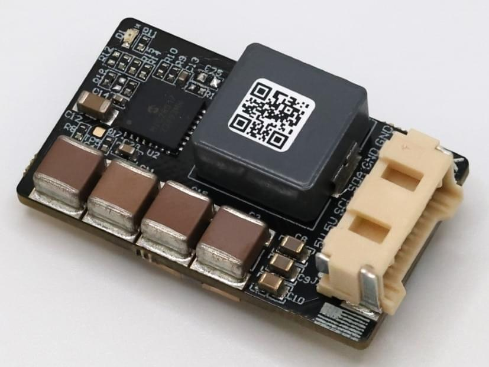

# ARK 12S PAB Power Module

The [ARK 12S PAB Power Module](https://arkelectron.gitbook.io/ark-documentation/power/ark-12s-pab-power-module) is a 5V 6A power supply and digital power monitor designed for use with Pixhawk Autopilot Bus Carrier boards.

## 구매처

Order this module from:

- [ARK Electronics](https://arkelectron.com/product/ark-12s-pab-power-module/) (US)

## Hardware Specifications

- **TI INA238 Digital Power Monitor**

  - 0.0001 Ohm Shunt
  - I2C Interface

- **5.2V 6A Step-Down Regulator**

  - 66V Maximum Input Voltage
  - 10V Minimum Input Voltage at 6A Out
  - Output Over-Current Protection

- **Connections**

  - Solder Pads Battery Input
  - Solder Pads Battery Output
  - 6 Pin Molex CLIK-Mate Output
    - [Matches ARK PAB Carrier Power Pinout](https://arkelectron.gitbook.io/ark-documentation/flight-controllers/ark-pixhawk-autopilot-bus-carrier/pinout)

- **Other**

  - USA Built
  - Includes 6 Pin Molex CLIK-Mate Cable

- **Additional Information**
  - Weight: 15.5 g
  - Dimensions: 3.7 cm x 2.2 cm x 1.3 cm

## PX4 Setup

- Disable the `SENS_EN_INA226` parameter if it is enabled.
- Enable the `SENS_EN_INA238` parameter.
- Reboot the flight controller.
- Set the `INA238_SHUNT` parameter to 0.0001.
- Reboot the flight controller.

## See Also

- [ARK 12S PAB Power Module Documentation](https://arkelectron.gitbook.io/ark-documentation/power/ark-12s-pab-power-module) (ARK Docs)
