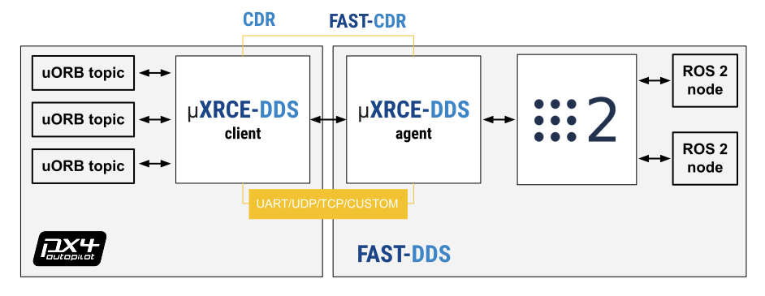
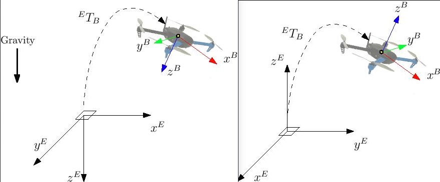

# ROS 2 사용자 가이드

The ROS 2-PX4 architecture provides a deep integration between ROS 2 and PX4, allowing ROS 2 subscribers or publisher nodes to interface directly with PX4 uORB topics.

This topic provides an overview of the architecture and application pipeline, and explains how to setup and use ROS 2 with PX4.

:::info
From PX4 v1.14, ROS 2 uses [uXRCE-DDS](../middleware/uxrce_dds.md) middleware, replacing the _FastRTPS_ middleware that was used in version 1.13 (v1.13 does not support uXRCE-DDS).

The [migration guide](../middleware/uxrce_dds.md#fast-rtps-to-uxrce-dds-migration-guidelines) explains what you need to do in order to migrate ROS 2 apps from PX4 v1.13 to PX4 v1.14.

If you're still working on PX4 v1.13, please follow the instructions in the [PX4 v1.13 Docs](https://docs.px4.io/v1.13/en/ros/ros2_comm.html).

<!-- remove this when there are PX4 v1.14 docs for some months -->

:::

## 개요

The application pipeline for ROS 2 is very straightforward, thanks to the use of the [uXRCE-DDS](../middleware/uxrce_dds.md) communications middleware.



<!-- doc source: https://docs.google.com/drawings/d/1WcJOU-EcVOZRPQwNzMEKJecShii2G4U3yhA3U6C4EhE/edit?usp=sharing -->

The uXRCE-DDS middleware consists of a client running on PX4 and an agent running on the companion computer, with bi-directional data exchange between them over a serial, UDP, TCP or custom link.
The agent acts as a proxy for the client to publish and subscribe to topics in the global DDS data space.

The PX4 [uxrce_dds_client](../modules/modules_system.md#uxrce-dds-client) is generated at build time and included in PX4 firmware by default.
It includes both the "generic" micro XRCE-DDS client code, and PX4-specific translation code that it uses to publish to/from uORB topics.
The subset of uORB messages that are generated into the client are listed in [PX4-Autopilot/src/modules/uxrce_dds_client/dds_topics.yaml](https://github.com/PX4/PX4-Autopilot/blob/main/src/modules/uxrce_dds_client/dds_topics.yaml).
The generator uses the uORB message definitions in the source tree: [PX4-Autopilot/msg](https://github.com/PX4/PX4-Autopilot/tree/main/msg) to create the code for sending ROS 2 messages.

ROS 2 applications need to be built in a workspace that has the _same_ message definitions that were used to create the uXRCE-DDS client module in the PX4 Firmware.
You can include these by cloning the interface package [PX4/px4_msgs](https://github.com/PX4/px4_msgs) into your ROS 2 workspace (branches in the repo correspond to the messages for different PX4 releases).

Starting from PX4 v1.16 (main) in which [message versioning](../middleware/uorb.md#message-versioning) was introduced, ROS2 applications may use a different version of message definitions than those used to build PX4.
This requires the [ROS 2 Message Translation Node](../ros2/px4_ros2_msg_translation_node.md) to be running to ensure that messages can be converted and exchanged correctly.

Note that the micro XRCE-DDS _agent_ itself has no dependency on client-side code.
It can be built from [source](https://github.com/eProsima/Micro-XRCE-DDS-Agent) either standalone or as part of a ROS build, or installed as a snap.

You will normally need to start both the client and agent when using ROS 2.
Note that the uXRCE-DDS client is built into firmware by default but not started automatically except for simulator builds.

:::info
In PX4v1.13 and earlier, ROS 2 was dependent on definitions in [px4_ros_com](https://github.com/PX4/px4_ros_com).
This repo is no longer needed, but does contain useful examples.
:::

## Installation & Setup

The supported and recommended ROS 2 platform for working with PX4 is ROS 2 "Humble" LTS on Ubuntu 22.04.

:::tip
If you're working on Ubuntu 20.04 we recommend you update to Ubuntu 22.04.
In the meantime you can use ROS 2 "Foxy" with [Gazebo Classic](../sim_gazebo_classic/index.md) on Ubuntu 20.04.
Note that ROS 2 "Foxy" reached end-of-life in May 2023, but is (at time of writing) still stable and works with PX4.
:::

To setup ROS 2 for use with PX4:

- [Install PX4](#install-px4) (to use the PX4 simulator)
- [Install ROS 2](#install-ros-2)
- [Setup Micro XRCE-DDS Agent & Client](#setup-micro-xrce-dds-agent-client)
- [Build & Run ROS 2 Workspace](#build-ros-2-workspace)

Other dependencies of the architecture that are installed automatically, such as _Fast DDS_, are not covered.

### Install PX4

You need to install the PX4 development toolchain in order to use the simulator.

:::info
The only dependency ROS 2 has on PX4 is the set of message definitions, which it gets from [px4_msgs](https://github.com/PX4/px4_msgs).
You only need to install PX4 if you need the simulator (as we do in this guide), or if you are creating a build that publishes custom uORB topics.
:::

Set up a PX4 development environment on Ubuntu in the normal way:

```sh
cd
git clone https://github.com/PX4/PX4-Autopilot.git --recursive
bash ./PX4-Autopilot/Tools/setup/ubuntu.sh
cd PX4-Autopilot/
make px4_sitl
```

Note that the above commands will install the recommended simulator for your version of Ubuntu.
If you want to install PX4 but keep your existing simulator installation, run `ubuntu.sh` above with the `--no-sim-tools` flag.

For more information and troubleshooting see: [Ubuntu Development Environment](../dev_setup/dev_env_linux_ubuntu.md) and [Download PX4 source](../dev_setup/building_px4.md).

### ROS2 설치

To install ROS 2 and its dependencies:

1. Install ROS 2.

 :::: tabs

 ::: tab humble
 To install ROS 2 "Humble" on Ubuntu 22.04:

 ```sh
 sudo apt update && sudo apt install locales
 sudo locale-gen en_US en_US.UTF-8
 sudo update-locale LC_ALL=en_US.UTF-8 LANG=en_US.UTF-8
 export LANG=en_US.UTF-8
 sudo apt install software-properties-common
 sudo add-apt-repository universe
 sudo apt update && sudo apt install curl -y
 sudo curl -sSL https://raw.githubusercontent.com/ros/rosdistro/master/ros.key -o /usr/share/keyrings/ros-archive-keyring.gpg
 echo "deb [arch=$(dpkg --print-architecture) signed-by=/usr/share/keyrings/ros-archive-keyring.gpg] http://packages.ros.org/ros2/ubuntu $(. /etc/os-release && echo $UBUNTU_CODENAME) main" | sudo tee /etc/apt/sources.list.d/ros2.list > /dev/null
 sudo apt update && sudo apt upgrade -y
 sudo apt install ros-humble-desktop
 sudo apt install ros-dev-tools
 source /opt/ros/humble/setup.bash && echo "source /opt/ros/humble/setup.bash" >> .bashrc
 ```

 The instructions above are reproduced from the official installation guide: [Install ROS 2 Humble](https://docs.ros.org/en/humble/Installation/Ubuntu-Install-Debians.html).
 You can install _either_ the desktop (`ros-humble-desktop`) _or_ bare-bones versions (`ros-humble-ros-base`), _and_ the development tools (`ros-dev-tools`).

:::

 ::: tab foxy
 To install ROS 2 "Foxy" on Ubuntu 20.04:

 - Follow the official installation guide: [Install ROS 2 Foxy](https://docs.ros.org/en/foxy/Installation/Ubuntu-Install-Debians.html).

 You can install _either_ the desktop (`ros-foxy-desktop`) _or_ bare-bones versions (`ros-foxy-ros-base`), _and_ the development tools (`ros-dev-tools`).

:::

 ::::

2. Some Python dependencies must also be installed (using **`pip`** or **`apt`**):

 ```sh
 pip install --user -U empy==3.3.4 pyros-genmsg setuptools
 ```

### Setup Micro XRCE-DDS Agent & Client

For ROS 2 to communicate with PX4, [uXRCE-DDS client](../modules/modules_system.md#uxrce-dds-client) must be running on PX4, connected to a micro XRCE-DDS agent running on the companion computer.

#### Setup the Agent

The agent can be installed onto the companion computer in a [number of ways](../middleware/uxrce_dds.md#micro-xrce-dds-agent-installation).
Below we show how to build the agent "standalone" from source and connect to a client running on the PX4 simulator.

To setup and start the agent:

1. Open a terminal.

2. Enter the following commands to fetch and build the agent from source:

 ```sh
 git clone -b v2.4.2 https://github.com/eProsima/Micro-XRCE-DDS-Agent.git
 cd Micro-XRCE-DDS-Agent
 mkdir build
 cd build
 cmake ..
 make
 sudo make install
 sudo ldconfig /usr/local/lib/
 ```

3. Start the agent with settings for connecting to the uXRCE-DDS client running on the simulator:

 ```sh
 MicroXRCEAgent udp4 -p 8888
 ```

The agent is now running, but you won't see much until we start PX4 (in the next step).

:::info
You can leave the agent running in this terminal!
Note that only one agent is allowed per connection channel.
:::

#### Start the Client

The PX4 simulator starts the uXRCE-DDS client automatically, connecting to UDP port 8888 on the local host.

To start the simulator (and client):

1. Open a new terminal in the root of the **PX4 Autopilot** repo that was installed above.

 :::: tabs

 ::: tab humble

 - Start a PX4 [Gazebo](../sim_gazebo_gz/index.md) simulation using:

  ```sh
  make px4_sitl gz_x500
  ```


:::

 ::: tab foxy

 - Start a PX4 [Gazebo Classic](../sim_gazebo_classic/index.md) simulation using:

  ```sh
  make px4_sitl gazebo-classic
  ```


:::

 ::::

The agent and client are now running they should connect.

The PX4 terminal displays the [NuttShell/PX4 System Console](../debug/system_console.md) output as PX4 boots and runs.
As soon as the agent connects the output should include `INFO` messages showing creation of data writers:

```sh
...
INFO  [uxrce_dds_client] synchronized with time offset 1675929429203524us
INFO  [uxrce_dds_client] successfully created rt/fmu/out/failsafe_flags data writer, topic id: 83
INFO  [uxrce_dds_client] successfully created rt/fmu/out/sensor_combined data writer, topic id: 168
INFO  [uxrce_dds_client] successfully created rt/fmu/out/timesync_status data writer, topic id: 188
...
```

The micro XRCE-DDS agent terminal should also start to show output, as equivalent topics are created in the DDS network:

```sh
...
[1675929445.268957] info     | ProxyClient.cpp    | create_publisher         | publisher created      | client_key: 0x00000001, publisher_id: 0x0DA(3), participant_id: 0x001(1)
[1675929445.269521] info     | ProxyClient.cpp    | create_datawriter        | datawriter created     | client_key: 0x00000001, datawriter_id: 0x0DA(5), publisher_id: 0x0DA(3)
[1675929445.270412] info     | ProxyClient.cpp    | create_topic             | topic created          | client_key: 0x00000001, topic_id: 0x0DF(2), participant_id: 0x001(1)
...
```

### ROS 2 작업 공간 빌드

This section shows how to create a ROS 2 workspace hosted in your home directory (modify the commands as needed to put the source code elsewhere).

The [px4_ros_com](https://github.com/PX4/px4_ros_com) and [px4_msgs](https://github.com/PX4/px4_msgs) packages are cloned to a workspace folder, and then the `colcon` tool is used to build the workspace.
The example is run using `ros2 launch`.

You should use a version of the px4_msgs package with the \_same_ message definitions as the PX4 firmware you have installed in the step above.
Branches in the px4_msgs repo are named to correspond to the message definitions for different PX4 releases.
If for any reason you cannot ensure the same message definitions between your PX4 firmware and ROS 2 px4_msgs package, you will additionally need to [start the message translation node](#optional-starting-the-translation-node) as part of your setup process.

:::info
The example builds the [ROS 2 Listener](#ros-2-listener) example application, located in [px4_ros_com](https://github.com/PX4/px4_ros_com).
[px4_msgs](https://github.com/PX4/px4_msgs) is needed too so that the example can interpret PX4 ROS 2 topics.
:::

#### Building the Workspace

To create and build the workspace:

1. Open a new terminal.

2. Create and navigate into a new workspace directory using:

 ```sh
 mkdir -p ~/ws_sensor_combined/src/
 cd ~/ws_sensor_combined/src/
 ```

 ::: info
 A naming convention for workspace folders can make it easier to manage workspaces.

:::

3. Clone the example repository and [px4_msgs](https://github.com/PX4/px4_msgs) to the `/src` directory (the `main` branch is cloned by default, which corresponds to the version of PX4 we are running):

 ```sh
 git clone https://github.com/PX4/px4_msgs.git
 git clone https://github.com/PX4/px4_ros_com.git
 ```

4. Source the ROS 2 development environment into the current terminal and compile the workspace using `colcon`:

 :::: tabs

 ::: tab humble

 ```sh
 cd ..
 source /opt/ros/humble/setup.bash
 colcon build
 ```


:::

 ::: tab foxy

 ```sh
 cd ..
 source /opt/ros/foxy/setup.bash
 colcon build
 ```


:::

 ::::

 This builds all the folders under `/src` using the sourced toolchain.

#### Running the Example

To run the executables that you just built, you need to source `local_setup.bash`.
This provides access to the "environment hooks" for the current workspace.
In other words, it makes the executables that were just built available in the current terminal.

:::info
The [ROS2 beginner tutorials](https://docs.ros.org/en/humble/Tutorials/Beginner-Client-Libraries/Creating-A-Workspace/Creating-A-Workspace.html#source-the-overlay) recommend that you _open a new terminal_ for running your executables.
:::

In a new terminal:

1. Navigate into the top level of your workspace directory and source the ROS 2 environment (in this case "Humble"):

 :::: tabs

 ::: tab humble

 ```sh
 cd ~/ws_sensor_combined/
 source /opt/ros/humble/setup.bash
 ```


:::

 ::: tab foxy

 ```sh
 cd ~/ws_sensor_combined/
 source /opt/ros/foxy/setup.bash
 ```


:::

 ::::

2. Source the `local_setup.bash`.

 ```sh
 source install/local_setup.bash
 ```

3. Now launch the example.
 Note here that we use `ros2 launch`, which is described below.

 ```sh
 ros2 launch px4_ros_com sensor_combined_listener.launch.py
 ```

If this is working you should see data being printed on the terminal/console where you launched the ROS listener:

```sh
RECEIVED DATA FROM SENSOR COMBINED
================================
ts: 870938190
gyro_rad[0]: 0.00341645
gyro_rad[1]: 0.00626475
gyro_rad[2]: -0.000515705
gyro_integral_dt: 4739
accelerometer_timestamp_relative: 0
accelerometer_m_s2[0]: -0.273381
accelerometer_m_s2[1]: 0.0949186
accelerometer_m_s2[2]: -9.76044
accelerometer_integral_dt: 4739
```

#### (Optional) Starting the Translation Node

<Badge type="tip" text="main (planned for: PX4 v1.16+)" /> <Badge type="tip" />  <Badge type="warning" text="Experimental" />

This example is built with PX4 and ROS2 versions that use the same message definitions.
If you were to use incompatible [message versions](../middleware/uorb.md#message-versioning) you would need to install and run the [Message Translation Node](./px4_ros2_msg_translation_node.md) as well, before running the example:

1. Include the [Message Translation Node](../ros2/px4_ros2_msg_translation_node.md) into the example workspace or a separate workspace by running the following script:

 ```sh
 cd /path/to/ros_ws
 /path/to/PX4-Autopilot/Tools/copy_to_ros_ws.sh .
 ```

2. Build and run the translation node:

 ```sh
 colcon build
 source install/local_setup.bash
 ros2 run translation_node translation_node_bin
 ```

## Controlling a Vehicle

To control applications, ROS 2 applications:

- subscribe to (listen to) telemetry topics published by PX4
- publish to topics that cause PX4 to perform some action.

The topics that you can use are defined in [dds_topics.yaml](https://github.com/PX4/PX4-Autopilot/blob/main/src/modules/uxrce_dds_client/dds_topics.yaml), and you can get more information about their data in the [uORB Message Reference](../msg_docs/index.md).
For example, [VehicleGlobalPosition](../msg_docs/VehicleGlobalPosition.md) can be used to get the vehicle global position, while [VehicleCommand](../msg_docs/VehicleCommand.md) can be used to command actions such as takeoff and land.

The [ROS 2 Example applications](#ros-2-example-applications) examples below provide concrete examples of how to use these topics.

## Compatibility Issues

This section contains information that may affect how you write your ROS code.

### ROS 2 Subscriber QoS Settings

ROS 2 code that subscribes to topics published by PX4 _must_ specify a appropriate (compatible) QoS setting in order to listen to topics.
Specifically, nodes should subscribe using the ROS 2 predefined QoS sensor data (from the [listener example source code](#ros-2-listener)):

```cpp
...
rmw_qos_profile_t qos_profile = rmw_qos_profile_sensor_data;
auto qos = rclcpp::QoS(rclcpp::QoSInitialization(qos_profile.history, 5), qos_profile);

subscription_ = this->create_subscription<px4_msgs::msg::SensorCombined>("/fmu/out/sensor_combined", qos,
...
```

This is needed because the ROS 2 default [Quality of Service (QoS) settings](https://docs.ros.org/en/humble/Concepts/About-Quality-of-Service-Settings.html#qos-profiles) are different from the settings used by PX4.
Not all combinations of publisher-subscriber [Qos settings are possible](https://docs.ros.org/en/humble/Concepts/About-Quality-of-Service-Settings.html#qos-compatibilities), and it turns out that the default ROS 2 settings for subscribing are not!
Note that ROS code does not have to set QoS settings when publishing (the PX4 settings are compatible with ROS defaults in this case).

<!-- From https://github.com/PX4/PX4-user_guide/pull/2259#discussion_r1099788316 -->

### ROS 2 & PX4 Frame Conventions

The local/world and body frames used by ROS and PX4 are different.

| 프레임 | PX4                                                                 | ROS                                                               |
| --- | ------------------------------------------------------------------- | ----------------------------------------------------------------- |
| 몸체  | FRD (X **F**orward, Y **R**ight, Z **D**own)     | FLU (X **F**orward, Y **L**eft, Z **U**p)      |
| 전역  | FRD or NED (X **N**orth, Y **E**ast, Z **D**own) | FLU or ENU (X **E**ast, Y **N**orth, Z **U**p) |

:::tip
See [REP105: Coordinate Frames for Mobile Platforms](http://www.ros.org/reps/rep-0105.html) for more information about ROS frames.
:::

두 프레임 모두 아래 이미지에 표시됩니다(왼쪽의 FRD/오른쪽의 FLU).



The FRD (NED) conventions are adopted on **all** PX4 topics unless explicitly specified in the associated message definition.
Therefore, ROS 2 nodes that want to interface with PX4 must take care of the frames conventions.

- To rotate a vector from ENU to NED two basic rotations must be performed:

 - first a pi/2 rotation around the `Z`-axis (up),
 - then a pi rotation around the `X`-axis (old East/new North).

- To rotate a vector from NED to ENU two basic rotations must be performed:

- - first a pi/2 rotation around the `Z`-axis (down),
 - then a pi rotation around the `X`-axis (old North/new East). Note that the two resulting operations are mathematically equivalent.

- To rotate a vector from FLU to FRD a pi rotation around the `X`-axis (front) is sufficient.

- To rotate a vector from FRD to FLU a pi rotation around the `X`-axis (front) is sufficient.

Examples of vectors that require rotation are:

- all fields in [TrajectorySetpoint](../msg_docs/TrajectorySetpoint.md) message; ENU to NED conversion is required before sending them.
- all fields in [VehicleThrustSetpoint](../msg_docs/VehicleThrustSetpoint.md) message; FLU to FRD conversion is required before sending them.

Similarly to vectors, also quaternions representing the attitude of the vehicle (body frame) w.r.t. the world frame require conversion.

[PX4/px4_ros_com](https://github.com/PX4/px4_ros_com) provides the shared library [frame_transforms](https://github.com/PX4/px4_ros_com/blob/main/include/px4_ros_com/frame_transforms.h) to easily perform such conversions.

### ROS, Gazebo and PX4 time synchronization

By default, time synchronization between ROS 2 and PX4 is automatically managed by the [uXRCE-DDS middleware](https://micro-xrce-dds.docs.eprosima.com/en/latest/time_sync.html) and time synchronization statistics are available listening to the bridged topic `/fmu/out/timesync_status`.
When the uXRCE-DDS client runs on a flight controller and the agent runs on a companion computer this is the desired behavior as time offsets, time drift, and communication latency, are computed and automatically compensated.

For Gazebo simulations the GZBridge sets the PX4 time on every sim step (see [Change simulation speed](../sim_gazebo_gz/index.md#change-simulation-speed)).
Note that this is different from the [simulation lockstep](../sim_gazebo_classic/index.md#lockstep) procedure adopted with Gazebo Classic.

ROS2 users have then two possibilities regarding the [time source](https://design.ros2.org/articles/clock_and_time.html) of their nodes.

#### ROS2 nodes use the OS clock as time source

This scenario, which is the one considered in this page and in the [offboard_control](./offboard_control.md) guide, is also the standard behaviour of the ROS2 nodes.
The OS clock acts as time source and therefore it can be used only when the simulation real time factor is very close to one.
The time synchronizer of the uXRCE-DDS client then bridges the OS clock on the ROS2 side with the Gazebo clock on the PX4 side.
No further action is required by the user.

#### ROS2 nodes use the Gazebo clock as time source

In this scenario, ROS2 also uses the Gazebo `/clock` topic as time source.
This approach makes sense if the Gazebo simulation is running with real time factor different from one, or if ROS2 needs to directly interact with Gazebo.
On the ROS2 side, direct interaction with Gazebo is achieved by the [ros_gz_bridge](https://github.com/gazebosim/ros_gz) package of the [ros_gz](https://github.com/gazebosim/ros_gz) repository.

Use the following commands to install the correct ROS 2/gz interface packages (not just the bridge) for the ROS2 and Gazebo version(s) supported by PX4.

:::: tabs

:::tab humble
To install the bridge for use with ROS 2 "Humble" and Gazebo Harmonic (on Ubuntu 22.04):

```sh
sudo apt install ros-humble-ros-gzharmonic
```

:::

:::tab foxy
First you will need to [install Gazebo Garden](../sim_gazebo_gz/index.md#installation-ubuntu-linux), as by default Foxy comes with Gazebo Classic 11. <!-- note, garden is EOL Nov 2024 -->

Then to install the interface packages for use with ROS 2 "Foxy" and Gazebo (Ubuntu 20.04):

```sh
sudo apt install ros-foxy-ros-gzgarden
```

:::

::::

:::info
The [repo](https://github.com/gazebosim/ros_gz#readme) and [package](https://github.com/gazebosim/ros_gz/tree/ros2/ros_gz_bridge#readme) READMEs show the package versions that need to be installed depending on your ROS2 and Gazebo versions.
:::

Once the packages are installed and sourced, the node `parameter_bridge` provides the bridging capabilities and can be used to create an unidirectional `/clock` bridge:

```sh
ros2 run ros_gz_bridge parameter_bridge /clock@rosgraph_msgs/msg/Clock[gz.msgs.Clock
```

At this point, every ROS2 node must be instructed to use the newly bridged `/clock` topic as time source instead of the OS one, this is done by setting the parameter `use_sim_time` (of _each_ node) to `true` (see [ROS clock and Time design](https://design.ros2.org/articles/clock_and_time.html)).

This concludes the modifications required on the ROS2 side. On the PX4 side, you are only required to stop the uXRCE-DDS time synchronization, setting the parameter [UXRCE_DDS_SYNCT](../advanced_config/parameter_reference.md#UXRCE_DDS_SYNCT) to `false`.
By doing so, Gazebo will act as main and only time source for both ROS2 and PX4.

## ROS 2 예제 애플리케이션

### ROS 2 Listener

The ROS 2 [listener examples](https://github.com/PX4/px4_ros_com/tree/main/src/examples/listeners) in the [px4_ros_com](https://github.com/PX4/px4_ros_com) repo demonstrate how to write ROS nodes to listen to topics published by PX4.

Here we consider the [sensor_combined_listener.cpp](https://github.com/PX4/px4_ros_com/blob/main/src/examples/listeners/sensor_combined_listener.cpp) node under `px4_ros_com/src/examples/listeners`, which subscribes to the [SensorCombined](../msg_docs/SensorCombined.md) message.

:::info
[Build ROS 2 Workspace](#build-ros-2-workspace) shows how to build and run this example.
:::

The code first imports the C++ libraries needed to interface with the ROS 2 middleware and the header file for the `SensorCombined` message to which the node subscribes:

```cpp
#include <rclcpp/rclcpp.hpp>
#include <px4_msgs/msg/sensor_combined.hpp>
```

Then it creates a `SensorCombinedListener` class that subclasses the generic `rclcpp::Node` base class.

```cpp
/**
 * @brief Sensor Combined uORB topic data callback
 */
class SensorCombinedListener : public rclcpp::Node
{
```

This creates a callback function for when the `SensorCombined` uORB messages are received (now as micro XRCE-DDS messages), and outputs the content of the message fields each time the message is received.

```cpp
public:
  explicit SensorCombinedListener() : Node("sensor_combined_listener")
  {
    rmw_qos_profile_t qos_profile = rmw_qos_profile_sensor_data;
    auto qos = rclcpp::QoS(rclcpp::QoSInitialization(qos_profile.history, 5), qos_profile);

    subscription_ = this->create_subscription<px4_msgs::msg::SensorCombined>("/fmu/out/sensor_combined", qos,
    [this](const px4_msgs::msg::SensorCombined::UniquePtr msg) {
      std::cout << "\n\n\n\n\n\n\n\n\n\n\n\n\n\n\n\n\n\n\n\n\n\n\n\n";
      std::cout << "RECEIVED SENSOR COMBINED DATA"   << std::endl;
      std::cout << "============================="   << std::endl;
      std::cout << "ts: "          << msg->timestamp    << std::endl;
      std::cout << "gyro_rad[0]: " << msg->gyro_rad[0]  << std::endl;
      std::cout << "gyro_rad[1]: " << msg->gyro_rad[1]  << std::endl;
      std::cout << "gyro_rad[2]: " << msg->gyro_rad[2]  << std::endl;
      std::cout << "gyro_integral_dt: " << msg->gyro_integral_dt << std::endl;
      std::cout << "accelerometer_timestamp_relative: " << msg->accelerometer_timestamp_relative << std::endl;
      std::cout << "accelerometer_m_s2[0]: " << msg->accelerometer_m_s2[0] << std::endl;
      std::cout << "accelerometer_m_s2[1]: " << msg->accelerometer_m_s2[1] << std::endl;
      std::cout << "accelerometer_m_s2[2]: " << msg->accelerometer_m_s2[2] << std::endl;
      std::cout << "accelerometer_integral_dt: " << msg->accelerometer_integral_dt << std::endl;
    });
  }
```

:::info
The subscription sets a QoS profile based on `rmw_qos_profile_sensor_data`.
This is needed because the default ROS 2 QoS profile for subscribers is incompatible with the PX4 profile for publishers.
For more information see: [ROS 2 Subscriber QoS Settings](#ros-2-subscriber-qos-settings),
:::

The lines below create a publisher to the `SensorCombined` uORB topic, which can be matched with one or more compatible ROS 2 subscribers to the `fmu/sensor_combined/out` ROS 2 topic.

````cpp
private:
 rclcpp::Subscription<px4_msgs::msg::SensorCombined>::SharedPtr subscription_;
};
```s

The instantiation of the `SensorCombinedListener` class as a ROS node is done on the `main` function.

```cpp
int main(int argc, char *argv[])
{
  std::cout << "Starting sensor_combined listener node..." << std::endl;
  setvbuf(stdout, NULL, _IONBF, BUFSIZ);
  rclcpp::init(argc, argv);
  rclcpp::spin(std::make_shared<SensorCombinedListener>());

  rclcpp::shutdown();
  return 0;
}
````

This particular example has an associated launch file at [launch/sensor_combined_listener.launch.py](https://github.com/PX4/px4_ros_com/blob/main/launch/sensor_combined_listener.launch.py).
This allows it to be launched using the [`ros2 launch`](#ros2-launch) command.

### ROS 2 Advertiser

그런 다음 코드는 일반 <code>rclcpp::Node</code> 기본 클래스의 하위 클래스인 <code>DebugVectAdvertiser</code> 클래스를 생성합니다.

Taking as an example the `debug_vect_advertiser.cpp` under `px4_ros_com/src/advertisers`, first we import required headers, including the `debug_vect` msg header.

```cpp
#include <chrono>
#include <rclcpp/rclcpp.hpp>
#include <px4_msgs/msg/debug_vect.hpp>

using namespace std::chrono_literals;
```

Then the code creates a `DebugVectAdvertiser` class that subclasses the generic `rclcpp::Node` base class.

```cpp
class DebugVectAdvertiser : public rclcpp::Node
{
```

The code below creates a function for when messages are to be sent.
The messages are sent based on a timed callback, which sends two messages per second based on a timer.

```cpp
public:
  DebugVectAdvertiser() : Node("debug_vect_advertiser") {
    publisher_ = this->create_publisher<px4_msgs::msg::DebugVect>("fmu/debug_vect/in", 10);
    auto timer_callback =
    [this]()->void {
      auto debug_vect = px4_msgs::msg::DebugVect();
      debug_vect.timestamp = std::chrono::time_point_cast<std::chrono::microseconds>(std::chrono::steady_clock::now()).time_since_epoch().count();
      std::string name = "test";
      std::copy(name.begin(), name.end(), debug_vect.name.begin());
      debug_vect.x = 1.0;
      debug_vect.y = 2.0;
      debug_vect.z = 3.0;
      RCLCPP_INFO(this->get_logger(), "\033[97m Publishing debug_vect: time: %llu x: %f y: %f z: %f \033[0m",
                                    debug_vect.timestamp, debug_vect.x, debug_vect.y, debug_vect.z);
      this->publisher_->publish(debug_vect);
    };
    timer_ = this->create_wall_timer(500ms, timer_callback);
  }

private:
  rclcpp::TimerBase::SharedPtr timer_;
  rclcpp::Publisher<px4_msgs::msg::DebugVect>::SharedPtr publisher_;
};
```

The instantiation of the `DebugVectAdvertiser` class as a ROS node is done on the `main` function.

```cpp
int main(int argc, char *argv[])
{
  std::cout << "Starting debug_vect advertiser node..." << std::endl;
  setvbuf(stdout, NULL, _IONBF, BUFSIZ);
  rclcpp::init(argc, argv);
  rclcpp::spin(std::make_shared<DebugVectAdvertiser>());

  rclcpp::shutdown();
  return 0;
}
```

### 오프보드 제어

[ROS 2 Offboard control example](../ros2/offboard_control.md) provides a complete C++ reference example of how to use [offboard control](../flight_modes/offboard.md) of PX4 with ROS2.

[Python ROS2 offboard examples with PX4](https://github.com/Jaeyoung-Lim/px4-offboard) (Jaeyoung-Lim/px4-offboard) provides a similar example for Python, and includes the scripts:

- `offboard_control.py`: Example of offboard position control using position setpoints
- `visualizer.py`: Used for visualizing vehicle states in Rviz

## Using Flight Controller Hardware

ROS 2 with PX4 running on a flight controller is almost the same as working with PX4 on the simulator.
The only difference is that you need to start both the agent _and the client_, with settings appropriate for the communication channel.

For more information see [Starting uXRCE-DDS](../middleware/uxrce_dds.md#starting-agent-and-client).

## Custom uORB Topics

ROS 2 needs to have the _same_ message definitions that were used to create the uXRCE-DDS client module in the PX4 Firmware in order to interpret the messages.
The definition are stored in the ROS 2 interface package [PX4/px4_msgs](https://github.com/PX4/px4_msgs) and they are automatically synchronized by CI on the `main` and release branches.
Note that all the messages from PX4 source code are present in the repository, but only those listed in `dds_topics.yaml` will be available as ROS 2 topics.
Therefore,

- If you're using a main or release version of PX4 you can get the message definitions by cloning the interface package [PX4/px4_msgs](https://github.com/PX4/px4_msgs) into your workspace.
- If you're creating or modifying uORB messages you must manually update the messages in your workspace from your PX4 source tree.
 Generally this means that you would update [dds_topics.yaml](https://github.com/PX4/PX4-Autopilot/blob/main/src/modules/uxrce_dds_client/dds_topics.yaml), clone the interface package, and then manually synchronize it by copying the new/modified message definitions from [PX4-Autopilot/msg](https://github.com/PX4/PX4-Autopilot/tree/main/msg) to its `msg` folders.
 Assuming that PX4-Autopilot is in your home directory `~`, while `px4_msgs` is in `~/ros2_ws/src/`, then the command might be:

 ```sh
 rm ~/ros2_ws/src/px4_msgs/msg/*.msg
 cp ~/PX4-Autopilot/mgs/*.msg ~/ros2_ws/src/px4_msgs/msg/
 ```

 ::: info
 Technically, [dds_topics.yaml](https://github.com/PX4/PX4-Autopilot/blob/main/src/modules/uxrce_dds_client/dds_topics.yaml) completely defines the relationship between PX4 uORB topics and ROS 2 messages.
 For more information see [uXRCE-DDS > DDS Topics YAML](../middleware/uxrce_dds.md#dds-topics-yaml).

:::

## Customizing the Namespace

Custom topic and service namespaces can be applied at build time (changing [dds_topics.yaml](https://github.com/PX4/PX4-Autopilot/blob/main/src/modules/uxrce_dds_client/dds_topics.yaml)) or at runtime (useful for multi vehicle operations):

- One possibility is to use the `-n` option when starting the [uxrce_dds_client](../modules/modules_system.md#uxrce-dds-client) from command line.
 This technique can be used both in simulation and real vehicles.
- A custom namespace can be provided for simulations (only) by setting the environment variable `PX4_UXRCE_DDS_NS` before starting the simulation.

:::info
Changing the namespace at runtime will append the desired namespace as a prefix to all `topic` fields in [dds_topics.yaml](https://github.com/PX4/PX4-Autopilot/blob/main/src/modules/uxrce_dds_client/dds_topics.yaml) and all [service servers](#px4-ros-2-service-servers).
Therefore, commands like:

```sh
uxrce_dds_client start -n uav_1
```

또는

```sh
PX4_UXRCE_DDS_NS=uav_1 make px4_sitl gz_x500
```

will generate topics under the namespaces:

```sh
/uav_1/fmu/in/  # for subscribers
/uav_1/fmu/out/ # for publishers
```

:::

## PX4 ROS 2 Service Servers

<Badge type="tip" text="PX4 v1.15" />

PX4 uXRCE-DDS middleware supports [ROS 2 services](https://docs.ros.org/en/jazzy/Concepts/Basic/About-Services.html).
Services are remote procedure calls, from one node to another, that return a result.

A service server is the entity that will accept a remote procedure request, perform some computation on it, and return the result.
They simplify communication between ROS 2 nodes and PX4 by grouping the request and response behaviour, and ensuring that replies are only returned to the specific requesting user.
This is much easier that publishing the request, subscribing to the reply, and filtering out any unwanted responses.

The service servers that are built into the PX4 [uxrce_dds_client](../modules/modules_system.md#uxrce-dds-client) module include:

- `/fmu/vehicle_command` (definition: [`px4_msgs::srv::VehicleCommand`](https://github.com/PX4/px4_msgs/blob/main/srv/VehicleCommand.srv).)

 This service can be called by ROS 2 applications to send PX4 [VehicleCommand](../msg_docs/VehicleCommand.md) uORB messages and receive PX4 [VehicleCommandAck](../msg_docs/VehicleCommandAck.md) uORB messages in response.

All PX4 service names follow the convention `{extra_namespace}/fmu/{server_specific_name}` where `{extra_namespace}` is the same [custom namespace](#customizing-the-namespace) that can be given to the PX4 topics.

Details and specific examples are provided in the following sections.

### VehicleCommand service

This can be used to send commands to the vehicle, such as "take off", "land", change mode, and "orbit", and receive a response.

The service type is defined in [`px4_msgs::srv::VehicleCommand`](https://github.com/PX4/px4_msgs/blob/main/srv/VehicleCommand.srv) as:

```txt
VehicleCommand request
---
VehicleCommandAck reply
```

Users can make service requests by sending [VehicleCommand](../msg_docs/VehicleCommand.md) messages, and receive a [VehicleCommandAck](../msg_docs/VehicleCommandAck.md) message in response.
The service ensures that only the `VehicleCommandAck` reply generated for the specific request made by the user is sent back.

#### VehicleCommand Service Offboard Control Example

A complete _offboard control_ example using the VehicleCommand service is provided by the [offboard_control_srv](https://github.com/PX4/px4_ros_com/blob/main/src/examples/offboard/offboard_control_srv.cpp) node available in the `px4_ros_com` package.

The example closely follows the _offboard control_ example described in [ROS 2 Offboard Control Example](../ros2/offboard_control.md) but uses the `VehicleCommand` service to request mode changes, vehicle arming and vehicle disarming.

First the ROS 2 application declares a service client of type `px4_msgs::srv::VehicleCommand` using `rclcpp::Client()` as shown (this is the same approach used for all ROS2 service clients):

```cpp
rclcpp::Client<px4_msgs::srv::VehicleCommand>::SharedPtr vehicle_command_client_;
```

Then the client is initialized to the right ROS 2 service (`/fmu/vehicle_command`).
As the application assumes the standard PX4 namespace is used, the code to do this looks like this:

```cpp
vehicle_command_client_{this->create_client<px4_msgs::srv::VehicleCommand>("/fmu/vehicle_command")}
```

After that, the client can be used to send any vehicle command request.
For example, the `arm()` function is used to request the vehicle to arm:

```cpp
void OffboardControl::arm()
{
  RCLCPP_INFO(this->get_logger(), "requesting arm");
  request_vehicle_command(VehicleCommand::VEHICLE_CMD_COMPONENT_ARM_DISARM, 1.0);
}
```

where `request_vehicle_command` handles formatting the request and sending it over in _asynchronous_ [mode](https://docs.ros.org/en/humble/How-To-Guides/Sync-Vs-Async.html#asynchronous-calls):

```cpp
void OffboardControl::request_vehicle_command(uint16_t command, float param1, float param2)
{
  auto request = std::make_shared<px4_msgs::srv::VehicleCommand::Request>();

  VehicleCommand msg{};
  msg.param1 = param1;
  msg.param2 = param2;
  msg.command = command;
  msg.target_system = 1;
  msg.target_component = 1;
  msg.source_system = 1;
  msg.source_component = 1;
  msg.from_external = true;
  msg.timestamp = this->get_clock()->now().nanoseconds() / 1000;
  request->request = msg;

  service_done_ = false;
  auto result = vehicle_command_client_->async_send_request(request, std::bind(&OffboardControl::response_callback, this,
                           std::placeholders::_1));
  RCLCPP_INFO(this->get_logger(), "Command send");
}
```

The response is finally captured asynchronously by the `response_callback` method which checks for the request result:

```cpp
void OffboardControl::response_callback(
      rclcpp::Client<px4_msgs::srv::VehicleCommand>::SharedFuture future) {
    auto status = future.wait_for(1s);
    if (status == std::future_status::ready) {
      auto reply = future.get()->reply;
      service_result_ = reply.result;
      // make decision based on service_result_
      service_done_ = true;
    } else {
      RCLCPP_INFO(this->get_logger(), "Service In-Progress...");
    }
  }
```

## ros2 CLI

The [ros2 CLI](https://docs.ros.org/en/humble/Tutorials/Beginner-CLI-Tools.html) is a useful tool for working with ROS.
You can use it, for example, to quickly check whether topics are being published, and also inspect them in detail if you have `px4_msg` in the workspace.
The command also lets you launch more complex ROS systems via a launch file.
A few possibilities are demonstrated below.

### ros2 topic list

Use `ros2 topic list` to list the topics visible to ROS 2:

```sh
ros2 topic list
```

If PX4 is connected to the agent, the result will be a list of topic types:

```sh
/fmu/in/obstacle_distance
/fmu/in/offboard_control_mode
/fmu/in/onboard_computer_status
...
```

Note that the workspace does not need to build with `px4_msgs` for this to succeed; topic type information is part of the message payload.

### ros2 topic echo

Use `ros2 topic echo` to show the details of a particular topic.

Unlike with `ros2 topic list`, for this to work you must be in a workspace has built the `px4_msgs` and sourced `local_setup.bash` so that ROS can interpret the messages.

```sh
ros2 topic echo /fmu/out/vehicle_status
```

The command will echo the topic details as they update.

```sh
---
timestamp: 1675931593364359
armed_time: 0
takeoff_time: 0
arming_state: 1
latest_arming_reason: 0
latest_disarming_reason: 0
nav_state_timestamp: 3296000
nav_state_user_intention: 4
nav_state: 4
failure_detector_status: 0
hil_state: 0
...
---
```

### ros2 topic hz

You can get statistics about the rates of messages using `ros2 topic hz`.
For example, to get the rates for `SensorCombined`:

```sh
ros2 topic hz /fmu/out/sensor_combined
```

The output will look something like:

```sh
average rate: 248.187
  min: 0.000s max: 0.012s std dev: 0.00147s window: 2724
average rate: 248.006
  min: 0.000s max: 0.012s std dev: 0.00147s window: 2972
average rate: 247.330
  min: 0.000s max: 0.012s std dev: 0.00148s window: 3212
average rate: 247.497
  min: 0.000s max: 0.012s std dev: 0.00149s window: 3464
average rate: 247.458
  min: 0.000s max: 0.012s std dev: 0.00149s window: 3712
average rate: 247.485
  min: 0.000s max: 0.012s std dev: 0.00148s window: 3960
```

### ros2 launch

The `ros2 launch` command is used to start a ROS 2 launch file.
For example, above we used `ros2 launch px4_ros_com sensor_combined_listener.launch.py` to start the listener example.

You don't need to have a launch file, but they are very useful if you have a complex ROS 2 system that needs to start several components.

For information about launch files see [ROS 2 Tutorials > Creating launch files](https://docs.ros.org/en/humble/Tutorials/Intermediate/Launch/Creating-Launch-Files.html)

## 문제 해결

### Missing dependencies

The standard installation should include all the tools needed by ROS 2.

If any are missing, they can be added separately:

- **`colcon`** build tools should be in the development tools.
 It can be installed using:

 ```sh
 $ git clone https://github.com/PX4/px4_ros_com.git ~/px4_ros_com_ros2/src/px4_ros_com
    $ git clone https://github.com/PX4/px4_msgs.git ~/px4_ros_com_ros2/src/px4_msgs
 ```

- The Eigen3 library used by the transforms library should be in the both the desktop and base packages.
 It should be installed as shown:

 :::: tabs

 ::: tab humble

 ```sh
 sudo apt install ros-humble-eigen3-cmake-module
 ```


:::

 ::: tab foxy

 ```sh
 $ cd ~/px4_ros_com_ros2/src/px4_ros_com/scripts
    $ source build_ros2_workspace.bash
 ```


:::

 ::::

### ros_gz_bridge not publishing on the \clock topic

If your [ROS2 nodes use the Gazebo clock as time source](../ros2/user_guide.md#ros2-nodes-use-the-gazebo-clock-as-time-source) but the `ros_gz_bridge` node doesn't publish anything on the `/clock` topic, you may have the wrong version installed.
This might happen if you install ROS 2 Humble with the default "Ignition Fortress" packages, rather than using those for PX4, which uses "Gazebo Harmonic".

The following commands uninstall the default Ignition Fortress topics and install the correct bridge and other interface topics for **Gazebo Harmonic** with ROS2 **Humble**:

```bash
# Remove the wrong version (for Ignition Fortress)
sudo apt remove ros-humble-ros-gz

# Install the version for Gazebo Garden
sudo apt install ros-humble-ros-gzharmonic
```

## 추가 정보

- [ROS 2 in PX4: Technical Details of a Seamless Transition to XRCE-DDS](https://www.youtube.com/watch?v=F5oelooT67E) - Pablo Garrido & Nuno Marques (youtube)
- [DDS and ROS middleware implementations](https://github.com/ros2/ros2/wiki/DDS-and-ROS-middleware-implementations)
