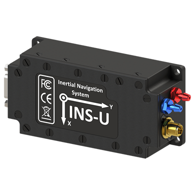

# Inertial Labs INS (All sensors, including INS-U/INS-DU)

Inertial Labs designs and develops [IMU](https://inertiallabs.com/products/imu-inertial-measurement-units/), [AHRS](https://inertiallabs.com/products/ahrs/), [GNSS/INS](https://inertiallabs.com/products/ins-inertial-navigation-systems/) and [other](https://inertiallabs.com/) solutions.
A universal protocol is used for [all Inertial Labs sensors](https://inertiallabs.com/).

Benefits to PX4 users:

- Higher accuracy heading, pitch, and roll estimates
- More robust and reliable GNSS positioning
- Improved positioning and attitude performance in GNSS-contested environments
- Performance under challenging dynamic conditions (e.g. catapult launches, VTOL operations, high-g or high angular rate operations)
- Work in different spoofing and jamming conditions

PX4 can use these in a mode that provides only raw sensor output (the default), or as an [external INS](../sensor/inertial_navigation_systems.md) that provides both sensor output and INS data such as position and velocity estimates.
The mode is configurable using a parameter.

## 구매처

[Get technical support or send requests to sales team](https://inertiallabs.com/inertial-labs-inc/contact-inertial-labs-team/).
Recommended sensors:

- [INS-U GNSS/INS](https://inertiallabs.com/ins-u-datasheet): Recommended for fixed-wing systems without hovering, where static heading is not necessary.
- [INS-DU DUAL GNSS/INS](https://inertiallabs.com/ins-du-datasheet): Recommended for multicopter systems where hovering and low dynamics requires the use of static heading.

## 하드웨어 설정

### 배선

Connect the sensor to any unused flight controller serial interface, such as a spare `GPS` or `TELEM`.

### 장착

The Inertial Labs sensors can be mounted in any orientation.
You can set offsets for coordinate axes in the sensor-configuration software that is provided with your sensor.

## 펌웨어 설정

### PX4 설정

To use the Inertial Labs driver:

1. Build the firmware with the [ilabs](../modules/modules_driver_ins.md#ilabs) module.

   The module is included by default for many boards.
   You can check by searching for the keys `CONFIG_COMMON_INS` (all INS drivers) and `CONFIG_DRIVERS_INS_ILABS` (ilabs driver) in the [default.px4board](https://github.com/PX4/PX4-Autopilot/blob/main/boards/px4/fmu-v6c/default.px4board#L25) configuration file for your target board.

   If it is not present, you can add the key to your `default.px4board` file, or include it using the [kconfig board configuration](../hardware/porting_guide_config.md#px4-board-configuration-kconfig): Drivers -> INS -> ilabs.

2. [Set the parameter](../advanced_config/parameters.md) [SENS_ILABS_CFG](../advanced_config/parameter_reference.md#SENS_ILABS_CFG) to the hardware port connected to the sensor, such as a spare `GPS` or `TELEM`.
   Make sure that nothing else is configured to use the port (for more information see [Serial Port Configuration](../peripherals/serial_configuration.md)).

3. Restart PX4.

4. Configure driver as either an external INS or to provide raw data:
   - For external INS, set [ILABS_MODE](../advanced_config/parameter_reference.md#ILABS_MODE) to `INS`.
   - For raw inertial sensors, set [ILABS_MODE](../advanced_config/parameter_reference.md#ILABS_MODE) to `Sensors Only`.

      You can then prioritize inertial labs sensors using [CAL_GYROn_PRIO](../advanced_config/parameter_reference.md#CAL_GYRO0_PRIO), [CAL_ACCn_PRIO](../advanced_config/parameter_reference.md#CAL_ACC0_PRIO), [CAL_BAROn_PRIO](../advanced_config/parameter_reference.md#CAL_BARO0_PRIO), [CAL_MAGn_PRIO](../advanced_config/parameter_reference.md#CAL_MAG0_PRIO), where `n` is the instance number of the IMU component (0, 1, etc.).

      ::: tip
      In most cases the external IMU is the highest-numbered.
      You can get a list of the IMU components available using [`uorb top -1`](../middleware/uorb.md#uorb-top-command), you can differentiate between them using the [`listener`](../modules/modules_command.md#listener) command and looking through the data, or just the rates.

:::

5. Restart PX4.

Once enabled, the module will be detected on boot.

## Inertial Labs Sensor Configuration

Perform sensor configuration according to the Interface Control Document (ICD) that comes with each device.
The sensor-configuration software allows you to set the baurate and the data format, and you can also adjust the orientation axes if the sensor wasn't oriented in the normal way.
This process is usually short and takes a few minutes, depending on the sensor and the installation conditions on the vehicle.

## Published Data

These uORB topics are published:

- [sensor_accel](../msg_docs/SensorAccel.md)
- [sensor_gyro](../msg_docs/SensorGyro.md)
- [sensor_mag](../msg_docs/SensorMag.md)
- [sensor_baro](../msg_docs/SensorBaro.md)
- [sensor_gps](../msg_docs/SensorGps.md)

If enabled as an external INS, publishes:

- [vehicle_local_position](../msg_docs/VehicleLocalPosition.md)
- [vehicle_global_positon](../msg_docs/VehicleGlobalPosition.md)
- [vehicle_attitude](../msg_docs/VehicleAttitude.md)

If enabled as external sensor only:

- `external_ins_local_position`
- `external_ins_global_position`
- `external_ins_attitude`

:::tip
Published topics can be viewed using the `listener` command.
:::
