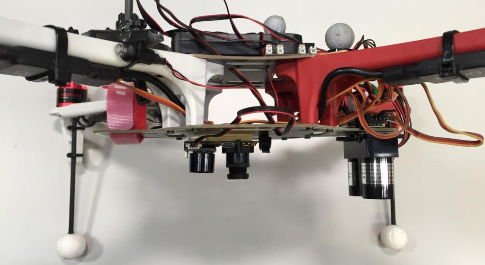
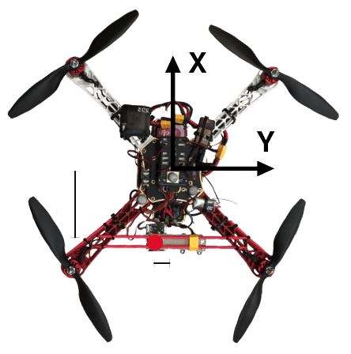

# 광류 센서

_Optical Flow_ uses a downward facing camera and a downward facing distance sensor for velocity estimation.
It can be used to determine speed when navigating without GNSS — in buildings, underground, or in any other GNSS-denied environment.

The video below shows PX4 holding position using the [Ark Flow](../dronecan/ark_flow.md) sensor for velocity estimation in [Position Mode](../flight_modes_mc/position.md):

<lite-youtube videoid="aPQKgUof3Pc" title="ARK Flow with PX4 Optical Flow Position Hold"/>

<!-- ARK Flow with PX4 Optical Flow Position Hold: 20210605 -->

The image below shows an optical flow setup with a separate flow sensor ([PX4Flow](../sensor/px4flow.md)) and distance sensor ([Lidar-Lite](../sensor/lidar_lite.md)):

## 설정

An Optical Flow setup requires a downward facing camera and a downward facing [distance sensor](../sensor/rangefinders.md) (preferably a LiDAR).
These can be combined in a single product, such as the [ARK Flow](../dronecan/ark_flow.md), [ARK Flow MR](../dronecan/ark_flow_mr.md) and [Holybro H-Flow](https://holybro.com/products/h-flow), or they may be separate sensors.

The sensor(s) can be connected via MAVLink, I2C or any other bus that supports the peripheral.

:::info
If connected to PX4 via MAVLink the Optical Flow camera sensor must publish the [OPTICAL_FLOW_RAD](https://mavlink.io/en/messages/common.html#OPTICAL_FLOW_RAD) message, and the distance sensor must publish the [DISTANCE_SENSOR](https://mavlink.io/en/messages/common.html#DISTANCE_SENSOR) message.
The information is written to the corresponding uORB topics: [DistanceSensor](../msg_docs/DistanceSensor.md) and [ObstacleDistance](../msg_docs/ObstacleDistance.md).
:::

다른 방향으로 이동할 때의 흐름 출력은 다음과 같아야합니다.

| 기체 이동 | 통합 흐름 |
| ----- | ----- |
| 전방    | + Y   |
| 후방    | - Y   |
| 우측    | - X   |
| 좌측    | + X   |

광류 데이터는 다른 속도 데이터 소스와 융합됩니다.
The approach used for fusing sensor data and any offsets from the center of the vehicle must be configured in the [estimator](#estimators).

### Scale Factor

For pure rotations the `OPTICAL_FLOW_RAD.integrated_xgyro` and `OPTICAL_FLOW_RAD.integrated_x` (respectively `integrated_ygyro` and `integrated_y`) have to be the same.
If this is not the case, the optical flow scale factor can be adjusted using [SENS_FLOW_SCALE](../advanced_config/parameter_reference.md#SENS_FLOW_SCALE).

:::tip
The low resolution of common optical flow sensors can cause slow oscillations when hovering at a high altitude above ground (> 20m).
Reducing the optical flow scale factor can improve the situation.
:::

## 유량 센서/카메라

### ARK Flow & ARK Flow MR

[ARK Flow](../dronecan/ark_flow.md) is a [DroneCAN](../dronecan/index.md) optical flow sensor, [distance sensor](../sensor/rangefinders.md), and IMU.
It has a PAW3902 optical flow sensor, Broadcom AFBR-S50LV85D 30 meter distance sensor, and Invensense ICM-42688-P 6-Axis IMU.

[ARK Flow MR](../dronecan/ark_flow_mr.md) is a [DroneCAN](../dronecan/index.md) optical flow sensor, [distance sensor](../sensor/rangefinders.md), and IMU, for mid-range applications.
It has a PixArt PAA3905 optical flow sensor, Broadcom AFBR-S50LX85D  50 meter distance sensor, and Invensense IIM-42653 6-Axis IMU.

### Holybro H-Flow

The [Holybro H-Flow](https://holybro.com/products/h-flow) is a compact [DroneCAN](../dronecan/index.md) optical flow and [distance sensor](../sensor/rangefinders.md) module.
It combines a PixArt PAA3905 optical flow sensor, a Broadcom AFBR-S50LV85D distance sensor, and an InvenSense ICM-42688-P 6-axis IMU.
An all-in-one design that simplifies installation, with an onboard infrared LED enhances visibility in low-light conditions.

### PMW3901 기반 센서

[PMW3901](../sensor/pmw3901.md) is an optical flow tracking sensor similar to what you would find in a computer mouse, but adapted to work between 80 mm and infinity.
Bitcraze, Tindie, Hex, Thone 및 Alientek의 일부 제품을 포함하여 여러 제품에 사용됩니다.

### 기타 카메라 / 센서

카메라 통합 보드를 사용할 수 있습니다.
For this the [Optical Flow repo](https://github.com/PX4/OpticalFlow) can be used (see also [snap_cam](https://github.com/PX4/snap_cam)).

## 거리 측정기

You can use any supported [distance sensor](../sensor/rangefinders.md).
그러나 견고성과 정확성 측면에서는 음향 센서보다 LIDAR를 사용하는 것이 좋습니다.

## 추정기

추정기는 광학 흐름 센서 및 기타 소스의 데이터를 융합합니다.
융합 방법 설정과 차량 중심에 대한 상대적 오프셋이 사용되는 추정기를 지정하여야합니다.

오프셋은 아래와 같이 차량 방향 및 중심을 기준으로 계산됩니다.

Optical Flow based navigation is enabled by both [EKF2](#ekf2) and LPE (deprecated).

### Extended Kalman Filter (EKF2) {#ekf2}

For optical flow fusion using EKF2, set [EKF2_OF_CTRL](../advanced_config/parameter_reference.md#EKF2_OF_CTRL).

광류 센서가 차량 중앙에서 오프셋된 경우 다음 매개변수를 사용하여 설정합니다.

| 매개변수                                                                                                                                                              | 설명                                                                                   |
| ----------------------------------------------------------------------------------------------------------------------------------------------------------------- | ------------------------------------------------------------------------------------ |
| [EKF2_OF_POS_X](../advanced_config/parameter_reference.md#EKF2_OF_POS_X) | 바디 프레임에서 광류 초점의 X 위치 (기본값은 0.0m). |
| [EKF2_OF_POS_Y](../advanced_config/parameter_reference.md#EKF2_OF_POS_Y) | 바디 프레임에서 광류 초점의 Y 위치 (기본값은 0.0m). |
| [EKF2_OF_POS_Z](../advanced_config/parameter_reference.md#EKF2_OF_POS_Z) | 바디 프레임에서 광류 초점의 Z 위치 (기본값은 0.0m). |

See [Using PX4's Navigation Filter (EKF2) > Optical flow](../advanced_config/tuning_the_ecl_ekf.md#optical-flow) for more information.
