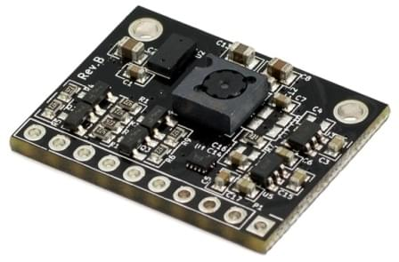
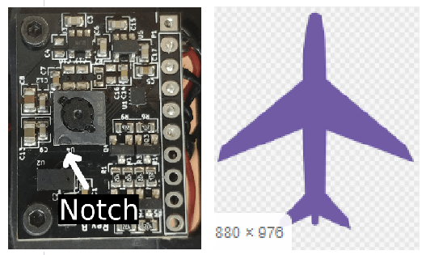
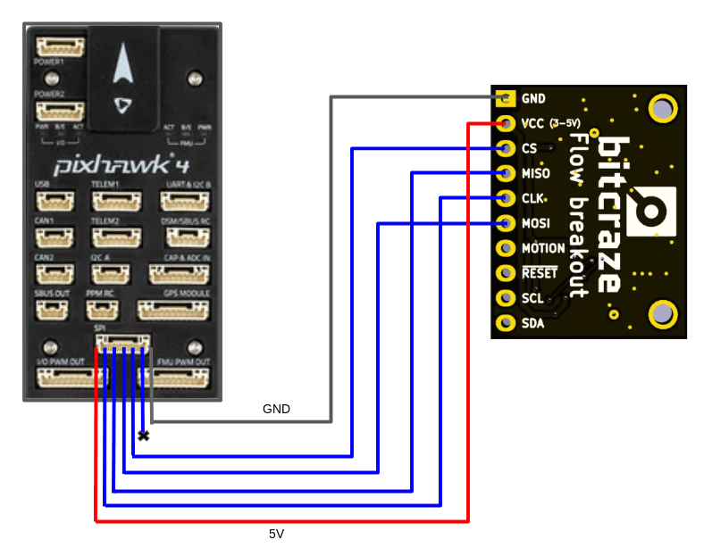
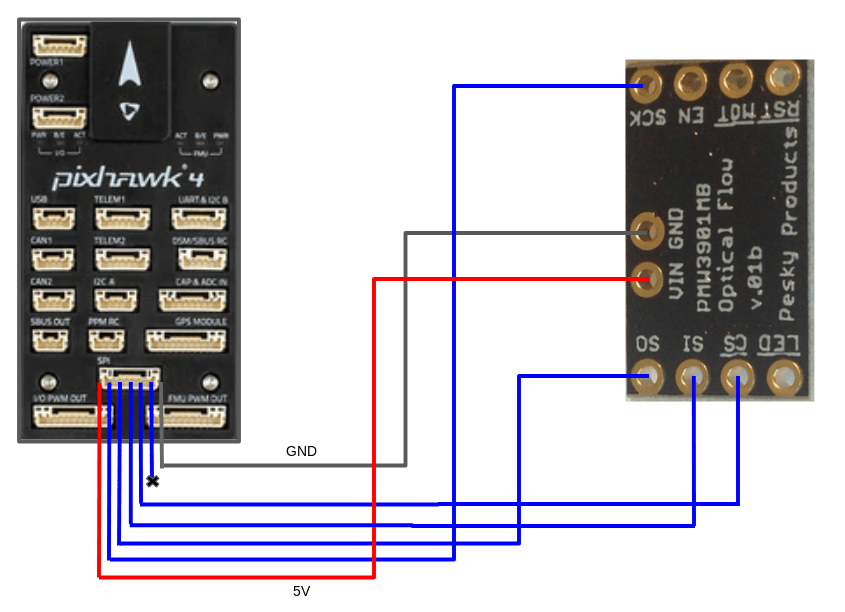
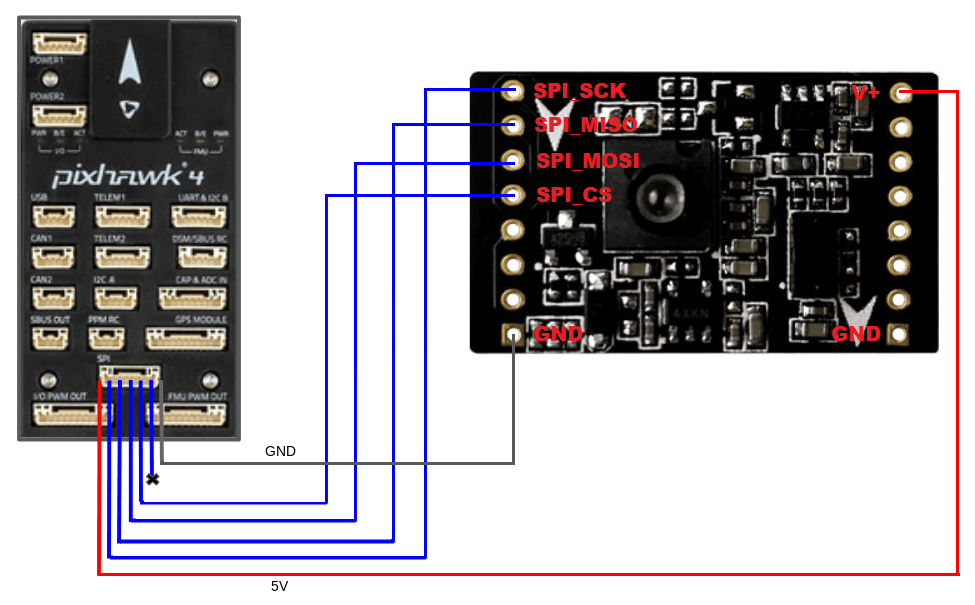
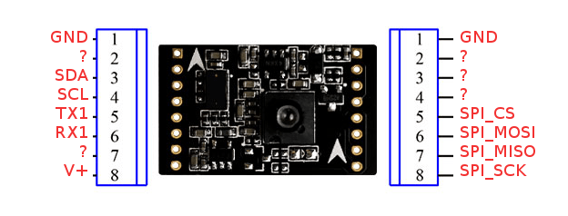
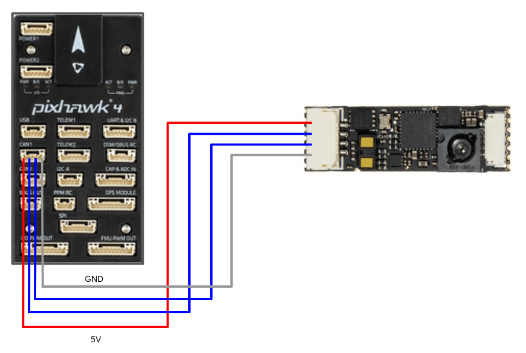
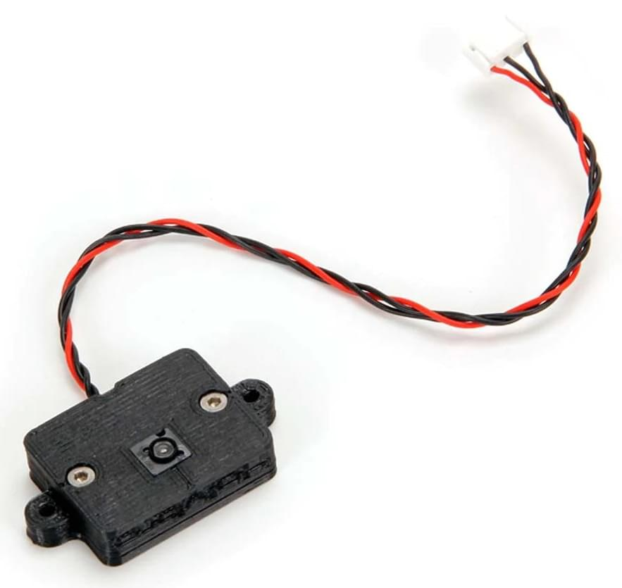
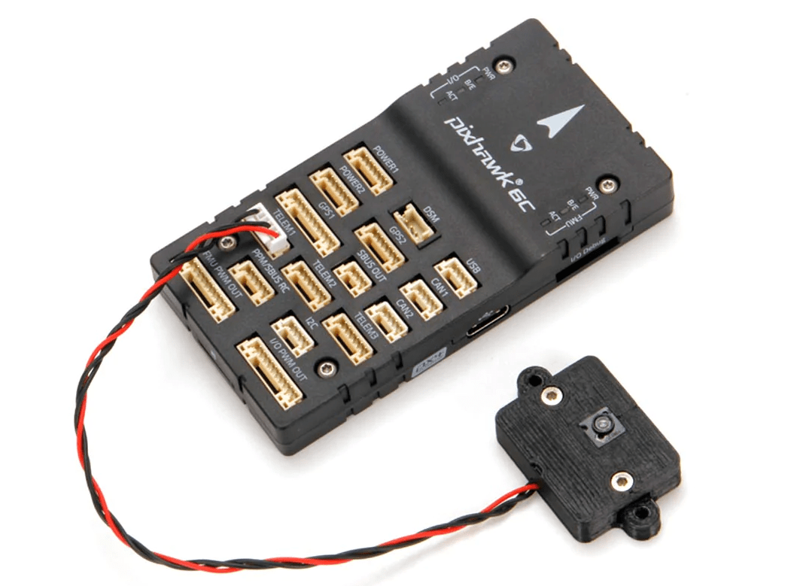
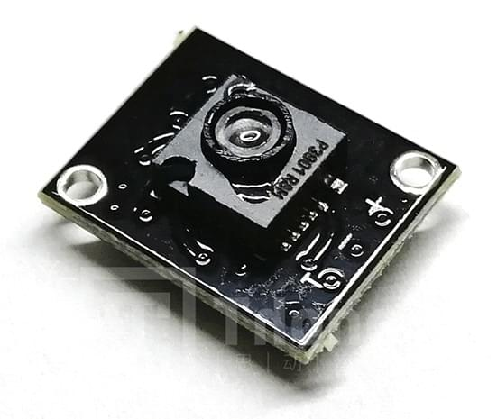

# PMW3901 기반 유량 센서

PMW3901 is an [optical flow](../sensor/optical_flow.md) ASIC that computes the flow internally and provides a difference in pixels between each frame.
컴퓨터 마우스와 유사한 추적 센서를 사용하지만 80mm에서 무한대 사이에서 작동하도록 조정되었습니다.
PMW3901은 Bitcraze, Tindie, Hex, Thone 및 Alientek의 일부 제품을 포함하여 여러 제품에 사용됩니다.

장착 방법, PX4 설정 방법과 테스트 센서에 대한 링크를 제공합니다 (이 유형의 모든 센서에 공통임).

## PMW3901을 사용하는 보드

다음 표는이 센서를 사용하는 일부 보드를 보여 주며, 인터페이스 수, 센서 수, 입력 전압 및 크기를 나열합니다.
보드 이름은 배선 및 구매 정보가 포함된 보드 별 섹션으로 연결됩니다.

| 제조사      | 보드                                                                                | 인터페이스 | 흐름 | 거리 측정기 | 자이로 | 전압 (V)                 | 크기 (mm)                | 최대 높이 (m) |
| -------- | --------------------------------------------------------------------------------- | ----- | -- | ------ | --- | ----------------------------------------- | ----------------------------------------- | ---------------------------- |
| Bitcraze | [Flow breakout](#bitcraze-flow-breakout)                                          | SPI   | Y  | Y      | -   | 3 - 5                                     | 21x20                                     | 1                            |
| Tindie   | [PMW3901 Optical Flow Sensor](#tindie-pmw3901-optical-flow-sensor)                | SPI   | Y  | -      | -   | 3 - 5                                     | AxB                                       | -                            |
| Hex      | [HereFlow PMW3901 Optical Flow Sensor](#hex-hereflow-pmw3901-optical-flow-sensor) | CAN   | Y  | Y      | Y   | 3 - 5                                     | AxB                                       | 4                            |
| Holybro  | [Holybro PMW3901 Optical Flow Sensor](#holybro-pmw3901-optical-flow-sensor)       | UART  | Y  | -      | -   | 3 - 5                                     | AxB                                       | -                            |
| Thone    | [ThoneFlow-3901U](#thone-thoneflow-3901u)                                         | UART  | Y  | -      | -   | 3 - 5                                     | AxB                                       | -                            |
| Alientek | [ATK-PMW3901](#alientek-atk-pmw3901)                                              | SPI   | Y  | -      | -   | 3.3 - 4.2 | 27.5x16.5 | 1                            |

## 외부 거리계

An external rangefinder/distance sensor is _required_ for the sensors that don't have a rangefinder (e.g. _Tindie_ or _Thone_) and _recommended_ for the other boards (as their range is quite limited).

필요한 범위는 애플리케이션에 따라 다릅니다.

- 실내 비행 : ≈4m
- 실외 비행 : ≥10 미터 (예 : GPS에 문제가 있을 수 있는 환경에서 위치 제어를 지원)

Any [rangefinder/distance sensor](../sensor/rangefinders.md) supported by PX4 may be used.
센서는 어디나 장착할 수 있지만, 아래를 향해야하며 평소와 같이 연결/설정하여야 합니다.

:::tip
The PX4 team mainly tested using the [Lidar Lite V3](../sensor/lidar_lite.md) on larger vehicles and the [Lanbao CM8JL65](../sensor/cm8jl65_ir_distance_sensor.md) (Discontinued) on smaller vehicles.
:::

## 장착 및 방향

흐름 모듈은 일반적으로 차량 중앙 근처에 장착됩니다.
If mounted off-centre you will need to set offsets: [Optical Flow > EKF2](../sensor/optical_flow.md#ekf2).

The flow modules may be mounted with any yaw orientation relative to the vehicle body frame, but you must set the value used in [SENS_FLOW_ROT](../advanced_config/parameter_reference.md#SENS_FLOW_ROT).

The "zero" rotation is when the sensor board and [vehicle](../getting_started/px4_basic_concepts.md#heading-and-directions) X-axes are aligned (i.e. the "front" of the vehicle and the board are in the same direction), with rotations increasing in a clockwise direction.

PMW3901 modules have a small notch indicating the direction of the **back** of the board.
The diagram shows the relative board and vehicle orientations that correspond to `SENS_FLOW_ROT=0` (note the notch at the back).

위의 다이어그램은 Bitcraze 보드입니다.
노치를 사용하여 같은 방법으로 다른 보드의 방향을 찾을 수 있습니다.

| &amp;nbsp;                       | &amp;nbsp;                                                                  |
| ---------------------------------------------------- | ----------------------------------------------------------------------------------------------- |
| Tindie ![PMW3901 Tindie Notch][tindie_notch]      | Hex Hereflow ![PMW3901 Hereflow Notch][hereflow_notch]                                       |
| Thone ![PMW3901 Thoneflow Notch][thoneflow_notch] | Alientek (also has an arrow indicating the front!) ![PMW3901 Alientek Notch][alientek_notch] |

[tindie_notch]: ../../assets/hardware/sensors/pmw3901/tindie_notch.jpg
[thoneflow_notch]: ../../assets/hardware/sensors/pmw3901/thoneflow_3901u_notch.jpg
[alientek_notch]: ../../assets/hardware/sensors/pmw3901/alientek_pmw3901_notch.jpg
[hereflow_notch]: ../../assets/hardware/sensors/pmw3901/hex_hereflow_notch.jpg

## PX4 설정

모든 PMW3901 기반 보드에 공통적인 PX4 설정:

- [Optical Flow > EKF2](../sensor/optical_flow.md#ekf2) explains how to fuse optical flow data in the EKF2 estimator and set position offsets for the mounting position of the flow sensor.
- [SENS_FLOW_ROT](../advanced_config/parameter_reference.md#SENS_FLOW_ROT) sets the orientation of the flow sensor relative to vehicle heading.

추가:

- SPI-connected sensors you must set [SENS_EN_PMW3901](../advanced_config/parameter_reference.md#SENS_EN_PMW3901) to `1` in order to enable the sensor driver.
- UART-connected sensors (e.g. ThoneFlow-3901UY) you must [configure the associated serial port](../peripherals/serial_configuration.md) by setting the parameter [SENS_TFLOW_CFG](../advanced_config/parameter_reference.md#SENS_TFLOW_CFG) to the value of the connected UART port (for example, if you connected this sensor to `TELEM 2`, you need to set `SENS_TFLOW_CFG` to `102`).
- DroneCAN sensors you must set `UAVCAN_ENABLE` appropriately.
  For more information see [DroneCAN Peripherals](../dronecan/index.md) (and the [HereFlow PMW3901 docs below](#dronecan_wiring)).

개별 유량 센서는 아래 섹션에 설명대로 추가로 설정됩니다.

## Bitcraze Flow Breakout

The [Bitcraze Flow breakout](https://www.bitcraze.io/products/flow-breakout/) directly exposes the [SPI interface](#spi-wiring) from the PMW3901 module.

The board also incorporates a distance sensor [wired to the Pixhawk I2C port](#i2c-wiring).
이 거리 센서는 STMicroelectronics의 VL53L0x ToF 센서입니다.
센서 범위는 최소 (2m)이며 햇빛 아래에서 비행시 줄어듭니다.
We therefore highly recommend that you use an [external distance sensor](#external-rangefinders).

[PX4 configuration](#px4-configuration) and [mounting/orientation](#mounting-orientation) instructions are provided above.

### SPI 배선

PMW3901은 Pixhawk 4의 SPI 포트에 연결된 경우 Bitcraze 흐름 모듈을 자동으로 감지합니다.
이 장치의 드라이버는 칩 선택 1을 사용하여 SPI 포트에 연결되도록 명시적으로 작성되었습니다.
No parameters will have to be configured other than the [orientation and position of the sensor](#mounting-orientation).

Pixhawk SPI 포트와 Bitcraze Flow Board의 핀아웃 매핑은 아래에 나와 있습니다 (포트 매핑은 모든 Pixhawk FMU 버전과 동일합니다).

| Pixhawk SPI 포트 (왼쪽에서 오른쪽으로) | Bitcraze 플로우 보드 |
| ---------------------------------------------- | --------------- |
| 1 (VCC)                     | VCC             |
| 2 (SCK)                     | CLK             |
| 3 (MISO)                    | MISO            |
| 4 (MOSI)                    | MOSI            |
| 5 (CS1)                     | CS              |
| 6 (CS2)                     | 연결하지 마십시오       |
| 7 (GND)                     | GND             |

Bitcraze 플로우 보드를 Pixhawk에 연결하려면 Pixhawk SPI 케이블의 와이어를 플로우 보드에 납땜하여야 합니다.
SPI 케이블에는 7개의 와이어가 있으며, 6개를 플로우 보드에 연결하여야합니다.

아래의 다이어그램은 센서를 Pixhawk 4에 연결하는 방법을 보여줍니다.

### I2C 배선

I2C 배선은 다른 거리 센서에 대해서도 동일합니다.
SLA, SLC, GND 및 VCC를 Pixhawk 콘트롤러와 센서의 해당 (동일한) 핀에 연결하면 됩니다.

## Tindie PMW3901 광류 센서

The Tindie [PMW3901 Optical Flow Sensor](https://www.tindie.com/products/onehorse/pmw3901-optical-flow-sensor/) exposes the SPI interface from the PMW3901 module exactly as on the Bitcraze module (see [SPI Wiring](#spi-wiring)).

The sensor doesn't have a distance sensor onboard, so you will need to use an [external distance sensor](#external-rangefinders).

[PX4 configuration](#px4-configuration) and [mounting/orientation](#mounting-orientation) instructions are provided above.

## AlienTek ATK-PMW3901

The AlienTek [ATK-PMW3901](https://www.aliexpress.com/i/32979605707.html) exposes the SPI interface from the PMW3901 module in the same way as the Bitcraze module (see [SPI Wiring](#spi-wiring)).

The board also incorporates a distance sensor (we recommend that you use an [external distance sensor](#external-rangefinders)).
You can wire the internal sensor to the Pixhawk I2C port [in the same way as any other I2C peripheral.](#i2c-wiring)
A screenshot showing the I2C pins (SLA, SLC, GND, and VCC) is provided below.

[PX4 configuration](#px4-configuration) and [mounting/orientation](#mounting-orientation) instructions are provided above.

## Hex HereFlow PMW3901 광류 센서

The Hex [HereFlow PMW3901 Optical Flow Sensor](http://www.proficnc.com/all-products/185-pixhawk2-suite.html) is a tiny board containing the PMW3901 flow module, VL53L1X distance sensor, and an IMU (used to synchronize the flow data with the gyro data).

An onboard microcontroller samples the three sensors and publishes two DroneCAN messages containing all the information needed for the flow and distance sensor calculations.

The board can be connected to any CAN port on any Pixhawk board (see [DroneCAN wiring](#dronecan_wiring)).

As for the other optical flow boards, we recommend that you use an [external distance sensor](#external-rangefinders).

[PX4 configuration](#px4-configuration) and [mounting/orientation](#mounting-orientation) instructions are provided above.

### DroneCAN Wiring/Setup

아래의 다이어그램은 센서를 Pixhawk 4 CAN 버스에 연결하는 방법을 보여줍니다.

In addition to any other configuration, you will need to set the parameter [UAVCAN_ENABLE](../advanced_config/parameter_reference.md#UAVCAN_ENABLE) to either 2 or 3, depending on your system:

- `UAVCAN_ENABLE=2`: DroneCAN sensors but no motor controllers.
- `UAVCAN_ENABLE=3`: DroneCAN sensors and motor controllers.

For general information about DroneCAN wiring and configuration see: [DroneCAN Peripherals](../dronecan/index.md).

## Holybro PMW3901 Optical Flow Sensor

The [Holybro PMW3901 Optical Flow Sensor](https://holybro.com/products/pmw3901-optical-flow-sensor) exposes a PMW3901 optical flow module via a UART interface.

The board doesn't include a distance sensor onboard, so you will need to use an [external distance sensor](#external-rangefinders).

It comes with a 3D printed case and has a pre-soldered TX, Voltage, and GND 4 pin connector that can be plugged into the telemetry port of your flight controller, as shown below (for the Pixhawk 6C).

## Thone ThoneFlow-3901U

The Thone [ThoneFlow-3901U](https://www.seeedstudio.com/ThoneFlow-3901U-UART-Serial-Version-PMW3901-Optical-Flow-Sensor-p-4040.html) exposes a PMW3901 optical flow module via a UART interface.

The board doesn't include a distance sensor onboard, so you will need to use an [external distance sensor](#external-rangefinders).

<!-- note, this will be set using SENS_TFLOW_CFG
Wiring is also required.
-->

[PX4 configuration](#px4-configuration) and [mounting/orientation](#mounting-orientation) instructions are provided above.

In addition, you must also set the parameter [SENS_TFLOW_CFG](../advanced_config/parameter_reference.md#SENS_TFLOW_CFG) to the value of the UART port you connected (e.g. if the sensor is connected to `TELEM 2` then set `SENS_TFLOW_CFG=102`.
For more information see [Serial Port Configuration](../peripherals/serial_configuration.md).
