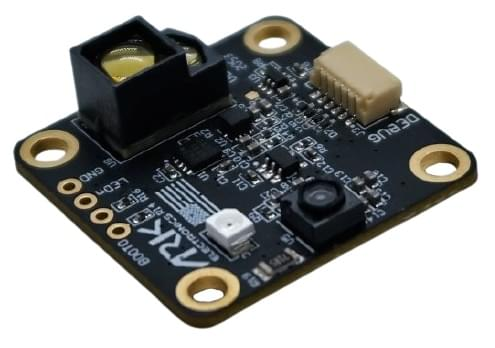
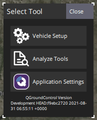
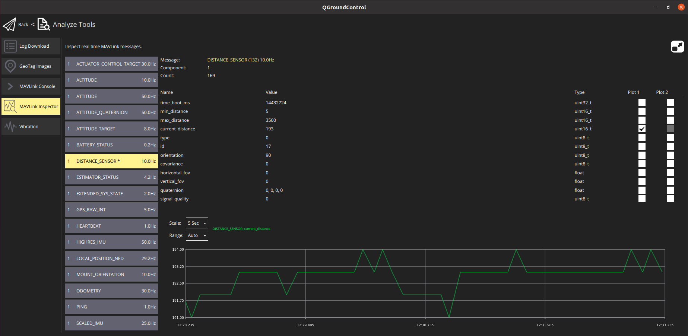

# 거리 센서 (거리 측정기)

Distance sensors provide distance measurement that can be used for [terrain following](../flying/terrain_following_holding.md#terrain_following), [terrain holding](../flying/terrain_following_holding.md#terrain_hold) (i.e. precision hovering for photography), improved landing behaviour ([conditional range aid](../advanced_config/tuning_the_ecl_ekf.md#conditional-range-aiding)), warning of regulatory height limits, collision prevention, etc.

This section lists the distance sensors supported by PX4 (linked to more detailed documentation), and provides information about the [generic configuration](#configuration) required for all rangefinders, [testing](#testing), and simulation with [Gazebo](#gazebo-simulation) or [Gazebo-Classic](#gazebo-classic-simulation).
보다 자세한 설정과 정보는 아래 링크(및 사이드 바)를 참고하십시오.



## 지원되는 거리 측정기

:::tip
This is a subset of the rangefinders that can be used with PX4.
[Modules: Distance Sensors](../modules/modules_driver_distance_sensor.md) lists PX4 drivers for other non-CAN rangefinders.
There may also be other DroneCAN rangefinders than those listed here.
:::

### ARK Flow & AKR Flow MR

[ARK Flow](../dronecan/ark_flow.md) and [ARK Flow](../dronecan/ark_flow_mr.md) are open-source Time-of-Flight (ToF) and optical flow sensor modules, which are capable of measuring distances from 8cm to 30m and from 8cm to 50m, respectively.
CAN1 포트를 통해 비행 콘트롤러에 연결할 수 있으므로, CAN2 포트를 통해 추가 센서를 연결할 수 있습니다.
It supports [DroneCAN](../dronecan/index.md), runs [PX4 DroneCAN Firmware](../dronecan/px4_cannode_fw.md), and is packed into a tiny form factor.

### Holybro ST VL53L1X Lidar

The [VL53L1X](https://holybro.com/products/st-vl53l1x-lidar) is a state-of-the-art, Time-of-Flight (ToF), laser-ranging sensor, enhancing the ST FlightSense™ product family.
최대 4m의 정확한 범위와 최대 50Hz의 빠른 범위 주파수를 제공하는 시장에서 가장 빠른 소형 ToF 센서입니다.

It comes with a JST GHR 4 pin connector that is compatible with the I2C port on [Pixhawk 4](../flight_controller/pixhawk4.md), [Pixhawk 5X](../flight_controller/pixhawk5x.md), and other flight controllers that follow the [Pixhawk Connector Standard](https://github.com/pixhawk/Pixhawk-Standards/blob/master/DS-009%20Pixhawk%20Connector%20Standard.pdf).

### Lidar-Lite

[Lidar-Lite](../sensor/lidar_lite.md) is a compact, high-performance optical distant measurement rangefinder.
It has a sensor range from (5cm - 40m) and can be connected to either PWM or I2C ports.

### MaxBotix I2CXL-MaxSonar-EZ

The MaxBotix [I2CXL-MaxSonar-EZ](https://www.maxbotix.com/product-category/i2cxl-maxsonar-ez-products) range has a number of relatively short-ranged sonar based rangefinders that are suitable for assisted takeoff/landing and collision avoidance.
These can be connected using an I2C port.

The rangefinders are enabled using the parameter [SENS_EN_MB12XX](../advanced_config/parameter_reference.md#SENS_EN_MB12XX).

### Lightware LIDARs

[Lightware SFxx Lidar](../sensor/sfxx_lidar.md) provide a broad range of lightweight “laser altimeters” that are suitable for many drone applications.

PX4 supports: SF11/c and SF/LW20.
PX4 can also be used with the following discontinued models: SF02, SF10/a, SF10/b, SF10/c.

Others may be supported via the [RaccoonLab Cyphal and DroneCAN Rangefinder Adapter](#raccoonlab-cyphal-and-dronecan-rangefinder-adapter) described below.

PX4 also supports the [LightWare LiDAR SF45 Rotating Lidar](../sensor/sf45_rotating_lidar.md) for [collision prevention](../computer_vision/collision_prevention.md) applications.

### TeraRanger 거리계

[TeraRanger](../sensor/teraranger.md) provide a number of lightweight distance measurement sensors based on infrared Time-of-Flight (ToF) technology.
They are typically faster and have greater range than sonar, and smaller and lighter than laser-based systems.

PX4 supports the following models connected via the I2C bus: TeraRanger One, TeraRanger Evo 60m and TeraRanger Evo 600Hz.

### Ainstein US-D1 Standard Radar Altimeter

The _Ainstein_ [US-D1 Standard Radar Altimeter](../sensor/ulanding_radar.md) is compact microwave rangefinder that has been optimised for use on UAVs.
It has a sensing range of around 50m.
A particular advantages of this product are that it can operate effectively in all weather conditions and over all terrain types (including water).

### LeddarOne

[LeddarOne](../sensor/leddar_one.md) is small Lidar module with a narrow, yet diffuse beam that offers excellent overall detection range and performance, in a robust, reliable, cost-effective package.
감지 범위는 1cm ~ 40m이며 UART/직렬 버스로 연결합니다.

### TFmini

The [Benewake TFmini Lidar](../sensor/tfmini.md) is a tiny, low cost, and low power LIDAR with 12m range.

### PSK-CM8JL65-CC5

<Badge type="info" text="Discontinued" />

The [Lanbao PSK-CM8JL65-CC5 ToF Infrared Distance Measuring Sensor](../sensor/cm8jl65_ir_distance_sensor.md) is a very small (38 mm x 18mm x 7mm, <10g) IR distance sensor with a 0.17m-8m range and millimeter resolution.
UART/직렬 버스에 연결됩니다.

### Avionics Anonymous UAVCAN Laser Altimeter Interface

The [Avionics Anonymous UAVCAN Laser Altimeter Interface](../dronecan/avanon_laser_interface.md) allows several common rangefinders (e.g. [Lightware SF11/c, SF30/D](../sensor/sfxx_lidar.md), etc) to be connected to the [CAN](../can/index.md) bus via [DroneCAN](../dronecan/index.md), a more robust interface than I2C.

### RaccoonLab Cyphal and DroneCAN Rangefinder Adapter

The [RaccoonLab Cyphal and DroneCAN Rangefinder Adapter](https://raccoonlab.co/tproduct/360882105-910084093051-cyphal-and-dronecan-rangefinder-adapter) allows several common rangefinders to be connected to the CAN bus via Cyphal or DroneCAN, providing a more robust interface than I2C or UART.
This adapter efficiently reads measurements via I2C or UART and publishes range data in meters, making it a versatile solution for UAVs, robotics, and technical documentation applications.

Supported rangefinders include:

- LightWare LW20/C
- TF-Luna
- Garmin Lite V3
- VL53L1CB

### RaccoonLab Cyphal and DroneCAN µRANGEFINDER

[RaccoonLab µRANGEFINDER](https://docs.raccoonlab.co/guide/rangefinder/uRANGEFINDER.html) is designed to measure distance and publish it via Cyphal/DroneCAN protocols.
It can be used to estimate precision landing or object avoidance.

Features:

- [VL53L1CBV0FY-1](https://www.st.com/resource/en/datasheet/vl53l1.pdf) sensor
- Input voltage sensor
- CAN connectors: 2 [UCANPHY Micro (JST-GH 4)](https://raccoonlabdev.github.io/docs/guide/wires/).

## Configuration/Setup {#configuration}

Rangefinders are usually connected to either a serial (PWM) or I2C port (depending on the device driver), and are enabled on the port by setting a particular parameter.

The hardware and software setup that is _specific to each distance sensor_ is covered in their individual topics.

The generic configuration that is _common to all distance sensors_, covering both the physical setup and usage, is given below.

### Generic Configuration

The common rangefinder configuration is specified using [EKF2_RNG\_\*](../advanced_config/parameter_reference.md#EKF2_RNG_CTRL) parameters.
These include (non exhaustively):

- [EKF2_RNG_POS_X](../advanced_config/parameter_reference.md#EKF2_RNG_POS_X), [EKF2_RNG_POS_Y](../advanced_config/parameter_reference.md#EKF2_RNG_POS_Y), [EKF2_RNG_POS_Z](../advanced_config/parameter_reference.md#EKF2_RNG_POS_Z) - offset of the rangefinder from the vehicle centre of gravity in X, Y, Z directions.
- [EKF2_RNG_PITCH](../advanced_config/parameter_reference.md#EKF2_RNG_PITCH) - A value of 0 degrees (default) corresponds to the range finder being exactly aligned with the vehicle vertical axis (i.e. straight down), while 90 degrees indicates that the range finder is pointing forward.
  Simple trigonometry is used to calculate the distance to ground if a non-zero pitch is used.
- [EKF2_RNG_DELAY](../advanced_config/parameter_reference.md#EKF2_RNG_DELAY) - approximate delay of data reaching the estimator from the sensor.
- [EKF2_RNG_SFE](../advanced_config/parameter_reference.md#EKF2_RNG_SFE) - Range finder range dependent noise scaler.
- [EKF2_RNG_NOISE](../advanced_config/parameter_reference.md#EKF2_RNG_NOISE) - Measurement noise for range finder fusion

## 시험

The easiest way to test the rangefinder is to vary the range and compare to the values detected by PX4.
The sections below show some approaches to getting the measured range.

### QGroundControl MAVLink Inspector

The _QGroundControl MAVLink Inspector_ lets you view messages sent from the vehicle, including `DISTANCE_SENSOR` information from the rangefinder.
The main difference between the tools is that the _Analyze_ tool can plot values in a graph.

:::info
The messages that are sent depend on the vehicle configuration.
You will only get `DISTANCE_SENSOR` messages if the connected vehicle has a rangefinder installed and is publishing sensor values.
:::

To view the rangefinder output:

1. Open the menu **Q > Select Tool > Analyze Tools**:

  

2. Select the message `DISTANCE_SENSOR`, and then check the plot checkbox against `current_distance`.
  The tool will then plot the result:
  

### QGroundControl MAVLink Console

You can also use the _QGroundControl MAVLink Console_ to observe the `distance_sensor` uORB topic:

```sh
listener distance_sensor 5
```

:::info
The _QGroundControl MAVLink Console_ works when connected to Pixhawk or other NuttX targets, but not the Simulator.
On the Simulator you can run the commands directly in the terminal.
:::

For more information see: [Development > Debugging/Logging > Sensor/Topic Debugging using the Listener Command](../debug/sensor_uorb_topic_debugging.md).

## 시뮬레이션

### Gazebo Simulation

Lidar and sonar rangefinders can be used in the [Gazebo](../sim_gazebo_gz/index.md) simulator.
To do this you must start the simulator using a vehicle model that includes the rangefinder.

Downward facing sensors that write to the [DistanceSensor](../msg_docs/DistanceSensor.md) UORB topic can be used to test use cases such as [landing](../flight_modes_mc/land.md) and [terrain following](../flying/terrain_following_holding.md):

- [Quadrotor(x500) with 1D LIDAR (Down-facing)](../sim_gazebo_gz/vehicles.md#x500-quadrotor-with-1d-lidar-down-facing)

  ```sh
  make px4_sitl gz_x500_lidar_down
  ```

Front-facing sensors that write to [ObstacleDistance](../msg_docs/ObstacleDistance.md) can be used to test [Collision Prevention](../computer_vision/collision_prevention.md#gazebo-simulation):

- [Quadrotor(x500) with 2D LIDAR](../sim_gazebo_gz/vehicles.md#x500-quadrotor-with-2d-lidar)

  ```sh
  make px4_sitl gz_x500_lidar_2d
  ```

- [Quadrotor(x500) with 1D LIDAR (Front-facing)](../sim_gazebo_gz/vehicles.md#x500-quadrotor-with-1d-lidar-front-facing)

  ```sh
  make px4_sitl gz_x500_lidar_front
  ```

### Gazebo-Classic Simulation

Lidar and sonar rangefinders can be used in the [Gazebo Classic](../sim_gazebo_classic/index.md) simulator.
To do this you must start the simulator using a vehicle model that includes the rangefinder.

The iris optical flow model includes a Lidar rangefinder:

```sh
make px4_sitl gazebo-classic_iris_opt_flow
```

The typhoon_h480 includes a sonar rangefinder:

```sh
make px4_sitl gazebo-classic_typhoon_h480
```

If you need to use a different vehicle you can include the model in its configuration file.
You can see how in the respective Iris and Typhoon configuration files:

- [iris_opt_flow.sdf](https://github.com/PX4/PX4-SITL_gazebo-classic/blob/main/models/iris_opt_flow/iris_opt_flow.sdf)

  ```xml
    <include>
      <uri>model://lidar</uri>
      <pose>-0.12 0 0 0 3.1415 0</pose>
    </include>
    <joint name="lidar_joint" type="revolute">
      <child>lidar::link</child>
      <parent>iris::base_link</parent>
      <axis>
        <xyz>0 0 1</xyz>
        <limit>
          <upper>0</upper>
          <lower>0</lower>
        </limit>
      </axis>
    </joint>
  ```

- [typhoon_h480.sdf](https://github.com/PX4/PX4-SITL_gazebo-classic/blob/main/models/typhoon_h480/typhoon_h480.sdf.jinja#L1131-L1145)

  ```xml
    <include>
      <uri>model://sonar</uri>
    </include>
    <joint name="sonar_joint" type="revolute">
      <child>sonar_model::link</child>
      <parent>typhoon_h480::base_link</parent>
      <axis>
        <xyz>0 0 1</xyz>
        <limit>
          <upper>0</upper>
          <lower>0</lower>
        </limit>
      </axis>
    </joint>
  ```
