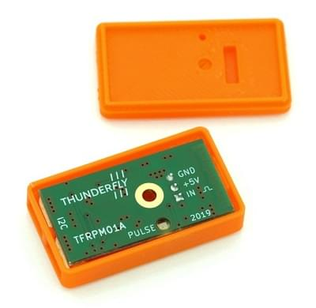

# ThunderFly TFRPM01 Revolution Counter

The [TFRPM01](https://github.com/ThunderFly-aerospace/TFRPM01) tachometer is a small, and low system demanding revolution-counter.

보드 자체에는 실제 센서가 포함되어 있지 않지만, 회전 계수를 위하여 다양한 센서/프로브 유형과 함께 사용할 수 있습니다.
PX4 연결 I²C 커넥터가 있으며, 3핀 커넥터를 통하여 실제 센서에 연결됩니다.
기본 진단 정보를 제공하는 LED도 있습니다.



:::info
The TFRPM01 sensor is open-source hardware commercially available from [ThunderFly s.r.o.](https://www.thunderfly.cz/) (manufacturing data is [available on GitHub](https://github.com/ThunderFly-aerospace/TFRPM01)).
:::

## 하드웨어 설정

이 보드에는 PX4 연결 (투 스루 패스) I²C 커넥터가 장착되어 있으며, 다양한 센서에 연결용 3핀 커넥터가 있습니다.

- TFRPM01은 모든 I²C 포트에 연결 가능합니다.
- TFRPM01에는 다양한 프로브 유형에 연결 3핀 헤더 커넥터 (풀업 장착 입력 포함)가 있습니다.
  - 센서/프로브 하드웨어에는 펄스 신호가 필요합니다.
    The signal input accepts +5V TTL logic or [open collector](https://en.wikipedia.org/wiki/Open_collector) outputs.
    최대 펄스 주파수는 50% 듀티 사이클에서 20kHz입니다.
  - 프로브 커넥터는 I²C 버스에서 +5V 전원을 제공하며, 최대 전력은 RC 필터에 의해 제한됩니다 (자세한 내용은 회로도 참조).

TFRPM01A 전자 장치에는 프로브가 연결 여부를 표시하는 LED가 있습니다.
펄스 입력이 접지되거나 논리 0에 노출되면 LED가 켜지므로 로터를 수동으로 회전하는 것만으로 프로브가 올바르게 작동하는 지 확인할 수 있습니다.

### 홀 효과 센서 프로브

홀 효과 센서 (자기 적으로 작동)는 먼지, 먼지 및 물이 감지된 로터에 접촉할 수있는 열악한 환경에 이상적입니다.

다양한 홀 효과 센서가 시판중입니다.
For example, a 55100 Miniature Flange Mounting Proximity Sensor is a good choice.


### 광학 센서 프로브

광학 센서도 사용할 수 있습니다 (측정 요구 사항에 따라 더 적합할 수 있음).
투과형 및 반사형 센서는 모두 펄스 생성에 사용될 수 있습니다.


## 소프트웨어 설정

### 드라이버 시작

드라이버는 자동으로 시작되지 않습니다 (어떤 기체에서도).
You will need to start it manually, either using the [QGroundControl MAVLink Console](https://docs.qgroundcontrol.com/master/en/qgc-user-guide/analyze_view/mavlink_console.html) or by adding the driver to the [startup script](../concept/system_startup.md#customizing-the-system-startup) on an SD card.

#### 콘솔에서 드라이버 시작

Start the driver from the [console](https://docs.qgroundcontrol.com/master/en/qgc-user-guide/analyze_view/mavlink_console.html) using the command:

```sh
pcf8583 start -X -b <bus number>
```

여기서:

- `-X` means that it is an external bus.
- `<bus number>` is the bus number to which the device is connected

:::info
The bus number in code `-b <bus number>` may not match the bus labels on the autopilot.
예를 들어 CUAV V5 + 또는 CUAV Nano를 사용하는 경우:

| 자동조종장치 레이블 | -b 번호   |
| ---------- | ------- |
| I2C1       | -X -b 4 |
| I2C2       | -X -b 2 |
| I2C3       | -X -b 1 |

The `pcf8583 start` command outputs the corresponding autopilot bus name/label for each bus number.
:::

### 시험

여러 가지 방법을 사용하여 카운터가 작동 여부를 확인할 수 있습니다.

#### PX4 (NuttX) MAVLink 콘솔

The [QGroundControl MAVLink Console](https://docs.qgroundcontrol.com/master/en/qgc-user-guide/analyze_view/mavlink_console.html) can also be used to check that the driver is running and the UORB topics it is outputting.

TFRPM01 드라이버의 상태를 확인하려면 다음 명령을 실행하십시오.

```sh
pcf8583 status
```

드라이버가 실행중인 경우 I²C 포트가 실행중인 인스턴스의 다른 기본 매개변수와 함께 인쇄됩니다.
드라이버가 실행 중이 아니면, 위에서 설명한 절차를 사용하여 시작할 수 있습니다.

The [listener](../modules/modules_command.md#listener) command allows you to monitor RPM UORB messages from the running driver.

```sh
listener rpm
```

For periodic display, you can add `-n 50` parameter after the command, which prints the next 50 messages.

#### QGroundControl MAVLink Inspector

The QGroundControl [Mavlink Inspector](https://docs.qgroundcontrol.com/master/en/qgc-user-guide/analyze_view/mavlink_inspector.html) can be used to observe MAVLink messages from PX4, including [RAW_RPM](https://mavlink.io/en/messages/common.html#RAW_RPM) emitted by the driver:

1. Start the inspector from the QGC menu: **Analyze tools > Mavlink Inspector**
2. Check that `RAW_RPM` is present in the list of messages (if it is missing, check that the driver is running).

### 매개변수 설정

일반적으로 센서는 설정 없이도 사용할 수 있지만, RPM 값은 실제 RPM의 배수이어야 합니다. It is because the `PCF8583_MAGNET` parameter needs to correspond to the real number of pulses per single revolution of the sensed rotor.
필요시 다음의 매개 변수들을 조정하여야 합니다.

- [PCF8583_POOL](../advanced_config/parameter_reference.md#PCF8583_POOL) — pooling interval between readout the counted number
- [PCF8583_RESET](../advanced_config/parameter_reference.md#PCF8583_RESET) — Counter value where the counted number should be reset to zero.
- [PCF8583_MAGNET](../advanced_config/parameter_reference.md#PCF8583_MAGNET) — Number of pulses per revolution e.g. number of magnets at a rotor disc.

:::info
The parameters above appear in QGC after the driver/PX4 are restarted.

재시작 후 설정 매개변수를 사용할 수 없는 경우에는 드라이버가 시작되었는 지 확인하십시오.
It may be that the [driver is not present in the firmware](../peripherals/serial_configuration.md#configuration-parameter-missing-from-qgroundcontrol), in which case it must be added to the board configuration:

```sh
drivers/rpm/pcf8583
```

:::
