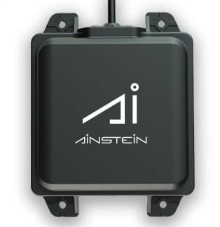

# Ainstein US-D1 Standard Radar Altimeter

:::tip
This supersedes the _Aerotenna uLanding Radar_ (discontinued) but uses the same driver/setup.
:::

The _Ainstein_ [US-D1 Standard Radar Altimeter](https://ainstein.ai/us-d1-all-weather-radar-altimeter/) is a compact microwave rangefinder that has been optimised for use on UAVs.
With a sensing range of about 50 metres, it is useful for applications including terrain following, precision hovering (e.g. for photography), anti-collision sensing etc.
이 제품의 특별한 장점은 모든 기상 조건과 모든 지형 유형(물 포함)에서 잘 작동한다는 점입니다.
The user manual can be found [here](https://ainstein.ai/wp-content/uploads/US-D1-Technical-User-Manual-D00.02.05.docx.pdf).



The rangefinder is not automatically included in most firmware, and hence cannot be used just by setting a parameter through _QGroundControl_ (as is possible with some other rangefinders).
이를 사용하려면 펌웨어에 드라이버를 추가하고, 부팅시 드라이버를 시작하도록 설정 파일을 업데이트하여야합니다.
아래 섹션에서는 방법을 설명합니다.

## 하드웨어 설정

거리계는 NuttX 또는 Posix OS에서 직렬 포트를 제공하는 하드웨어에서 지원됩니다.
Minimally this will include most, if not all, [Pixhawk Series](../flight_controller/pixhawk_series.md) controllers.

US-D1 can be connected to any unused _serial port_ (UART), e.g.: TELEM2, TELEM3, GPS2 etc.

## 매개변수 설정

[Configure the serial port](../peripherals/serial_configuration.md) on which the lidar will run using [SENS_ULAND_CFG](../advanced_config/parameter_reference.md#SENS_ULAND_CFG).
포트 전송속도는 드라이버에 의해 설정되므로, 추가로 설정하지 않아도 됩니다.

::: info

If the configuration parameter is not available in _QGroundControl_ then you may need to [add the driver to the firmware](../peripherals/serial_configuration.md#parameter_not_in_firmware):

```plain
CONFIG_DRIVERS_DISTANCE_SENSOR_ULANDING_RADAR=y
```

:::
