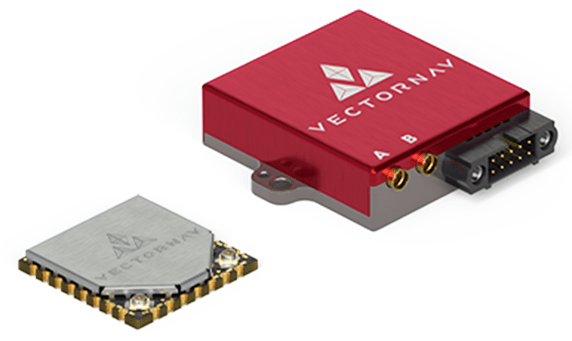

# VectorNav

VectorNav Technologies designs and develops high-performance, low-SWaP [IMU/AHRS](https://www.vectornav.com/resources/inertial-navigation-primer/theory-of-operation/theory-ahrs), [GNSS/INS](https://www.vectornav.com/resources/inertial-navigation-primer/theory-of-operation/theory-gpsins), and [Dual GNSS/INS](https://www.vectornav.com/resources/inertial-navigation-primer/theory-of-operation/theory-gnsscompass) solutions that enable safe and reliable autonomy at scale.

VectorNav products provide a range of benefits to PX4 users and can be integrated for:

- Higher accuracy heading, pitch, and roll estimates
- More robust and reliable GNSS positioning
- Improved positioning and attitude performance in GNSS-contested environments
- Performance under challenging dynamic conditions (e.g. catapult launches, VTOL operations, high-g or high angular rate operations)

The VectorNav PX4 Driver is streamlined to provide a simple plug-and-play architecture, removing engineering obstacles and allowing the acceleration of the design, development, and launch of platforms to keep pace with the rapid rate of innovation.

PX4 can use these as an [external INS](../sensor/inertial_navigation_systems.md), bypassing/replacing the EKF2 estimator, or as a source of raw sensor data provided to the estimator.

The driver supports [all VectorNav sensors](https://www.vectornav.com/store/products).
In particular the following systems are recommended:

- **VN-200 GNSS/INS:** Recommended for fixed-wing systems without hovering, where static heading is not necessary.
- **VN-300 DUAL GNSS/INS:** Recommended for multicopter systems where hovering and low dynamics requires the use of static heading.

## 구매처

VectorNav IMU/AHRS, GNSS/INS, and Dual GNSS/INS solutions are available directly from [VectorNav Technologies](https://www.vectornav.com/store/products) (US) or through their Global Sales Representatives. For more information on their solutions or for international orders, please contact sales@vectornav.com.

[Purchase VN-200 Development Kit](https://www.vectornav.com/store/products/gnss-ins/p/vn-200-rugged-development-kit) (GNSS/INS)
[Purchase VN-300 Development Kit](https://www.vectornav.com/store/products/dual-gnss-ins/p/vn-300-rugged-development-kit) (Dual GNSS/INS)

## 하드웨어 설정

### 배선

Connect any unused flight controller serial interface, such as a spare `GPS` or `TELEM` port, to the VectorNav UART2 port (required by PX4).

### 장착

The VectorNav sensor can be mounted in any orientation, in any position on the vehicle, without regard to center of gravity.
All VectorNav sensors default to a coordinate system of x-forward, y-right, and z-down, making the default mounting as connector-back, base down.
This can be changed to any rigid rotation using the VectorNav Reference Frame Rotation register.

If using a GNSS-enabled product, the GNSS antenna must be mounted rigidly with respect to the inertial sensor and with an unobstructed sky view. If using a dual-GNSS-enabled product (VN-3X0), the secondary antenna must be mounted rigidly with respect to the primary antenna and the inertial sensor with an unobstructed sky view.

For more mounting requirements and recommendations, see the relevant [Quick Start Guide](https://www.vectornav.com/resources/quick-start-guides).

## 펌웨어 설정

### PX4 설정

To use the VectorNav driver:

1. Include the module in firmware in the [kconfig board configuration](../hardware/porting_guide_config.md#px4-board-configuration-kconfig) by setting the kconfig variables: `CONFIG_DRIVERS_INS_VECTORNAV` or `CONFIG_COMMON_INS`.

2. [Set the parameter](../advanced_config/parameters.md) [SENS_VN_CFG](../advanced_config/parameter_reference.md#SENS_VN_CFG) to the hardware port connected to the VectorNav (for more information see [Serial Port Configuration](../peripherals/serial_configuration.md)).

3. Disable magnetometer preflight checks by setting [SYS_HAS_MAG](../advanced_config/parameter_reference.md#SYS_HAS_MAG) to `0`.

4. Allow the VectorNav driver to initialize by restarting PX4.

5. Configure driver as either an external INS or to provide raw data:

   - If using the VectorNav as an external INS, set [VN_MODE](../advanced_config/parameter_reference.md#VN_MODE) to `INS`.
      This disables EKF2.
   - If using the VectorNav as external inertial sensors:

      1. Set [VN_MODE](../advanced_config/parameter_reference.md#VN_MODE) to `Sensors Only`
      2. If internal sensors are enabled, prioritize VectorNav sensors using [CAL_GYROn_PRIO](../advanced_config/parameter_reference.md#CAL_GYRO0_PRIO), [CAL_ACCn_PRIO](../advanced_config/parameter_reference.md#CAL_ACC0_PRIO), [CAL_BAROn_PRIO](../advanced_config/parameter_reference.md#CAL_BARO0_PRIO), [CAL_MAGn_PRIO](../advanced_config/parameter_reference.md#CAL_MAG0_PRIO), where _n_ is the instance number of the IMU component (0, 1, etc.).

      ::: tip
      In most cases the external IMU (VN) is the highest-numbered.
      You can get a list of the IMU components available using [`uorb top -1`](../middleware/uorb.md#uorb-top-command), you can differentiate between them using the [`listener`](../modules/modules_command.md#listener) command and looking through the data, or just the rates.

      Alternatively, you can check [CAL_GYROn_ID](../advanced_config/parameter_reference.md#CAL_GYRO0_ID) to see the device id.
      The priority is 0-255, where 0 is entirely disabled and 255 is highest priority.

:::

6. Restart PX4.

Once enabled, the module will be detected on boot.
IMU data should be published at 800Hz (400Hz if using VN-300).

## VectorNav Configuration

Definitions for all commands and registers referenced in this section can be found in the respective [VectorNav ICD](https://www.vectornav.com/resources/interface-control-documents).

Upon initialization, PX4 configures the VectorNav unit as follows:

- Enables necessary binary outputs
- Disables ASCII outputs on active serial port
- Configures VPE Heading Mode to Absolute
- Autoscans baudrates and configures active port to 921600 bps

All other necessary configuration parameters must be separately loaded to the VectorNav unit manually. These most commonly include:

- `GNSS Antenna A Offset` Necessary if using a GNSS-enabled product and the GNSS antenna is mounted more than 10 cm from the VectorNav unit
- `GNSS Antenna Baseline` Necessary if using a dual-GNSS-enabled product
- `Reference Frame Rotation` Necessary if not mounted as connector-back, base-down
- `IMU Filtering Config` Recommended to adjust the default 200Hz IMU filtering

After setting these parameters, the settings must be set to persist over a power cycle using a Write Non Volatile command.

## Published Data

Upon initialization, the driver should print the following information to console (printed using `PX4_INFO`)

- Unit model number
- Unit hardware version
- Unit serial number
- Unit firmware number

This should be accessible using the [`dmesg`](../modules/modules_system.md#dmesg) command.

The VectorNav driver always publishes the unit's data to the following UOrb topics:

- [sensor_accel](../msg_docs/SensorAccel.md)
- [sensor_gyro](../msg_docs/SensorGyro.md)
- [sensor_mag](../msg_docs/SensorMag.md)
- [sensor_baro](../msg_docs/SensorBaro.md)
- [sensor_gps](../msg_docs/SensorGps.md)

and, if enabled as an external INS, publishes:

- [vehicle_local_position](../msg_docs/VehicleLocalPosition.md)
- [vehicle_global_positon](../msg_docs/VehicleGlobalPosition.md)
- [vehicle_attitude](../msg_docs/VehicleAttitude.md)

or, if enabled as external sensor only, publishes:

- `external_ins_local_position`
- `external_ins_global_position`
- `external_ins_attitude`

:::tip
Published topics can be viewed using the `listener` command.
:::

## Hardware Specifications

- [Product Briefs](https://www.vectornav.com/resources/product-briefs)
- [Datasheets](https://www.vectornav.com/resources/datasheets)
