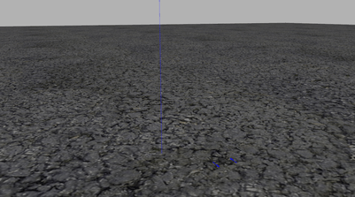
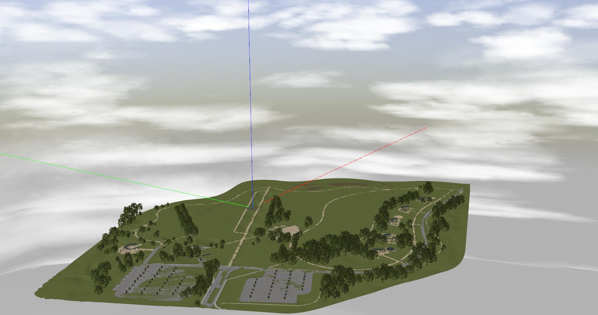
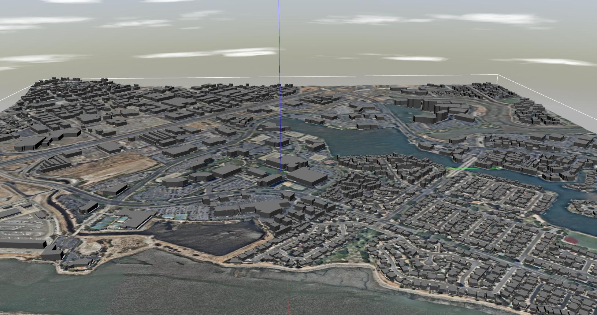
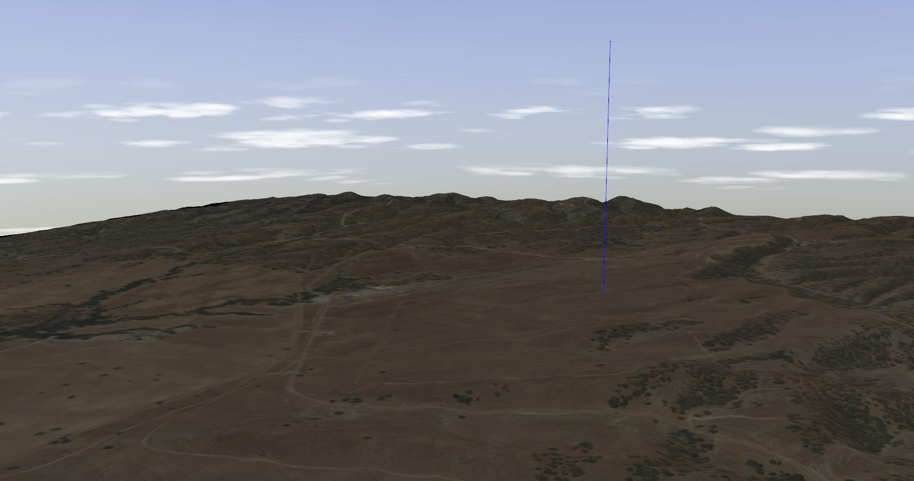
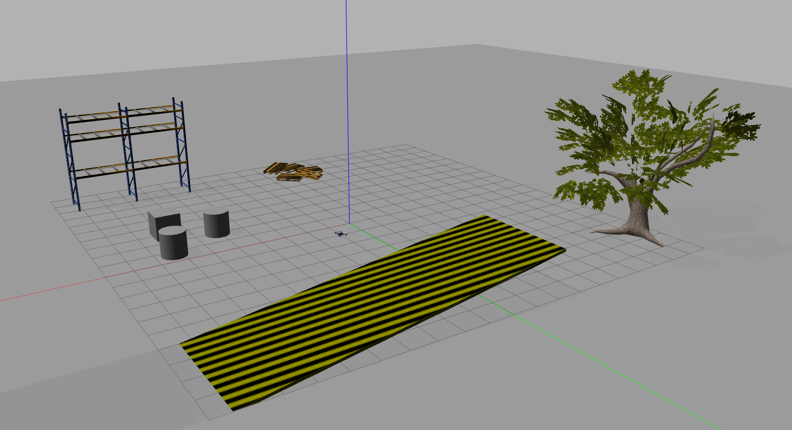
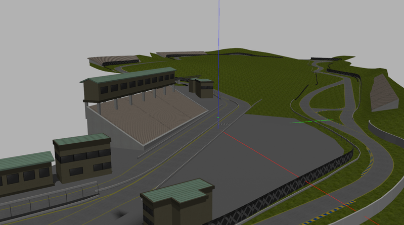
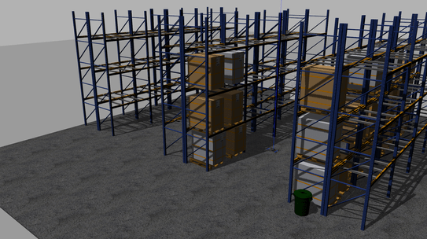

# Gazebo Classic Worlds

This topic provides imagery/information about the [Gazebo Classic](../sim_gazebo_classic/index.md) worlds supported by PX4.

The [empty.world](#empty_world) is spawned by default, though this may be overridden by a [model specific world](#model_specific_worlds).
Developers can also manually specify the world to load: [Gazebo Classic > Loading a Specific World](../sim_gazebo_classic/index.md#loading-a-specific-world).

The source code for supported worlds can be found on GitHub here: [PX4/PX4-SITL_gazebo-classic/tree/main/worlds](https://github.com/PX4/PX4-SITL_gazebo-classic/tree/main/worlds).

## Empty (Default)

[PX4/PX4-SITL_gazebo-classic/tree/main/worlds/empty.world](https://github.com/PX4/PX4-SITL_gazebo-classic/blob/main/worlds/empty.world)

## Baylands

[PX4/PX4-SITL_gazebo-classic/tree/main/worlds/baylands.world](https://github.com/PX4/PX4-SITL_gazebo-classic/blob/main/worlds/baylands.world)

## KSQL Airport

[PX4/PX4-SITL_gazebo-classic/tree/main/worlds/ksql_airport.world](https://github.com/PX4/PX4-SITL_gazebo-classic/blob/main/worlds/ksql_airport.world)

## McMillan Airfield

[PX4/PX4-SITL_gazebo-classic/tree/main/worlds/mcmillan_airfield.world](https://github.com/PX4/PX4-SITL_gazebo-classic/blob/main/worlds/mcmillan_airfield.world)

## Safe Landing

[PX4/PX4-SITL_gazebo-classic/tree/main/worlds/safe_landing.world](https://github.com/PX4/PX4-SITL_gazebo-classic/blob/main/worlds/safe_landing.world)

## Sonoma Raceway

[PX4/PX4-SITL_gazebo-classic/tree/main/worlds/sonoma_raceway.world](https://github.com/PX4/PX4-SITL_gazebo-classic/blob/main/worlds/sonoma_raceway.world)

## Warehouse

[PX4/PX4-SITL_gazebo-classic/tree/main/worlds/warehouse.world](https://github.com/PX4/PX4-SITL_gazebo-classic/blob/main/worlds/warehouse.world)

## Yosemite

[PX4/PX4-SITL_gazebo-classic/tree/main/worlds/yosemite.world](https://github.com/PX4/PX4-SITL_gazebo-classic/blob/main/worlds/yosemite.world)

## Model Specific Worlds

Some [vehicle models](../sim_gazebo_classic/vehicles.md) rely on the physics / plugins of a specific world.
The PX4 toolchain will automatically spawn a world that has the same name as the vehicle model if one exists (instead of the default **empty.world**):

The model specific worlds are:

- [boat.world](https://github.com/PX4/PX4-SITL_gazebo-classic/blob/main/worlds/boat.world): Includes a surface to simulate buoyancy of the [boat](../sim_gazebo_classic/vehicles.md#unmanned-surface-vehicle-usv-boat).
- [uuv_hippocampus.world](https://github.com/PX4/PX4-SITL_gazebo-classic/blob/main/worlds/uuv_hippocampus.world): An empty world used to simulate an underwater environment for the [HippoCampus UUV](../sim_gazebo_classic/vehicles.md#hippocampus-tuhh-uuv).
- [typhoon_h480.world](https://github.com/PX4/PX4-SITL_gazebo-classic/blob/main/worlds/typhoon_h480.world): Used by [Typhoon H480 (Hexrotor)](../sim_gazebo_classic/vehicles.md#typhoon-h480-hexrotor) vehicle model and includes a video widget to enable / disable video streaming.
  The world includes a gazebo plugin for a simulated camera.
- [iris_irlock.world](https://github.com/PX4/PX4-SITL_gazebo-classic/blob/main/worlds/iris_irlock.world): Includes a IR beacon for testing [precision landing](../advanced_features/precland.md).
