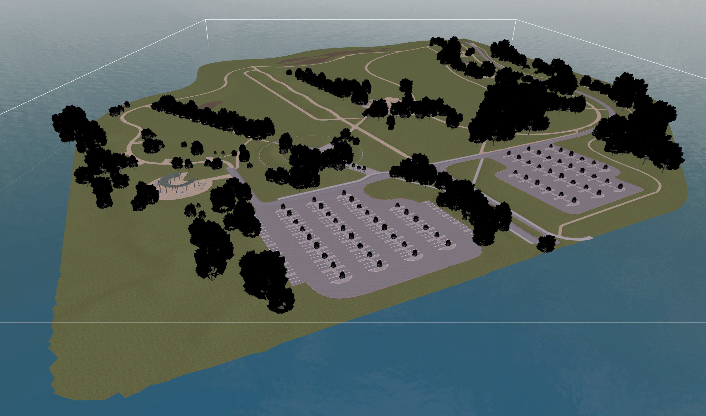
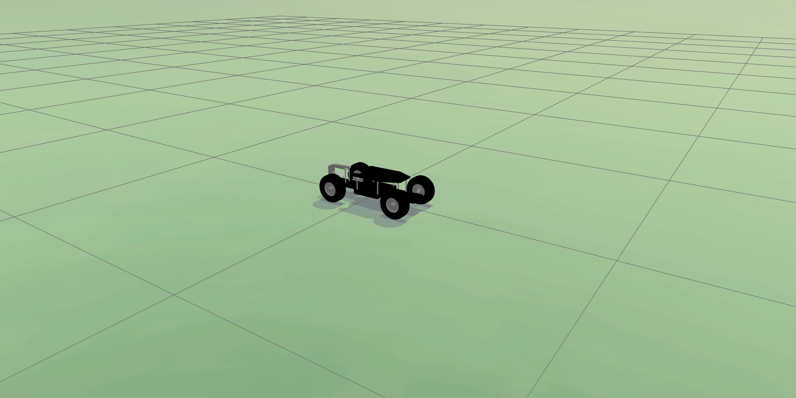
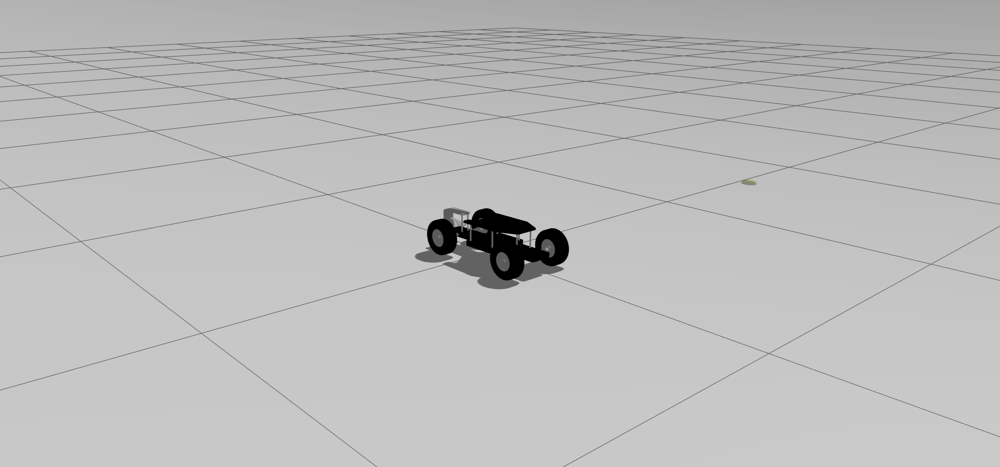
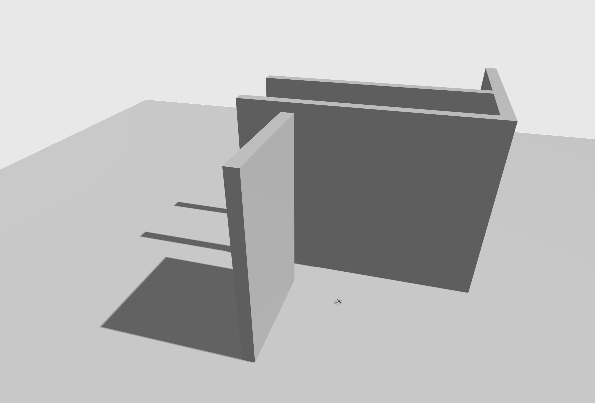

# Gazebo Worlds

This topic provides imagery/information about the [Gazebo](../sim_gazebo_gz/index.md) worlds supported by PX4.

The [default world](#default) is spawned by default, though this may be overridden by a [model specific world](#model_specific_worlds).
Developers can also manually specify the world to load: [Gazebo > Specify World](../sim_gazebo_gz/index.md#specify-world) (or [Gazebo Models Repository](../sim_gazebo_gz/gazebo_models.md#gazebo-models-repository-px4-gazebo-models)).

The source code for supported worlds can be found in the [Gazebo Models Repository](../sim_gazebo_gz/gazebo_models.md#gazebo-models-repository-px4-gazebo-models) on GitHub here: [PX4/PX4-gazebo-models/tree/main/worlds](https://github.com/PX4/PX4-gazebo-models/tree/main/worlds).

## Empty (Default) {#default}

Empty world (a grey plane).
This is used by default.

[PX4-gazebo-models/main/worlds/default.sdf](https://github.com/PX4/PX4-gazebo-models/blob/main/worlds/default.sdf)

## Aruco

Aruco world is the default world with the addition of an [ArUco marker](https://docs.opencv.org/4.x/d5/dae/tutorial_aruco_detection.html).

This is used in conjunction with the [x500_mono_cam_down](../sim_gazebo_gz/vehicles.md#x500-quadrotor-with-monocular-camera-down-facing) airframe to test [precision landing](../advanced_features/precland.md).

[PX4-gazebo-models/main/worlds/aruco.sdf](https://github.com/PX4/PX4-gazebo-models/blob/main/worlds/aruco.sdf)

## Baylands

Baylands world surrounded by water.

[PX4-gazebo-models/main/worlds/bayland.sdf](https://github.com/PX4/PX4-gazebo-models/blob/main/worlds/baylands.sdf)

## Lawn

Lawn is a flat green world that is a less-optimized alternative to [rover world](#rover).
It is not recommended as the low frame rate causes segmentation faults on some frames.

[PX4-gazebo-models/main/worlds/lawn.sdf](https://github.com/PX4/PX4-gazebo-models/blob/main/worlds/lawn.sdf)

## 탐사선

Rover world is optimised for rovers (and will be further optimised for rovers) and is the default world for [Ackermann Rover (4012)](../frames_rover/ackermann.md) (`make px4_sitl gz_rover_ackermann`) and [Differential Rover ((r1-rover (4009))](../frames_rover/differential.md) (`make px4_sitl gz_r1_rover`).

[PX4-gazebo-models/main/worlds/rover.sdf](https://github.com/PX4/PX4-gazebo-models/blob/main/worlds/rover.sdf)

:::info
Rover world is very similar to [lawn world](#lawn), but with these tow main differences:

- Grid on the ground which is useful as a reference while driving.
- Higher update rate which solves segfault issues specifically with rovers with ackermann steering.

:::

## Walls

World with walls that is designed for testing [collision prevention](../computer_vision/collision_prevention.md).

[PX4-gazebo-models/main/worlds/walls.sdf](https://github.com/PX4/PX4-gazebo-models/blob/main/worlds/walls.sdf)

## Windy

[Empty world](#default) with wind enabled.

[PX4-gazebo-models/main/worlds/windy.sdf](https://github.com/PX4/PX4-gazebo-models/blob/main/worlds/windy.sdf)

## Model Specific Worlds {#model_specific_worlds}

Some [vehicle models](../sim_gazebo_gz/vehicles.md) rely on the physics / plugins of a specific world.
The PX4 toolchain will automatically spawn a world that has the same name as the vehicle model if one exists (instead of the [default world](#default)):

The model specific worlds are:

- [Aruco world](#aruco): Default world with an [ArUco marker](https://docs.opencv.org/4.x/d5/dae/tutorial_aruco_detection.html) that can be used with with [x500_mono_cam_down](../sim_gazebo_gz/vehicles.md#x500-quadrotor-with-monocular-camera-down-facing) for testing [precision landing](../advanced_features/precland.md).
