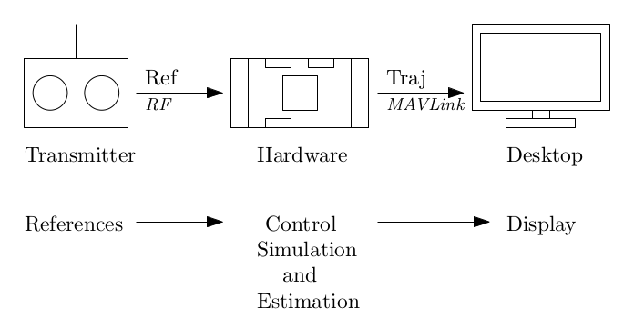

# Simulation-In-Hardware (SIH)

<Badge type="tip" text="PX4 v1.9 (MC)" /><Badge type="tip" text="PX4 v1.13 (MC, VTOL, FW)" />

:::warning
This simulator is [community supported and maintained](../simulation/community_supported_simulators.md).
It may or may not work with current versions of PX4 (known to work in PX4 v1.14).

See [Toolchain Installation](../dev_setup/dev_env.md) for information about the environments and tools supported by the core development team.
:::

Simulation-In-Hardware (SIH) is an alternative to [Hardware In The Loop simulation (HITL)](../simulation/hitl.md) for quadrotors, fixed-wing vehicles (airplane), and VTOL tailsitters.

SIH can be used by new PX4 users to get familiar with PX4 and the different modes and features, and of course to learn to fly a vehicle using an RC controller in simulation, which is not possible using SITL.

## 개요

With SIH the whole simulation is running on embedded hardware: the controller, the state estimator, and the simulator.
The Desktop computer is only used to display the virtual vehicle.



### 호환성

- SIH is compatible with all PX4 supported boards except those based on FMUv2.
- SIH for quadrotor is supported from PX4 v1.9.
- SIH for fixed-wing (airplane) and VTOL tailsitter are supported from PX4 v1.13.
- SIH as SITL (without hardware) from PX4 v1.14.
- SIH for Standard VTOL from PX4 v1.16.

### Benefits

SIH provides several benefits over HITL:

- It ensures synchronous timing by avoiding the bidirectional connection to the computer.
  As a result the user does not need such a powerful desktop computer.
- The whole simulation remains inside the PX4 environment.
  Developers who are familiar with PX4 can more easily incorporate their own mathematical model into the simulator.
  They can, for instance, modify the aerodynamic model, or noise level of the sensors, or even add a sensor to be simulated.
- The physical parameters representing the vehicle (such as mass, inertia, and maximum thrust force) can easily be modified from the [SIH parameters](../advanced_config/parameter_reference.md#simulation-in-hardware).

## Requirements

To run the SIH, you will need a:

- [Flight controller](../flight_controller/index.md), such as a Pixhawk-series board
- [Manual controller](../getting_started/px4_basic_concepts.md#manual-control): either a [radio control system](../getting_started/rc_transmitter_receiver.md) or a [joystick](../config/joystick.md).
- QGroundControl for flying the vehicle via GCS.
- Development computer for visualizing the virtual vehicle (optional).

From PX4 v1.14 you can run SIH "as SITL", in which case a flight controller is not required.

## Starting SIH

To set up/start SIH:

1. Connect the flight controller to the desktop computer with a USB cable.
2. Open QGroundControl and wait for the flight controller too boot and connect.
3. Open [Vehicle Setup > Airframe](../config/airframe.md) then select the desired frame:
  - [SIH Quadcopter X](../airframes/airframe_reference.md#copter_simulation_sih_quadcopter_x)
  - [SIH plane AERT](../airframes/airframe_reference.md#plane_simulation_sih_plane_aert)
  - [SIH Tailsitter Duo](../airframes/airframe_reference.md#vtol_simulation_sih_tailsitter_duo)
  - [SIH Standard VTOL QuadPlane](../airframes/airframe_reference.md#vtol_simulation_sih_standard_vtol_quadplane)

The autopilot will then reboot.
The `sih` module is started on reboot, and the vehicle should be displayed on the ground control station map.

:::warning
The airplane needs to takeoff in manual mode at full throttle.
Also, if the airplane crashes the state estimator might lose its fix.
:::

## Display/Visualisation (optional)

The SIH-simulated vehicle can be displayed using [jMAVSim](../sim_jmavsim/index.md) as a visualiser.

:::tip
SIH does not _need_ a visualiser — you can connect with QGroundControl and fly the vehicle without one.
:::

To display the simulated vehicle:

1. Close _QGroundControl_ (if open).

2. Unplug and replug the flight controller (allow a few seconds for it to boot).

3. Start jMAVSim by calling the script **jmavsim_run.sh** from a terminal:

  ```sh
  ./Tools/simulation/jmavsim/jmavsim_run.sh -q -d /dev/ttyACM0 -b 2000000 -o
  ```

  where the flags are:

  - `-q` to allow the communication to _QGroundControl_ (optional).
  - `-d` to start the serial device `/dev/ttyACM0` on Linux.
    On macOS this would be `/dev/tty.usbmodem1`.
  - `-b` to set the serial baud rate to `2000000`.
  - `-o` to start jMAVSim in _display Only_ mode (i.e. the physical engine is turned off and jMAVSim only displays the trajectory given by the SIH in real-time).
  - add a flag `-a` to display an aircraft or `-t` to display a tailsitter.
    If this flag is not present a quadrotor will be displayed by default.

4. After few seconds, _QGroundControl_ can be opened again.

At this point, the system can be armed and flown.
The vehicle can be observed moving in jMAVSim, and on the QGC _Fly_ view.

## SIH as SITL (no FC)

SIH can be run as SITL (Software-In-The-Loop) from v1.14.
What this means is that the simulation code is executed on the laptop/computer instead of a flight controller, similar to Gazebo or jMAVSim.
In this case you don't need the flight controller hardware.

To run SIH as SITL:

1. Install the [PX4 Development toolchain](../dev_setup/dev_env.md).
2. Run the appropriate make command for each vehicle type (at the root of the PX4-Autopilot repository):

  - quadrotor:

    ```sh
    make px4_sitl sihsim_quadx
    ```

  - Fixed-wing (plane):

    ```sh
    make px4_sitl sihsim_airplane
    ```

  - XVert VTOL tailsitter:

    ```sh
    make px4_sitl sihsim_xvert
    ```

  - Standard VTOL:

    ```sh
    make px4_sitl sihsim_standard_vtol
    ```

### Change Simulation Speed

SITL allows the simulation to be run faster than real time.
To run the airplane simulation 10 times faster than real time, run the command:

```sh
PX4_SIM_SPEED_FACTOR=10 make px4_sitl sihsim_airplane
```

To display the vehicle in jMAVSim during SITL mode, enter the following command in another terminal:

```sh
./Tools/simulation/jmavsim/jmavsim_run.sh -p 19410 -u -q -o
```

- add a flag `-a` to display an aircraft or `-t` to display a tailsitter.
  If this flag is not present a quadrotor will be displayed by default.

### Set Custom Takeoff Location

The takeoff location in SIH on SITL can be set using environment variables.
This will override the default takeoff location.

The variables to set are: `PX4_HOME_LAT`, `PX4_HOME_LON`, and `PX4_HOME_ALT`.

예:

```sh
export PX4_HOME_LAT=28.452386
export PX4_HOME_LON=-13.867138
export PX4_HOME_ALT=28.5
make px4_sitl sihsim_quadx
```

## Adding New Airframes

[Adding a new airframe](../dev_airframes/adding_a_new_frame.md) for use in SIH simulation is much the same as for other use cases.
You still need to configure your vehicle type and [geometry](../config/actuators.md) (`CA_` parameters) and start any other defaults for that specific vehicle.

:::warning
Not every vehicle can be simulated with SIH — there are currently [four supported vehicle types](../advanced_config/parameter_reference.md#SIH_VEHICLE_TYPE), each of which has a relatively rigid implementation in [`sih.cpp`](https://github.com/PX4/PX4-Autopilot/blob/main/src/modules/simulation/simulator_sih/sih.cpp).
:::

The specific differences for SIH simulation airframes are listed in the sections below.

For all variants of SIH:

- Set all the [Simulation In Hardware](../advanced_config/parameter_reference.md#simulation-in-hardware) parameters (prefixed with `SIH_`) in order to configure the physical model of the vehicle.

  ::: tip
  Make sure that the `SIH_*` parameters and the `CA_*` parameters describe the same vehicle.
  Note that some of these parameters are redundant!

:::

- `param set-default SYS_HITL 2` to enable SIH on the next boot.

  ::: info
  This also disables input from real sensors.
  For SIH on the FC (only), it also enables the simulated GPS, barometer, magnetometer, and airspeed sensor.

  For SIH on SITL you will need to explicitly enable these sensors as shown below.

:::

- `param set-default EKF2_GPS_DELAY 0` to improve state estimator performance (the assumption of instant GPS measurements would normally be unrealistic, but is accurate for SIH).

For SIH on FC:

- Airframe file goes in `ROMFS/px4fmu_common/init.d/airframes` and follows the naming template `${ID}_${model_name}.hil`, where `ID` is the `SYS_AUTOSTART_ID` used to select the airframe, and `model_name` is the airframe model name.
- Add the model name in `ROMFS/px4fmu_common/init.d/airframes/CMakeLists.txt` to generate a corresponding make target.
- Actuators are configured with `HIL_ACT_FUNC*` parameters (not the usual `PWM_MAIN_FUNC*` parameters).
  This is to avoid using the real actuator outputs in SIH.
  Similarly, the bitfield for inverting individual actuator output ranges is `HIL_ACT_REV`, rather than `PWM_MAIN_REV`.

For SIH as SITL (no FC):

- Airframe file goes in `ROMFS/px4fmu_common/init.d-posix/airframes` and follows the naming template `${ID}_sihsim_${model_name}`, where `ID` is the `SYS_AUTOSTART_ID` used to select the airframe, and `model_name` is the airframe model name.
- Add the model name in `src/modules/simulation/simulator_sih/CMakeLists.txt` to generate a corresponding make target.
- Actuators are configured as usual with `PWM_MAIN_FUNC*` and `PWM_MAIN_REV`.
- Additionally, set:
  - `PX4_SIMULATOR=${PX4_SIMULATOR:=sihsim}`
  - `PX4_SIM_MODEL=${PX4_SIM_MODEL:=svtol}` (replacing `svtol` with the airframe model name)
- Enable the simulated sensors using [SENS_EN_GPSSIM](../advanced_config/parameter_reference.md#SENS_EN_GPSSIM), [SENS_EN_BAROSIM](../advanced_config/parameter_reference.md#SENS_EN_BAROSIM), [SENS_EN_MAGSIM](../advanced_config/parameter_reference.md#SENS_EN_MAGSIM), and [SENS_EN_ARSPDSIM](../advanced_config/parameter_reference.md#SENS_EN_ARSPDSIM) (this is only needed for SIH-as-SITL):
  - `param set-default SENS_EN_GPSSIM 1`
  - `param set-default SENS_EN_BAROSIM 1`
  - `param set-default SENS_EN_MAGSIM 1`
  - `param set-default SENS_EN_ARSPDSIM 1` (if it is a fixed-wing or VTOL airframe with airspeed sensor)

For specific examples see the `_sihsim_` airframes in [ROMFS/px4fmu_common/init.d-posix/airframes](https://github.com/PX4/PX4-Autopilot/blob/main/ROMFS/px4fmu_common/init.d-posix/airframes/) (SIH as SITL) and [ROMFS/px4fmu_common/init.d/airframes](https://github.com/PX4/PX4-Autopilot/tree/main/ROMFS/px4fmu_common/init.d/airframes) (SIH on FC).

## Dynamic Models

The dynamic models for the various vehicles are:

- Quadrotor: [pdf report](https://github.com/PX4/PX4-user_guide/raw/main/assets/simulation/SIH_dynamic_model.pdf).
- Fixed-wing: Inspired by the PhD thesis: "Dynamics modeling of agile fixed-wing unmanned aerial vehicles." Khan, Waqas, supervised by Nahon, Meyer, McGill University, PhD thesis, 2016.
- Tailsitter: Inspired by the master's thesis: "Modeling and control of a flying wing tailsitter unmanned aerial vehicle." Chiappinelli, Romain, supervised by Nahon, Meyer, McGill University, Masters thesis, 2018.

## 비디오

<lite-youtube videoid="PzIpSCRD8Jo" title="SIH FW demo"/>

## Credits

SIH was originally developed by Coriolis g Corporation.
The airplane model and tailsitter models were added by Altitude R&D inc.
Both are Canadian companies:

- Coriolis g developped a new type of Vertical Takeoff and Landing (VTOL) vehicles based on passive coupling systems;
- [Altitude R&D](https://www.altitude-rd.com/) is specialized in dynamics, control, and real-time simulation (today relocated in Zurich).

The simulator is released for free under BSD license.
