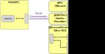
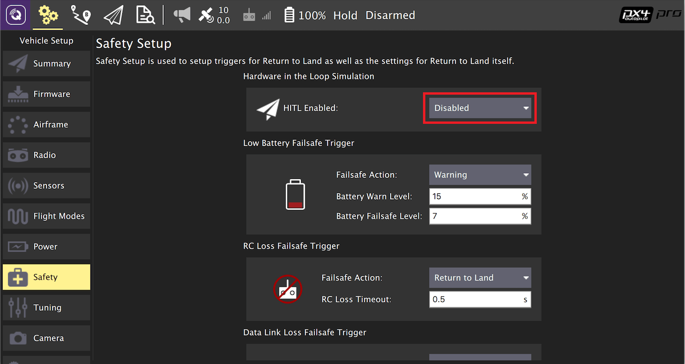
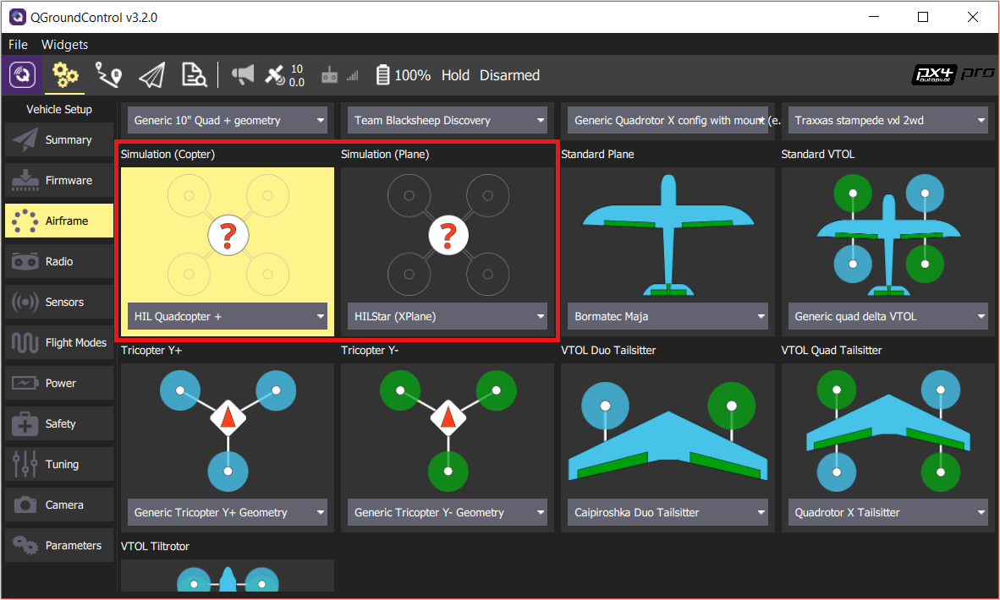
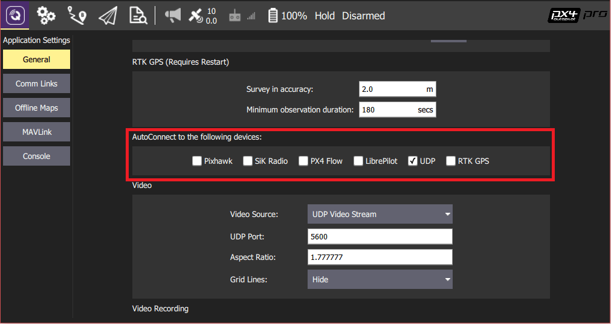

# Hardware in the Loop Simulation (HITL)

:::warning
HITL is [community supported and maintained](../simulation/community_supported_simulators.md).
It may or may not work with current versions of PX4.

See [Toolchain Installation](../dev_setup/dev_env.md) for information about the environments and tools supported by the core development team.
:::

HITL(Hardware-in-the-Loop)은 일반 PX4 펌웨어가 실제 비행 콘트롤러 하드웨어에서 실행되는 시뮬레이션 모드입니다.
이 접근 방식은 실제 하드웨어에서 대부분의 실제 비행 코드를 테스트할 수 있습니다.

PX4 supports HITL for multicopters (using [jMAVSim](../sim_jmavsim/index.md) or [Gazebo Classic](../sim_gazebo_classic/index.md)) and VTOL (using Gazebo Classic).

<a id="compatible_airframe"></a>

## HITL 호환 기체

The set of compatible airframes vs simulators is:

| 기체                                                                                                               | `SYS_AUTOSTART` | Gazebo Classic | jMAVSim |
| ---------------------------------------------------------------------------------------------------------------- | --------------- | -------------- | ------- |
| [HIL Quadcopter X](../airframes/airframe_reference.md#copter_simulation_hil_quadcopter_x)                        | 1001            | Y              | Y       |
| [HIL Standard VTOL QuadPlane](../airframes/airframe_reference.md#vtol_standard_vtol_hil_standard_vtol_quadplane) | 1002            | Y              |         |
| [Generic Quadrotor x](../airframes/airframe_reference.md#copter_quadrotor_x_generic_quadcopter) copter           | 4001            | Y              | Y       |

<a id="simulation_environment"></a>

## HITL 시뮬레이션 환경

HITL(Hardware-in-the-Loop) 시뮬레이션을 사용하여, 일반 PX4 펌웨어가 실제 하드웨어에서 실행됩니다.
JMAVSim or Gazebo Classic (running on a development computer) are connected to the flight controller hardware via USB/UART.
The simulator acts as gateway to share MAVLink data between PX4 and _QGroundControl_.

:::info
The simulator can also be connected via UDP if the flight controller has networking support and uses a stable, low-latency connection (e.g. a wired Ethernet connection - WiFi is usually not sufficiently reliable).
For example, this configuration has been tested with PX4 running on a Raspberry Pi connected via Ethernet to the computer (a startup configuration that includes the command for running jMAVSim can be found [here](https://github.com/PX4/PX4-Autopilot/blob/main/posix-configs/rpi/px4_hil.config)).
:::

아래 다이어그램은 시뮬레이션 환경을 나타냅니다.

- A HITL configuration is selected (via _QGroundControl_) that doesn't start any real sensors.
- _jMAVSim_ or _Gazebo Classic_ are connected to the flight controller via USB.
- The simulator is connected to _QGroundControl_ via UDP and bridges its MAVLink messages to PX4.
- _Gazebo Classic_ and _jMAVSim_ can also connect to an offboard API and bridge MAVLink messages to PX4.
- (Optional) A serial connection can be used to connect Joystick/Gamepad hardware via _QGroundControl_.



## HITL 대 SITL

SITL은 시뮬레이션 환경의 컴퓨터에서 실행되며, 해당 환경에서 제작된 펌웨어를 사용합니다.
시뮬레이터에서 가공의 환경 데이터를 제공하는 시뮬레이션 드라이버 이외의 시스템은 정상적으로 작동합니다.

이와 대조적으로, HITL은 일반 하드웨어의 "HITL 모드"에서 일반 PX4 펌웨어를 실행합니다.
시뮬레이션 데이터는 SITL과 다른 지점에서 시스템에 입력됩니다.
커맨더 및 센서와 같은 핵심 모듈에는 시작 시 정상적인 기능 중 일부를 우회하는 HITL 모드가 있습니다.

요약하면, HITL은 표준 펌웨어를 사용하여 실제 하드웨어에서 PX4를 실행하고, SITL은 실제로 더 많은 표준 시스템 코드를 실행합니다.

## HITL 설정

### PX4 설정

1. Connect the autopilot directly to _QGroundControl_ via USB.

2. HITL 모드를 활성화합니다.

   1. Open **Setup > Safety** section.
   2. Enable HITL mode by selecting **Enabled** from the _HITL Enabled_ list:

      

3. 기체를 선택합니다.

   1. Open **Setup > Airframes**
   2. Select a [compatible airframe](#compatible_airframe) you want to test.
      Then click **Apply and Restart** on top-right of the _Airframe Setup_ page.

      

4. 필요한 경우 RC 또는 조이스틱을 보정합니다.

5. UDP를 설정합니다.

   1. Under the _General_ tab of the settings menu, uncheck all _AutoConnect_ boxes except for **UDP**.

      

6. (선택 사항) 조이스틱과 안정장치를 설정합니다.
   Set the following [parameters](../advanced_config/parameters.md) in order to use a joystick instead of an RC remote control transmitter:

   - [COM_RC_IN_MODE](../advanced_config/parameter_reference.md#COM_RC_IN_MODE) to "Joystick/No RC Checks". 이것은 조이스틱 입력을 허용하고, RC 입력을 비활성화합니다.
   - [NAV_RCL_ACT](../advanced_config/parameter_reference.md#NAV_RCL_ACT) to "Disabled". 무선 제어로 HITL을 실행하지 않으면, RC 안전장치가 간섭하지 않습니다.

   :::tip
   The _QGroundControl User Guide_ also has instructions on [Joystick](https://docs.qgroundcontrol.com/master/en/qgc-user-guide/setup_view/joystick.html) and [Virtual Joystick](https://docs.qgroundcontrol.com/master/en/qgc-user-guide/settings_view/virtual_joystick.html) setup.

:::

Once configuration is complete, **close** _QGroundControl_ and disconnect the flight controller hardware from the computer.

### 시뮬레이터별 설정

다음 섹션을 참고하여 특정 시뮬레이터에 대하여 설정하십시오.

#### Gazebo Classic

:::info
Make sure _QGroundControl_ is not running!
:::

1. Build PX4 with [Gazebo Classic](../sim_gazebo_classic/index.md) (in order to build the Gazebo Classic plugins).

   ```sh
   cd <Firmware_clone>
   DONT_RUN=1 make px4_sitl_default gazebo-classic
   ```

2. Open the vehicle model's sdf file (e.g. **Tools/simulation/gazebo-classic/sitl_gazebo-classic/models/iris_hitl/iris_hitl.sdf**).

3. Replace the `serialDevice` parameter (`/dev/ttyACM0`) if necessary.

   ::: info
   The serial device depends on what port is used to connect the vehicle to the computer (this is usually `/dev/ttyACM0`).
   An easy way to check on Ubuntu is to plug in the autopilot, open up a terminal, and type `dmesg | grep "tty"`.
   올바른 장치가 마지막에 표시됩니다.

:::

4. 환경 변수를 설정합니다.

   ```sh
   source Tools/simulation/gazebo-classic/setup_gazebo.bash $(pwd) $(pwd)/build/px4_sitl_default
   ```

   and run Gazebo Classic in HITL mode:

   ```sh
   gazebo Tools/simulation/gazebo-classic/sitl_gazebo-classic/worlds/hitl_iris.world
   ```

5. Start _QGroundControl_.
   It should autoconnect to PX4 and Gazebo Classic.

#### jMAVSim(쿼드콥터 전용)

:::info
Make sure _QGroundControl_ is not running!
:::

1. 비행 콘트롤러를 컴퓨터에 연결하고, 부팅시까지 기다립니다.

2. jMAVSim를 HITL 모드에서 실행:

   ```sh
   ./Tools/simulation/jmavsim/jmavsim_run.sh -q -s -d /dev/ttyACM0 -b 921600 -r 250
   ```

   ::: info
   Replace the serial port name `/dev/ttyACM0` as appropriate.
   On macOS this port would be `/dev/tty.usbmodem1`.
   Windows(Cygwin 포함)에서는 COM1 또는 다른 포트입니다. Windows 장치 관리자에서 확인하십시오.

:::

3. Start _QGroundControl_.
   PX4와 jMAVSim에 자동으로 연결되어야 합니다.

## HITL에서 자율 임무 비행

You should be able to use _QGroundControl_ to [run missions](https://docs.qgroundcontrol.com/master/en/qgc-user-guide/fly_view/fly_view.html#missions) and otherwise control the vehicle.
