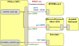

# 시뮬레이션

시뮬레이터는 PX4 비행 코드가 시뮬레이션된 가상 "세계"에서 컴퓨터로 모델링된 기체를 제어합니다.
You can interact with this vehicle just as you might with a real vehicle, using _QGroundControl_, an offboard API, or a radio controller/gamepad.

:::tip
Simulation is a quick, easy, and most importantly, _safe_ way to test changes to PX4 code before attempting to fly in the real world.
실험할 기체가 없은 경우 PX4로 비행을 시작하는 것도 좋은 방법입니다.
:::

PX4 supports both _Software In the Loop (SITL)_ simulation, where the flight stack runs on computer (either the same computer or another computer on the same network) and _Hardware In the Loop (HITL)_ simulation using a simulation firmware on a real flight controller board.

사용 가능한 시뮬레이터와 설정 방법을 다음 섹션에서 설명합니다.
The other sections provide general information about how the simulator works, and are not required to _use_ the simulators.

## 지원되는 시뮬레이터

The following simulators are supported by the PX4 core development team.

| 시뮬레이터                                            | 설명                                                                                                                                                                                                                                                                                                                                                                                                                                                                                                                                                                                                                                                                                                                                                   |
| ------------------------------------------------ | ---------------------------------------------------------------------------------------------------------------------------------------------------------------------------------------------------------------------------------------------------------------------------------------------------------------------------------------------------------------------------------------------------------------------------------------------------------------------------------------------------------------------------------------------------------------------------------------------------------------------------------------------------------------------------------------------------------------------------------------------------- |
| [Gazebo](../sim_gazebo_gz/index.md)              | Gazebo supersedes [Gazebo Classic](../sim_gazebo_classic/index.md), featuring more advanced rendering, physics and sensor models. It is the only version of Gazebo available from Ubuntu Linux 22.04<br><br>A powerful 3D simulation environment that is particularly suitable for testing object-avoidance and computer vision. [다중 차량시뮬레이션](../simulation/multi-vehicle-simulation.md)에도 사용할 수 있으며 일반적으로 차량 제어 자동화를 위한 도구 모음인 [ROS](../simulation/ros_interface.md)와 함께 사용됩니다. <br><br><strong>Supported Vehicles:</strong> Quad, VTOL (Standard, Tailsitter, Tiltroter), Plane, Rovers                                                         |
| [Gazebo Classic](../sim_gazebo_classic/index.md) | A powerful 3D simulation environment that is particularly suitable for testing object-avoidance and computer vision. It can also be used for [multi-vehicle simulation](../simulation/multi-vehicle-simulation.md) and is commonly used with [ROS](../simulation/ros_interface.md), a collection of tools for automating vehicle control.<br><br>**Supported Vehicles:** Quad ([Iris](../airframes/airframe_reference.md#copter_quadrotor_x_generic_quadcopter)), Hex (Typhoon H480), [Generic Standard VTOL (QuadPlane)](../airframes/airframe_reference.md#vtol_standard_vtol_generic_standard_vtol), Tailsitter, Plane, Rover, Submarine |

There are also a number of [Community Supported Simulators](../simulation/community_supported_simulators.md).

---

이 항목의 나머지 부분은 시뮬레이션 인프라 작동 방식에 대한 "다소 일반적인" 설명입니다.
It is not required to _use_ the simulators.

## Simulator MAVLink API

All simulators except for Gazebo communicate with PX4 using the Simulator MAVLink API.
이 API는 시뮬레이션된 세계에서 PX4로 센서 데이터를 제공하고, 시뮬레이션된 차량에 적용될 비행 코드에서 모터 및 액추에이터 값을 반환하는 MAVLink 메시지 세트를 정의합니다.
아래 이미지는 메시지 흐름을 나타냅니다.


:::info
A SITL build of PX4 uses [SimulatorMavlink.cpp](https://github.com/PX4/PX4-Autopilot/blob/main/src/modules/simulation/simulator_mavlink/SimulatorMavlink.cpp) to handle these messages while a hardware build in HIL mode uses [mavlink_receiver.cpp](https://github.com/PX4/PX4-Autopilot/blob/main/src/modules/mavlink/mavlink_receiver.cpp).
시뮬레이터의 센서 데이터는 PX4 uORB 주제에 기록됩니다.
모든 모터/액츄에이터가 차단되지만, 내부 소프트웨어는 완전하게 작동합니다.
:::

메시지는 아래에 설명되어 있습니다(자세한 내용은 링크 참조).

| 메시지                                                                  | 방향                                 | 설명                                                                                                                                                                                                                     |
| -------------------------------------------------------------------- | ---------------------------------- | ---------------------------------------------------------------------------------------------------------------------------------------------------------------------------------------------------------------------- |
| [MAV\_MODE:MAV\_MODE\_FLAG\_HIL\_ENABLED][mav_mode_flag_hil_enabled] | NA                                 | 시뮬레이션 모드 플래그입니다. 모든 모터/액추에이터가 차단되지만, 내부 소프트웨어는 완전하게 작동합니다.                                                                                                                             |
| [HIL\_ACTUATOR\_CONTROLS][hil_actuator_controls]                     | PX4 &rarr; Sim | PX4 제어 출력(모터, 액추에이터).                                                                                                                                                               |
| [HIL\_SENSOR][hil_sensor]                                            | Sim &rarr; PX4 | NED 본체 프레임의 SI 단위로 시뮬레이션된 IMU 판독값.                                                                                                                                                                     |
| [HIL\_GPS][hil_gps]                                                  | Sim &rarr; PX4 | 시뮬레이션된 GPS RAW 센서 값입니다.                                                                                                                                                                                |
| [HIL\_OPTICAL\_FLOW][hil_optical_flow]                               | Sim &rarr; PX4 | 흐름 센서에서 시뮬레이션된 광류(예: PX4FLOW 또는 광학 마우스 센서)                                                                                                                                          |
| [HIL\_STATE\_QUATERNION][hil_state_quaternion]                       | Sim &rarr; PX4 | 실제 "시뮬레이션된" 차량 위치, 자세, 속도 등이 포함됩니다. 이것은 분석 및 디버깅에 대한 PX4의 추정치와 비교 기록될 수 있습니다(예: 노이즈가 있는(시뮬레이션된) 센서 입력에 대해 추정기가 얼마나 잘 작동하는 지 확인). |
| [HIL\_RC\_INPUTS\_RAW][hil_rc_inputs_raw]                            | Sim &rarr; PX4 | 수신된 RC 채널의 RAW 값입니다.                                                                                                                                                                                   |

<!-- links for table above -->

[mav_mode_flag_hil_enabled]: https://mavlink.io/en/messages/common.html#MAV_MODE_FLAG_HIL_ENABLED
[hil_actuator_controls]: https://mavlink.io/en/messages/common.html#HIL_ACTUATOR_CONTROLS
[hil_sensor]: https://mavlink.io/en/messages/common.html#HIL_SENSOR
[hil_gps]: https://mavlink.io/en/messages/common.html#HIL_GPS
[hil_optical_flow]: https://mavlink.io/en/messages/common.html#HIL_OPTICAL_FLOW
[hil_state_quaternion]: https://mavlink.io/en/messages/common.html#HIL_STATE_QUATERNION
[hil_rc_inputs_raw]: https://mavlink.io/en/messages/common.html#HIL_RC_INPUTS_RAW

<!-- above ^^^ links for table -->

PX4 directly uses the [Gazebo API](https://gazebosim.org/docs) to interface with [Gazebo](../sim_gazebo_gz/index.md) and MAVlink is not required.

## 기본 PX4 MAVLink UDP 포트

By default, PX4 uses commonly established UDP ports for MAVLink communication with ground control stations (e.g. _QGroundControl_), Offboard APIs (e.g. MAVSDK, MAVROS) and simulator APIs (e.g. Gazebo).
해당 포트는 다음과 같습니다:

- PX4's remote UDP Port **14550** is used for communication with ground control stations.
  GCS는 이 포트에서 연결 수신을 예상합니다.
  _QGroundControl_ listens to this port by default.
- PX4's remote UDP Port **14540** is used for communication with offboard APIs.
  오프보드 API는 이 포트에서 연결 수신을 예상합니다.
  ::: info
  Multi-vehicle simulations use a separate remote port for each instance, allocated sequentially from `14540` to `14549`
  (additional instances all use port `14549`).

:::
- The simulator's local TCP Port, **4560**, is used for communication with PX4.
  PX4는 이 포트를 수신하고, 시뮬레이터는 이 포트에 데이터를 브로드캐스트하여 통신을 시작합니다.

:::info
The ports for the GCS, offboard APIs and simulator are specified by startup scripts.
See [System Startup](../concept/system_startup.md) to learn more.
:::

<!-- A useful discussion about UDP ports here: https://github.com/PX4/PX4-user_guide/issues/1035#issuecomment-777243106 -->

## SITL 시뮬레이션 환경

The diagram below shows a typical SITL simulation environment for any of the supported simulators that use MAVLink (i.e. all of them except Gazebo).



시스템의 차이점은 UDP를 통해 연결되며, 동일 컴퓨터 또는 동일 네트워크의 다른 컴퓨터에서도 실행됩니다.

- PX4는 시뮬레이션 전용 모듈을 사용하여, 시뮬레이터의 로컬 TCP 포트 4560에 연결합니다.
  Simulators then exchange information with PX4 using the [Simulator MAVLink API](#simulator-mavlink-api) described above.
  SITL 및 시뮬레이터의 PX4는 동일 컴퓨터 또는 동일 네트워크의 다른 컴퓨터에서 실행할 수 있습니다.

  ::: info
  Simulators can also use the _uxrce-dds bridge_ ([XRCE-DDS](../middleware/uxrce_dds.md)) to directly interact with PX4 (i.e. via [UORB topics](../middleware/uorb.md) rather than MAVLink).
  This approach _may_ used by Gazebo Classic for [multi-vehicle simulation](../sim_gazebo_classic/multi_vehicle_simulation.md#build-and-test-xrce-dds).

:::

- PX4는 일반 MAVLink 모듈을 사용하여, MAVSDK 또는 ROS와 같은 외부 개발자 API와 지상국에 연결합니다.
  - Ground stations listen to PX4's remote UDP port: `14550`
  - External developer APIs listen to PX4's remote UDP port: `14540`.
    For multi-vehicle simulations, PX4 sequentially allocates a separate remote port for each instance from `14540` to `14549` (additional instances all use port `14549`).

- PX4 defines a number of _local_ UDP ports (`14580`,`18570`), which are sometimes used when networking with PX4 running in a container or virtual machine.
  이는 "일반적인" 용도로는 권장되지 않으며, 향후 변경될 수 있습니다.

- A serial connection may be used to connect [Joystick/Gamepad](../config/joystick.md) hardware via _QGroundControl_.

If you use the normal build system SITL `make` configuration targets (see next section) then both SITL and the Simulator will be launched on the same computer and the ports above will automatically be configured.
추가 MAVLink UDP 연결을 구성하거나 빌드 구성 및 초기화 파일에서 시뮬레이션 환경을 수정할 수 있습니다.

### SITL 시뮬레이션 시작/구축

빌드 시스템으로 SITL에서 PX4를 빌드하여 시뮬레이터를 시작/연결할 수 있습니다.
구문(단순화)은 다음과 같습니다.

```sh
make px4_sitl simulator[_vehicle-model]
```

where `simulator` is `gz` (for Gazebo), `gazebo-classic`, `jmavsim` or some other simulator, and vehicle-model is a particular vehicle type supported by that simulator ([Gazebo](../sim_gazebo_gz/index.md) and [jMAVSim](../sim_jmavsim/index.md) only support multicopters at time of writing, while [Gazebo Classic](../sim_gazebo_classic/index.md) supports many different types).

아래에는 여러가지 예가 있으며, 각 시뮬레이터의 개별 페이지에는 더 많은 예제들이 있습니다.

```sh
# Start Gazebo with the x500 multicopter
make px4_sitl gz_x500

# Start Gazebo Classic with plane
make px4_sitl gazebo-classic_plane

# Start Gazebo Classic with iris and optical flow
make px4_sitl gazebo-classic_iris_opt_flow

# Start JMavSim with iris (default vehicle model)
make px4_sitl jmavsim

# Start PX4 with no simulator (i.e. to use your own "custom" simulator)
make px4_sitl none_iris
```

시뮬레이션은 환경 변수를 통하여 추가로 설정이 가능합니다.

- `PX4_ESTIMATOR`: This variable configures which estimator to use.
  Possible options are: `ekf2` (default), `lpe` (deprecated).
  It can be set via `export PX4_ESTIMATOR=lpe` before running the simulation.

The syntax described here is simplified, and there are many other options that you can configure via _make_ - for example, to set that you wish to connect to an IDE or debugger.
For more information see: [Building the Code > PX4 Make Build Targets](../dev_setup/building_px4.md#px4-make-build-targets).

### Run Simulation Faster than Realtime {#simulation_speed}

SITL can be run faster or slower than real-time when using Gazebo, Gazebo Classic, or jMAVSim.

The speed factor is set using the environment variable `PX4_SIM_SPEED_FACTOR`.

:::info
PX4 SITL and the simulators are run in _lockstep_, which means that they are locked to run at the same speed, and therefore can react appropriately to sensor and actuator messages.
This is what makes it possible to run the simulation at different speeds, and also pause the simulation in order to step through code.
:::

더 자세한 정보는 다음을 참고하십시오.

- Gazebo: [Change Simulation Speed](../sim_gazebo_gz/index.md#change-simulation-speed)
- Gazebo Classic: [Change Simulation Speed](../sim_gazebo_classic/index.md#change-simulation-speed) and [Lockstep](../sim_gazebo_classic/index.md#lockstep)
- jMAVSim: [Change Simulation Speed](../sim_jmavsim/index.md#change-simulation-speed) and [Lockstep](../sim_jmavsim/index.md#lockstep)

### 시작 스크립트

스크립트는 매개변수 설정과 시작 모듈 제어에 사용됩니다.
They are located in the [ROMFS/px4fmu_common/init.d-posix](https://github.com/PX4/PX4-Autopilot/tree/main/ROMFS/px4fmu_common/init.d-posix) directory, the `rcS` file is the main entry point.
See [System Startup](../concept/system_startup.md) for more information.

### 안정장치 및 센서/하드웨어 오류 시뮬레이션

[Simulate Failsafes](../simulation/failsafes.md) explains how to trigger safety failsafes like GPS failure and battery drain.

## HITL 시뮬레이션 환경

HITL(Hardware-in-the-Loop) 시뮬레이션을 사용하여, 일반 PX4 펌웨어가 실제 하드웨어에서 실행됩니다.
The HITL Simulation Environment in documented in: [HITL Simulation](../simulation/hitl.md).

## 조이스틱/게임패드 통합

_QGroundControl_ desktop versions can connect to a USB Joystick/Gamepad and send its movement commands and button presses to PX4 over MAVLink.
이것은 SITL 및 HITL 시뮬레이션 모두에서 작동하며, 시뮬레이션 차량을 직접 제어할 수 있습니다.
조이스틱이 없는 경우 QGroundControl의 화면 가상 썸스틱을 사용하여 차량을 제어할 수도 있습니다.

For setup information see the _QGroundControl User Guide_:

- [Joystick Setup](https://docs.qgroundcontrol.com/master/en/qgc-user-guide/setup_view/joystick.html)
- [Virtual Joystick](https://docs.qgroundcontrol.com/master/en/qgc-user-guide/settings_view/virtual_joystick.html)

<!-- FYI Airsim info on this setting up remote controls: https://github.com/Microsoft/AirSim/blob/master/docs/remote_controls.md -->

## 카메라 시뮬레이션

PX4 supports capture of both still images and video from within the [Gazebo Classic](../sim_gazebo_classic/index.md) simulated environment.
This can be enabled/set up as described in [Gazebo Glassic > Video Streaming](../sim_gazebo_classic/index.md#video-streaming).

The simulated camera is a gazebo classic plugin that implements the [MAVLink Camera Protocol](https://mavlink.io/en/protocol/camera.html) <!-- **PX4-Autopilot/Tools/simulation/gazebo-classic/sitl_gazebo-classic/src/gazebo_geotagged_images_plugin.cpp -->.
PX4 connects/integrates with this camera in _exactly the same way_ as it would with any other MAVLink camera:

1. [TRIG_INTERFACE](../advanced_config/parameter_reference.md#TRIG_INTERFACE) must be set to `3` to configure the camera trigger driver for use with a MAVLink camera
  :::tip
  In this mode the driver just sends a [CAMERA_TRIGGER](https://mavlink.io/en/messages/common.html#CAMERA_TRIGGER) message whenever an image capture is requested.
  For more information see [Cameras Connected to Flight Controller Outputs](../camera/fc_connected_camera.md).

:::
2. PX4는 GCS와 (시뮬레이터) MAVLink 카메라 사이의 모든 카메라 명령을 전달하여야 합니다.
  You can do this by starting [MAVLink](../modules/modules_communication.md#mavlink) with the `-f` flag as shown, specifying the UDP ports for the new connection.

  ```sh
  mavlink start -u 14558 -o 14530 -r 4000 -f -m camera
  ```

  ::: info
  More than just the camera MAVLink messages will be forwarded, but the camera will ignore those that it doesn't consider relevant.

:::

다른 시뮬레이터에서도 동일한 접근 방식을 사용하여 카메라 지원을 구현할 수 있습니다.

## 원격 서버에서 시뮬레이션 실행

한 컴퓨터에서 시뮬레이터를 실행하고 동일 네트워크(또는 적절한 라우팅이 있는 다른 네트워크)의 다른 컴퓨터에서 시뮬레이터에 접근할 수 있습니다.
시뮬레이션 차량을 실행하는 실제 보조 컴퓨터에서 실행되는 드론 애플리케이션을 테스트하는 경우에 유용합니다.

(네트워크 스팸과 서로 다른 시뮬레이션이 서로 간섭하는 것을 방지하기 위하여) PX4는 기본적으로 패킷을 외부 인터페이스로 라우팅하지 않기 때문에 "즉시" 작동하지 않습니다.
대신 내부적으로 트래픽을 "localhost"로 라우팅합니다.

아래에 설명된 대로 외부 인터페이스에서 UDP 패킷을 사용하는 여러 방법이 있습니다.

### MAVLink 라우터 사용

The [mavlink-router](https://github.com/mavlink-router/mavlink-router) can be used to route packets from localhost to an external interface.

To route packets between SITL running on one computer (sending MAVLink traffic to localhost on UDP port 14550), and QGC running on another computer (e.g. at address `10.73.41.30`) you could:

- Start _mavlink-router_ with the following command:

  ```sh
  mavlink-routerd -e 10.73.41.30:14550 127.0.0.1:14550
  ```

- Use a _mavlink-router_ conf file.

  ```ini
  [UdpEndpoint QGC]
  Mode = Normal
  Address = 10.73.41.30
  Port = 14550

  [UdpEndpoint SIM]
  Mode = Eavesdropping
  Address = 127.0.0.1
  Port = 14550
  ```

:::info
More information about _mavlink-router_ configuration can be found [here](https://github.com/mavlink-router/mavlink-router#running).
:::

### UDP 브로드캐스트 활성화

The [mavlink module](../modules/modules_communication.md#mavlink_usage) routes to _localhost_ by default, but you can enable UDP broadcasting of heartbeats using its `-p` option.
Any remote computer on the network can then connect to the simulator by listening to the appropriate port (i.e. 14550 for _QGroundControl_).

:::info
UDP broadcasting provides a simple way to set up the connection when there is only one simulation running on the network.
Do not use this approach if there are multiple simulations running on the network (you might instead [publish to a specific address](#enable-streaming-to-specific-address)).
:::

This should be done in an appropriate configuration file where `mavlink start` is called.
For example: [/ROMFS/px4fmu_common/init.d-posix/px4-rc.mavlink](https://github.com/PX4/PX4-Autopilot/blob/main/ROMFS/px4fmu_common/init.d-posix/px4-rc.mavlink).

### 특정 주소로 스트리밍 활성화

The [mavlink module](../modules/modules_communication.md#mavlink_usage) routes to _localhost_ by default, but you can specify an external IP address to stream to using its `-t` option.
The specified remote computer can then connect to the simulator by listening to the appropriate port (i.e. 14550 for _QGroundControl_).

This should be done in various configuration files where `mavlink start` is called.
For example: [/ROMFS/px4fmu_common/init.d-posix/px4-rc.mavlink](https://github.com/PX4/PX4-Autopilot/blob/main/ROMFS/px4fmu_common/init.d-posix/px4-rc.mavlink).

### SSH 터널링

SSH 터널링을 사용하면 시뮬레이션 컴퓨터와 이를 사용하는 시스템이 동일 네트워크에 있지 않아도 됩니다.

:::info
You might similarly use VPN to provide a tunnel to an external interface (on the same network or another network).
:::

터널을 만드는 한 가지 방법은 SSH 터널링 옵션을 사용하는 것입니다.
The tunnel itself can be created by running the following command on _localhost_, where `remote.local` is the name of a remote computer:

```sh
ssh -C -fR 14551:localhost:14551 remote.local
```

UDP 패킷은 SSH를 통해 라우팅될 수 있도록 TCP 패킷으로 변환되어야 합니다.
The [netcat](https://en.wikipedia.org/wiki/Netcat) utility can be used on both sides of the tunnel - first to convert packets from UDP to TCP, and then back to UDP at the other end.

:::tip
QGC must be running before executing _netcat_.
:::

On the _QGroundControl_ computer, UDP packet translation may be implemented by running following commands:

```sh
mkfifo /tmp/tcp2udp
netcat -lvp 14551 < /tmp/tcp2udp | netcat -u localhost 14550 > /tmp/tcp2udp
```

SSH 터널의 시뮬레이터 측에서 명령어는 다음과 같습니다.

```sh
mkfifo /tmp/udp2tcp
netcat -lvup 14550 < /tmp/udp2tcp | netcat localhost 14551 > /tmp/udp2tcp
```

The port number `14550` is valid for connecting to QGroundControl or another GCS, but should be adjusted for other endpoints (e.g. developer APIs etc.).

The tunnel may in theory run indefinitely, but _netcat_ connections may need to be restarted if there is a problem.

The [QGC_remote_connect.bash](https://raw.githubusercontent.com/ThunderFly-aerospace/sitl_gazebo/autogyro-sitl/scripts/QGC_remote_connect.bash) script can be run on the QGC computer to automatically setup/run the above instructions.
시뮬레이션은 원격 서버에서 실행 중이어야 하며, 해당 서버로 SSH 연결이 가능하여야 합니다.
