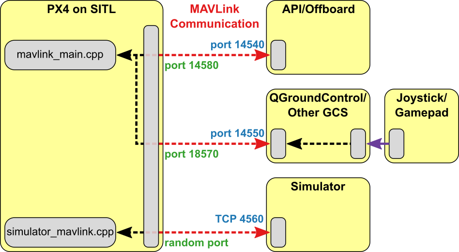

# ROS with Gazebo Classic Simulation

[ROS](../ros/index.md) (Robot Operating System) can be used with PX4 and the [Gazebo Classic](../sim_gazebo_classic/index.md) simulator.
It uses the [MAVROS](../ros/mavros_installation.md) MAVLink node to communicate with PX4.

The ROS/Gazebo Classic integration with PX4 follows the pattern in the diagram below (this shows the _generic_ [PX4 simulation environment](../simulation/index.md#sitl-simulation-environment)).
PX4 communicates with the simulator (e.g. Gazebo Classic) to receive sensor data from the simulated world and send motor and actuator values.
GCS 및 Offboard API(예: ROS)와 통신하여 시뮬레이션된 환경에서 텔레메트리 데이터를 전송하고 명령을 수신합니다.



:::info
The only _slight_ difference to "normal behaviour" is that ROS initiates the connection on port 14557, while it is more typical for an offboard API to listen for connections on UDP port 14540.
:::

## Installing ROS and Gazebo Classic

[ROS (1) with MAVROS Installation Guide](../ros/mavros_installation.md) explains how to set up a guide for working with ROS (1), MAVROS, and PX4.

:::info
_ROS_ is only supported on Linux (not macOS or Windows).
:::

## ROS 시뮬레이션 실행

The command below can be used to launch the simulation and connect ROS to it via [MAVROS](../ros/mavros_installation.md), where `fcu_url` is the IP / port of the computer running the simulation:

```sh
roslaunch mavros px4.launch fcu_url:="udp://:14540@192.168.1.36:14557"
```

localhost에 연결하려면 다음 URL을 사용하십시오.

```sh
roslaunch mavros px4.launch fcu_url:="udp://:14540@127.0.0.1:14557"
```

:::info
It can be useful to call _roslaunch_ with the `-w NUM_WORKERS` (override number of worker threads) and/or `-v` (verbose) in order to get warnings about missing dependencies in your setup. 예:

```sh
roslaunch mavros px4.launch fcu_url:="udp://:14540@127.0.0.1:14557"
```

:::

## Launching Gazebo Classic with ROS Wrappers

The Gazebo Classic simulation can be modified to integrate sensors publishing directly to ROS topics e.g. the Gazebo Classic ROS laser plugin.
To support this feature, Gazebo Classic must be launched with the appropriate ROS wrappers.

ROS로 래핑된 시뮬레이션을 실행하는 데 사용할 수 있는 ROS 시작 스크립트가 있습니다.

- [posix_sitl.launch](https://github.com/PX4/PX4-Autopilot/blob/main/launch/posix_sitl.launch): plain SITL launch
- [mavros_posix_sitl.launch](https://github.com/PX4/PX4-Autopilot/blob/main/launch/mavros_posix_sitl.launch): SITL and MAVROS

ROS에 래핑된 SITL을 실행하려면 ROS 환경을 업데이트한 다음, 평소와 같이 시작하여야 합니다.

(선택 사항): 소스에서 MAVROS 또는 다른 ROS 패키지를 컴파일한 경우에만 catkin 작업 공간을 소싱합니다.

```sh
cd <PX4-Autopilot_clone>
DONT_RUN=1 make px4_sitl_default gazebo-classic
source ~/catkin_ws/devel/setup.bash    # (optional)
source Tools/simulation/gazebo-classic/setup_gazebo.bash $(pwd) $(pwd)/build/px4_sitl_default
export ROS_PACKAGE_PATH=$ROS_PACKAGE_PATH:$(pwd)
export ROS_PACKAGE_PATH=$ROS_PACKAGE_PATH:$(pwd)/Tools/simulation/gazebo-classic/sitl_gazebo-classic
roslaunch px4 posix_sitl.launch
```

위에서 언급한 시작 파일 중 하나를 자체 시작 파일에 포함하여, 시뮬레이션에서 ROS 애플리케이션을 실행합니다.

## 움직임 뒤에서 일어나는 일

This section shows how the _roslaunch_ instructions provided previously actually work (you can follow them to manually launch the simulation and ROS).

You will need three terminals, in all of them the ros environment must be sourced.

아래 명령어를 사용하여 시뮬레이터를 시작합니다.

```sh
cd <PX4-Autopilot_clone>
export ROS_PACKAGE_PATH=$ROS_PACKAGE_PATH:$(pwd)
roslaunch px4 px4.launch
```

콘솔 화면은 다음과 같이 나타납니다:

```sh
INFO  [px4] instance: 0

______  __   __    ___
| ___ \ \ \ / /   /   |
| |_/ /  \ V /   / /| |
|  __/   /   \  / /_| |
| |     / /^\ \ \___  |
\_|     \/   \/     |_/

px4 starting.

INFO  [px4] startup script: /bin/sh etc/init.d-posix/rcS 0
INFO  [init] found model autostart file as SYS_AUTOSTART=10016
INFO  [param] selected parameter default file parameters.bson
INFO  [param] importing from 'parameters.bson'
INFO  [parameters] BSON document size 295 bytes, decoded 295 bytes (INT32:12, FLOAT:3)
INFO  [param] selected parameter backup file parameters_backup.bson
INFO  [dataman] data manager file './dataman' size is 7866640 bytes
etc/init.d-posix/rcS: 31: [: Illegal number:
INFO  [init] PX4_SIM_HOSTNAME: localhost
INFO  [simulator_mavlink] Waiting for simulator to accept connection on TCP port 4560
```

In the second terminal make sure you will be able to start gazebo with the world files defined in PX4-Autopilot. To do this set your environment variables to include the appropriate `sitl_gazebo-classic` folders.

```sh
cd <PX4-Autopilot_clone>
source Tools/simulation/gazebo-classic/setup_gazebo.bash $(pwd) $(pwd)/build/px4_sitl_default
export ROS_PACKAGE_PATH=$ROS_PACKAGE_PATH:$(pwd)/Tools/simulation/gazebo-classic/sitl_gazebo-classic
```

Now start Gazebo Classic like you would when working with ROS

```sh
roslaunch gazebo_ros empty_world.launch world_name:=$(pwd)/Tools/simulation/gazebo-classic/sitl_gazebo-classic/worlds/empty.world
```

In the third terminal make sure you will be able to spawn the model with the sdf files defined in PX4-Autopilot. To do this set your environment variables to include the appropriate `sitl_gazebo-classic` folders.

```sh
cd <PX4-Autopilot_clone>
source Tools/simulation/gazebo-classic/setup_gazebo.bash $(pwd) $(pwd)/build/px4_sitl_default
export ROS_PACKAGE_PATH=$ROS_PACKAGE_PATH:$(pwd)/Tools/simulation/gazebo-classic/sitl_gazebo-classic
```

Now insert the Iris quadcopter model like you would when working with ROS. Iris가 로드되면 자동으로 px4 앱에 연결됩니다.

```sh
rosrun gazebo_ros spawn_model -sdf -file $(pwd)/Tools/simulation/gazebo-classic/sitl_gazebo-classic/models/iris/iris.sdf -model iris -x 0 -y 0 -z 0 -R 0 -P 0 -Y 0
```
