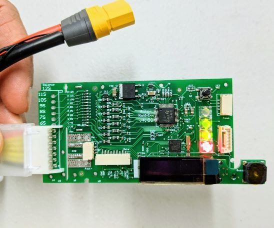

# Rotoye Batmon

[Rotoye Batmon](https://rotoye.com/batmon/) is a kit for adding smart battery functionality to off-the-shelf Lithium-Ion and LiPo batteries.
독립형 장치로 또는 공장에서 조립된 스마트 배터리의 일부로 구입할 수 있습니다.

:::info
At time of writing you can only use Batmon by [building a custom branch of PX4](#build-px4-firmware).
Support in the codeline is pending [PR approval](https://github.com/PX4/PX4-Autopilot/pull/16723).
:::




## 구매처

[Rotoye Store](https://rotoye.com/batmon/): Batmon kits, custom smart-batteries, and accessories

## Wiring/Connections

Rotoye Batmon 시스템은 I2C 핀이 있는 XT-90 배터리 커넥터와 광절연기 보드를 사용하여 데이터를 전송합니다.


More details can be found [here](https://github.com/rotoye/batmon_reader)

## 소프트웨어 설정

### PX4 펌웨어 빌드

1. Clone or download [Rotoye's fork of PX4:](https://github.com/rotoye/PX4-Autopilot/tree/batmon_4.03)
   ```sh
   git clone https://github.com/rotoye/PX4-Autopilot.git
   cd PX4-Autopilot
   ```
2. Checkout the _batmon_4.03_ branch
   ```sh
   git fetch origin batmon_4.03
   git checkout batmon_4.03
   ```
3. [Build and upload the firmware](../dev_setup/building_px4.md) for your target board

### Configure Parameters

In _QGroundControl_:

1. Set the following [parameters](../advanced_config/parameters.md):
   - `BATx_SOURCE` to `External`,
   - `SENS_EN_BAT` to `true`,
   - `BAT_SMBUS_MODEL` to `3:Rotoye`
2. Open the [MAVLink Console](https://docs.qgroundcontrol.com/master/en/qgc-user-guide/analyze_view/mavlink_console.html)
3. Start the [batt_smbus driver](../modules/modules_driver.md) in the console.
   예를 들어 동일한 버스에서 두 개의 BatMon을 실행하려면:
   ```sh
   batt_smbus start -X -b 1 -a 11 # External bus 1, address 0x0b  
   batt_smbus start -X -b 1 -a 12 # External bus 1, address 0x0c
   ```

## 추가 정보

[Quick Start Guide](https://rotoye.com/batmon-tutorial/) (Rotoye)
