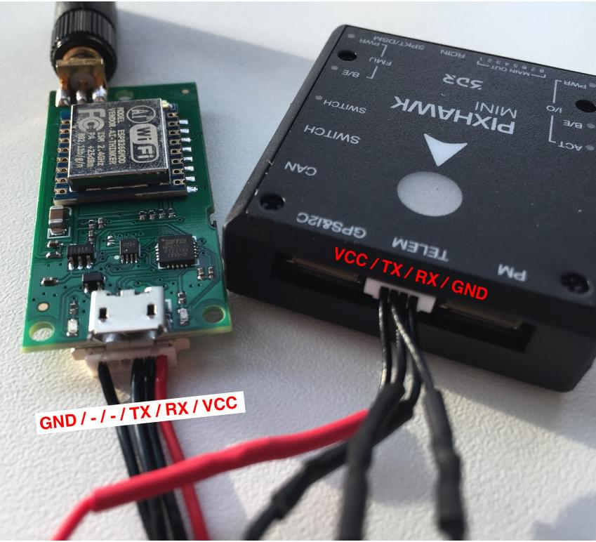

# 3DR WiFi 텔레메트리 (단종됨)

:::info
This product is no longer manufactured or available from 3DR.
:::

The _3DR WiFi Telemetry Radio_ is supported by PX4.
Simply connect it to the flight controller's `TELEM1` port to create a WiFi "hotspot" for the vehicle with the details below:

```sh
essid: APM_PIX
비밀번호: 12345678
```

지상 관제소를 위의 WiFi에 연결합니다.
After connecting the vehicle should automatically be detected and connect to _QGroundControl_.



