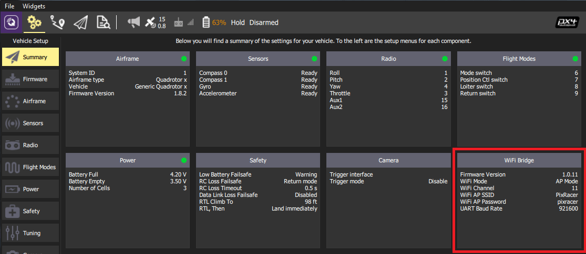

# ESP8266 WiFi 모듈

ESP8266와 유사품은 전체 TCP/IP와 마이크로 컨트롤러 기능을 제공하는 저렴한 Wi-Fi 모듈입니다.
모든 Pixhawk 시리즈 콘트롤러에서 사용 가능합니다.

:::tip
ESP8266 is the _defacto_ default WiFi module for use with [Pixracer](../flight_controller/pixracer.md) (and is usually bundled with it).
:::

## 구매처

ESP8266 모듈은 여러 곳에서 쉽게 구매할 수 있습니다.
몇 군데의 구매처는 아래에 나열되어 있습니다.

대부분의 모듈은 3.3V 입력 (전용)을 지원하지만 일부 비행 콘트롤러(예 : Pixhawk 4)는 5V에서 출력됩니다 (호환성을 확인하고 필요한 경우 전압을 낮추어야합니다).

3.3V 사용 모듈:

- [WRL-17146](https://www.sparkfun.com/products/13678) (Sparkfun)
- [AI Cloud](https://us.gearbest.com/boards-shields/pp_009604906563.html) - discontinued (GearBeast)

5.0V 사용 모듈:

- [AI Thinker](https://www.banggood.com/Wireless-Wifi-to-Uart-Telemetry-Module-With-Antenna-for-Mini-APM-Flight-Controller-p-1065339.html) (Banggood)
- [AlphaUAVLink](https://www.banggood.com/MAVLink-Wifi-Bridge-2_4G-Wireless-Wifi-Telemetry-Module-with-Antenna-for-Pixhawk-APM-Flight-Controller-p-1428590.html) (Banggood)
- [Kahuna](https://www.beyondrobotix.com/products/kahuna?utm_source=px4-esp8266-docs) (Beyond Robotix)

  A plug and play ESP8266 module.

  The Kahuna comes with a cable to connect directly to the Pixhawk-standard `TELEM1` or `TELEM2` ports.
  It is pre-flashed with the latest firmware, and has a u.fl connector for an external antenna.
  At most you may need to set the baud rate parameter, which for `TELEM1` is `SER_TEL1_BAUD = 57600 (57600 8N1)`.
  The User Guide include WiFi setup and other relevant information.

  

## Pixhawk/PX4 Setup & Configuration {#px4_config}

:::tip
You _may_ first need to update the radio with PX4-compatible ESP8266 firmware ([see below](#esp8266-flashing-firmware-advanced)).
제조 매뉴얼에 업데이트가 필요한 지 확인하십시오.
:::

무료 UART에서 ESP8266을 Pixhawk 시리즈 비행 콘트롤러(예 : Pixracer)에 연결합니다.

USB로 비행 컨트롤러를 지상국에 연결합니다 (WiFi가 아직 완전히 설정되지 않았으므로).

Using _QGroundControl_:

- [Load recent PX4 firmware onto the flight controller](../config/firmware.md).
- [Configure the serial port](../peripherals/serial_configuration.md) used to connect the ESP8266.
  ESP8266에 설정된 값과 일치하려면 전송 속도를 921600으로 설정하여야 합니다.
- [Configure MAVLink](../peripherals/mavlink_peripherals.md) on the corresponding serial port in order to receive telemetry and transmit commands over the ESP8266.

무선 연결용 비행 콘트롤러 직렬 포트를 설정후에는 지상국과 기체간의 물리적 USB 연결을 해제할 수 있습니다.

## ESP8266을 통한 QGC 연결

이 모듈은 지상국과 기체 연결용 WiFi 핫스팟을 노출합니다.

:::info
The settings for the ESP8266 hotspot should be provided with the board (e.g. typically printed on the reverse side of the board or on the packaging).

일반적인 공장 네트워크 설정은 다음과 같습니다.

- **SSID:** PixRacer
- **Password:** pixracer
- **WiFi Channel:** 11
- **UART speed:** 921600

다른 모듈은 다음과 같은 설정을 사용할 수 있습니다.

- **SSID:** IFFRC_xxxxxxxx
- **Password:** 12345678
- **IP:** 192.168.4.1
- **Port:** 6789 (TCP)

AlphaUILink 및 DOITING의 보드 예는 다음과 같습니다.

   
:::

On your wifi-enabled _QGroundControl_ ground station computer/tablet, find and connect to the open wireless network for your ESP8266.
On a Windows computer the connection settings for a network with name **Pixracer** and default password **pixracer** point will look like this:


_QGroundControl_ will automatically connect to the vehicle when the ground station computer is attached to a WiFi access point named "Pixracer".

다른 WiFi 이름을 가진 모듈을 사용하는 경우에는, 다음 섹션에 표시된대로 QGroundControl WiFi 연결을 수동으로 설정하여야 합니다.

## 비표준 WiFi 연결 QGC 설정

_QGroundControl_ will automatically connect to the vehicle when the ground station computer is attached to the "Pixracer" WiFi access point.
다른 이름의 액세스 포인트에는 사용자 지정 통신 연결을 수동으로 생성하여야 합니다.

1. Go to [Application Settings > Comm Links](https://docs.qgroundcontrol.com/master/en/qgc-user-guide/settings_view/settings_view.html)
2. 적절한 설정으로 새 연결을 추가합니다.
3. Select the new connection, and click **Connect**.
4. 이제 기체에 연결되어야 합니다.

## 확인

이제 무선 링크를 통해 QGC 컴퓨터에서 HUD 이동을 확인하고, ESP8266 WiFi 브리지에 대한 요약 패널을 볼 수 있습니다 (아래 그림 참조).



:::tip
If you have any problem connecting, see [QGC Usage Problems](https://docs.qgroundcontrol.com/master/en/qgc-user-guide/troubleshooting/qgc_usage.html).
:::

## ESP8266 플래싱/펌웨어 (고급)

다른 제조업체의 ESP8266 모듈에는 사전에 적절한 ESP8266 펌웨어가 설치되어 있지 않을 수 있습니다.
아래 지침은 적절한 버전으로 라디오를 업데이트 방법을 설명합니다.

### 사전 빌드 바이너리

[MavLink ESP8266 Firmware V 1.2.2](http://www.grubba.com/mavesp8266/firmware-1.2.2.bin)

### 소스 빌드

The [firmware repository](https://github.com/dogmaphobic/mavesp8266) contains instructions and all the tools needed for building and flashing the ESP8266 firmware.

### 펌웨어 OTA 업데이트

If you have firmware 1.0.4 or greater installed, you can do the update using the ESP's _Over The Air Update_ feature.
Just connect to its AP WiFi link and browse to: `http://192.168.4.1/update`.
위에서 다운로드한 펌웨어 파일을 WiFi 모듈에 업로드할 수 있습니다.

:::tip
This is the easiest way to update firmware!
:::

### ESP8266 펌웨어 플래싱

Before flashing, make sure you boot the ESP8266 in _Flash Mode_ as described below.
If you cloned the [MavESP8266](https://github.com/dogmaphobic/mavesp8266) repository, you can build and flash the firmware using the provided [PlatformIO](http://platformio.org) tools and environment.
If you downloaded the pre-built firmware above, download the [esptool](https://github.com/espressif/esptool) utility and use the command line below:

```sh
esptool.py --baud 921600 --port /dev/your_serial_port write_flash 0x00000 firmware_xxxxx.bin
```

여기서:

- **firmware_xxxxx.bin** is the firmware you downloaded above
- **your_serial_port** is the name of the serial port where the ESP8266 is connected to (`/dev/cu.usbmodem` for example)

### 펌웨어 플래싱을 위한 배선

:::warning
Most ESP8266 modules support 3.3 volts (only), while some flight controllers (e.g. Pixhawk 4) output at 5V.
호환성을 확인하고, 필요한 경우 전압을 낮추어야 합니다.
:::

There are various methods for setting the ESP8266 into _Flash Mode_ but not all USB/UART adapters provide all the necessary pins for automatic mode switching.
In order to boot the ESP8266 in _Flash Mode_, the GPIO-0 pin must be set low (GND) and the CH_PD pin must be set high (VCC).
설정 예은 다음과 같습니다.


RX, TX, VCC 및 GND가 FTDI 어댑터에서 ESP8266으로 연결되는 케이블을 직접 제작하였습니다.
ESP8266에서 GPIO-0 및 CH_PD에 연결된 두 개의 와이어를 여분으로 남겨 두었습니다.
각각 GND 및 VCC에 연결하여 플래시 모드로 부팅 가능합니다.

#### ESP8266 (ESP-01) 핀배열


#### FTDI USB / UART 어댑터를 사용한 플래싱 다이어그램


