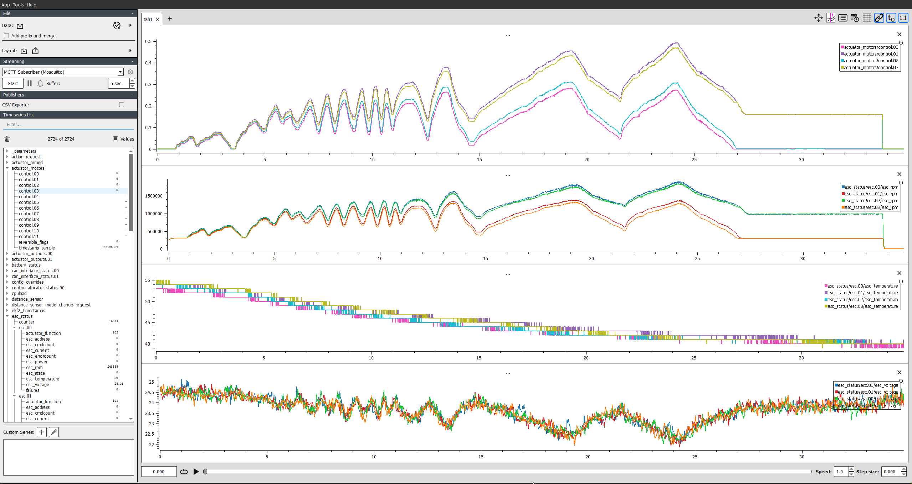

# Test MC_08 - DSHOT ESC

## Objective

Regression test for DSHOT working with PX4

## Preflight

- Ensure vehicle is using a DSHOT ESC
- Parameter [DSHOT_BIDIR_EN](../advanced_config/parameter_reference.md#DSHOT_BIDIR_EN) is enabled
- Parameter [DSHOT_TEL_CFG](../advanced_config/parameter_reference.md#DSHOT_TEL_CFG) is configured (if ESC supports telemetry)
- Parameter [SDLOG_PROFILE](../advanced_config/parameter_reference.md#SDLOG_PROFILE) has Debug (`5`) checked

## Flight Tests

❏ [Stabilized mode](../flight_modes_mc/manual_stabilized.md)

&nbsp;&nbsp;&nbsp;&nbsp;❏ Takeoff in stabilized mode to ensure correct motor spin

&nbsp;&nbsp;&nbsp;&nbsp;❏ Pitch/Roll/Yaw response 1:1

&nbsp;&nbsp;&nbsp;&nbsp;❏ Throttle response 1:1

❏ [Position mode](../flight_modes_mc/position.md)

&nbsp;&nbsp;&nbsp;&nbsp;❏ Horizontal position should hold current value with stick centered

&nbsp;&nbsp;&nbsp;&nbsp;❏ Vertical position should hold current value with stick centered

&nbsp;&nbsp;&nbsp;&nbsp;❏ Throttle response set to climb/descent rate

&nbsp;&nbsp;&nbsp;&nbsp;❏ Pitch/Roll/Yaw response set to pitch/roll/yaw rates

## 착륙

❏ Land in either Position or Altitude mode with the throttle below 40%

❏ Upon touching ground, copter should disarm automatically within 2 seconds (default: see [COM_DISARM_LAND](../advanced_config/parameter_reference.md#COM_DISARM_LAND))

## 예상 결과

- Download flight logs
- Load into Data Plot Juggler
- Ensure data is logged for `esc_status`/`esc.0x`/`esc_rpm`

  
