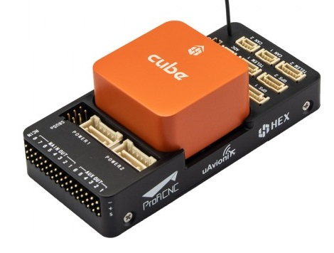

# Uçuş Kontrolcüsü Seçimi

Uçuş kontrolcüleri, insansız bir aracın "beynidir".
PX4, [birçok uçuş kontrolcü kartında](../flight_controller/index.md) çalışabilir.

Aracınızın fiziksel kısıtlamalarına, gerçekleştirmek istediğiniz faaliyetlere ve tabii ki maliyete uygun bir kart seçmelisiniz.

## Pixhawk Serisi

[Pixhawk Serisi](../flight_controller/pixhawk_series.md) açık donanım uçuş kontrolcüleri, NuttX işletim sistemi üzerinde PX4 çalıştırır.
Birçok form faktörü ile, birçok kullanım durumunu ve pazar segmentini hedefleyen versiyonları mevcuttur.

[Pixhawk Standart Otopilotlar](../flight_controller/autopilot_pixhawk_standard.md), PX4 referans platformu olarak kullanılır.
PX4 geliştirme ekibi tarafından desteklenir, test edilir ve özellikle tavsiye edilir.

## Üretici Destekli Kontrolcüler

Diğer uçuş kontrolcüleri [üretici desteklidir](../flight_controller/autopilot_manufacturer_supported.md).
Bu; Pixhawk standardına büyük ölçüde dayanan (ancak tam uyumlu olmayan) FC'leri (Uçuş Kontrolcülerini) ve daha pek çoğunu içerir.

Üretici destekli kontrolcülerin, Pixhawk standardı olanlar kadar "iyi" (veya daha iyi) olabileceğini unutmayın.

## Hesaplama Açısından Yoğun Görevler için Otopilotlar

Pixhawk gibi özel uçuş kontrolcüleri, genellikle genel amaçlı bilgi işlem veya hesaplama açısından yoğun görevleri yürütmek için uygun değildir.
Daha fazla işlem gücü için en yaygın yaklaşım, bu uygulamaları araç üzerindeki ayrı bir [Eşlikçi Bilgisayarda (Companion Computer)](../companion_computer/index.md) çalıştırmaktır.
Bazı eşlikçi bilgisayarlar, aynı otopilot kartının bir parçası olarak PX4'ü ayrı bir DSP üzerinde de çalıştırabilir.

Benzer şekilde, PX4 doğal (native) olarak Raspberry Pi üzerinde de çalışabilir (bu yaklaşım genellikle ayrı bir eşlikçi bilgisayara sahip olmak veya özel bir DSP kullanmak kadar "sağlam" kabul edilmez):

- [Raspberry Pi 2/3 Navio2](../flight_controller/raspberry_pi_navio2.md)
- [Raspberry Pi 2/3/4 PilotPi Shield](../flight_controller/raspberry_pi_pilotpi.md)

## PX4 Çalıştırabilen Ticari İHA'lar

PX4; PX4 ile birlikte gönderilenler ve PX4 ile güncellenebilenler (aracınıza görev planlama ve diğer PX4 Uçuş modlarını eklemenize olanak tanıyanlar) dahil olmak üzere birçok popüler ticari drone ürününde mevcuttur.

Daha fazla bilgi için bkz. [Tam Araçlar](../complete_vehicles/index.md).