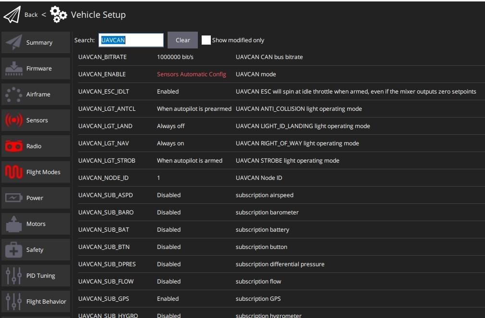

# CUAV NEO 3X GPS

<Badge type="tip" text="PX4 v1.13" />

CUAV Neo 3X is a GNSS receiver that is waterproof and dustproof.
It has IP66 protection capability and integrates UBLOX M9N module, RM3100 compass, color LED light and safety switch.

Main features :

- Professional waterproof and dustproof design.
- DroneCAN protocol support.
- Quad Satellite System Receiver (Ublox M9N).

## Technical Specification

| Hardware                  | Type                                                                              |
| :------------------------ | :-------------------------------------------------------------------------------- |
| MUC                       | STM32F412                                                                         |
| Protocol                  | DroneCAN                                                                          |
| Compass                   | RM3100                                                                            |
| Barometer                 | ICP-20100                                                                         |
| GNSS receiver             | Ublox M9N                                                                         |
| Frequency band            | GPS: L1C/A GLONASS:L10F  Beidou:B1I Galileo:E1B/C                        |
| Number of concurrent GNSS | 4                                                                                 |
| Horizontal accuracy       | 1.5m                                                                              |
| Number of satellites(MAX) | 32+                                                                               |
| Acquisition               | Cold start：24S Hot start：2S Aided start:2s                                |
| Nav. update rate          | 5Hz(default)，25Hz(MAX)                                                           |
| Sensitivity               | Tracking and nav:-167dBm Cold start Hot star:-148dBm Reacquisition: -160dBm |
| Protection level          | IP66                                                                              |
| Input voltage             | 4.7~5.2V                                                                          |
| Operating temperature     | -10~70℃                                                                           |
| Size                      | 67*67*21.2mm                                                                      |
| Weight                    | 46g (without cable）                                                              |

## Where to Buy

- [CUAV](https://www.alibaba.com/product-detail/Free-shipping-CUAV-NEO-3X-GPS_1601004167114.html?spm=a2747.manage.0.0.6aa271d2urCPnP)

## Wiring and Connections

NEO 3X connected to autopilot CAN1/CAN2 interface

## PX4 Configuration

Open **QGroundControl > Parameters** and modify the following parameters:

- `UAVCAN_ENABLE`Set to `Sensors Automatic config` .
- `UAVCAN_SUB_GPS` Set to `Enable`.

## More info

- [CUAV docs](https://doc.cuav.net/gps/neo-series-gnss/en/neo-3x.html)
