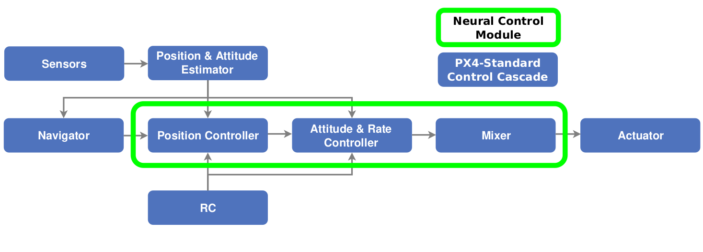
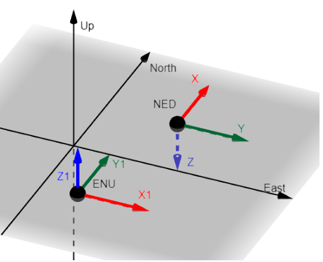

# Neural Networks

<Badge type="tip" text="main (planned for: PX4 v1.17)" /> <Badge type="warning" text="Experimental" />

:::warning
This is an experimental module.
Use at your own risk.
:::

The Multicopter Neural Network (NN) module ([mc_nn_control](../modules/modules_controller.md#mc-nn-control)) is an example module that allows you to experiment with using a pre-trained neural network on PX4.
It might be used, for example, to experiment with controllers for non-traditional drone morphologies, computer vision tasks, and so on.

The module integrates a pre-trained neural network based on the [TensorFlow Lite Micro (TFLM)](../advanced/tflm.md) module.
The module is trained for the [X500 V2](../frames_multicopter/holybro_x500v2_pixhawk6c.md) multicopter frame.
While the controller is fairly robust, and might work on other platforms, we recommend [Training your own Network](#training-your-own-network) if you use a different vehicle.
Note that after training the network you will need to update and rebuild PX4.

TLFM is a mature inference library intended for use on embedded devices.
It has support for several architectures, so there is a high likelihood that you can build it for the board you want to use.
If not, there are other possible NN frameworks, such as [Eigen](https://eigen.tuxfamily.org/index.php?title=Main_Page) and [Executorch](https://pytorch.org/executorch-overview).

This document explains how you can include the module in your PX4 build, and provides a broad overview of how it works.
The other documents in the section provide more information about the integration, allowing you to replace the NN with a version trained on different data, or even to replace the TLFM library altogether.

If you are looking for more resources to learn about the module, a website has been created with links to a youtube video and a workshop paper. A full master's thesis will be added later. [A Neural Network Mode for PX4 on Embedded Flight Controllers](https://ntnu-arl.github.io/px4-nns/).

## Neural Network PX4 Firmware

The module has been tested on a number of configurations, which can be build locally using the commands:

```sh
make px4_sitl_neural
```

```sh
make px4_fmu-v6c_neural
```

```sh
make mro_pixracerpro_neural
```

You can add the module to other board configurations by modifying their `default.px4board file` configuration to include these lines:

```sh
CONFIG_LIB_TFLM=y
CONFIG_MODULES_MC_NN_CONTROL=y
```

:::tip
The `mc_nn_control` module takes up roughly 50KB, and many of the `default.px4board file` are already close to filling all the flash on their boards. To make room for the neural control module you can remove the include statements for other modules, such as FW, rover, VTOL and UUV.
:::

## Example Module Overview

The example module replaces the entire controller structure as well as the control allocator, as shown in the diagram below:



In the [controller diagram](../flight_stack/controller_diagrams.md) you can see the [uORB message](../middleware/uorb.md) flow.
We hook into this flow by subscribing to messages at particular points, using our neural network to calculate outputs, and then publishing them into the next point in the flow.
We also need to stop the module publishing the topic to be replaced, which is covered in [Neural Network Module: System Integration](nn_module_utilities.md)

### Вхід

The input can be changed to whatever you want.
Set up the input you want to use during training and then provide the same input in PX4.
In the Neural Control module the input is an array of 15 numbers, and consists of these values in this order:

- [3] Local position error. (goal position - current position)
- [6] The first 2 rows of a 3 dimensional rotation matrix.
- [3] Linear velocity
- [3] Angular velocity

All the input values are collected from uORB topics and transformed into the correct representation in the `PopulateInputTensor()` function.
PX4 uses the NED frame representation, while the Aerial Gym Simulator, in which the NN was trained, uses the ENU representation.
Therefore two rotation matrices are created in the function and all the inputs are transformed from the NED representation to the ENU one.



ENU and NED are just rotation representations, the translational difference is only there so both can be seen in the same figure.

### Output

The output consists of 4 values, the motor forces, one for each motor.
These are transformed in the `RescaleActions()` function.
This is done because PX4 expects normalized motor commands while the Aerial Gym Simulator uses physical values.
So the output from the network needs to be normalized before they can be sent to the motors in PX4.

The commands are published to the [ActuatorMotors](../msg_docs/ActuatorMotors.md) topic.
The publishing is handled in `PublishOutput(float* command_actions)` function.

:::tip
If the neural control mode is too aggressive or unresponsive the [MC_NN_THRST_COEF](../advanced_config/parameter_reference.md#MC_NN_THRST_COEF) parameter can be tuned.
Decrease it for more thrust.
:::

## Training your own Network

The network is currently trained for the [X500 V2](../frames_multicopter/holybro_x500v2_pixhawk6c.md).
But the controller is somewhat robust, so it could work directly on other platforms, but performing system identification and training a new network is recommended.

Since the Aerial Gym Simulator is open-source you can download it and train your own networks as long as you have access to an NVIDIA GPU.
If you want to train a control network optimized for your platform you can follow the instructions in the [Aerial Gym Documentation](https://ntnu-arl.github.io/aerial_gym_simulator/9_sim2real/).

You should do one system identification flight for this and get an approximate inertia matrix for your platform.
On the `sys-id` flight you need ESC telemetry, you can read more about that in [DSHOT](../peripherals/dshot.md).

Then do the following steps:

- Do a hover flight
- Read of the logs what RPM is required for the drone to hover.
- Use the weight of each motor, length of the motor arms, total weight of the platform with battery to calculate an approximate inertia matrix for the platform.
- Insert these values into the Aerial Gym configuration and train your network.
- Convert the network as explained in [TFLM](tflm.md).
