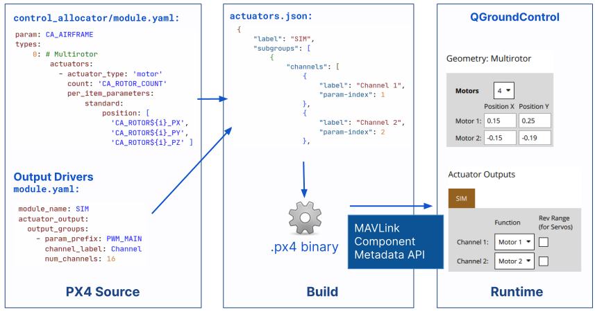

# Метадані PX4

PX4 використовує та генерує дані, які мають відповідні метадані, зрозумілі людині й машині:

- [Параметри](../advanced_config/parameters.md) налаштовують поведінку PX4.
  - Параметр представлено рядком ідентифікатора, який зіставляється зі значенням, що зберігається у PX4.
  - Відповідні метадані включають опис параметра, його можливі значення, інформацію про те, як значення може бути представлено (наприклад, для бітових масок).
- [Події](../concept/events_interface.md) повідомляють про події, такі як причини збою, попередження про низький заряд батареї, кінець калібрування і так далі.
  - Подія позначається ідентифікатором і надсилається з відповідним рівнем журналу та аргументами.
  - Пов'язані метадані включають повідомлення, опис та список аргументів (включаючи їх тип) кожної події.
- Конфігурація [приводів](../config/actuators.md) налаштовує конкретну геометрію транспортного засобу, призначає приводи та двигуни вихідними сигналами контролера польоту та перевіряє реакцію приводу та двигуна.
  - Метадані містять інформацію про підтримувані геометрії транспортних засобів, список вихідних драйверів та їх конфігурацію.
  - _QGroundControl_ використовує цю інформацію для динамічної побудови інтерфейсу конфігурації.

Метадані та переклади метаданих надаються зовнішнім системам, таким як QGroundControl, що дозволяє їм відображати інформацію про параметри та події, а також налаштовувати геометрію транспортного засобу та відображати відповідності виведення привода.

У цій темі пояснюється, як можна визначити метадані та допомогти перекладати рядки (а також "просто для інформації", як це все працює).

## Переклад метаданих

Переклад метаданих PX4 виконується за допомогою Crowdin у проєкті [PX4-Metadata-Translations](https://crowdin.com/project/px4-metadata-translations).
Для отримання додаткової інформації про роботу з PX4 та Crowdin див. [Переклад](../contribute/translation.md).

## Визначення метаданих

Метадані PX4 визначаються у вихідному коді PX4 разом з відповідними даними.
Це можна зробити або в коментарі на C/C++ зі спеціальною розміткою для вказівки полів метаданих та їх значень, або за допомогою файлів YAML.

Докладнішу інформацію див. у темах для кожного типу даних:

- [Параметри та конфігурації > Створення/визначення параметрів](../advanced/parameters_and_configurations.md#creating-defining-parameters)
- [Інтерфейс подій](. ./concept/events_interface.md)
- [Метадані приводу](#actuator-metadata) (нижче)

## Інструментарій метаданих

Процес обробки метаданих однаковий для всіх типів метаданих.

Метадані збираються у файли JSON кожного разу, коли збирається PX4.

Для більшості польотних контролерів (оскільки більшість з них мають достатньо доступного FLASH), файл JSON стискається xz-стисненням і зберігається у згенерованому бінарному файлі.
Потім файл передається ​​на наземні станції за допомогою протоколу MAVLink [Component Metadata Protocol](https://mavlink.io/en/services/component_information.html).
Використання протоколу метаданих компонентів гарантує, що одержувач завжди отримує актуальні метадані для коду, що виконується на апараті.
Метадані подій також додаються до файлів журналів, що дозволяє інструментам аналізу журналів (таким як Перегляд польотів) використовувати правильні метадані для відображення подій.

Бінарні файли для контролерів польоту з обмеженим обсягом пам'яті не зберігають метадані параметрів у бінарному файлі, а натомість посилаються на ті самі дані, що зберігаються на `px4-travis.s3.amazonaws.com`.
Це стосується, наприклад, [Omnibus F4 SD](../flight_controller/omnibus_f4_sd.md).
Метадані завантажуються через [github CI](https://github.com/PX4/PX4-Autopilot/blob/main/.github/workflows/metadata.yml) для всіх цілей збірки (таким чином, вони будуть доступні лише після того, як параметри будуть об'єднані в main).

:::info
You can identify memory constrained boards because they specify `CONFIG_BOARD_CONSTRAINED_FLASH=y` in their [px4board definition file](https://github.com/PX4/PX4-Autopilot/blob/main/boards/omnibus/f4sd/default.px4board).

Якщо ви виконуєте індивідуальну розробку на платі з обмеженою FLASH-пам'яттю, ви можете змінити URL-адресу [тут](https://github. com/PX4/PX4-Autopilot/blob/main/src/lib/component_information/CMakeLists.txt#L41), щоб вказати на інший сервер.
:::

Метадані на `px4-travis.s3.amazonaws.com` використовуються, якщо метадані параметрів відсутні на бортовому комп'ютері безпілотника.
Він також може використовуватися як запасний варіант, щоб уникнути дуже повільного завантаження через низькошвидкісне телеметричне з'єднання.

JSON-файли метаданих для CI-збірок `main` також копіюються до репозиторію github: [PX4/PX4-Metadata-Translations](https://github.com/PX4/PX4-Metadata-Translations/).
Це інтегрується з Crowdin для отримання перекладів, які зберігаються у теці [translated](https://github.com/PX4/PX4-Metadata-Translations/tree/main/translated) як xz-стиснуті файли перекладу для кожної мови.
На них посилаються метадані компонентів безпілотника, і вони завантажуються за необхідності.
Для отримання додаткової інформації див. [PX4-Metadata-Translations](https://github.com/PX4/PX4-Metadata-Translations/) та [Протокол метаданих компонентів > Переклад](https://mavlink.io/en/services/component_information.html#translation).

:::info
Файл параметрів XML з головної гілки проєкту PX4 копіюється до дерева джерел QGC за допомогою безперервної інтеграції (CI). Цей файл використовується як резервний варіант у випадках, коли метадані недоступні через протокол метаданих компонентів (цей підхід передує появі протоколу метаданих компонентів).
:::

### Метадані приводу

У наступній діаграмі показано, як метадані приводу складаються з вихідного коду та використовуються QGroundControl:

<!-- Source: https://docs.google.com/drawings/d/1hMQmIijdFjr21rREcXj50qz0C1b47JW0OEa6p5P231k/edit -->

- **Ліворуч**: метадані визначаються в файлах `module.yml` в різних модулях.
  Модулі `control_allocator` визначають геометрії, тоді як кожен вихідний драйвер визначає свій набір каналів та параметрів конфігурації.
  [Файл схеми](https://github.com/PX4/PX4-Autopilot/blob/main/validation/module_schema.yaml) документує структуру цих файлів yaml.
- **Середній**: Під час компіляції файли `module.yml` для всіх активованих модулів для поточної цілі компіляції аналізується і перетворюється у файл `actuators.json` за допомогою сценарію [Tools/module_config/generate_actuators_metadata.py](https://github.com/PX4/PX4-Autopilot/blob/main/Tools/module_config/generate_actuators_metadata.py).
  Також є [файл схеми](https://github.com/mavlink/mavlink/blob/master/component_metadata/actuators.schema.json) для цього.
- **Правильно**: Під час виконання програми файли JSON запитуються QGroundControl через API метаданих компонентів MAVLink (який описано вище).

## Подальша інформація

- [Параметри та конфігурації](../advanced/parameters_and_configurations.md)
- [Інтерфейс подій](. ./concept/events_interface.md)
- [Переклад](../contribute/translation.md)
- [Протокол метаданих компонентів](https://mavlink.io/en/services/component_information.html) (mavlink.io)
- [PX4-Metadata-Translations](https://github.com/PX4/PX4-Metadata-Translations/) (Github)
