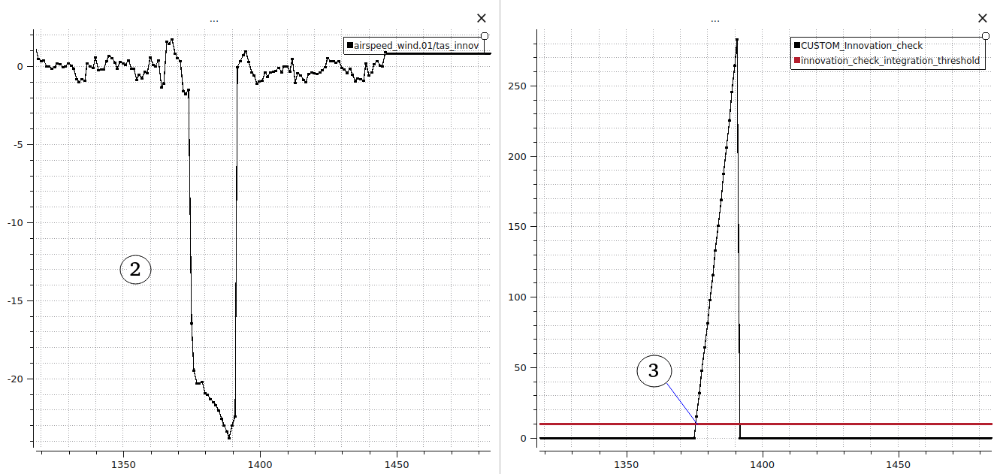

# Airspeed Validation

PX4 includes a set of airspeed validation checks that run continuously during fixed-wing flight to ensure the airspeed data is accurate and reliable.

If any check fails persistently, the system can declare airspeed as invalid.
When this happens, PX4 discards the sensor data and falls back to the option configured by [ASPD_FALLBACK](#aspd_fallback_table).

:::info
By default, the [Missing Data](#missing-data-check), [Data Stuck](#data-stuck-check), and [Innovation](#innovation-check) checks are enabled.
You can configure which checks are active using the [ASPD_DO_CHECKS](#aspd_do_checks_table) parameter.
:::

## Airspeed in PX4

PX4 handles multiple types of airspeed:

- **IAS (Indicated Airspeed):** The raw measurement from the airspeed sensor, directly influenced by sensor characteristics and installation effects (e.g., pitot-static errors).

- **CAS (Calibrated Airspeed):** IAS corrected for sensor-specific and installation-related errors.

- **EAS (Equivalent Airspeed):** _Not explicitly handled by PX4_ - Calibrated airspeed corrected for compressibility effects.
  While PX4 does not currently model EAS separately, this correction is negligible at low speeds and altitudes, so EAS is treated as equivalent to CAS for simplicity.

- **TAS (True Airspeed):** CAS adjusted for atmospheric effects such as air pressure and temperature (i.e., altitude and atmospheric conditions).

The standard conversion chain used in PX4 is: `IAS → CAS (= EAS) → TAS`.

## CAS Scale Estimation

PX4 estimates the IAS to CAS scale (referred to as the CAS scale) during flight using GNSS ground speed and wind estimation.
To compute the final TAS, standard environment conversions are applied (CAS → TAS).

This CAS scaling plays an important role in keeping the [innovation check](#innovation-check) reliable, since a well-estimated CAS is key to spotting inconsistencies between measured and predicted airspeed.
If the estimated CAS scale is inaccurate, it can mask real airspeed faults or trigger false positives.

If you observe that the CAS scale estimate is consistently off, or if it is converging too slowly, you can manually set it using [ASPD_SCALE_n](#aspd_scale_n_table) (where `n` is the sensor number).
[ASPD_SCALE_APPLY](#aspd_scale_apply_table) can be used to configure when/if the estimated scale is applied.

:::info
For a quick manual CAS scale estimate, compare groundspeed minus windspeed (from the [VehicleLocalPosition](../msg_docs/VehicleLocalPosition.md) and [Wind](../msg_docs/Wind.md) messages, respectively) to indicated airspeed values (in the [Airspeed](../msg_docs/Airspeed.md) message).
The ratio of indicated airspeed to groundspeed minus windspeed can provide a reasonable starting estimate for [ASPD_SCALE_n](#aspd_scale_n_table).
:::

## Validation Checks

These checks are primarily designed to validate incoming airspeed sensor data and detect potential sensor failures during flight.
However, they may also trigger due to configuration issues, estimator inaccuracies, or specific flight conditions that lead to physically inconsistent measurements.

The following overview summarizes each check, common failure causes, and relevant configuration parameters.

### Missing Data Check

:::info
This check is independent of the other validation checks.
It must pass for any of the other checks to run.
:::

Triggers when no new airspeed data has been received for more than 1 second.

Common failure causes:

- Faulty or disconnected sensor.

### Data Stuck Check

Triggers when the measured indicated airspeed (IAS) has not changed for more than 2 seconds.

Common failure causes:

- Airspeed sensor driver issues.
- Very low sensor resolution.

### Innovation Check

Compares the estimated true airspeed (TAS) to the predicted GNSS-based airspeed (groundspeed minus windspeed).
If the difference exceeds a threshold ([ASPD_FS_INNOV](#aspd_fs_innov_table)) for a prolonged period ([ASPD_FS_INTEG](#aspd_fs_integ_table)), the check fails.

This check helps detect cases where the measured airspeed is inconsistent with the aircraft's predicted kinematic state, often indicating sensor drift, (partial) blockage, or sub-optimal sensor placement on the vehicle.

Common failure causes:

- Faulty or blocked airspeed sensor (_sensor fault_)
- Poor sensor placement on vehicle (_configuration issue_)
- Badly estimated CAS scale (or convergence of estimate too slow) (_estimator inaccuracy_)

Relevant parameters: [ASPD_FS_INNOV](#aspd_fs_innov_table), [ASPD_FS_INTEG](#aspd_fs_integ_table)

### Load Factor Check

:::info
This check is disabled by default because it often triggers during manual landings, where the vehicle naturally slows down and may momentarily "stall" near touchdown.
Since the system cannot reliably distinguish between a real in-flight stall and this expected behaviour, false positives are common.
:::

Checks whether the measured airspeed is physically consistent with the aircraft's current load factor.
If the measured airspeed is too low to plausibly generate the required lift, the sensor reading is considered invalid.

This check helps detect cases where the airspeed sensor may be under-reading during flight.

Common failure causes:

- Faulty or blocked airspeed sensor (_sensor fault_)
- The vehicle is stalling (_flight condition_)
- Uncalibrated airspeed sensor (_configuration issue_)
- Poor sensor placement on vehicle (_configuration issue_)
- Incorrect stall speed configuration (_configuration issue_)

Relevant parameters: [FW_AIRSPD_STALL](#fw_airspd_stall_table)

### First Principle Check

Validates whether the measured indicated airspeed (IAS) behaviour matches expected aircraft response based on throttle and pitch inputs.

Specifically, when throttle is above trim by at least 5% and the aircraft is pitched downward (below [FW_PSP_OFF](#fw_psp_off_table)), the rate of change of the IAS should be consistent with the aircraft behaviour.

If the airspeed readings increase too slowly, this may indicate that the sensor is not responding correctly to dynamic pressure changes — for example, due to pitot tube icing or (partial) blockage.

Common failure causes:

- Faulty or blocked airspeed sensor (_sensor fault_)
- Pitot tube icing (_sensor fault_)
- Excessive drag (e.g. flaps down, landing gear deployed, payload) (_flight condition_)
- Throttle not producing expected thrust (_mechanical issue_)
- Incorrect trim or max throttle setting (_configuration issue_)

Relevant parameters: [ASPD_FP_T_WINDOW](#aspd_fp_t_window_table), [FW_PSP_OFF](#fw_psp_off_table), [FW_THR_TRIM](#fw_thr_trim_table), [FW_THR_MAX](#fw_thr_max_table)

## Additional Configuration

To configure the delay before PX4 starts or stops using airspeed sensor data after it passes or fails validation, use:

[ASPD_FS_T_START](#aspd_fs_t_start_table): Delay after passing validation before the sensor is considered valid.

[ASPD_FS_T_STOP](#aspd_fs_t_stop_table): Delay after failing validation before the sensor is considered invalid.

## Приклади

### Flight 1: Blocked Pitot Tube during Rainy Conditions

During a fixed-wing flight in rainy conditions, the pitot tube became blocked.
The following configuration was used:

[ASPD_DO_CHECKS](#aspd_do_checks_table) = 5 ([missing data check](#missing-data-check) and [innovation check](#innovation-check) enabled) \
[ASPD_FS_INNOV](#aspd_fs_innov_table) = 4 \
[ASPD_FS_INTEG](#aspd_fs_integ_table) = 10 \
[FW_AIRSPD_STALL](#fw_airspd_stall_table) = 12 \
[ASPD_FS_T_STOP](#aspd_fs_t_stop_table) = 2

The figure below shows the incoming airspeed data, and the moment it was flagged invalid (1):

In this scenario, the airspeed sensor was flagged as invalid by the innovation check.
The TAS scale innovation (2) exceeded the threshold specified by `ASPD_FS_INNOV`.
This exceedence is integrated until the `ASPD_FS_INTEG` threshold is reached (3).
This check triggered four seconds after the blockage occurred.
This delay consisted of:

- two seconds to accumulate enough error in the innovation integrator (per `ASPD_FS_INTEG`)
- two seconds to satisfy the `ASPD_FS_T_STOP` hold time before the failure was declared

Had the [load factor check](#load-factor-check) been enabled, the check would have been triggered immediately.
The left plot shows that at the time of failure, the vehicle was flying more or less level (load factor 1).
When the airspeed suddenly dropped, the check would have triggered (4), as the measured airspeed would not have been enough for the observed flight condition:

### Flight 2: Pitot Tube Icing

This example involves a vehicle that experienced pitot tube icing during flight.
The configuration was:

[ASPD_DO_CHECKS](#aspd_do_checks_table) = 23 ([missing data check](#missing-data-check), [innovation check](#innovation-check) and [first principle check](#first-principle-check) enabled) \
[FW_PSP_OFF](#fw_psp_off_table) = 4 (degrees) \
[FW_THR_TRIM](#fw_thr_trim_table) = 0.6 \
[ASPD_FP_T_WINDOW](#aspd_fp_t_window_table) =2 \
[ASPD_FS_T_STOP](#aspd_fs_t_stop_table) = 2

The figure below shows the incoming airspeed data, and the moment it was flagged invalid (1):

In this scenario, the airspeed sensor was flagged as invalid by the first principle check.
This check requires four consecutive seconds of invalid airspeed:

- two seconds of inconsistent behaviour (as defined by `ASPD_FP_T_WINDOW`)
- two seconds to satisfy the failure hold time (`ASPD_FS_T_STOP`)

The check triggers if the aircraft is nose-down (2), the throttle is 5% above trim (3), but the measured airspeed is not increasing (4) for at least four seconds.

We can check when the innovation check would have triggered.
The red line (5) marks the point when the airspeed was flagged as invalid by the first principle check.
The green line (6) marks the point when the innovation check would have triggered: more than a minute later.
The middle plot shows an increase in the TAS scale estimation after the failure occurred to try and compensate for the difference between the GNSS based speed and the measured airspeed.
As a result, the innovation metric stayed within limits for some time.
Only when the measured airspeed began decreasing very quickly would the innovation check have failed.

## Параметри

Listed below are all the relevant parameters.

| Параметр                                                                                                                                                                         | Опис                                                                                                                                     | Used In                                                             |
| -------------------------------------------------------------------------------------------------------------------------------------------------------------------------------- | ---------------------------------------------------------------------------------------------------------------------------------------- | ------------------------------------------------------------------- |
| [ASPD_DO_CHECKS](../advanced_config/parameter_reference.md#ASPD_DO_CHECKS)                            | Bitmask to enable/disable individual airspeed validation checks.                                                         |                                                                     |
| [ASPD_FS_INNOV](../advanced_config/parameter_reference.md#ASPD_FS_INNOV)                               | Innovation threshold between estimated and predicted TAS.                                                                | [Innovation Check](#innovation-check)                               |
| [ASPD_FS_INTEG](../advanced_config/parameter_reference.md#ASPD_FS_INTEG)                               | Threshold the integral of the innovation must exceed before triggering failure.                                          | [Innovation Check](#innovation-check)                               |
| [FW_AIRSPD_STALL](../advanced_config/parameter_reference.md#FW_AIRSPD_STALL)                         | Estimated stall speed of vehicle. If misconfigured, the load factor check may trigger.                   | [Load Factor Check](#load-factor-check)                             |
| [FW_PSP_OFF](../advanced_config/parameter_reference.md#FW_PSP_OFF)                                        | Pitch at level flight. If misconfigured, the first principle check may trigger.                          | [First Principle Check](#first-principle-check)                     |
| [FW_THR_TRIM](../advanced_config/parameter_reference.md#FW_THR_TRIM)                                     | Throttle trim value. If misconfigured, the first principle check may trigger.                            | [First Principle Check](#first-principle-check)                     |
| [FW_THR_MAX](../advanced_config/parameter_reference.md#FW_THR_MAX)                                        | Throttle limit max.                                                                                                      | [First Principle Check](#first-principle-check)                     |
| [ASPD_FP_T_WINDOW](../advanced_config/parameter_reference.md#ASPD_FP_T_WINDOW) | Time window for evaluating airspeed trend in First Principle Check.                                                      | [First Principle Check](#first-principle-check)                     |
| [ASPD_FS_T_START](../advanced_config/parameter_reference.md#ASPD_FS_T_START)    | Delay after passing validation before using sensor data. Affects how soon a recovered sensor is trusted. | All Checks                                                          |
| [ASPD_FS_T_STOP](../advanced_config/parameter_reference.md#ASPD_FS_T_STOP)       | Delay after failure before declaring data invalid. Affects how quickly faults lead to rejection.         | All Checks                                                          |
| [ASPD_FALLBACK](../advanced_config/parameter_reference.md#ASPD_FALLBACK)                                                    | Fallback mode when airspeed data is lost or invalid.                                                                     | System behavior (post-check)                     |
| [ASPD_SCALE_APPLY](../advanced_config/parameter_reference.md#ASPD_SCALE_APPLY)                      | Controls if/when to apply estimated CAS scaling. Poor scaling can cause false innovation failures.       | [Innovation Check](#innovation-check) (indirect) |
| [ASPD_SCALE_n](../advanced_config/parameter_reference.md#ASPD_SCALE_1)                                  | User-defined IAS to CAS scale override per sensor. May help when auto-scale estimation is unreliable.    | [Innovation Check](#innovation-check) (indirect) |
