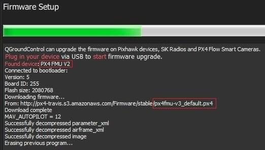

# Оновлення завантажувача

_PX4 Bootloader_ використовується для завантаження прошивки для [Pixhawk boards](../flight_controller/pixhawk_series.md) (PX4FMU, PX4IO).

Зазвичай контролери Pixhawk поставляються з попередньо встановленою відповідною версією завантажувача.
Однак у деяких випадках його може бути відсутній, або може бути присутня старіша версія, яку потрібно оновити, або плата може бути відключена і потребує стирання та перевстановлення завантажувача.

Ця тема пояснює, як побудувати завантажувач PX4 та кілька методів для його прошивки на плату.

::: info

- Більшість плат потребують використання [Debug Probe](#debug-probe-bootloader-update) для оновлення завантажувача.
- На [FMUv6X-RT](../flight_controller/pixhawk6x-rt.md) ви можете [встановлювати завантажувач/відновлювати плати через USB](bootloader_update_v6xrt.md).
  Це корисно, якщо у вас немає тесту налагодження.
- У FMUv2 та деяких нестандартних прошивках (тільки) ви можете використовувати [Оновлення завантажувача QGC](#qgc-bootloader-update).

:::

## Створення завантажувача PX4

### PX4 Bootloader FMUv6X та новіші

Плати, що починаються з FMUv6X (STM32H7), використовують вбудований завантажувач PX4.

Це можна побудувати з каталогу [PX4-Autopilot](https://github.com/PX4/PX4-Autopilot), використовуючи команду `make` та конкретну для плати ціль з суфіксом `_bootloader`.

Для FMUv6X команда наступна:

```sh
make px4_fmu-v6x_bootloader
```

Це збудує бінарний файл завантажувача як `build/px4_fmu-v6x_bootloader/px4_fmu-v6x_bootloader.elf`, який можна прошити через SWD або DFU.
Якщо ви збираєте завантажувач, вам вже повинні бути знайомі з одним із цих варіантів.

Якщо вам потрібний файл у форматі HEX замість ELF файлу, використовуйте objcopy:

```sh
arm-none-eabi-objcopy -O ihex build/px4_fmu-v6x_bootloader/px4_fmu-v6x_bootloader.elf px4_fmu-v6x_bootloader.hex
```

### PX4 Bootloader FMUv5X та раніші версії

Плата PX4 до FMUv5X (до STM32H7) використовувала репозиторій [завантажувача PX4](https://github.com/PX4/Bootloader).

Інструкції в README репозиторію пояснюють, як його використовувати.

## Оновлення завантажувача Debug Probe

Наступні кроки пояснюють, як ви можете "вручну" оновити завантажувач за допомогою сумісного [Відладного пристрою](../debug/swd_debug.md#debug-probes-for-px4-hardware):

1. Отримайте бінарний файл, який містить завантажувальник (або від команди розробників, або [зіберіть його самостійно](#building-the-px4-bootloader)).

2. Get a [Debug Probe](../debug/swd_debug.md#debug-probes-for-px4-hardware).
  Підключіть зонд до комп'ютера за допомогою USB та налаштуйте `gdbserver`.

3. Перейдіть до каталогу, що містить бінарний файл, і запустіть команду для обраного вами завантажувача в терміналі:

  - FMUv6X

    ```sh
    arm-none-eabi-gdb px4_fmu-v6x_bootloader.elf
    ```

  - FMUv6X-RT

    ```sh
    arm-none-eabi-gdb px4_fmu-v6xrt_bootloader.elf
    ```

  - FMUv5

    ```sh
    arm-none-eabi-gdb px4fmuv5_bl.elf
    ```

  H7 Завантажувачі з [PX4/PX4-Autopilot](https://github.com/PX4/PX4-Autopilot) мають назву за шаблоном `*._bootloader.elf`.
  Завантажувачі з [PX4/PX4-Bootloader](https://github.com/PX4/PX4-Bootloader) мають назву за шаблоном `*_bl.elf`.

:::

4. Термінал _gdb_ з'являється, і він повинен відображати такий вивід:

  ```sh
  GNU gdb (GNU Tools for Arm Embedded Processors 7-2017-q4-major) 8.0.50.20171128-git
  Copyright (C) 2017 Free Software Foundation, Inc.
  License GPLv3+: GNU GPL version 3 or later <http://gnu.org/licenses/gpl.html>
  This is free software: you are free to change and redistribute it.
  There is NO WARRANTY, to the extent permitted by law.
  Type "show copying"    and "show warranty" for details.
  This GDB was configured as "--host=x86_64-linux-gnu --target=arm-none-eabi".
  Type "show configuration" for configuration details.
  For bug reporting instructions, please see:
  <http://www.gnu.org/software/gdb/bugs/>.
  Find the GDB manual and other documentation resources online at:
  <http://www.gnu.org/software/gdb/documentation/>.
  For help, type "help".
  Type "apropos word" to search for commands related to "word"...
  Reading symbols from px4fmuv5_bl.elf...done.
  ```

5. Find your `<dronecode-probe-id>` by running an `ls` command in the **/dev/serial/by-id** directory.

6. Тепер підключіться до debug probe з наступною командою:

  ```sh
  tar ext /dev/serial/by-id/<dronecode-probe-id>
  ```

7. Увімкніть Pixhawk за допомогою іншого USB-кабелю та під’єднайте зонд до порту `FMU-DEBUG`.

  ::: info
  Якщо ви використовуєте зонд Dronecode, вам може знадобитися зняти футляр, щоб підключитися до порту `FMU-DEBUG` (наприклад, на Pixhawk 4 це можна зробити за допомогою викрутки T6 Torx).

:::

8. Використовуйте таку команду, щоб знайти SWD Pixhawk і підключитися до нього:

  ```sh
  (gdb) mon swdp_scan
  (gdb) attach 1
  ```

9. Завантажте двійковий файл в Pixhawk:

  ```sh
  (gdb) load
  ```

Після оновлення завантажувача ви можете [завантажити прошивку PX4](../config/firmware.md) за допомогою _QGroundControl_.

## Оновлення завантажувача QGC

Найпростіший підхід - спочатку використовуйте _QGroundControl_, щоб встановити прошивку, яка містить потрібний/останній завантажувач.
Ви можете ініціювати оновлення завантажувача при наступному перезавантаженні, встановивши параметр: [SYS_BL_UPDATE](../advanced_config/parameter_reference.md#SYS_BL_UPDATE).

Такий підхід можна використовувати лише у випадку, якщо параметр [SYS_BL_UPDATE](../advanced_config/parameter_reference.md#SYS_BL_UPDATE) присутній у прошивці.

:::warning
Наразі бажаний завантажувач міститься лише в FMUv2 та деяких спеціальних програмних вибірках.
:::

Кроки наступні:

1. Вставте SD-карту (це дозволяє реєструвати журнали завантаження для відлагодження будь-яких проблем).

2. [Оновіть прошивку](../config/firmware.md#custom) з образом, що містить новий/потрібний завантажувач.

  ::: info
  Оновлений завантажувач може бути постачений у власній прошивці (наприклад, від команди розробників), або він може бути включений у останню головну гілку.

:::

3. Зачекайте, доки транспортний засіб перезавантажиться.

4. [Знайдіть](../advanced_config/parameters.md) та увімкніть параметр [SYS_BL_UPDATE](../advanced_config/parameter_reference.md#SYS_BL_UPDATE).

5. Перезавантажте (відключіть / підключіть плату).
  Оновлення завантажувача займе лише кілька секунд.

Зазвичай на цьому етапі ви можливо захочете [оновити прошивку](../config/firmware.md) ще раз, використовуючи правильно/ново встановлений загрузчик.

Наведений нижче конкретний приклад цього процесу оновлення загрузчика FMUv2.

### Оновлення завантажувача FMUv2

Якщо _QGroundControl_ встановлює ціль FMUv2 (див. консоль під час встановлення), і у вас є новіша плата, вам може знадобитися оновити завантажувальник, щоб мати доступ до всієї пам'яті на вашому контролері польоту.

:::info
Ранні контролери польоту FMUv2 [Pixhawk-series](../flight_controller/pixhawk_series.md#fmu_versions) мали [апаратну проблему](../flight_controller/silicon_errata.md#fmuv2-pixhawk-silicon-errata), яка обмежувала їх використання 1 Мб флеш-пам’яті.
Проблема виправлена на новіших платах, але вам може знадобитися оновити заводський завантажувальник, щоб встановити прошивку FMUv3 та мати доступ до всієї доступної пам'яті у 2 МБ.
:::

Щоб оновити завантажувач:

1. Вставте SD-карту (це дозволяє реєструвати журнали завантаження для відлагодження будь-яких проблем).

2. [Оновіть програмне забезпечення](../config/firmware.md) до версії PX4 _master_ (під час оновлення програмного забезпечення перевірте **Розширені налаштування** і виберіть **Розробницьку збірку (master)** із випадаючого списку).
  _QGroundControl_ автоматично виявить, що апаратне забезпечення підтримує FMUv2 і встановить відповідне програмне забезпечення.

  

  Зачекайте, доки транспортний засіб перезавантажиться.

3. [Знайдіть](../advanced_config/parameters.md) та увімкніть параметр [SYS_BL_UPDATE](../advanced_config/parameter_reference.md#SYS_BL_UPDATE).

4. Перезавантажте (відключіть / підключіть плату).
  Оновлення завантажувача займе лише кілька секунд.

5. Тоді знову [Оновити програмне забезпечення](../config/firmware.md).
  На цей раз _QGroundControl_ повинен автоматично визначити обладнання як FMUv3 і відповідним чином оновити програмне забезпечення.

  

  ::: info
  Якщо апаратне забезпечення має [Помилки в кремнієвій мікросхемі](../flight_controller/silicon_errata.md#fmuv2-pixhawk-silicon-errata), воно все одно буде виявлене як FMUv2, і ви побачите, що FMUv2 було знову встановлено (у консолі).
  У цьому випадку ви не зможете встановити апаратне забезпечення FMUv3.

:::

## Інші плати (не Pixhawk)

Плати, які не є частиною серії [Pixhawk](../flight_controller/pixhawk_series.md), матимуть власні механізми оновлення завантажувача.

Для плат, які передвстановлені за допомогою Betaflight, дивіться [Flash пусковика на системи Betaflight](bootloader_update_from_betaflight.md).
