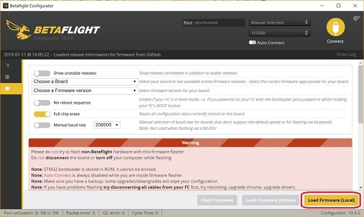

# Завантаження завантажувача PX4 на системи Betaflight

Ця сторінка документує, як прошивати завантажувач PX4 на плати, які вже мають прошивку Betaflight (наприклад, [OmnibusF4 SD](../flight_controller/omnibus_f4_sd.md) або [Kakute F7](../flight_controller/kakutef7.md)).

Є три інструменти, які можна використовувати для прошивки завантажувача PX4: _Конфігуратор Betaflight_, [командний рядок dfu-util](http://dfu-util.sourceforge.net/) або графічний інструмент [dfuse](https://www.st.com/en/development-tools/stsw-stm32080.html) (тільки для Windows).

:::info
_Конфігуратор Betaflight_ є найпростішим використанням, але більш нові версії можуть не підтримувати оновлення завантажувача, який не є частиною Betaflight.
Ви можете спробувати це спочатку, але скористайтеся іншими методами, якщо оновлення мікропрограми не працює.
:::

## Оновлення завантажувача в конфігураторі Betaflight

:::info
_Betaflight Configurator_ may not support PX4 Bootloader update, as of May 2023.
Давні версії повинні працювати, хоча точні версії не відомі.
:::

Для встановлення завантажувача PX4 за допомогою _Конфігуратора Betaflight_:

1. Download or build [bootloader firmware](#bootloader-firmware) for the board you want to flash.

2. Завантажте або зіберіть [прошивку завантажувача](#bootloader-firmware) для плати, яку ви хочете прошивати.

   Якщо ви користуєтеся веб-браузером _Chrome_, простий крос-платформений альтернативний варіант - встановити конфігуратор як [розширення звідси](https://chrome.google.com/webstore/detail/betaflight-configurator/kdaghagfopacdngbohiknlhcocjccjao).

:::

3. Підключіть плату до комп'ютера і запустіть конфігуратор.

4. Натисніть кнопку **Завантажити прошивку [Локально]**.
   

5. Виберіть бінарний файл завантажувача з файлової системи, а потім прошейте плату.

Тепер ви повинні змогти встановити прошивку PX4 на плату.

## Оновлення завантажувача через DFU

Цей розділ пояснює, як перепрошити завантажувач PX4 за допомогою інструменту [dfu-util](http://dfu-util.sourceforge.net/) або графічного інструменту [dfuse](https://www.st.com/en/development-tools/stsw-stm32080.html) (тільки для Windows).

Спершу вам потрібно завантажити або зібрати [прошивку завантажувача](#bootloader-firmware) для плати, яку ви хочете прошивати (нижче це зазначено як `<target.bin>`).

:::info
All of the methods below are safe as the STM32 MCU cannot be bricked!
DFU не може бути перезаписано при прошивці і завжди дозволяє встановити нову прошивку, навіть якщо процес прошивки завершиться невдало.
:::

### Режим DFU

Обидва інструменти вимагають, щоб плата перебувала в режимі DFU.
Щоб увійти в режим DFU, утримуйте кнопку завантаження (boot button) натиснутою під час підключення USB-кабеля до вашого комп'ютера.
Кнопку можна відпустити після того, як плата буде ввімкнена.

### dfu-util

:::info
The [Holybro Kakute H7 v2](../flight_controller/kakuteh7v2.md), [Holybro Kakute H7](../flight_controller/kakuteh7.md) and [mini](../flight_controller/kakuteh7mini.md) flight controllers may require that you first run an additional command to erase flash parameters (in order to fix problems with parameter saving):

```
dfu-util -a 0 --dfuse-address 0x08000000:force:mass-erase:leave -D build/<target>/<target>.bin
```

Ця команда може викликати помилку, яку можна ігнорувати.
Після завершення введіть режим DFU ще раз, щоб завершити звичайне оновлення.
:::

Для прошивки загрузчика на контролер польоту:

```
dfu-util -a 0 --dfuse-address 0x08000000 -D  build/<target>/<target>.bin
```

Перезавантажте контролер польоту і дайте йому завантажитися без утримування кнопки завантаження.

### dfuse

Керівництво dfuse можна знайти тут: https://www.st.com/resource/en/user_manual/cd00155676.pdf

Використовуйте інструмент для прошивки `<target>.bin` файлу.

## Прошивка завантажувача

Інструменти вище прошивають вбудоване програмне забезпечення завантажувача.
Прошивка завантажувача може бути побудована для більшості цілей за допомогою звичайного вихідного коду PX4, тоді як для інших цілей можна використовувати вихідний код з репозиторію завантажувача.

Плати управління політами, які мають цільові PX4-Autopilot `make` для завантажувача, можуть збудувати завантажувач із вихідного коду PX4-Autopilot.
Список контролерів, яких це стосується, можна отримати, виконавши наступну команду `make` і зазначивши цілі `make`, які закінчуються на `_bootloader`

```
$make list_config_targets

...
cuav_nora_bootloader
cuav_x7pro_bootloader
cubepilot_cubeorange_bootloader
holybro_durandal-v1_bootloader
holybro_kakuteh7_bootloader
holybro_kakuteh7v2_bootloader
holybro_kakuteh7mini_bootloader
matek_h743-mini_bootloader
matek_h743-slim_bootloader
modalai_fc-v2_bootloader
mro_ctrl-zero-classic_bootloader
mro_ctrl-zero-h7_bootloader
mro_ctrl-zero-h7-oem_bootloader
mro_pixracerpro_bootloader
px4_fmu-v6u_bootloader
px4_fmu-v6x_bootloader
```

Щоб створити для цих контролерів польоту, завантажте та створіть [джерело PX4-Autopilot](https://github.com/PX4/PX4-Autopilot), а потім створіть ціль за допомогою таких команд:

```sh
git clone --recursive https://github.com/PX4/PX4-Autopilot.git
cd PX4-Autopilot
make <target> # For example: holybro_kakuteh7mini_bootloader
```

Для інших контролерів польоту завантажте репозиторій [PX4/Bootloader](https://github.com/PX4/Bootloader) і створіть вихідний код, використовуючи відповідні цілі:

```
git clone --recursive  https://github.com/PX4/Bootloader.git
cd Bootloader
make <target> # For example: omnibusf4sd_bl or kakutef7_bl
```

## Перевстановіть Betaflight

Для переключення назад на Betaflight:

1. Резервне копіювання параметрів PX4.
   Ви можете зробити це, [експортуючи](../advanced/parameters_and_configurations.md#exporting-and-loading-parameters) їх на SD-карту.
2. Натисніть і утримуйте кнопку **завантажувача**, підключивши USB-кабель
3. Flash _Betaflight_ as usual with the _Betaflight-configurator_
