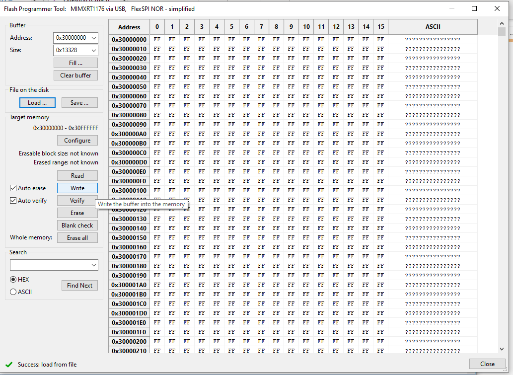

# Оновлення завантажувача Pixhawk V6X-RT через USB

У цій темі пояснюється флеш-завантажувач [Pixhawk FMUv6X-RT](../flight_controller/pixhawk6x-rt.md) через USB _без необхідності перевірки налагодження_.

## Загальний огляд

_PX4 Bootloader_ використовується для завантаження прошивки для [Pixhawk boards](../flight_controller/pixhawk_series.md) (PX4FMU, PX4IO).

Зазвичай контролери Pixhawk поставляються з попередньо встановленою відповідною версією завантажувача.
Однак у деяких випадках він може бути відсутнім або може бути присутня старіша версія, яку потрібно оновити.
Також можливо, що пристрій заблоковано, тому пристрій потрібно стерти та встановити новий завантажувач.

Більшість контролерів польоту вимагають використання зонду для відлагодження для оновлення завантажувальної програми, як обговорено в [Оновлення завантажувальної програми > Оновлення завантажувальної програми за допомогою Debug Probe](../advanced_config/bootloader_update.md#debug-probe-bootloader-update).
Ви можете використовувати цей підхід для Pixhawk FMUv6X-RT, але якщо у вас немає зонда для налагодження, ви можете скористатися інструкціями, викладеними в цьому розділі.

## Створення завантажувача PX4 FMUv6X-RT

Це можна створити з папки PX4-Autopilot за допомогою команди `make` і спеціальної цілі плати з суфіксом `_bootloader`.
Для FMUv6X команда наступна:

```sh
make px4_fmu-v6xrt_bootloader
```

Це створить двійковий файл завантажувача як `build/px4_fmu-v6xrt_bootloader/px4_fmu-v6xrt_bootloader.bin`, який можна завантажувати через SWD або ISP.
Якщо ви збираєте завантажувач, вам вже повинні бути знайомі з одним із цих варіантів.

Якщо вам потрібний файл у форматі HEX замість ELF файлу, використовуйте objcopy:

```sh
arm-none-eabi-objcopy -O ihex build/px4_fmu-v6xrt_bootloader/px4_fmu-v6xrt_bootloader.elf px4_fmu-v6xrt_bootloader.hex
```

## Прошивання завантажувальної програми через USB.

Pixhawk V6X-RT постачається з вбудованим завантажувачем, розміщеним у ПЗУ.
Щоб прошити новий завантажувач через USB, потрібно завантажити [NXP MCUXpresso Secure Provisioning](https://www.nxp.com/design/design-center/software/development-software/mcuxpresso-software-and- tools-/mcuxpresso-secure-provisioning-tool:MCUXPRESSO-SECURE-PROVIZIONING).
Інструмент доступний для Windows, Linux і macOS.

1. Встановіть програму _MCUXpresso Secure Provisioning_ і запустіть додаток:

   

2. Спочатку потрібно створити «Новий Workspace».
   Виберіть `i.mX RT11xx` і потім оберіть `MIMXRT1176`

   

3. Після створення «Нового робочого простору» натисніть кнопку **FlexSPI NOR - спрощений**

   

4. У вікні _Конфігурація пам'яті завантажувальної програми_ змініть "Тип пристрою" на `Macronix Octal DDR` і натисніть **ОК**.


1. На панелі меню виберіть **Інструменти > Програматор Flash**:

   

2. Ви повинні отримати спливаюче вікно, що показує, що Pixhawk V6X-RT не знаходиться в режимі "завантажувальної програми ISP".

   

   Щоб перевести Pixhawk V6X-RT у режим "завантажувальної програми ISP", є два варіанти:

   1. Запустіть QGC, підключіть Pixhawk, виберіть **Аналітичні інструменти**, а потім **Консоль MAVLINK**.
      На тип консолі `reboot -i`.
      Це переведе Pixhawk V6X-RT у режим "завантажувальної програми ISP".

      

   2. Якщо плата "заблокована" (заблокована завантажувальна програма) і підключення до QGC неможливе, відкрийте модуль FMUM і натисніть кнопку BOOT (помічена червоним кружечком на зображенні нижче), утримуючи її натиснутою під час включення живлення до плати.

      

      Натисніть **ТАК** для запуску інструменту _Flash програми_.

3. Коли починається програмування флеш-пам'яті, ви отримаєте спливаюче вікно для налаштування цільової пам'яті. Натисніть **Так**.

   

4. Коли конфігурація цільової пам'яті успішна, ви можете натиснути кнопку **Стерти все**

   

5. Після очищення флеш-пам'яті натисніть кнопку **Завантажити ...**, а потім натисніть кнопку **Огляд**.

   

6. Знайдіть файл `px4_fmu-v6xrt_bootloader.bin` і натисніть **Відкрити**, а потім натисніть **Завантажити**.

   

7. Якщо завантаження пройшло успішно, ви повинні побачити «Успіх: завантажити з файлу» внизу праворуч

   

8. Натисніть кнопку **Запис**, щоб прошити завантажувальну програму PX4.



1. У випадку успішного виконання воно повинно відображати "Success: Запис пам'яті 0x30000000 - 0x3XXXXXXX". Зауваження: значення можуть відрізнятися через зміни завантажувальної програми.

   

Тепер від'єднайте Pixhawk V6X-RT і знову ввімкніть плату.
Після оновлення завантажувача ви можете [завантажити прошивку PX4](../config/firmware.md) за допомогою _QGroundControl_.
