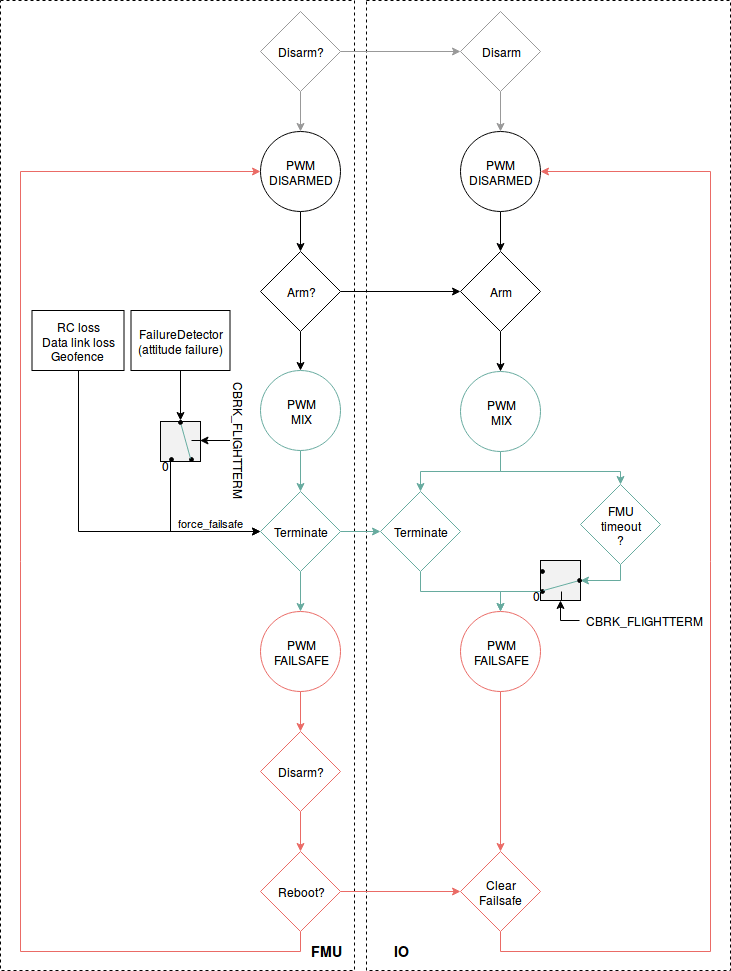

# Конфігурація завершення польоту

Дія _аварійного зупинення польоту_ може бути викликана [автономною захисною дією](../config/safety.md#failsafe-actions) (наприклад, втрата зв'язку з радіокеруванням, порушення геозони тощо на будь-якому типі транспортного засобу або у будь-якому режимі польоту), або [виявником відмов](../config/safety.md#failure-detector).

:::info
Flight termination may also be triggered from a ground station or companion computer using the MAVLink [MAV_CMD_DO_FLIGHTTERMINATION](https://mavlink.io/en/messages/common.html#MAV_CMD_DO_FLIGHTTERMINATION) command.
This is sent, for example, when you call the [MAVSDK Action plugin](https://mavsdk.mavlink.io/main/en/cpp/api_reference/classmavsdk_1_1_action.html#classmavsdk_1_1_action_1a47536c4a4bc8367ccd30a92eb09781c5) `terminate()` or `terminate_async()` methods.
:::

Коли активується _аварійне припинення польоту_, PX4 одночасно вимикає всі контролери та встановлює всі виходи PWM у значення аварійного режиму.

Залежно від підключених пристроїв, вихідні значення аварійного режиму PWM можуть бути використані для:

- Розгорніть [парашут](../peripherals/parachute.md).
- Витягнути втягуючі стійки шасі.
- Перемістіть гімбал, підключений до PWM, в безпечне положення (або втягніть його), щоб захистити камеру.
- Запустіть надувний пристрій, наприклад подушку безпеки.
- Запустити тривогу.

Немає можливості відновлення після аварійного припинення польоту.
Після виклику аварійного припинення польоту вам слід якнайшвидше відключити батарею.
Перед тим, як знову використовувати транспортний засіб, вам доведеться перезавантажити/вимкнути живлення.

:::tip
PX4 не знає, які пристрої безпеки приєднані - він просто застосовує заздалегідь визначений набір значень ШІМ до своїх виходів.
:::

:::tip
Failsafe values are applied to all outputs on termination.
Немає способу налаштувати незалежне тригерування моторів або конкретних пристроїв безпеки на основі часу (або іншого критерію).
:::

:::info
This is _not_ an independent _Flight Termination System_.
Якщо втрачається живлення або автопілот повністю відмовляє, аварійні пристрої не будуть активовані.
:::

## Конфігурація апаратного забезпечення

Будь-який _пристрій безпеки_ (наприклад, [парашут](../peripherals/parachute.md)), який може бути активований зміною значення PWM, може бути використаний та підключений до будь-якого вільного порту PWM (як MAIN, так і AUX).

:::info
Якщо ви використовуєте плату серії Pixhawk, вам доведеться окремо живити рейку сервопривода (наприклад, з 5V BEC, який часто також доступний з вашого регулятора обертів).
:::

## Конфігурація програмного забезпечення

Тема [Безпека](../config/safety.md) пояснює, як встановити _аварійне припинення польоту_ як [дію в разі аварії](../config/safety.md#failsafe-actions), що має бути виконана для певної перевірки аварійного стану.

[Виявник відмов](../config/safety.md#failure-detector) також (опційно) може бути налаштований на активацію аварійного припинення польоту, якщо транспортний засіб перекидається (перевищує певний кут нахилу) або якщо виявлена відмова зовнішньою автоматичною системою спрацьовування (ATS):

- Увімкніть виявник відмов під час польоту, встановивши [CBRK_FLIGHTTERM=0](../advanced_config/parameter_reference.md#CBRK_FLIGHTTERM).
- [Safety > Failure Detector > Attitude Trigger](../config/safety.md#attitude-trigger) explains how to configure the attitude limits that trigger _Flight termination_.
  ::: info
  During _takeoff_ excessive attitutes will trigger _lockdown_ (kill motors, but not launch parachute) rather than flight termination.
  This is always enabled, irrespective of the value of `CBRK_FLIGHTTERM`.

:::
- [Safety > External Automatic Trigger System (ATS)](../config/safety.md#external-automatic-trigger-system-ats) explains how to configure an external trigger system.

Для кожного основного виходу, до якого підключений пристрій безпеки, де "n" - номер порту PWM, встановіть:

- [Безпека > Зовнішня автоматична система спрацьовування (ATS)](../config/safety.md#external-automatic-trigger-system-ats) пояснює, як налаштувати зовнішню систему спрацьовування.
- [PWM_MAIN_FAILn](../advanced_config/parameter_reference.md#PWM_MAIN_FAIL1) to the device's "ON" PWM value.

Для кожного основного виходу, до якого підключений пристрій безпеки, де "n" - номер порту PWM, встановіть:

- [PWM_MAIN_DISn](../advanced_config/parameter_reference.md#PWM_MAIN_DIS1) до значення "OFF" PWM пристрою.
- [PWM_MAIN_FAILn](../advanced_config/parameter_reference.md#PWM_MAIN_FAIL1) до значення PWM пристрою "ON".

Для кожного AUX виходу, до якого підключений пристрій безпеки, де "n" - номер порту PWM, встановіть:

## Схема логіки

Нарешті, встановіть значення PWM для портів `PWM_AUX_FAILn` та `PWM_MAIN_FAILn` для будь-яких двигунів.

