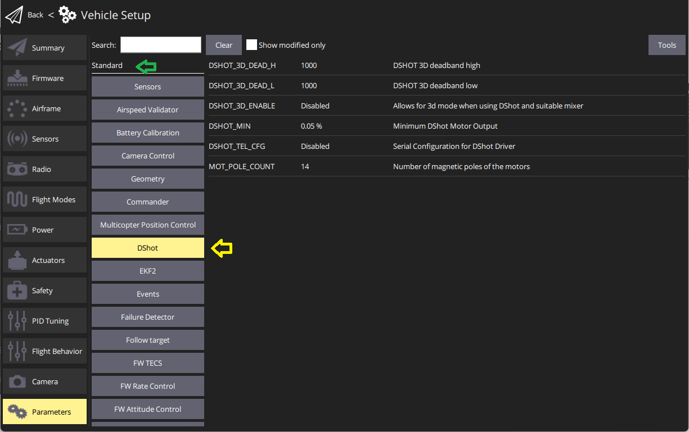
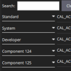
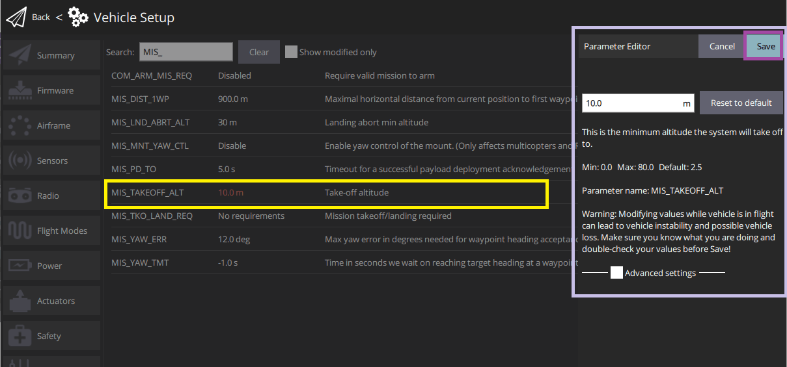
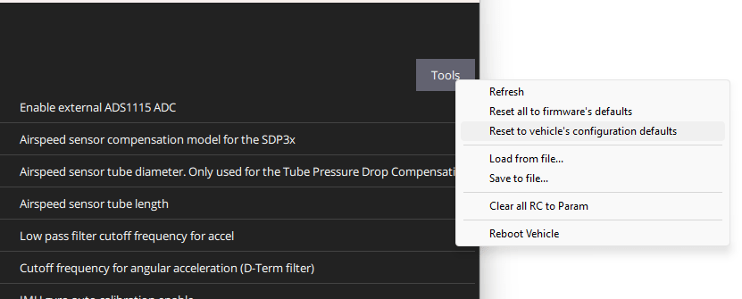

# Finding/Updating Parameters

Поведінку PX4 можна налаштувати/настроїти за допомогою [параметрів](../advanced_config/parameter_reference.md) (наприклад, [Коефіцієнти PID для багатокоптерів](../config_mc/pid_tuning_guide_multicopter.md), інформація про калібрування і т. д.).

The _QGroundControl Parameters_ screen allows you to find and modify **any** of the parameters associated with the vehicle.
Доступ до цього екрану здійснюється за допомогою натискання значка застосунка **Q** > **Налаштування транспортного засобу**, а потім _Параметри_ у бічному меню.

:::info
Більшість з найбільш поширених параметрів зручніше налаштовувати за допомогою відповідних екранів налаштувань, як описано в розділі [Стандартна конфігурація](../config/index.md).
Екран _Параметри_ необхідний при модифікації менш часто змінюваних параметрів, наприклад, під час налаштування нового транспортного засобу.
:::

:::warning
Хоча деякі параметри можна змінювати в польоті, це не рекомендується (за винятком випадків, якщо це явно зазначено в керівництві).
:::

## Пошук параметра

Ви можете шукати параметр, введенням терміну в поле _Пошук_.
Це покаже вам список всіх назв параметрів і описів, що містять введену підстроку (натисніть **Очистити**, щоб скинути пошук, і використовуйте прапорець **Показувати лише змінені**, щоб відфільтрувати незмінені параметри).

Ви також можете переглядати параметри за типом і групою, натиснувши кнопки зліва (на зображенні нижче вибрана група _DShot_ в _стандартних_ параметрах).

Ви можете розгортати / згортати групи "типу", як показано.
Note that the groups at the bottom named _Component X_ are attached [DroneCAN peripherals](../dronecan/index.md#qgc-cannode-parameter-configuration) ("X" is the node id).
[QGC може встановлювати параметри](../dronecan/README.md#qgc-cannode-parameter-configuration) цих периферійних пристроїв, якщо вони підключені до контролера польоту при запуску QGC.

:::tip
Якщо ви не можете знайти очікуваний параметр, див. [наступний розділ](#missing).
:::

## Відсутні Параметри

Зазвичай параметри не відображаються через те, що вони умовні на інші параметри, або вони відсутні в прошивці (див. нижче).

### Умовні параметри

Параметр може не відображатися, якщо він залежить від іншого параметра, який не ввімкнено.

Зазвичай можна дізнатися, які параметри залежать від інших, шляхом пошуку [повного списку параметрів](../advanced_config/parameter_reference.md) та іншої документації.
Зокрема параметри [конфігурації послідовного порта](../peripherals/serial_configuration.md) залежать від того, яка служба призначена для послідовного порта.

### Параметр не в прошивці

Параметр може відсутній у прошивці через використання іншої версії PX4 або через використання збірки, в якій відповідний модуль не включено.

Нові параметри додаються у кожній версії PX4, а існуючі параметри іноді видаляються або перейменовуються.
Ви можете перевірити, чи має бути _присутній_ параметр, переглянувши [повний посібник з параметрами](../advanced_config/parameter_reference.md) для версії, яку ви використовуєте.
Також ви можете шукати параметр у дереві вихідних кодів та в релізних примітках.

Інший причиною відсутності параметра у прошивці може бути те, що його пов'язаний модуль не був включений.
Це особливо стосується прошивки _FMUv2_, яка пропускає багато модулів, щоб PX4 помістився в 1 МБ доступної флеш-пам'яті.
Є два способи вирішення цієї проблеми:

- Перевірте, чи можете ви оновити плату для виконання прошивки FMUv3, яка включає всі модулі: [Прошивка > Оновлення завантажувальника FMUv2](../config/firmware.md#bootloader)
- Якщо ваша плата може працювати тільки з прошивкою FMUv2, вам потрібно [перебудувати PX4](../dev_setup/building_px4.md) з увімкненими відсутніми модулями.
  Вам потрібно змінити конфігурацію самої прошивки PX4 через make px4_fmuv2_default boardconfig, де ви можете увімкнути/вимкнути модулі.

  ::: info
  You may also need to disable other modules in order to fit the rebuilt firmware into 1MB flash.
  Визначення модулів для видалення вимагає деяких спроб та помилок і залежить від того, які вимоги до використання потрібні вашому повітряному засобу.

:::

## Зміна параметрів

Для зміни значення параметра клацніть на рядку параметра у групі або списку пошуку.
Це відкриє бічний діалог, в якому ви можете оновити значення (цей діалог також надає додаткову детальну інформацію про параметр - включаючи те, чи потрібно перезавантаження для введення змін).

:::info
Після натискання кнопки **Зберегти** параметр автоматично й беззвучно завантажується на підключене повітряне судно.
Залежно від параметра, можливо, вам потрібно буде перезавантажити керуючий пристрій для введення змін.
:::

## Інструменти

Ви можете вибрати додаткові опції у меню **Інструменти** у верхньому правому куті екрану.

**Оновити**  Оновити значення параметрів, повторно запросивши їх усі від транспортного засобу.

**Скинути все на заводські налаштування прошивки**  Скидання всіх параметрів до їхніх початкових значень за замовчуванням в прошивці.

**Скинути на налаштування за замовчуванням транспортного засобу**  Скидання всіх параметрів до їхніх початкових значень за замовчуванням для вибраної конфігурації транспортного засобу.

**Завантажити з файлу / Зберегти до файлу**  Завантажте параметри з існуючого файлу або збережіть поточні налаштування параметрів у файл.

**Очистити всі RC до Param**  Це очищає всі асоціації між керуванням радіо передавача та параметрами.
Для отримання додаткової інформації див.: [Налаштування радіо > Канали налаштування параметрів](../config/radio.md#param-tuning-channels).

**Перезавантажити Транспортний Засіб**  Перезавантажити транспортний засіб (необхідно після зміни деяких параметрів).
