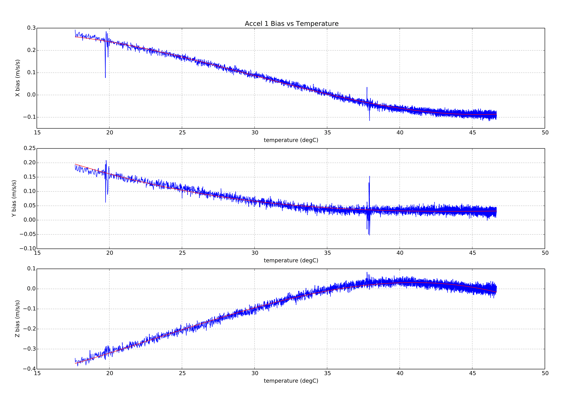
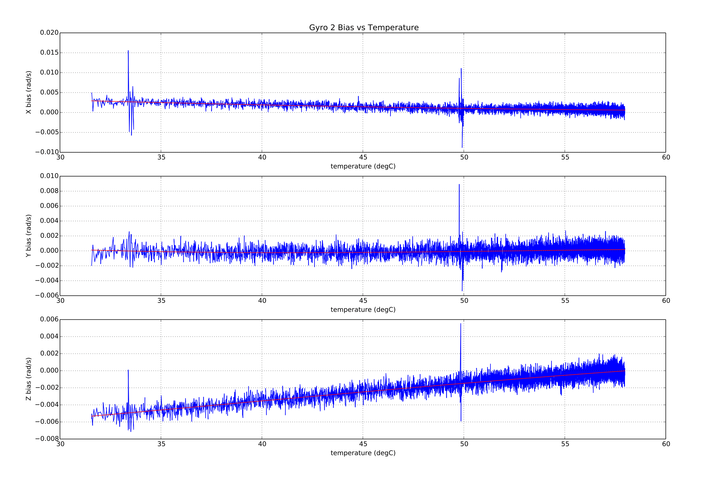
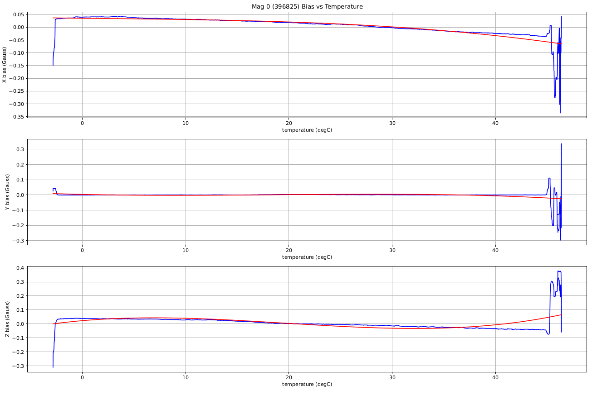
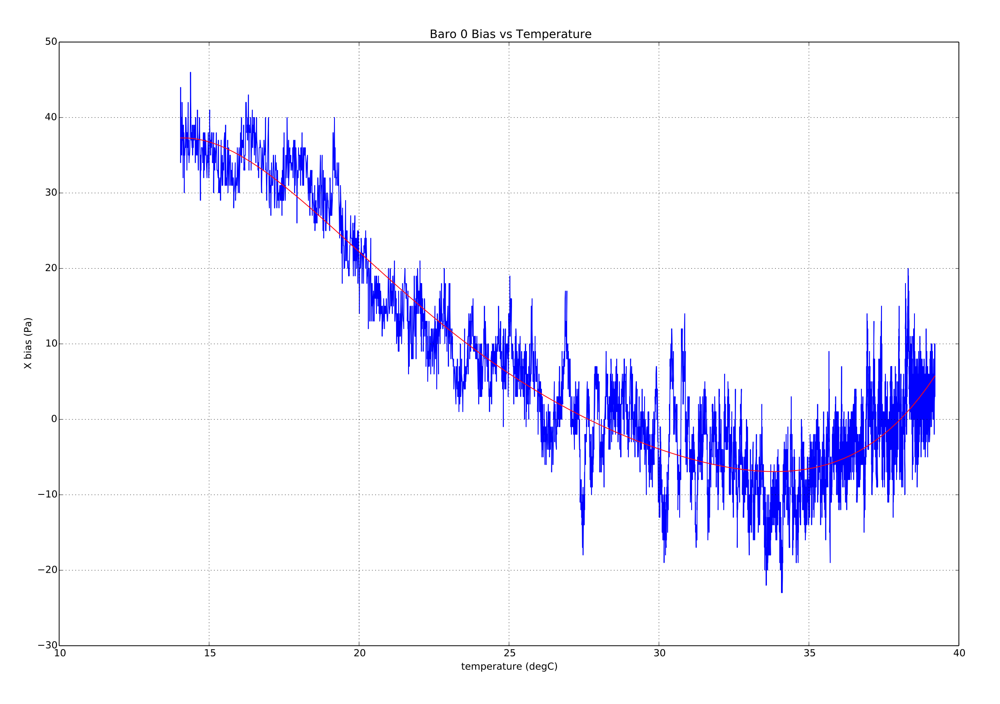

# Термальне калібрування та компенсація

PX4 містить функцію калібрування та компенсації акселерометра, гіроскопа, магнітометра та датчиків барометричного тиску для впливу зміни температури датчика на зміщення датчика.

Ця тема розглядає [середовище тестування](#test_setup) та [процедури калібрування](#calibration_procedures).
В кінці надається опис [впровадження](#implementation).

:::info
Після термокалібрування параметри термокалібрування (`TC_*`) використовуються для _всієї_ калібрування/компенсації відповідних датчиків.
Отже, будь-яке наступне стандартне калібрування оновить параметри `TC_*`, а не "звичайні" параметри калібрування `SYS_CAL_*` (і в деяких випадках ці параметри можуть бути скинуті).
:::

:::info
Випуски до PX4 v1.14 не підтримують термокалібрування магнітометра.
:::

<a id="test_setup"></a>

## Тестування налаштувань та найкращі практики

[Процедури калібрування](#calibration_procedures), описані в наступних розділах, ідеально виконувати в _камері для навколишнього середовища_ (середовищі з контрольованою температурою та вологістю), оскільки плата нагрівається від найнижчої до найвищої робочої/ температура калібрування.
Перед початком калібрування плату спочатку _замочують_ (охолоджують до мінімальної температури та дають їй досягти рівноваги).

:::info
Активні електронагрівальні елементи впливатимуть на значення калібрування магнітометра.
Переконайтеся, що нагрівальні елементи або неактивні, або достатньо далеко від датчика, щоб уникнути введення шуму в калібрування магнітометра.
:::

Для заморожування можна використовувати звичайну домашню морозильну камеру для досягнення температури -20°C, а комерційні морозильні камери можуть досягати температури приблизно -40°C.
Дошку слід помістити в пакет з антистатичної плівки або замкнуту у спеціальну сумку з силікагелем, з проводом живлення, який виходить через герметично закриту отвір.
Після заморожування пакет можна перемістити до тестового середовища, і тест можна продовжити в тому ж пакеті.

:::info
Мішок / силіка слугує для запобігання конденсації на платі.
:::

Так, можливо провести калібрування без камери комерційного класу.
Можна створити простий контейнер для середовища, використовуючи пінопластову коробку з дуже малим внутрішнім об'ємом повітря.
Це дозволяє автопілоту самостійно нагрівати повітря досить швидко (переконайтеся, що коробка має невелике отвірчик, щоб вирівняти тиск з оточуючим повітрям, але все ж може нагрітися всередині).

За допомогою такого типу установки можна нагріти плату приблизно до 70 °C.
Анекдотичні дані свідчать, що багато поширених плат можна нагріти до цієї температури без негативних побічних ефектів.
Якщо у вас є сумніви, перевірте безпечний діапазон роботи у виробника.

:::tip
Щоб перевірити статус калібрування вбудованої термічної системи, скористайтеся консоллю MAVlink (або консоллю NuttX), щоб перевірити звітовану внутрішню температуру від датчика.
:::

<a id="calibration_procedures"></a>

## Принципи калібрування

PX4 підтримує два процедури калібрування:

- [onboard](#onboard_calibration) - калібрування запускається на самій платі. Цей метод вимагає знань про те, наскільки можливе підвищення температури з використанням тестового устаткування. Цей метод вимагає знань про те, наскільки можливе підвищення температури з використанням тестового устаткування.
- [offboard](#offboard_calibration) - компенсаційні параметри обчислюються на розробницькому комп'ютері на основі інформації журналу, зібраної під час процедури калібрування. Цей метод дозволяє користувачам візуально перевіряти якість даних та підгонку кривої.

Підхід offboard є складнішим і повільнішим, але вимагає менше знань про тестове обладнання і є легше перевірити.

<a id="onboard_calibration"></a>

### Процедура калібрування на борті

Онбордне калібрування виконується повністю на пристрої. Для цього потрібно мати уявлення про те, наскільки можна підвищити температуру за допомогою тестового обладнання.

Для проведення калібрування на борту виконайте такі кроки:

1. Переконайтеся, що тип рами встановлено перед калібруванням, інакше параметри калібрування будуть втрачені, коли плата буде налаштована.
2. Power the board and set the `SYS_CAL_*` parameters to 1 to enable calibration of the required sensors at the next startup. Увімкніть плату та встановіть параметри `SYS_CAL_*` на значення 1, щоб увімкнути калібрування потрібних датчиків при наступному запуску. [^1]
3. Встановіть параметр [SYS_CAL_TDEL](../advanced_config/parameter_reference.md#SYS_CAL_TDEL) на кількість градусів підвищення температури, необхідну для завершення вбудованого калібратора. Якщо цей параметр встановлено занадто великим, вбудований калібратор ніколи не завершиться. При встановленні цього параметра слід враховувати підвищення температури через самонагрівання плати. Якщо кількість підвищення температури на датчиках невідома, то слід використовувати метод калібрування поза межами плати. Якщо цей параметр встановлено занадто великим, вбудований калібратор ніколи не завершиться. при встановленні цього параметра слід враховувати підвищення температури через самонагрівання плати. Якщо кількість підвищення температури на датчиках невідома, то слід використовувати метод калібрування поза межами плати.
4. Встановіть параметр [SYS_CAL_TMIN](../advanced_config/parameter_reference.md#SYS_CAL_TMIN) на найнижчу температуру даних, яку ви хочете, щоб калібратор використовував. Це дозволяє використовувати більш низьку початкову амбієнтну температуру для зменшення часу охолодження, зберігаючи при цьому контроль над мінімальною температурою калібрування. Дані для датчика не будуть використані калібратором, якщо вони будуть нижчими, ніж значення, встановлене цим параметром.
5. [SYS_CAL_TMAX](../advanced_config/parameter_reference.md#SYS_CAL_TMAX) на найвищу початкову температуру датчика, яка повинна бути прийнята калібратором. Якщо початкова температура вища, ніж значення, встановлене цим параметром, калібрування завершиться з помилкою. Зверніть увагу, що якщо відхилення виміряної температури між різними датчиками перевищує різницю між `SYS_CAL_TMAX` і `SYS_CAL_TMIN`, то буде неможливо розпочати калібрування.
6. Вимкніть живлення та охолодіть плату до температури нижче початкової, визначеної параметром `SYS_CAL_TMIN`. Зауважте, що перед початком калібрування існує 10-секундна затримка під час запуску, щоб дозволити будь-яким датчикам стабілізуватися, і датчики будуть нагріватися всередині протягом цього періоду.
7. Keeping the board stationary[^2], apply power and warm to a temperature high enough to achieve the temperature rise specified by the `SYS_CAL_TDEL` parameter. Відсоток виконання друкується на системній консолі під час калібрування. [^3]
8. Вимкніть живлення та залиште плату для охолодження до температури, яка знаходиться в межах діапазону калібрування, перш ніж виконати наступний крок.
9. Виконайте калібрування акселерометра за допомогою консолі системи за допомогою команди `commander calibrate accel` або через _QGroundControl_. Якщо плата встановлюється вперше, також потрібно виконати калібрування гіроскопа та магнітомера.
10. Після калібрування датчиків до політів завжди потрібно перезавантажити плату, оскільки раптові зміни зміщень від калібрування можуть спотворити навігаційний оцінювач, і деякі параметри не завантажуються алгоритмами, які використовують їх, до наступного запуску.

<a id="offboard_calibration"></a>

### Процедура позабортового калібрування

Виносне калібрування виконується на комп’ютері розробки з використанням даних, зібраних під час випробування калібрування. Виносне калібрування виконується на комп’ютері розробки з використанням даних, зібраних під час випробування калібрування.

Щоб виконати автономне калібрування:

1. Переконайтеся, що тип рами встановлено перед калібруванням, інакше параметри калібрування будуть втрачені, коли плата буде налаштована.

2. Увімкніть плату та встановіть параметри [TC_A_ENABLE](../advanced_config/parameter_reference.md#TC_A_ENABLE), [TC_B_ENABLE](../advanced_config/parameter_reference.md#TC_B_ENABLE), [TC_G_ENABLE](../advanced_config/parameter_reference.md#TC_G_ENABLE) і [TC_M_ENABLE](../advanced_config/parameter_reference.md#TC_M_ENABLE) на `1`.

3. Встановіть всі параметри [CAL_ACC\*](../advanced_config/parameter_reference.md#CAL_ACC0_ID), [CAL_GYRO\*](../advanced_config/parameter_reference.md#CAL_GYRO0_ID), [CAL_MAG\*](../advanced_config/parameter_reference.md#CAL_MAG0_ID), and [CAL_BARO\*](../advanced_config/parameter_reference.md#CAL_BARO0_ID) на значення за замовчуванням.

4. Установіть для параметра [SDLOG_MODE](../advanced_config/parameter_reference.md#SDLOG_MODE) значення 2, щоб увімкнути реєстрацію даних під час завантаження.

5. Установіть прапорець [SDLOG_PROFILE](../advanced_config/parameter_reference.md#SDLOG_PROFILE) для _термічного калібрування_ (біт 2), щоб зареєструвати необроблені дані датчика, необхідні для калібрування.

6. Охолодіть дошку до мінімальної температури, при якій вона буде потрібна для роботи.

7. Apply power and keeping the board still [^2], warm it slowly to the maximum required operating temperature. [^3]

8. Вимкніть живлення та розпакуйте файл .ulog.

9. Відкрийте вікно терміналу в каталозі **Firmware/Tools** і запустіть сценарій калібрування python:

  ```sh
  python process_sensor_caldata.py <full path name to .ulog file>
  ```

  Буде створено файл **.pdf**, у якому відображатимуться вимірювані дані та підгонка кривої для кожного датчика, а також файл **.params**, що містить параметри калібрування.

10. Увімкніть плату, підключіть _QGroundControl_ та завантажте параметри зі створеного файлу **.params** на плату за допомогою _QGroundControl_. Відсоток виконання друкується на системній консолі під час калібрування.

11. Після завершення завантаження параметрів встановіть для параметра `SDLOG_MODE` значення 1, щоб знову ввімкнути звичайне журналювання та вимкнути живлення.

12. Увімкніть плату та виконайте звичайне калібрування датчика акселерометра за допомогою _QGroundControl_. Важливо, щоб цей крок було виконано, коли плата знаходиться в межах діапазону температури калібрування. Після цього кроку плата повинна бути знову увімкнена перед польотом, оскільки раптові зміни зміщення можуть налякати оцінювач навігації, і деякі параметри не завантажуються алгоритмами, що використовують їх, до наступного запуску.

<a id="implementation"></a>

## Деталі реалізації

Калібрування відноситься до процесу зміни датчиків через діапазон внутрішніх температур, і виконання полінома відповідно до даних для обчислення набору коефіцієнтів (збережених як параметри), що може бути використане для виправлення даних датчика. Компенсація відноситься до процесу використання внутрішньої температури для обчислення зсуву, яке віднімається від читача датчика для виправлення температури

Зміщення датчиків акселерометра, гірометра обчислюється, використовуючи многочлен третього порядку, тоді як зсув з барометричного тиску розраховується з використанням многочлена 5-го порядку. Приклад переходів відображається нижче:









### Зберігання параметрів калібрування

З існуючою реалізацією системи параметрів ми обмежені збереженням кожного значення в структурі як окремого запису. Щоб обійти це обмеження, для [параметрів теплової компенсації](../advanced_config/parameter_reference.md#thermal-compensation) використовується така логічна домовленість про найменування:

```sh
TC_[type][instance]_[cal_name]_[axis]
```

Де:

- `тип`: один символ, що вказує на тип датчика, де `A` = акселерометр, `G` = швидкість гіроскопа, `M` = магнітометр і `B` = барометр.

- `instance`: is an integer 0,1 or 2 allowing for calibration of up to three sensors of the same `type`.

- `cal_name`: це рядок, що ідентифікує значення калібрування. Він має такі можливі значення:

  - `Xn`: поліноміальний коефіцієнт, де n є порядком коефіцієнта, напр. `X3 * (температура - контрольна температура)**3`.
  - `SCL`: коефіцієнт масштабування.
  - `TREF`: контрольна температура (град. C).
  - `TMIN`: мінімальна допустима температура (градус C).
  - `TMAX`: максимальна допустима температура (градус C).

- `axis`: is an integer 0,1 or 2 indicating that the calibration data is for X,Y or Z axis in the board frame of reference. Для датчика барометричного тиску суфікс `axis` опущено.

Приклади:

- [TC_A1_TREF](../advanced_config/parameter_reference.md#TC_A1_TREF) – еталонна температура для другого акселерометра.
- [TC_G0_X3_0](../advanced_config/parameter_reference.md#TC_G0_X3_0) – це коефіцієнт `^3` для першої осі x гіроскопа.

### Використання параметрів калібрування

Корекція теплового зсуву (за допомогою параметрів калібрування) виконується в [модулі датчиків](../modules/modules_system.md#sensors).
Еталонна температура віднімається від виміряної температури, щоб отримати дельта-температуру, де:

```
delta = measured_temperature - reference_temperature
```

Потім дельта-температура використовується для розрахунку зсуву, де:

```
offset = X0 + X1*delta + X2*delta**2 + ... + Xn*delta**n
```

Зсув і температурний масштабний коефіцієнт потім використовуються для корекції вимірювання датчика, де:

```
corrected_measurement = (raw_measurement - offset) * scale_factor
```

Якщо температура перевищує тестовий діапазон, установлений параметрами `*_TMIN` і `*_TMAX`, тоді виміряна температура буде обрізана, щоб залишатися в межах.

Корекція даних акселерометра, гіроскопа, магнітометра або барометра вмикається, налаштувавши [TC_A_ENABLE](../advanced_config/parameter_reference.md#TC_A_ENABLE), [TC_G_ENABLE](../advanced_config/parameter_reference.md#TC_G_ENABLE), [TC_M_ENABLE](../advanced_config/parameter_reference.md#TC_M_ENABLE) або [TC_B_ENABLE](../advanced_config/parameter_reference.md#TC_B_ENABLE) параметри до 1 відповідно.

### Сумісність зі старими параметрами `CAL_*` та калібрування, керовані commander

Застаріле калібрування гіроскопа й датчика акселерометра PX4 із температурним агностиком виконується модулем керування та передбачає налаштування зміщення, а у випадку калібрування акселерометра — параметрів калібрування масштабного коефіцієнта. Параметри зсуву та масштабного коефіцієнта застосовуються в драйвері для кожного датчика. Ці параметри знаходяться в [групі параметрів CAL](../advanced_config/parameter_reference.md#sensor-calibration).

Калібрування бортової температури контролюється модулем подій, а виправлення застосовуються в модулі датчиків перед тим, як буде опубліковано тему комбінованого датчика uORB. Це означає, що якщо використовується термокомпенсація, для всіх відповідних попередніх параметрів зміщення та масштабного коефіцієнта потрібно встановити значення за замовчуванням нуль і одиницю перед виконанням теплового калібрування. Якщо виконується вбудоване калібрування температури, це буде зроблено автоматично, однак якщо виконується зовнішнє калібрування, важливо, щоб застарілі параметри `CAL*OFF` і `CAL*SCALE` параметри потрібно скинути перед реєстрацією даних калібрування.

Якщо термокомпенсацію прискорення було ввімкнено шляхом встановлення параметра `TC_A_ENABLE` на 1, тоді контрольоване 6-точковим калібруванням прискорення все ще можна виконати.
Однак замість налаштування параметрів `*OFF` і `*SCALE` у групі параметрів `CAL` ці параметри встановлюються за замовчуванням, а теплова компенсація < Натомість налаштовуються параметри `X0` та `SCL`.

Якщо теплову компенсацію гіроскопа було ввімкнено шляхом встановлення параметра `TC_G_ENABLE` на 1, тоді контрольоване калібрування гіроскопа, кероване командиром, усе ще можна виконувати, однак воно використовуватиметься для зміщення кривої компенсації вгору або вниз на необхідну величину до нуля зміщення кутової швидкості. Це досягається шляхом регулювання коефіцієнтів X0.

Якщо термокомпенсацію магнітометра було ввімкнено шляхом установлення параметра `TC_M_ENABLE` на 1, тоді контрольоване 6-точковим калібруванням прискорення все ще можна виконати.
Однак замість налаштування параметрів `*OFF` і `*SCALE` у групі параметрів `CAL` ці параметри встановлюються за замовчуванням, а теплова компенсація < Натомість налаштовуються параметри `X0` та `SCL`.

### Обмеження

Припустимо, що масштабні фактори незмінні температури внаслідок труднощів, пов'язаних з вимірюванням їх за різних температур. Це обмежує корисність калібрування акселерометра в цих сенсорних моделях з факторами стабільного масштабу. Виносне калібрування виконується на комп’ютері розробки з використанням даних, зібраних під час випробування калібрування. Через складність інтеграції необхідного руху дошки з алгоритмом калібрування ця можливість не включена.

---

[^1]: The [SYS_CAL_ACCEL](../advanced_config/parameter_reference.md#SYS_CAL_ACCEL), [SYS_CAL_BARO](../advanced_config/parameter_reference.md#SYS_CAL_BARO) and [SYS_CAL_GYRO](../advanced_config/parameter_reference.md#SYS_CAL_GYRO) parameters are reset to 0 when the calibration is started.

[^2]: Для калібрування зсувів датчика барометричного тиску потрібен стабільний тиск повітря. The air pressure will change slowly due to weather and inside buildings can change rapidly due to external wind fluctuations and HVAC system operation.

[^3]: Слід бути обережним під час нагрівання холодної дошки, щоб уникнути утворення конденсату на дошці, який за певних обставин може спричинити її пошкодження.
