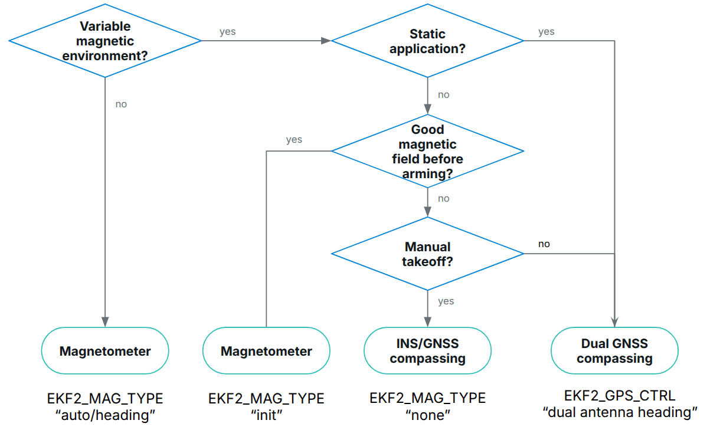
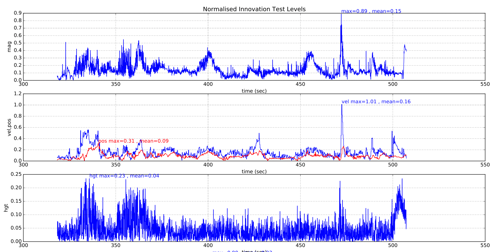
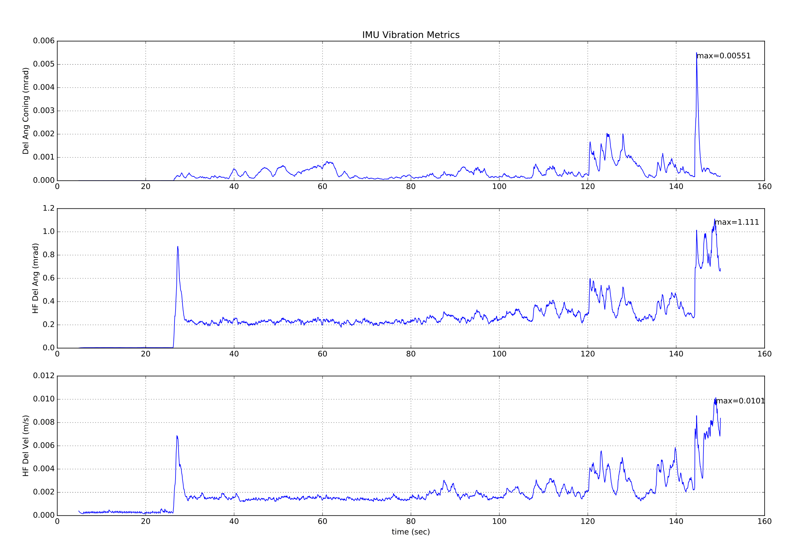
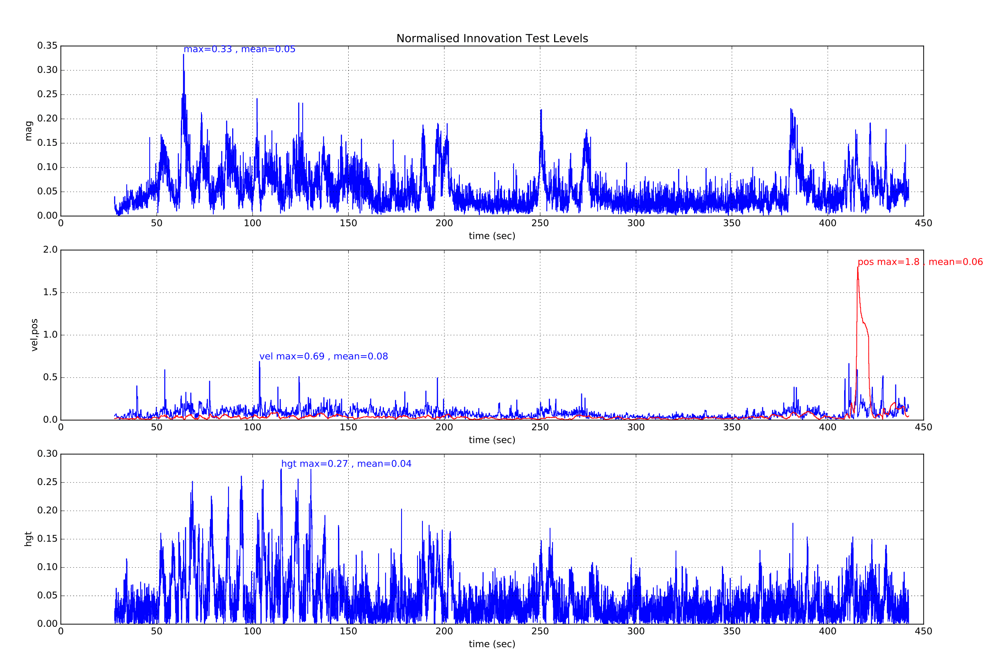
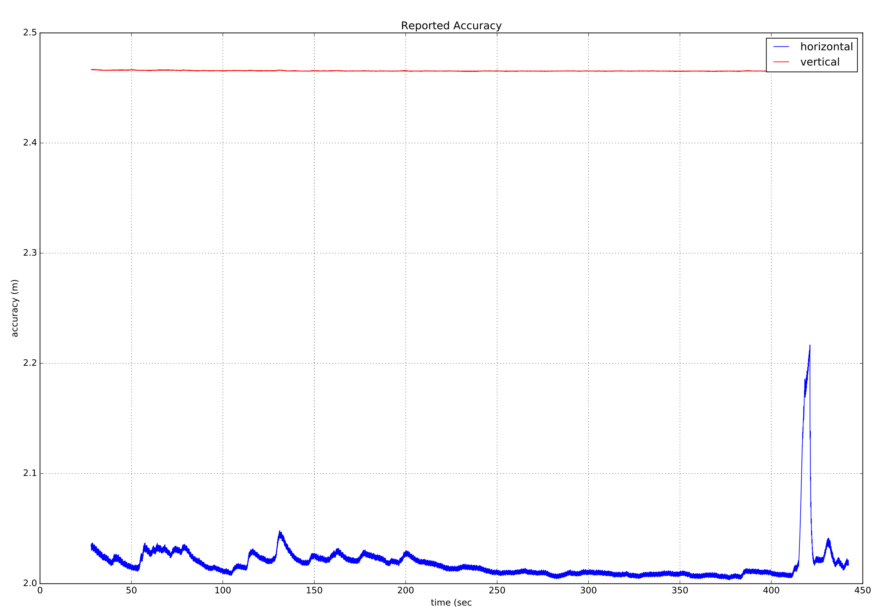
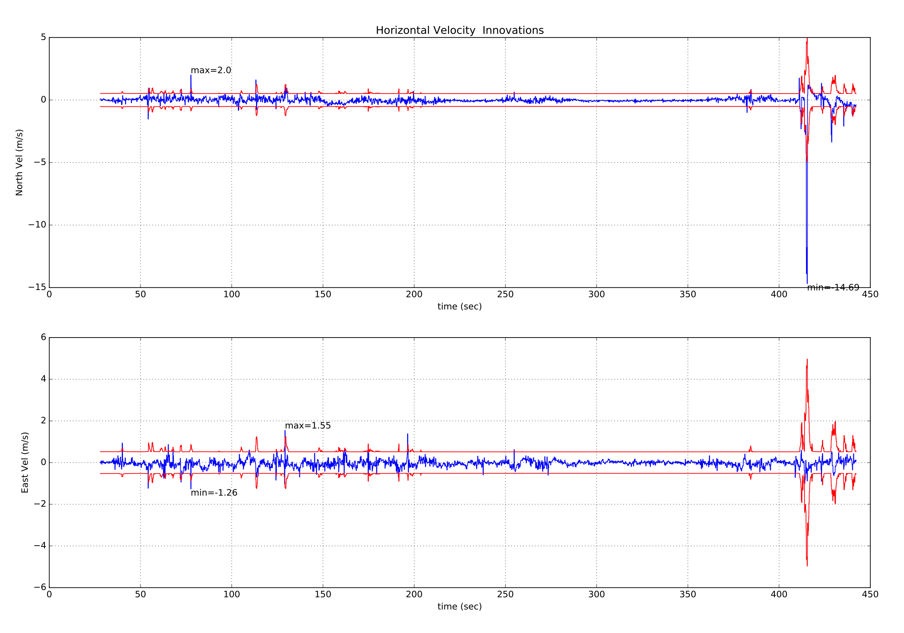
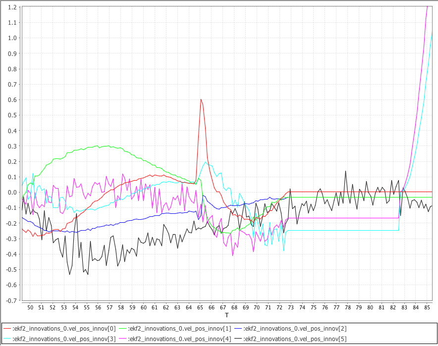
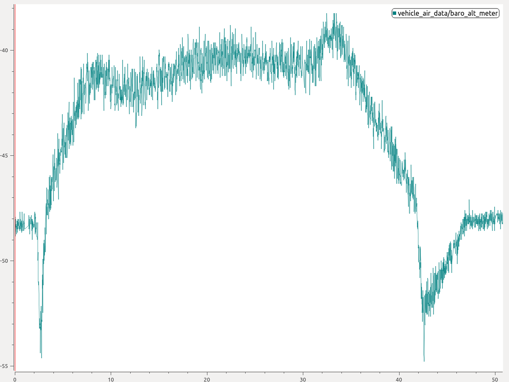

# Using PX4's Navigation Filter (EKF2)

This tutorial answers common questions about use of the EKF algorithm used for navigation.

:::tip
The [PX4 State Estimation Overview](https://youtu.be/HkYRJJoyBwQ) video from the _PX4 Developer Summit 2019_ (Dr. Paul Riseborough) provides an overview of the estimator, and additionally describes both the major changes from 2018/2019, major changes and improvements were added since then.
:::

## Загальний огляд

PX4's Navigation filter uses an Extended Kalman Filter (EKF) algorithm to process sensor measurements and provide an estimate of the following states:

- Quaternion defining the rotation from North, East, Down local navigation frame to X, Y, Z body frame
- Швидкість в IMU - Північ, Схід, Вниз (м/с)
- Position at the IMU - Latitude (rad), Longitude (rad), Altitude (m)
- IMU gyro bias estimates - X, Y, Z (rad/s)
- IMU accelerometer bias estimates - X, Y, Z (m/s<sup>2</sup>)
- Компоненти земного магнітного поля - Північ, Схід, Вниз (гаусс)
- Зміщення магнітного поля тіла транспортного засобу - X, Y, Z (гаусс)
- Швидкість вітру - північний, східний \(м/с\)
- Terrain altitude (m)

To improve stability, an "error-state" formulation is implemented
This is especially relevant when estimating the uncertainty of a rotation which is a 3D vector (tangent space of SO(3)).

EKF працює зі затримкою 'горизонту злиття часу', щоб дозволити різним затримкам часу для кожного вимірювання відносно ІМП.
Дані для кожного датчика зберігаються у буфері FIFO та забираються з буфера ЕКФ для використання в потрібний час.
Компенсація затримки для кожного датчика керується параметрами [EKF2\_\*\_DELAY](../advanced_config/parameter_reference.md#ekf2).

Для передачі станів від "горизонту злиття" до поточного часу використовується доповнювальний фільтр за допомогою буферизованих даних ІМУ.
Часова константа цього фільтру контролюється параметрами [EKF2_TAU_VEL](../advanced_config/parameter_reference.md#EKF2_TAU_VEL) та [EKF2_TAU_POS](../advanced_config/parameter_reference.md#EKF2_TAU_POS).

:::info
The 'fusion time horizon' delay and length of the buffers is determined by [EKF2_DELAY_MAX](../advanced_config/parameter_reference.md#EKF2_DELAY_MAX).
This value should be at least as large as the longest delay `EKF2\_\*\_DELAY`.
Зменшення затримки "горизонту злиття" зменшує помилки в доповнювальному фільтрі, що використовується для передачі станів до поточного часу.
:::

ЕКФ використовує дані ІМУ лише для передбачення стану.
Дані ІМУ не використовуються як спостереження при похідництві ЕКФ.
The algebraic equations for the covariance prediction and measurement jacobians are derived using [SymForce](https://symforce.org/) and can be found here: [Symbolic Derivation](https://github.com/PX4/PX4-Autopilot/blob/main/src/modules/ekf2/EKF/python/ekf_derivation/derivation.py).
Covariance update is done using the [Joseph Stabilized form](https://en.wikipedia.org/wiki/Kalman_filter#Deriving_the_posteriori_estimate_covariance_matrix) to improve numerical stability and allow conditional update of independent states.

### Precisions about the position output

The position is estimated as latitude, longitude and altitude and the INS integration is performed using the WGS84 ellipsoid mode.
However, the position uncertainty is defined in the local navigation frame at the current position (i.e.: NED error in meters).

Стани положення та швидкості налаштовуються з урахуванням зсуву між IMU та каркасом тіла перед тим, як вони виводяться на контури керування.

Положення ІМУ відносно тіла задається параметрами `EKF2_IMU_POS_X,Y,Z`.

In addition to the global position estimate in latitude/longitude/altitude, the filter also provides a local position estimate (NED in meters) by projecting the global position estimate using an [azimuthal_equidistant_projection](https://en.wikipedia.org/wiki/Azimuthal_equidistant_projection) centred on an arbitrary origin.
This origin is automatically set when global position measurements are fused but can also be specified manually.
If no global position information is provided, only the local position is available and the INS integration is performed on a spherical Earth.

## Запуск одного EKF екземпляра

_Стандартна поведінка_ полягає в тому, щоб запускати один екземпляр ЕКФ.
У цьому випадку вибір датчиків та аварійне переключення виконуються до того, як дані надходять до EKF.
Це забезпечує захист від обмеженої кількості несправностей датчиків, таких як втрата даних, але не захищає від ситуацій, коли датчик надає неточні дані, які перевищують можливості ЕКФ та контрольних циклів компенсувати.

Налаштування параметрів для запуску окремого екземпляра EKF:

- [EKF2_MULTI_IMU](../advanced_config/parameter_reference.md#EKF2_MULTI_IMU) = 0
- [EKF2_MULTI_MAG](../advanced_config/parameter_reference.md#EKF2_MULTI_MAG) = 0
- [SENS_IMU_MODE](../advanced_config/parameter_reference.md#SENS_IMU_MODE) = 1
- [SENS_MAG_MODE](../advanced_config/parameter_reference.md#SENS_MAG_MODE) = 1

## Запуск кількох екземплярів EKF

Залежно від кількості ІМП та магнітометрів і потужності ЦП автопілота, може бути запущено декілька екземплярів EKF.
Це забезпечує захист від більш широкого спектру помилок датчиків і досягається за рахунок використання кожним екземпляром EKF різної комбінації датчиків.
Порівнюючи внутрішню узгодженість кожного екземпляра EKF, селектор EKF може визначити комбінацію EKF та датчиків з найкращою узгодженістю даних.
Це дозволяє виявляти та ізолювати несправності, такі як раптові зміни в зміщенні ІМП, насичення або застрягання даних.

Загальна кількість екземплярів EKF є добутком кількості ймовірних утиліт та кількості магнітометрів, вибраних за допомогою [EKF2_MULTI_IMU](../advanced_config/parameter_reference.md#EKF2_MULTI_IMU) та [EKF2_MULTI_MAG](../advanced_config/parameter_reference.md#EKF2_MULTI_MAG), і визначається наступною формулою:

> N_instances = MAX([EKF2_MULTI_IMU](../advanced_config/parameter_reference.md#EKF2_MULTI_IMU) , 1) x MAX([EKF2_MULTI_MAG](../advanced_config/parameter_reference.md#EKF2_MULTI_MAG) , 1)

Наприклад, автопілот з 2 ймовірними утилітами та 2 магнітометрами може працювати з EKF2_MULTI_IMU = 2 та EKF2_MULTI_MAG = 2 для загальної кількості 4 екземплярів EKF, де кожен екземпляр використовує наступну комбінацію датчиків:

- Екземпляр EKF 1: IMU 1, магнітометр 1
- Екземпляр EKF 2: IMU 1, магнітометр 2
- Екземпляр EKF 3: IMU 2, магнітометр 1
- Екземпляр EKF 4: IMU 2, магнітометр 2

Максимальна кількість ймовірних утиліт або магнітометрів, які можуть бути оброблені, становить 4 кожен для теоретичного максимуму 4 x 4 = 16 екземплярів EKF.
На практиці це обмежено наявними обчислювальними ресурсами.
Під час розробки цієї функції тестування з центральним процесором STM32F7 показало, що 4 екземпляри EKF мають прийнятне навантаження обробки та використання пам'яті.

:::warning
Перед польотом необхідно виконати тестування на землі, щоб перевірити використання процесора та пам'яті.
:::

Якщо [EKF2_MULTI_IMU](../advanced_config/parameter_reference.md#EKF2_MULTI_IMU) >= 3, тоді час аварійного вимкнення для великих помилок гіроскопа подальше знижується, оскільки селектор EKF може застосовувати стратегію медіанного вибору для швидшої ізоляції несправного IMUу.

Налаштування для декількох екземплярів EKF контролюються наступними параметрами:

- [SENS_IMU_MODE](../advanced_config/parameter_reference.md#SENS_IMU_MODE): Встановлено на 0, якщо запускаються декілька екземплярів EKF з диверсифікацією датчика ймовірності, тобто [EKF2_MULTI_IMU](../advanced_config/parameter_reference.md#EKF2_MULTI_IMU) > 1.

  Коли встановлено на 1 (за замовчуванням для роботи з одним EKF), модуль датчика вибирає дані IMU, що використовуються EKF.
  Це забезпечує захист від втрати даних від датчика, але не захищає від поганих даних датчика.
  Коли встановлено на 0, модуль датчика не робить вибір.

- [SENS_MAG_MODE](../advanced_config/parameter_reference.md#SENS_MAG_MODE): Встановіть на 0, якщо використовуєте декілька екземплярів EKF з диверсифікацією магнітного датчика, тобто [EKF2_MULTI_MAG](../advanced_config/parameter_reference.md#EKF2_MULTI_MAG) > 1.

  Коли встановлено на 1 (за замовчуванням для роботи з одним EKF), модуль датчика вибирає дані магнітометра, що використовуються EKF.
  Це забезпечує захист від втрати даних від датчика, але не захищає від поганих даних датчика.
  Коли встановлено на 0, модуль датчика не робить вибір.

- [EKF2_MULTI_IMU](../advanced_config/parameter_reference.md#EKF2_MULTI_IMU): Цей параметр вказує кількість датчиків IMU, що використовуються декількома EKF.
  Якщо `EKF2_MULTI_IMU` <= 1, то використовуватиметься лише перший датчик IMU.
  Коли [SENS_IMU_MODE](../advanced_config/parameter_reference.md#SENS_IMU_MODE) = 1, це буде датчик, вибраний модулем датчика.
  Якщо `EKF2_MULTI_IMU` >= 2, то окремий екземпляр EKF буде працювати для вказаної кількості датчиків IMU до меншої з 4 або кількості присутніх датчиків IMU.

- [EKF2_MULTI_MAG](../advanced_config/parameter_reference.md#EKF2_MULTI_MAG): Цей параметр вказує кількість датчиків магнітометра, що використовуються декількома EKF. Якщо `EKF2_MULTI_MAG` <= 1, то використовуватиметься лише перший датчик магнітометра.
  When [SENS_MAG_MODE](../advanced_config/parameter_reference.md#SENS_MAG_MODE) = 1, this will be the sensor selected by the sensor module.
  Коли [SENS_MAG_MODE](../advanced_config/parameter_reference. md#SENS_MAG_MODE) = 1, це буде датчик, вибраний модулем датчика.

:::info
Запис і відтворення журналів польоту [EKF2 replay](../debug/system_wide_replay.md#ekf2-replay) з декількома екземплярами EKF не підтримується.
Щоб увімкнути запис для відтворення EKF, ви повинні встановити параметри для увімкнення [одного екземпляра EKF](#running-a-single-ekf-instance).
:::

## Які датчики вимірювань він використовує?

EKF має різні режими роботи, які дозволяють використовувати різні комбінації вимірювань датчиків.
Під час запуску фільтр перевіряє мінімально можливу комбінацію датчиків, і після завершення початкового вирівнювання кута нахилу, кута розвороту та висоти, входить у режим, що забезпечує оцінки обертання, вертикальної швидкості, вертикального положення, зміщення кута та швидкості IMU.

Цей режим потребує даних від IMU, джерела кута розвороту (магнітометра або зовнішнього бачення) та джерела даних про висоту.
Цей мінімальний набір даних потрібний для всіх режимів роботи EKF.
Інші дані датчика можуть бути використані для оцінки додаткових станів.

### IMU

- Дані з трьох вісей Imu (дельта кута та дельта швидкості), закріплені на тілі, мінімум з частотою 100 Гц.
  Примітка: Корекції конінга мають бути застосовані до даних дельта кута IMU перед їх використанням EKF.

### Магнітометр

Three axis body fixed magnetometer data at a minimum rate of 5Hz is required to be considered by the estimator.

::: info

- The magnetometer **biases** are only observable while the drone is rotating
- The true heading is observable when the vehicle is accelerating (linear acceleration) while absolute position or velocity measurements are fused (e.g. GPS).
  This means that magnetometer heading measurements are optional after initialization if those conditions are met often enough to constrain the heading drift (caused by gyro bias).

:::

Magnetometer data fusion can be configured using [EKF2_MAG_TYPE](../advanced_config/parameter_reference.md#EKF2_MAG_TYPE):

0. Automatic:
  - The magnetometer readings only affect the heading estimate before arming, and the whole attitude after arming.
  - Heading and tilt errors are compensated when using this method.
  - Incorrect magnetic field measurements can degrade the tilt estimate.
  - The magnetometer biases are estimated whenever observable.
1. Magnetic heading:
  - Only the heading is corrected.
    The tilt estimate is never affected by incorrect magnetic field measurements.
  - Tilt errors that could arise when flying without velocity/position aiding are not corrected when using this method.
  - The magnetometer biases are estimated whenever observable.
2. Deprecated
3. Deprecated
4. Deprecated
5. None:
  - Magnetometer data is never used.
    This is useful when the data can never be trusted (e.g.: high current close to the sensor, external anomalies).
  - The estimator will use other sources of heading: [GPS heading](#yaw-measurements) or external vision.
  - When using GPS measurements without another source of heading, the heading can only be initialized after sufficient horizontal acceleration.
    See [Estimate yaw from vehicle movement](#yaw-from-gps-velocity) below.
6. Init only:
  - Magnetometer data is only used to initialize the heading estimate.
    This is useful when the data can be used before arming but not afterwards (e.g.: high current after the vehicle is armed).
  - After initialization, the heading is constrained using other observations.
  - Unlike mag type `None`, when combined with GPS measurements, this method allows position controlled modes to run directly during takeoff.

The following selection tree can be used to select the right option:



### Висота

Джерело даних про висоту - GPS, барометричний тиск, дальномір, зовнішнє бачення або комбінація цих джерел, мінімум з частотою 5 Гц, необхідно.

Якщо жодне з вибраних вимірювань не присутнє, EKF не почне працювати.
Коли ці вимірювання будуть виявлені, EKF ініціалізує стани та завершить вирівнювання нахилу та розвороту.
Після завершення вирівнювання нахилу та розвороту EKF може перейти до інших режимів роботи, що дозволяє використовувати додаткові дані датчика:

Кожне джерело висоти можна ввімкнути/вимкнути за допомогою його окремого параметра керування:

- [GNSS/GPS](#gnss-gps): [EKF2_GPS_CTRL](../advanced_config/parameter_reference.md#EKF2_GPS_CTRL)
- [Барометр](#barometer): [EKF2_BARO_CTRL](../advanced_config/parameter_reference.md#EKF2_BARO_CTRL)
- [Далекомір](#range-finder): [EKF2_RNG_CTRL](../advanced_config/parameter_reference.md#EKF2_RNG_CTRL)
- [Зовнішнє бачення](#external-vision-system): Enabled when [EKF2_HGT_REF](../advanced_config/parameter_reference.md#EKF2_HGT_REF) is set to "Vision"

Надовгий період часу оцінка висоти слідує «джерелу посилання» даних про висоту.
Це посилання визначається параметром [EKF2_HGT_REF](../advanced_config/parameter_reference.md#EKF2_HGT_REF).

#### Типові конфігурації

|                                                      | [EKF2_GPS_CTRL](../advanced_config/parameter_reference.md#EKF2_GPS_CTRL) | [EKF2_BARO_CTRL](../advanced_config/parameter_reference.md#EKF2_BARO_CTRL) | [EKF2_RNG_CTRL](../advanced_config/parameter_reference.md#EKF2_RNG_CTRL) | [EKF2_HGT_REF](../advanced_config/parameter_reference.md#EKF2_HGT_REF) |
| ---------------------------------------------------- | ------------------------------------------------------------------------------------------------------------------ | -------------------------------------------------------------------------------------------------------------------- | ------------------------------------------------------------------------------------------------------------------ | ---------------------------------------------------------------------------------------------------------------- |
| Вуличне(за замовчуванням)         | 7 (Довгота/Висота/Висота)                                                                       | 1 (увімкнено)                                                                                     | 1 ([conditional](#conditional-range-aiding))                                                    | 1 (GNSS)                                                                                      |
| В приміщенні (нерівна місцевість) | 0 (вимкнено)                                                                                    | 1 (увімкнено)                                                                                     | 1 ([conditional](#conditional-range-aiding))                                                    | 2 (діапазон)                                                                                  |
| Приміщення (рівна місцевість)     | 0 (вимкнено)                                                                                    | 1 (увімкнено)                                                                                     | 2 ([always enabled](#range-height-fusion))                                                      | 2 (діапазон)                                                                                  |
| Зовнішнє бачення                                     | В міру необхідності                                                                                                | В міру необхідності                                                                                                  | В міру необхідності                                                                                                | 3 (бачення)                                                                                   |

### Барометр

Увімкнення/вимкнення за допомогою [EKF2_BARO_CTRL](../advanced_config/parameter_reference.md#EKF2_BARO_CTRL) як джерела даних про висоту [Height](#height).

Зверніть увагу, що об'єднуються дані лише з одного барометра, навіть якщо доступно кілька барометрів.
Обирається барометр з найвищим пріоритетом [CAL_BAROx_PRIO](../advanced_config/parameter_reference.md#CAL_BARO0_PRIO), перехід на наступний барометр з найвищим пріоритетом відбувається в разі виявлення несправності датчика.
Якщо барометри мають рівні найвищі пріоритети, використовується перший виявлений.
Барометр можна повністю вимкнути як можливе джерело, встановивши його значення `CAL_BAROx_PRIO` на `0` (вимкнено).

[Висоту](#height) для отримання додаткової інформації про конфігурацію джерел висоти. Корекція помилки позиції статичного тиску.

#### Виправлення помилки позиції статичного тиску

Висота за барометром піддається помилкам, що виникають від аеродинамічних перешкод, спричинених вітровою швидкістю та орієнтацією транспортного засобу.
Це відомо в авіації як _помилка позиції за статичним тиском_.
Модуль EKF2, який використовує бібліотеку оцінювача ECL/EKF2, надає метод компенсації цих помилок, за умови, що оцінка стану швидкості вітру активна.

Для транспортних засобів, що працюють у режимі фіксованого крила, оцінка стану швидкості вітру потребує активації злиття [швидкості повітря](#airspeed) та/або [синтетичного бокового ковзання](#synthetic-sideslip).

Для багатовертольотів злиття [специфічних сил тяги](#mc_wind_estimation_using_drag) може бути активоване та налаштоване для надання потрібних оцінок стану швидкості вітру.

Модуль EKF2 моделює помилку у вигляді еліпсоїда, що фіксується в тілі, який визначає частку динамічного тиску, що додається до/віднімається від барометричного тиску - перш ніж він перетворюється у висотну оцінку.

Добре налаштування можна отримати таким чином:

1. Проведіть польоти один раз у режимі позиції [Position mode](../flight_modes_mc/position.md) повторно вперед/назад/ліворуч/праворуч/вгору/вниз між спокоєм і максимальною швидкістю (найкращі результати отримуються, коли цей тест проводиться в спокійних умовах).

2. Витягніть `.ulg` файл журналу за допомогою, наприклад, [QGroundControl: Аналізувати > Завантажити журнал](https://docs.qgroundcontrol.com/master/en/qgc-user-guide/analyze_view/log_download.html)

  Той самий файл журналу можна використовувати для налаштування оцінювача вітру багатовертольотника [multirotor wind estimator](#mc_wind_estimation_using_drag).

:::

3. Використовуйте журнал зі скриптом Python [baro_static_pressure_compensation_tuning.py](https://github.com/PX4/PX4-Autopilot/tree/main/src/modules/ekf2/EKF/python/tuning_tools/baro_static_pressure_compensation), щоб отримати оптимальний набір параметрів.

Параметри налаштування:

- [EKF2_PCOEF_XP](../advanced_config/parameter_reference.md#EKF2_PCOEF_XP)
- [EKF2_PCOEF_XN](../advanced_config/parameter_reference.md#EKF2_PCOEF_XN)
- [EKF2_PCOEF_YP](../advanced_config/parameter_reference.md#EKF2_PCOEF_YP)
- [EKF2_PCOEF_YN](../advanced_config/parameter_reference.md#EKF2_PCOEF_YN)
- [EKF2_PCOEF_Z](../advanced_config/parameter_reference.md#EKF2_PCOEF_Z)

#### Компенсація зміщення барометра

Барометр при постійній висоті піддається дрейфу в своїх вимірюваннях через зміни в оточуючому тисковому середовищі або варіації температури датчика.
Для компенсації цієї помилки вимірювання EKF2 оцінює зміщення за допомогою висоти GNSS (якщо доступно) як "нестійкий" еталон.
Налаштування не потрібні.

### GNSS/GPS

#### Вимірювання позиції та швидкості

Вимірювання GPS використовуватимуться для позиції та швидкості, якщо виконуються такі умови:

- Використання GPS увімкнено через налаштування параметра [EKF2_GPS_CTRL](../advanced_config/parameter_reference.md#EKF2_GPS_CTRL).
- Перевірка якості GPS пройдена.
  Ці перевірки контролюються параметрами [EKF2_GPS_CHECK](../advanced_config/parameter_reference.md#EKF2_GPS_CHECK) і `EKF2_REQ_*`.

Для отримання додаткової інформації про налаштування джерел висоти [натисніть тут](#height).

#### Вимірювання повороту

Деякі приймачі GPS, такі як приймач GPS з системою [Trimble MB-Two RTK](https://www.trimble.com/Precision-GNSS/MB-Two-Board.aspx), можуть використовуватися для надання вимірювання кута курсу, що замінює використання даних магнітометра.
Це може бути значним перевагою при роботі в середовищі, де присутні великі магнітні аномалії, або на широтах, де магнітне поле Землі має високий нахил.
Використання вимірювань курсу від GPS увімкнено, встановивши біт на позиції 3 на 1 (додаючи 8) у параметрі [EKF2_GPS_CTRL](../advanced_config/parameter_reference.md#EKF2_GPS_CTRL).

#### Кут курсу від швидкості GPS

EKF запускає додатковий фільтр багатьох гіпотез внутрішньо, який використовує кілька 3-станових розширених калманівських фільтрів (EKF), стани яких є швидкість NE і кут курсу.
Ці індивідуальні оцінки кута курсу потім об'єднуються за допомогою фільтра гаусової суми (GSF).
Індивідуальні 3-станові EKF використовують дані IMU та горизонтальної швидкості GPS (плюс необов'язкові дані про швидкість повітря), і не покладаються на жодні попередні знання про кут курсу або вимірювання магнітометра.
Це надає резервний кут курсу для основного фільтра і використовується для скидання кута курсу для основного EKF 24-станцій, коли після зльоту втрачається навігація, що призводить до того, що оцінка кута курсу від магнітометра є поганою.
Це призведе до повідомлення про `аварійне скидання кута курсу - зупинка використання магнітометра` на інформаційному повідомленні в GCS.

Data from this estimator is logged when ekf2 replay logging is enabled and can be viewed in the `yaw_estimator_status` message.
The individual yaw estimates from the individual 3-state EKF yaw estimators are in the `yaw` fields.
The GSF combined yaw estimate is in the `yaw_composite` field.
The variance for the GSF yaw estimate is in the `yaw_variance` field.
Усі кути виражені в радіанах.
Weightings applied by the GSF to the individual 3-state EKF outputs are in the`weight` fields.

Це також робить можливим роботу без даних магнітометра або приймача GPS з подвійною антеною для кута курсу, наданий достатній горизонтальний рух після зльоту, щоб зробити кут курсу спостережним.
Для використання цієї функції встановіть [EKF2_MAG_TYPE](../advanced_config/parameter_reference.md#EKF2_MAG_TYPE) на `none` (5), щоб вимкнути використання магнітометра.
Як тільки транспортний засіб виконає достатньо горизонтального руху, щоб зробити кут спостережним, головний EKF з 24 станами вирівняє свій курс на оцінку GSF та розпочне використання GPS.

#### Подвійні приймачі

Дані з приймачів GPS можуть бути змішані за допомогою алгоритму, який вагує дані на основі звітної точності (це працює найкраще, якщо обидва приймачі виводять дані з однаковою частотою та використовують однакову точність).
Механізм також забезпечує автоматичний перехід на резервний варіант, якщо дані від приймача втрачаються (це дозволяє, наприклад, використовувати стандартний GPS як резервний варіант для більш точного приймача RTK).
Це контролюється параметром [SENS_GPS_MASK](../advanced_config/parameter_reference.md#SENS_GPS_MASK).

Параметр [SENS_GPS_MASK](../advanced_config/parameter_reference.md#SENS_GPS_MASK) за замовчуванням встановлений для вимкнення змішування і завжди використовує перший приймач, тому його потрібно встановити, щоб вибрати, які метрики точності приймача використовуються для визначення внеску кожного виходу приймача в змішане рішення.
У випадку використання різних моделей приймачів важливо, щоб параметр [SENS_GPS_MASK](../advanced_config/parameter_reference.md#SENS_GPS_MASK) був встановлений на значення, яке використовує метрики точності, які підтримуються обома приймачами.
Наприклад, не встановлюйте позицію біта 0 в значення `true`, якщо драйвери для обох приймачів не публікують значення у полі `s_variance_m_s` повідомлення `vehicle_gps_position`, які можна порівняти.
Це може бути складним з приймачами від різних виробників через різний спосіб визначення точності, наприклад, CEP проти 1-сигма і т.д.

Наступні елементи слід перевірити під час налаштування:

- Перевірте, що дані для другого приймача присутні.
  Буде зареєстровано як `vehicle_gps_position_1` і також може бути перевірено під час підключення через _консоль nsh_ за допомогою команди `listener vehicle_gps_position -i 1`.
  Параметр [GPS_2_CONFIG](../advanced_config/parameter_reference.md#GPS_2_CONFIG) повинен бути встановлений правильно.
- Перевірте дані `s_variance_m_s`, `eph` і `epv` від кожного приймача та вирішіть, які показники точності можна використовувати.
  Якщо обидва приймачі видають зрозумілі дані `s_variance_m_s` та `eph`, і вертикальна позиція GPS не використовується безпосередньо для навігації, то рекомендується встановити [SENS_GPS_MASK](../advanced_config/parameter_reference.md#SENS_GPS_MASK) на 3.
  Якщо доступні лише дані `eph` і обидва приймачі не виводять дані `s_variance_m_s`, встановіть [SENS_GPS_MASK](../advanced_config/parameter_reference.md#SENS_GPS_MASK) на.
  Позиція біта 2 буде встановлена, лише якщо GPS було вибрано як джерело опорної висоти за допомогою параметра [EKF2_HGT_REF](../advanced_config/parameter_reference.md#EKF2_HGT_REF) і обидва приймачі видають чутливі дані `epv`.
- Дані з змішаного приймача реєструються як `ekf_gps_position` і можуть бути перевірені під час підключення через термінал nsh за допомогою команди слухача `ekf_gps_position`.
- У випадку, якщо приймачі видають дані на різних швидкостях, вихідне змішане значення буде відповідати швидкості повільнішого приймача.
  Де це можливо, приймачі повинні бути налаштовані на видачу даних з однаковою швидкістю.

#### Вимоги до продуктивності GNSS

Для того щоб ECL приймав дані GNSS для навігації, необхідно, щоб певні мінімальні вимоги були виконані протягом певного часу, визначеного параметром [EKF2_REQ_GPS_H](../advanced_config/parameter_reference.md#EKF2_REQ_GPS_H) (за замовчуванням 10 секунд).

Мінімуми визначаються у параметрах [EKF2_REQ_\*](../advanced_config/parameter_reference.md#EKF2_REQ_EPH), і кожна перевірка може бути увімкнена/вимкнена за допомогою параметра [EKF2_GPS_CHECK](../advanced_config/parameter_reference.md#EKF2_GPS_CHECK).

Нижче наведена таблиця, яка показує різні метри, які безпосередньо повідомляються або обчислюються на основі даних GNSS, а також мінімальні значення, необхідні для того, щоб ці дані використовувалися ECL.
Крім того, стовпчик _Середнє значення_ показує типові значення, які можуть бути розумними для отримання зі стандартного модуля GNSS (наприклад, серія u-blox M8) - тобто значення, які вважаються хорошими/прийнятними.

| Метрика               | Мінімальна вимога                                                                                                                                                                                                   | Середнє значення     | Units | Примітки                                                                                                                                                                                                                                                                                        |
| --------------------- | ------------------------------------------------------------------------------------------------------------------------------------------------------------------------------------------------------------------- | -------------------- | ----- | ----------------------------------------------------------------------------------------------------------------------------------------------------------------------------------------------------------------------------------------------------------------------------------------------- |
| eph                   | <&nbsp;3 ([EKF2_REQ_EPH](../advanced_config/parameter_reference.md#EKF2_REQ_EPH))                         | 0.8  | m     | Стандартне відхилення помилки горизонтальної позиції                                                                                                                                                                                                                                            |
| epv                   | <&nbsp;5 ([EKF2_REQ_EPV](../advanced_config/parameter_reference.md#EKF2_REQ_EPV))                         | 1.5  | m     | Стандартне відхилення помилки вертикальної позиції                                                                                                                                                                                                                                              |
| Кількість супутників  | ≥6&nbsp;([EKF2_REQ_NSATS](../advanced_config/parameter_reference.md#EKF2_REQ_NSATS))                                               | 14                   | -     |                                                                                                                                                                                                                                                                                                 |
| sacc                  | <&nbsp;0.5 ([EKF2_REQ_SACC](../advanced_config/parameter_reference.md#EKF2_REQ_SACC))     | 0.2  | m/s   | Стандартне відхилення помилки горизонтальної швидкості                                                                                                                                                                                                                                          |
| fix type              | ≥&nbsp;3                                                                                                                                                                                        | 4                    | -     | 0-1: відсутній фікс, 2: 2D фікс, 3: 3D фікс, 4: диференційний код RTCM, 5: кінематика в реальному часі, плаваюча, 6: кінематика в реальному часі, фіксована, 8: екстрапольована |
| PDOP                  | <&nbsp;2.5 ([EKF2_REQ_PDOP](../advanced_config/parameter_reference.md#EKF2_REQ_PDOP))     | 1.0  | -     | Дільник точності положення                                                                                                                                                                                                                                                                      |
| hpos швидкість дрейфу | <&nbsp;0.1 ([EKF2_REQ_HDRIFT](../advanced_config/parameter_reference.md#EKF2_REQ_HDRIFT)) | 0.01 | m/s   | Швидкість дрейфу, обчислена з відомого положення GNSS (при безрухомості).                                                                                                                                                                                    |
| vpos швидкість дрейфу | <&nbsp;0.2 ([EKF2_REQ_VDRIFT](../advanced_config/parameter_reference.md#EKF2_REQ_VDRIFT)) | 0.02 | m/s   | Швидкість дрейфу, обчислена з відомої висоти GNSS (при безрухомості).                                                                                                                                                                                        |
| hspd                  | <&nbsp;0.1 ([EKF2_REQ_HDRIFT](../advanced_config/parameter_reference.md#EKF2_REQ_HDRIFT)) | 0.01 | m/s   | Фільтрована величина звітної горизонтальної швидкості GNSS.                                                                                                                                                                                                                     |
| vspd                  | <&nbsp;0.2 ([EKF2_REQ_VDRIFT](../advanced_config/parameter_reference.md#EKF2_REQ_VDRIFT)) | 0.02 | m/s   | Фільтрована величина звітної вертикальної швидкості GNSS.                                                                                                                                                                                                                       |

:::info
Параметри `hpos_drift_rate`, `vpos_drift_rate` та `hspd` обчислюються протягом 10 секунд і публікуються у темі `ekf2_gps_drift`.
Зверніть увагу, що `ekf2_gps_drift` не зафіксовано!
:::

### Далекомір

[Range finder](../sensor/rangefinders.md) distance to ground is used by a single state filter to estimate the vertical position of the terrain relative to the height datum.

Режими злиття керуються [EKF2_RNG_CTRL](../advanced_config/parameter_reference.md#EKF2_RNG_CTRL):

1. [Умовна допомога зондування](#conditional-range-aiding)
2. [Об'єднання висоти дальності](#range-height-fusion)

Для отримання додаткової інформації про налаштування джерел висоти [натисніть тут](#height).

#### Умовна допомога зондування

Умовне об'єднання датчика дальності (також відоме як. _Умовна допомога зони діапазону_) активує злиття відомостей дальномера для оцінки висоти під час операцій з низькою швидкістю/низькою висотою (додатково до інших активних джерел висоти).
Якщо дальномер встановлено як джерело висоти за замовчуванням (використовуючи [EKF2_HGT_REF](../advanced_config/parameter_reference.md#EKF2_HGT_REF)), інші активні джерела висоти, такі як барометр та висота ГНСС, з часом коригуватимуть свої вимірювання, щоб відповідати показам дальномера.
Коли умови не виконані для початку допомоги діапазону, автоматично обирається вторинне джерело.

:::info
Перемикання між джерелами висоти призводить до поступового відхилення оцінки абсолютної висоти з плином часу.
Це не проблема при польоті в режимі позиції, але може стати проблемою, якщо дрон має летіти місію на конкретній висоті за ГНСС.
Якщо небажане відхилення абсолютної висоти, рекомендується встановити висоту за ГНСС як джерело висоти, навіть при використанні умовної допомоги діапазону.
:::

Це передбачено переважно для _зльоту та посадки_, у випадках, коли налаштування барометра таке, що втручання від струменя повітря від лопастей відбувається в надмірній мірі та може спотворити оцінки стану EKF.

Допомога діапазону також може використовуватися для поліпшення утримання висоти, коли транспортний засіб зупинений.

:::tip
[Утримання за допомогою рельєфу](../flying/terrain_following_holding.md#terrain_hold) рекомендується перед _Допомогою діапазону_ для утримання на рельєфі.
Це через те, що утримання за допомогою рельєфу використовує звичайний оцінювач ECL/EKF для визначення висоти, і це загалом надійніше, ніж датчик відстані в більшості умов.
:::

_Умовна допомога діапазону_ включається шляхом встановлення [EKF2_RNG_CTRL](../advanced_config/parameter_reference.md#EKF2_RNG_CTRL) = "Увімкнено (умовний режим)" (1).

Вона додатково налаштовується за допомогою параметрів `EKF2_RNG_A_`:

- [EKF2_RNG_A_VMAX](../advanced_config/parameter_reference.md#EKF2_RNG_A_VMAX): Максимальна горизонтальна швидкість, при перевищенні якої відключається допомога датчика дальності.
- [EKF2_RNG_A_HMAX](../advanced_config/parameter_reference.md#EKF2_RNG_A_HMAX): Максимальна висота, при перевищенні якої відключається допомога датчика дальності.
- [EKF2_RNG_A_IGATE](../advanced_config/parameter_reference.md#EKF2_RNG_A_IGATE): Ворота перевірки узгодженості допомоги датчика дальності (вимірювання помилки до відключення допомоги датчика дальності).

#### Об'єднання висоти дальності

PX4 дозволяє постійно об'єднувати дальномер як джерело висоти (у будь-якому режимі польоту/типі транспортного засобу).
Це може бути корисно для застосунків, коли транспортний засіб гарантовано летить лише над майже плоскою поверхнею (наприклад, у приміщенні).

При використанні датчика відстані як джерела висоти, літакам слід бути уважними:

- Перельот над перешкодами може призвести до відкидання даних дальномера оцінювачем (через внутрішні перевірки консистентності даних), що може призвести до поганого утримання висоти в той час, коли оцінювач базується виключно на оцінках акселерометра.

  Цей сценарій може статися, коли транспортний засіб піднімається на схилі майже на постійній висоті над землею, оскільки висота, виміряна дальномером, не змінюється, тоді як та, яка визначається за допомогою акселерометра, змінюється.
  ЕКФ виконує перевірки консистентності інновацій, які враховують помилку між виміром і поточним станом, а також оцінену дисперсію стану і дисперсію самого вимірювання.
  Якщо перевірки не вдаються, дані дальномера будуть відхилені, і висота буде оцінена за допомогою акселерометра та інших обраних джерел висоти (ГНСС, баро, візія), якщо вони включені та доступні Після 5 секунд неузгоджених даних, якщо датчик відстані є активним джерелом висотних даних, оцінювач скидає стан висоти для відповідності поточним даним дальномера.
  Якщо одне або кілька інших джерел висоти активні, дальномер визнається несправним, і оцінювач продовжує оцінювати висоту за допомогою інших датчиків.
  Вимірювання також можуть стати знову узгодженими, наприклад, якщо транспортний засіб спускається, або якщо оцінена висота дрейфує для відповідності виміряній висоті дальномера.

:::

- Локальне початкове положення NED буде підніматися та опускатися разом з рівнем ґрунту.

- Продуктивність дальномера над нерівними поверхнями (наприклад, деревами) може бути дуже низькою, що призводить до шумних і неузгоджених даних.
  Це знову призводить до поганого утримання висоти.

Функцію можна ввімкнути, установивши для [EKF2_RNG_CTRL](../advanced_config/parameter_reference.md#EKF2_RNG_CTRL) значення «Увімкнено» (2).
Щоб зробити далекомір орієнтиром висоти, коли він активний, установіть для параметра [EKF2_HGT_REF](../advanced_config/parameter_reference.md#EKF2_HGT_REF) значення «Датчик дальності».

:::tip
Для того щоб увімкнути злиття дальномера тільки тоді, коли дрон знаходиться у спокої (для отримання кращої оцінки висоти під час зльоту та посадки), але не злити дальномер решту часу, скористайтеся [умовним режимом](#conditional-range-aiding) (1) параметру [EKF2_RNG_CTRL](../advanced_config/parameter_reference.md#EKF2_RNG_CTRL).
:::

#### Виявлення перешкод далекоміром

ЕКФ може виявити, чи перешкоджається шлях дальномера до землі (можливо, завдяки вантажу), використовуючи кінематичну перевірку консистентності між оцінкою вертикальної швидкості та числовою похідною даних дальномера.
Якщо дальномер статистично неузгоджений з EKF2, датчик відкидається на решту польоту, якщо тільки статистичний тест не пройшов знову протягом щонайменше 1 секунди при вертикальній швидкості 0,5 м/с або більше.

Перевірка активується лише тоді, коли дальномер не використовується як основне джерело висоти, і активна лише тоді, коли транспортний засіб не рухається горизонтально (оскільки вона припускає статичну висоту ґрунту).

Для ефективного виявлення перешкод необхідно тісно налаштувати параметр шуму дальномера за допомогою даних польоту.
Параметр порогу кінематичної консистентності можна налаштувати для досягнення бажаної чутливості виявлення несправностей.

Параметри налаштування:

- [EKF2_RNG_NOISE](../advanced_config/parameter_reference.md#EKF2_RNG_NOISE)
- [EKF2_RNG_K_GATE](../advanced_config/parameter_reference.md#EKF2_RNG_K_GATE)

### Швидкість повітря

Дані про еквівалентну повітряну швидкість (EAS) можуть бути використані для оцінки швидкості вітру та зменшення дрейфу, коли втрачений сигнал GPS, встановивши значення [EKF2_ARSP_THR](../advanced_config/parameter_reference.md#EKF2_ARSP_THR) на позитивне значення.
Дані про повітряну швидкість будуть використані, коли вони перевищать поріг, встановлений позитивним значенням для [EKF2_ARSP_THR](../advanced_config/parameter_reference.md#EKF2_ARSP_THR), і тип транспортного засобу не є вертольотом.

### Синтетичний боковий кут нахилу

Фіксованокрилі платформи можуть скористатися припущеною спостереженням дрейфу нульовим, щоб поліпшити оцінку швидкості вітру і також включити оцінку швидкості вітру без датчика повітряної швидкості.
Це вмикається, встановивши параметр [EKF2_FUSE_BETA](../advanced_config/parameter_reference.md#EKF2_FUSE_BETA) на значення 1.

<a id="mc_wind_estimation_using_drag"></a>

### Оцінка вітру багатовертольотників за допомогою специфічних сил опору

Багатороторні платформи можуть скористатися взаємозв'язком між повітряною швидкістю та силою опору вздовж осей тіла X та Y для оцінки північної / східної складових швидкості вітру.
Це можна ввімкнути, використовуючи параметр [EKF2_DRAG_CTRL](../advanced_config/parameter_reference.md#EKF2_DRAG_CTRL).

Взаємозв'язок між повітряною швидкістю та конкретною силою (виміри прискорення ІМП) вздовж осей тіла X та Y контролюється параметрами [EKF2_BCOEF_X](../advanced_config/parameter_reference.md#EKF2_BCOEF_X), [EKF2_BCOEF_Y](../advanced_config/parameter_reference.md#EKF2_BCOEF_Y) та [EKF2_MCOEF](../advanced_config/parameter_reference.md#EKF2_MCOEF), які встановлюють коефіцієнти балістики для польоту в напрямку X та Y та коефіцієнт ковзання, що виникає від пропелерів, відповідно.
Кількість шуму спостереження конкретної сили встановлюється параметром [EKF2_DRAG_NOISE](../advanced_config/parameter_reference.md#EKF2_DRAG_NOISE).

Добре налаштування можна отримати таким чином:

1. Проведіть польоти один раз у режимі позиції [Position mode](../flight_modes_mc/position.md) повторно вперед/назад/ліворуч/праворуч/вгору/вниз між спокоєм і максимальною швидкістю (найкращі результати отримуються, коли цей тест проводиться в спокійних умовах).
2. Extract the **.ulg** log file using, for example, [QGroundControl: Analyze > Log Download](https://docs.qgroundcontrol.com/master/en/qgc-user-guide/analyze_view/log_download.html)
  ::: info
  The same **.ulg** log file can also be used to tune the [static pressure position error coefficients](#correction-for-static-pressure-position-error).

:::
3. Використовуйте журнал зі сценарієм Python [mc_wind_estimator_tuning.py](https://github.com/PX4/PX4-Autopilot/tree/main/src/modules/ekf2/EKF/python/tuning_tools/mc_wind_estimator), щоб отримати оптимальний набір параметрів.

### Оптичний потік(Optical Flow)

Дані [оптичного потоку](../sensor/optical_flow.md) використовуватимуться, якщо виконуються такі умови:

- Доступні дані дальномера відповідно до умов.
- [EKF2_OF_CTRL](../advanced_config/parameter_reference.md#EKF2_OF_CTRL) встановлено.
- Якість метрики, поверненої датчиком потоку, більше мінімальних вимог, встановлених параметром [EKF2_OF_QMIN](../advanced_config/parameter_reference.md#EKF2_OF_QMIN).

For better performance, set the location of the optical flow sensor as described [here](../sensor/optical_flow.md#ekf2).

If a stable hover can be achieved at low altitude above ground (< 10m) but slow oscillations occur at higher altitude, consider adjusting the [optical flow scale factor](../sensor/optical_flow.md#scale-factor).

### Зовнішня система бачення

Дані про положення, швидкість або орієнтацію від зовнішньої системи бачення, наприклад, Vicon, можуть бути використані.

Змірювання, які об'єднуються, налаштовані, встановивши відповідні біти [EKF2_EV_CTRL](../advanced_config/parameter_reference.md#EKF2_EV_CTRL) на `true`:

- 0: Дані горизонтальної позиції
- `1`: Дані про вертикальне положення.
  Джерела висоти можуть бути додатково налаштовані за допомогою [EKF2_HGT_REF](../advanced_config/parameter_reference.md#EKF2_HGT_REF) (див. розділ [Висота](#height)).
- 2: Дані швидкості
- 3: Дані кута yaw

Зверніть увагу, що якщо використовуються дані про курс (біт 3), напрямок відносно зовнішнього візуального кадру; в іншому випадку напрямок відносно північного.

EKF враховує невизначеність в оцінці візуального положення.
Цю інформацію про невизначеність можна відправити через поля коваріації в повідомленні MAVLink [ODOMETRY](https://mavlink.io/en/messages/common.html#ODOMETRY) або встановити через параметри [EKF2_EVP_NOISE](../advanced_config/parameter_reference.md#EKF2_EVP_NOISE), [EKF2_EVV_NOISE](../advanced_config/parameter_reference.md#EKF2_EVV_NOISE) та [EKF2_EVA_NOISE](../advanced_config/parameter_reference.md#EKF2_EVA_NOISE).
Ви можете вибрати джерело невизначеності з [EKF2_EV_NOISE_MD](../advanced_config/parameter_reference.md#EKF2_EV_NOISE_MD).

## Як використовувати бібліотеку EKF "ecl"?

EKF2 is enabled by default (for more information see [Switching State Estimators](../advanced/switching_state_estimators.md) and [EKF2_EN](../advanced_config/parameter_reference.md#EKF2_EN)).

## Які переваги та недоліки EKF ecl порівняно з іншими оцінювачами?

Як і всі оцінювачі, більша частина продуктивності забезпечується налаштуванням відповідно до характеристик датчика.
Настройка - це компроміс між точністю і надійністю, і хоча ми намагалися надати настройку, яка задовольняє потреби більшості користувачів, будуть випадки, коли потрібні зміни налаштувань.

З цієї причини не висуваються претензії на точність в порівнянні з традиційною комбінацією `attitude_estimator_q` + `local_position_estimator`, і найкращий вибір оцінювача буде залежати від застосування і налаштування.

### Недоліки

- Ecl EKF — це складний алгоритм, для успішного налаштування якого потрібне добре розуміння розширеної теорії фільтра Калмана та її застосування до проблем навігації.
  Тому користувачам, які не досягають хороших результатів, важче знати, що змінити.
- Ecl EKF використовує більше оперативної пам’яті та флеш-пам’яті.
- Ecl EKF використовує більше місця для журналювання.

### Переваги

- ЕКФ ecl може об'єднувати дані з датчиків з різними затримками часу та частотами даних в математично послідовний спосіб, що підвищує точність під час динамічних маневрів, якщо параметри затримки часу встановлені правильно.
- ЕКФ ecl здатний об'єднувати широкий спектр різних типів сенсорів.
- ЕКФ ecl виявляє та повідомляє про статистично значущі неузгодженості в даних сенсорів, допомагаючи в діагностиці помилок сенсорів.
- Для роботи з фіксованим крилом, ЕКФ ecl оцінює швидкість вітру з або без датчика швидкості повітря та може використовувати оцінену швидкість вітру в поєднанні з вимірюваннями швидкості повітря та припущеннями про боковий вітер, щоб продовжити час дедраконінгу, доступний у разі втрати GPS під час польоту.
- ЕКФ ecl оцінює відхилення акселерометра по трьох осях, що підвищує точність для апаратів типу "хвісторізи" та інших транспортних засобів, які досвідчують великі зміни у положенні між фазами польоту.
- Федеративна архітектура (об'єднане оцінювання стану атитюду та положення/швидкості) означає, що оцінювання атитюду користується всіма вимірюваннями сенсорів.
  Це повинно забезпечити потенційну можливість покращення оцінювання атитюду при правильному налаштуванні.

## Як перевірити працездатність EKF?

Дані, виведені ЕКІ, стани та статуси, публікуються в кількох темах uORB, які журналюються на SD-карту під час польоту.
The following guide assumes that data has been logged using the _.ulog file format_.
The **.ulog** format data can be parsed in python by using the [PX4 pyulog library](https://github.com/PX4/pyulog).

Більшість даних ЕКІ знаходиться у повідомленнях uORB [EstimatorInnovations](https://github.com/PX4/PX4-Autopilot/blob/main/msg/EstimatorInnovations.msg) та [EstimatorStatus](https://github.com/PX4/PX4-Autopilot/blob/main/msg/EstimatorStatus.msg), які реєструються в файлі .ulog.

Сценарій Python, який автоматично генерує аналітичні графіки та метадані, можна знайти [тут](https://github.com/PX4/PX4-Autopilot/blob/main/Tools/ecl_ekf/process_logdata_ekf.py).
Щоб використати цей файл сценарію, перейдіть до каталогу `Tools/ecl_ekf` і введіть `python process_logdata_ekf.py <log_file.ulg>`.
Це зберігає метадані продуктивності у файлі Csv під назвою **<log_file>.mdat.csv** і малюнки у файлі Pdf під назвою `<log_file>.pdf`.

Кілька файлів журналу в каталозі можна проаналізувати за допомогою сценарію [batch_process_logdata_ekf.py](https://github.com/PX4/PX4-Autopilot/blob/main/Tools/ecl_ekf/batch_process_logdata_ekf.py).
Коли це вже зроблено, файли метаданих про продуктивність можна обробити, щоб надати статистичну оцінку продуктивності оцінювача по всій популяції журналів, використовуючи сценарій [batch_process_metadata_ekf.py](https://github.com/PX4/PX4-Autopilot/blob/main/Tools/ecl_ekf/batch_process_metadata_ekf.py).

### Вихідні дані

- Вихідні дані Attitude містяться в повідомленні [VehicleAttitude](https://github.com/PX4/PX4-Autopilot/blob/main/msg/VehicleAttitude.msg).
- Вихідні дані про локальне положення знаходяться в повідомленні [VehicleLocalPosition](https://github.com/PX4/PX4-Autopilot/blob/main/msg/VehicleLocalPosition.msg).
- Глобальні вихідні дані \(WGS-84\) містяться в повідомленні [VehicleGlobalPosition](https://github.com/PX4/PX4-Autopilot/blob/main/msg/VehicleGlobalPosition.msg).
- Вихідні дані про швидкість вітру містяться в повідомленні [Wind.msg](https://github.com/PX4/PX4-Autopilot/blob/main/msg/Wind.msg).

### Стани

Зверніться до станів\[24\] у [EstimatorStates](https://github.com/PX4/PX4-Autopilot/blob/main/msg/EstimatorStates.msg).
Індексна карта для станів\[24\] така:

- \[0 ... 3\] Quaternions
- \[4 ... 6\] Velocity NED \(m/s\)
- \[7 ... 9\] Position NED \(m\)
- \[10 ... 12\] IMU delta angle bias XYZ \(rad\)
- \[13 ... 15\] IMU delta velocity bias XYZ \(m/s\)
- \[16 ... 18\] Earth magnetic field NED \(gauss\)
- \[19 ... 21\] Body magnetic field XYZ \(gauss\)
- \[22 ... 23\] Wind velocity NE \(m/s\)

### Відхилення стану

Зверніться до коваріацій\[24\] у [EstimatorStates](https://github.com/PX4/PX4-Autopilot/blob/main/msg/EstimatorStates.msg).
Індексна карта для коваріацій\[24\] така:

- \[0 ... 3\] Quaternions
- \[4 ... 6\] Velocity NED \(m/s\)^2
- \[7 ... 9\] Position NED \(m^2\)
- \[10 ... 12\] IMU delta angle bias XYZ \(rad^2\)
- \[13 ... 15\] IMU delta velocity bias XYZ \(m/s\)^2
- \[16 ... 18\] Earth magnetic field NED \(gauss^2\)
- \[19 ... 21\] Body magnetic field XYZ \(gauss^2\)
- \[22 ... 23\] Wind velocity NE \(m/s\)^2

### Інновації спостережень & інноваційні варіанти

Поля спостережень `estimator_innovations`, `estimator_innovation_variances` і `estimator_innovation_test_ratios` визначено в [EstimatorInnovations.msg](https://github.com/PX4/PX4-Autopilot/blob/main/msg/EstimatorInnovations.msg).
Усі повідомлення мають однакові назви/типи полів (але різні одиниці вимірювання).

:::info
Повідомлення мають однакові поля, оскільки вони генеруються з того самого визначення поля.
The `# TOPICS` line (at the end of [the file](https://github.com/PX4/PX4-Autopilot/blob/main/msg/EstimatorInnovations.msg)) lists the names of the set of messages to be created):

```
# TOPICS estimator_innovations estimator_innovation_variances estimator_innovation_test_ratios
```

:::

Деякі з спостережень:

- Магнітометр XYZ (гаус, гаус^2): `mag_field[3]`
- Кут розвороту (рад, рад^2): `heading`
- Швидкість повітря (м/с, (м/с)^2): `airspeed`
- Синтетичний кут бокового зсуву (рад, рад^2): `beta`
- Оптичний потік XY (рад/с, (рад/с)^2): `flow`
- Висота над землею (м, м^2): `hagl`
- Тягове специфічне зусилля ((м/с)^2): `drag`
- Інновації швидкості та положення: для кожного сенсора

Крім того, кожен сенсор має власні поля для горизонтального та вертикального положення та/або швидкості (за потреби).
Вони в основному документуються самостійно, і наведені нижче:

```
# GPS
float32[2] gps_hvel	# horizontal GPS velocity innovation (m/sec) and innovation variance ((m/sec)**2)
float32    gps_vvel	# vertical GPS velocity innovation (m/sec) and innovation variance ((m/sec)**2)
float32[2] gps_hpos	# horizontal GPS position innovation (m) and innovation variance (m**2)
float32    gps_vpos	# vertical GPS position innovation (m) and innovation variance (m**2)

# External Vision
float32[2] ev_hvel	# horizontal external vision velocity innovation (m/sec) and innovation variance ((m/sec)**2)
float32    ev_vvel	# vertical external vision velocity innovation (m/sec) and innovation variance ((m/sec)**2)
float32[2] ev_hpos	# horizontal external vision position innovation (m) and innovation variance (m**2)
float32    ev_vpos	# vertical external vision position innovation (m) and innovation variance (m**2)

# Fake Position and Velocity
float32[2] fake_hvel	# fake horizontal velocity innovation (m/s) and innovation variance ((m/s)**2)
float32    fake_vvel	# fake vertical velocity innovation (m/s) and innovation variance ((m/s)**2)
float32[2] fake_hpos	# fake horizontal position innovation (m) and innovation variance (m**2)
float32    fake_vpos	# fake vertical position innovation (m) and innovation variance (m**2)

# Height sensors
float32 rng_vpos	# range sensor height innovation (m) and innovation variance (m**2)
float32 baro_vpos	# barometer height innovation (m) and innovation variance (m**2)

# Auxiliary velocity
float32[2] aux_hvel	# horizontal auxiliary velocity innovation from landing target measurement (m/sec) and innovation variance ((m/sec)**2)
float32    aux_vvel	# vertical auxiliary velocity innovation from landing target measurement (m/sec) and innovation variance ((m/sec)**2)
```

### Додатковий фільтр виводу

Вихідний додатковий фільтр використовується для поширення станів вперед від горизонту часу синтезу до поточного часу.
Щоб перевірити величину помилок відстеження кутової швидкості та положення, виміряних у момент злиття, зверніться до `output_tracking_error[3]` у повідомленні `ekf2_innovations`.

Індексна карта виглядає наступним чином:

- [0] Величина помилки відстеження кутового руху (рад)
- [1] Величина помилки відстеження швидкості (м/с).
  Часова константа відстеження швидкості може бути налаштована за допомогою параметра [EKF2_TAU_VEL](../advanced_config/parameter_reference.md#EKF2_TAU_VEL).
  Зменшення цього параметра зменшує сталі похибки, але збільшує кількість шуму спостереження на вихідних даних про швидкість NED.
- [2] Величина помилки відстеження позиції \(m\).
  Часова константа відстеження позиції може бути налаштована за допомогою параметра [EKF2_TAU_POS](../advanced_config/parameter_reference.md#EKF2_TAU_POS).
  Зменшення цього параметра зменшує сталі похибки, але збільшує кількість шуму спостереження на вихідних даних про позицію NED.

### Помилки EKF

EKF містить внутрішню перевірку помилок для погано обумовлених оновлень стану та коваріації.
Зверніться до `filter_fault_flags` in [Estimator](https://github.com/PX4/PX4-Autopilot/blob/main/msg/EstimatorStatus.msg).

### Помилки спостереження

Існує дві категорії помилок спостереження:

- Втрата даних.
  Прикладом цього є далекомір, який не забезпечує повернення.
- Інновація, яка є різницею між прогнозом стану та спостереженням датчика, є надмірною.
  Прикладом цього є надмірна вібрація, що викликає велику помилку у вертикальному положенні, що призводить до відхилення вимірювання висоти барометра.

Обидва ці фактори можуть призвести до відкидання спостережень настільки довго, що ЕКФ спробує скинути стани, використовуючи спостереження датчика.
До всіх спостережень застосовуються статистичні перевірки на впевненість у інноваціях.
Кількість стандартних відхилень для перевірки контролюється параметром `EKF2_*_GATE` для кожного типу спостереження.

Рівні тестування доступні в [EstimatorStatus](https://github.com/PX4/PX4-Autopilot/blob/main/msg/EstimatorStatus.msg) наступним чином:

- `mag_test_ratio`: співвідношення найбільшого компонента інновації магнітомера до межі тесту інновацій
- `vel_test_ratio`: співвідношення найбільшого компонента інновації швидкості до межі тесту інновацій
- `pos_test_ratio`: співвідношення найбільшого горизонтального компонента інновації позиції до межі тесту інновацій
- `hgt_test_ratio`: співвідношення інновації вертикальної позиції до межі тесту інновацій
- `tas_test_ratio`: співвідношення інновації істинної швидкості повітря до межі тесту інновацій
- `hagl_test_ratio`: співвідношення інновації висоти над землею до межі тесту інновацій

Для отримання бінарного підсумку "пройшов/не пройшов" для кожного датчика дивіться прапорці innovation_check_flags у [EstimatorStatus](https://github.com/PX4/PX4-Autopilot/blob/main/msg/EstimatorStatus.msg).

### Перевірка якості GPS

EKF проводить кілька перевірок якості GPS перед початком допомоги GPS.
Ці перевірки контролюються параметрами [EKF2_GPS_CHECK](../advanced_config/parameter_reference.md#EKF2_GPS_CHECK) і `EKF2_REQ_*`.
Статус успішності/невдачі цих перевірок реєструється у повідомленні [EstimatorStatus](https://github.com/PX4/PX4-Autopilot/blob/main/msg/EstimatorStatus.msg).gps_check_fail_flags.
Це ціле число буде рівне нулю, коли всі необхідні перевірки GPS будуть пройдені.
Якщо EKF не розпочинає вирівнювання GPS, перевірте значення цілочисельної величини порівняно з визначенням бітової маски `gps_check_fail_flags` у [EstimatorStatus](https://github.com/PX4/PX4-Autopilot/blob/main/msg/EstimatorStatus.msg).

### Числові помилки EKF

ЕКФ використовує операції з плаваючою комою одинарної точності для всіх своїх обчислень і апроксимації першого порядку для похідних у рівняннях прогнозу та оновлення коваріації, щоб зменшити обчислювальні вимоги.
Це означає, що при повторному налаштуванні ЕКФ можуть виникнути умови, коли операції з матрицями коваріації стають погано умовленими, що може призвести до розходження або значних помилок у оцінках стану.

Щоб цього уникнути, кожний крок оновлення коваріації та стану містить наступні кроки виявлення та корекції помилок:

- Якщо дисперсія інновацій менша за дисперсію спостереження (це потребує від'ємної дисперсії стану, що неможливо), або оновлення коваріації приведе до виникнення від'ємної дисперсії для будь-якого зі станів, тоді:
  - Оновлення стану та коваріації пропускається
  - Відповідні рядки та стовпці в матриці коваріації скидаються
  - Помилка реєструється у повідомленні [EstimatorStatus](https://github.com/PX4/PX4-Autopilot/blob/main/msg/EstimatorStatus.msg) `filter_fault_flags`
- Дисперсії стану (діагоналі в матриці коваріації) обмежені на невід'ємні значення.
- Застосовується верхній ліміт до дисперсій стану.
- На матрицю коваріації нав'язується симетрія.

Після переналаштування фільтра, особливо переналаштування, що включають зменшення шумових змінних, слід перевірити значення `estimator_status.gps_check_fail_flags`, щоб переконатися, що воно залишається нульовим.

## Що робити, якщо оцінка висоти розходиться?

Найбільш поширену причину відхилення висоти ЕКФ від GPS та вимірів альтиметра під час польоту становить обрізання і/або аліасинг вимірів ІМУ, спричинене вібрацією.
Якщо це відбувається, то на даних мають бути видні наступні ознаки:

- [EstimatorInnovations](https://github.com/PX4/PX4-Autopilot/blob/main/msg/EstimatorInnovations.msg).vel_pos_innov\[2\] та [EstimatorInnovations](https://github.com/PX4/PX4-Autopilot/blob/main/msg/EstimatorInnovations.msg).vel_pos_innov\[5\] матимуть однаковий знак.
- [Статус оцінювання](https://github.com/PX4/PX4-Autopilot/blob/main/msg/EstimatorStatus.msg).hgt_test_ratio буде більшим за 1.0

Рекомендований перший крок - переконатися, що автопілот відізолований від конструкції корпусу за допомогою ефективної системи кріплення з ізоляцією.
Iзоляційний кріпиль має 6 ступенів свободи, і, отже, 6 резонансних частот.
Загалом, шість резонансних частот автопілота на кріпленні з ізоляцією повинні бути вище 25 Гц, щоб уникнути взаємодії з динамікою автопілота та нижче частоти обертання моторів.

Кріплення з ізоляцією може погіршити вібрацію, якщо резонансні частоти співпадають з частотами обертання моторів або лопаток пропелерів.

EKF можна зробити більш стійким до розходження висоти, викликаного вібрацією, змінивши наступні параметри:

- Подвійне значення інноваційних воріт для основного датчика висоти.
  Якщо використовується барометрична висота, це [EKF2_BARO_GATE](../advanced_config/parameter_reference.md#EKF2_BARO_GATE).
- Спочатку збільште значення [EKF2_ACC_NOISE](../advanced_config/parameter_reference.md#EKF2_ACC_NOISE) до 0,5.
  Якщо розбіжність все ще виникає, збільшуйте подальші кроки на 0,1, але не перевищуйте 1,0

Зверніть увагу, що ці зміни зроблять EKF більш чутливим до помилок у вертикальній швидкості GPS та барометричному тиску.

## Що робити, якщо оцінка позиції розходиться?

Найпоширеніші причини розбіжності положення:

- Високі рівні вібрації.
  - Виправити, покращивши механічну ізоляцію автопілота.
  - Збільшення значень [EKF2_ACC_NOISE](../advanced_config/parameter_reference.md#EKF2_ACC_NOISE) та [EKF2_GYR_NOISE](../advanced_config/parameter_reference.md#EKF2_GYR_NOISE) може допомогти, але робить ЕКФ більш вразливим до помилок GPS.
- Великі зсуви зміщення гіроскопа.
  - Виправити шляхом повторної калібрування гіроскопа.
    Перевірте наявність надмірної температурної чутливості (> 3 град/сек зміни зміщення під час прогрівання після холодного запуску) і, в разі необхідності, замініть сенсор або ізолюйте, щоб сповільнити температурні зміни.
- Погане вирівнювання курсу.
  - Перевірте калібрування та вирівнювання магнітомера.
  - Перевірте, чи показаний курс у QGC відповідає істині в межах 15 градусів
- Низька точність GPS
  - Перевірте наявність перешкод
  - Покращіть роздільність та екранування
  - Перевірте місце польоту на перешкоди для сигналу GPS та рефлектори (наприклад, високі будівлі в неподалік)
- Втрата сигналу GPS

Визначення того, яка з них є основною причиною, вимагає методичного підходу до аналізу журнальних даних EKF.

- Намалюйте відношення інноваційного тесту швидкості - [EstimatorStatus](https://github.com/PX4/PX4-Autopilot/blob/main/msg/EstimatorStatus.msg).vel_test_ratio
- Намалюйте відношення інноваційного тесту горизонтального положення - [EstimatorStatus](https://github.com/PX4/PX4-Autopilot/blob/main/msg/EstimatorStatus.msg).pos_test_ratio
- Намалюйте відношення інноваційного тесту висоти - [EstimatorStatus](https://github.com/PX4/PX4-Autopilot/blob/main/msg/EstimatorStatus.msg).hgt_test_ratio
- Намалюйте відношення інноваційного тесту магнітометра - [EstimatorStatus](https://github.com/PX4/PX4-Autopilot/blob/main/msg/EstimatorStatus.msg).mag_test_ratio
- Намалюйте точність швидкості, звіщену GPS-приймачем - [SensorGps.msg](https://github.com/PX4/PX4-Autopilot/blob/main/msg/SensorGps.msg).s_variance_m_s
- Намалюйте оцінки стану кутових зміщень IMU - [EstimatorStatus](https://github.com/PX4/PX4-Autopilot/blob/main/msg/EstimatorStatus.msg).states\[10\], states\[11\] та states\[12\]
- Діаграма внутрішніх частотних частотних метрик EKF:
  - Конічна вібрація під кутом дельта - [EstimatorStatus](https://github.com/PX4/PX4-Autopilot/blob/main/msg/EstimatorStatus.msg).vibe\[0\]
  - Вібрація конусу кутового зміщення - [EstimatorStatus](https://github.com/PX4/PX4-Autopilot/blob/main/msg/EstimatorStatus.msg).vibe\[1\]
  - Високочастотна вібрація кутового зміщення - [EstimatorStatus](https://github.com/PX4/PX4-Autopilot/blob/main/msg/EstimatorStatus.msg).vibe\[2\]

Під час нормальної роботи всі тестові відношення повинні залишатися нижче 0.5, і лише іноді вони можуть підніматися вище цього значення, як показано на прикладі успішного польоту нижче:



Наведений графік показує метрики вібрацій ЕКФ для мультиротора з хорошою ізоляцією.
Можна побачити удар при посадці та збільшену вібрацію під час зльоту та посадки.
З цими метриками зібрано недостатньо даних, щоб надати конкретні порогові значення.



Вказані метрики вібрації мають обмежену цінність, оскільки наявність вібрації на частоті, близькій до частоти дискретизації ІМУ (1 кГц для більшості плат), призведе до появи зсувів у даних, які не виявляються на метриках вищої частоти вібрації.
Єдиний спосіб виявити помилки аліасування - це їх вплив на точність інерційної навігації та зростання рівнів інновацій.

Крім того, крім генерації великих тестових відношень позиції та швидкості більше 1.0, різні механізми помилок впливають на інші тестові відношення по-різному:

### Визначення надмірної вібрації

Високі рівні вібрації зазвичай впливають на інновації вертикального положення та швидкості, а також на горизонтальні компоненти.
На рівні перевірки магнітометра це впливає лише незначною мірою.

\(insert example plots showing bad vibration here\)

### Визначення надмірного зміщення гіроскопа

Великі зміщення гіроскопа зазвичай характеризуються зміною значення зміщення кутової швидкості більше, ніж 5E-4 під час польоту (еквівалентно приблизно 3 град/с) і також можуть призводити до значного збільшення відношення тесту магнітомера, якщо позначений вплив на ось розвороту.
Висота зазвичай не піддається впливу, за винятком випадків надзвичайних ситуацій.
Перемикання на значення зсуву до 5 градусів за секунду може бути прийнятним, за умови, що фільтр має час встановитися перед польотом.
Перевірки перед польотом, які виконує командир, повинні уникати підготовки до польоту, якщо позиція відхиляється.

\(insert example plots showing bad gyro bias here\)

### Визначення поганої точності курсу

Погане вирівнювання курсу викликає швидке збільшення відношення тесту швидкості, коли транспортний засіб починає рухатися через непослідовність у напрямку швидкості, обчисленої інерціальною навігацією, та вимірювання GPS.
Інновації магнітометра слабо впливають.
Висота зазвичай не піддається впливу.

\(insert example plots showing bad yaw alignment here\)

### Визначення точності GPS

Погана точність GPS зазвичай супроводжується зростанням звітної помилки швидкості приймача разом із зростанням інновацій.
Тимчасові помилки, спричинені мультипуттям, затемненням та перешкодами, є більш поширеними причинами.
Ось приклад тимчасової втрати точності GPS, коли багатороторний літак почав віддалятися від своєї позиції у режимі очікування і його довелося коригувати за допомогою джойстиків.
The rise in [EstimatorStatus](https://github.com/PX4/PX4-Autopilot/blob/main/msg/EstimatorStatus.msg).vel_test_ratio to greater than 1 indicates the GPs velocity was inconsistent with other measurements and has been rejected.



Це супроводжується зростанням звітної точності швидкості приймача GPS, що вказує на ймовірну помилку GPS.



Якщо ми також розглянемо інновації та дисперсії інновацій горизонтальної швидкості GPS, то ми побачимо великий пік інновації північної швидкості, який супроводжує цю подію "збою" GPS.



### Визначення втрат даних GPS

Втрата даних GPS буде відображатися стійким "заповзанням" в тестових відношеннях інновацій швидкості та позиції.
Якщо це сталося, перевірте інші дані про статус GPS у `vehicle_gps_position` для отримання додаткової інформації.

Наступний графік показує інновації швидкості GPS NED `ekf2_innovations_0.vel_pos_innov[0 ... 2]`, the GPS NE position innovations `ekf2_innovations_0.vel_pos_innov[3 ... 4]` and the Baro vertical position innovation `ekf2_innovations_0.vel_pos_innov[5]` generated from a simulated VTOL flight using SITL Gazebo.

Симульований GPS був налаштований на втрату зв'язку о 73 секундах.
Зверніть увагу, що інновації швидкості NED та інновації позиції NE "заповзають" після втрати зв'язку з GPS.
Зверніть увагу, що після 10 секунд без даних GPS ЕКФ повертається до статичного режиму положення, використовуючи останнє відоме положення, і інновації позиції ПН починають змінюватися знову.



### Компенсація впливу землі на барометр

Якщо під час посадки транспортний засіб має тенденцію підніматися у повітря, коли він наближається до землі, найбільш ймовірна причина - це вплив землі на барометр.

Це відбувається, коли повітря, виштовхуване гвинтами, вдаряє в землю і утворює зону високого тиску під дроном.
Результатом є менше вимірювання висоти тиску, що призводить до непотрібної команди на підйом.
На малюнку нижче показано типову ситуацію, коли присутній ефект землі.
Зверніть увагу на зниження сигналу барометра на початку та в кінці польоту.



Ви можете ввімкнути _компенсацію ефекту землі_, щоб вирішити цю проблему:

- З графіка оцініть величину зниження барометра під час зльоту або посадки. На графіку вище можна виокремити зниження барометра приблизно на 6 метрів під час посадки.
- Then set the parameter [EKF2_GND_EFF_DZ](../advanced_config/parameter_reference.md#EKF2_GND_EFF_DZ) to that value and add a 10 percent margin. Отже, у цьому випадку значення 6,6 метра буде хорошою початковою точкою.

Якщо доступна оцінка рельєфу (наприклад, транспортний засіб обладнаний дальномером), то можна додатково вказати параметр [EKF2_GND_MAX_HGT](../advanced_config/parameter_reference.md#EKF2_GND_MAX_HGT), висоту над рівнем землі, нижче якої компенсація ефекту землі повинна бути активована.
Якщо оцінка рельєфу недоступна, цей параметр не буде мати впливу, і система використовуватиме евристику для визначення того, чи слід активувати компенсацію ефекту землі.

## Подальша інформація

- [Огляд оцінки стану PX4](https://youtu.be/HkYRJJoyBwQ), _Саміт розробників PX4 2019_, д-р Пол Райзборо: Огляд оцінювача та основні зміни з 2018/19, а також очікувані покращення до 2019/ 20.
