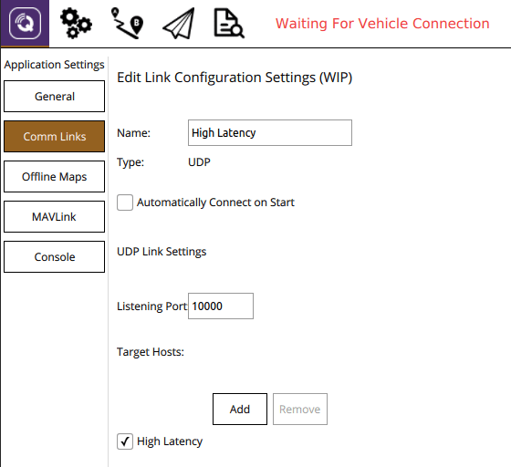

# Система супутникового зв'язку Iridium/RockBlock

Система супутникового зв'язку може використовуватись для забезпечення високого діапазону між наземною станцією та транспортним засобом.

Ця тема описує спосіб налаштування системи, яка використовує RockBlock як постачальника послуг для системи зв'язку зі супутниковими системами SBD.
З огляду на хорошу якість сигналу, користувачі можуть очікувати затримки від 10 до 15 секунд.

## Загальний огляд

Для посилання на супутникове зв'язку потрібні наступні компоненти:

- Модуль [Супутникового модему RockBlock 9603 Iridium](https://www.iridium.com/products/rock-seven-rockblock-9603/), підключений до Pixhawk, спалахнув за допомогою автопілота PX4.
- Сервер повторного повідомлення працює Ubuntu Linux.
- Автономний комп'ютер запущено _QGroundControl_ на Ubuntu Linux

Нижче показана вся архітектура системи:


:::info
The setup was tested with the current release of _QGroundControl_ running on Ubuntu 14.04 and 16.04.

- Можливо, можна запустити систему на інших наземних станціях і операційних системах, але це не було перевірено (і не гарантовано працює).
- Також можна використовувати модуль [RockBlock MK2](https://www.groundcontrol.com/us/product/rockblock-9602-satellite-modem/).
  Модуль RockBlock 9603 рекомендується оскільки він є меншим та легшим, одночасно забезпечує той самий функціонал.

:::

## Витрати

Посилання на посилання, що працює в Великобританії, складається з вартості оренди лінії та витрат на повідомлення:

- Кожен модуль повинен бути активований, який коштує 10,00 в місяць
- Кожне повідомлення, передане через систему, коштує один _кредит_ за 50 байт.
  Пакети кредитів можна купити від RockBlock за £0.04-£0.11 за кредит, в залежності від розміру пакета.

Звертайтесь до [документації RockBlock](https://docs.rockblock.rock7.com/docs) для детального пояснення модулів, оперативних витрат та _RockBlock_ загалом.

## Налаштування транспорту

### Підключення

Підключіть модуль RockBlock до послідовного порту Pixhawk.
Через вимоги до живлення модуля його можна живити лише через високопотужний послідовний порт, оскільки для роботи необхідно максимум 0,5 А при 5 В.
Якщо жоден з них недоступний або вільний, то інший джерело живлення, яке має той самий рівень землі, що й Pixhawk і може забезпечити необхідну потужність, повинно бути налаштоване.
Деталі щодо [роз'ємів](https://docs.rockblock.rock7.com/docs/connectors) та вимог до [живлення](https://docs.rockblock.rock7.com/docs/power-supply) можна знайти в документації RockBlock.

### Модулі

Модуль може використовувати як внутрішню антену, так і зовнішню, підключену до роз'єму SMA.
Для [перемикання між двома режимами антен](https://docs.rockblock.rock7.com/docs/switching-rockblock-9603-antenna-mode) потрібно змінити положення невеликого кабелю RF.
Якщо використовується зовнішня антена, завжди переконуйтеся, що антена підключена до модуля перед включенням живлення, щоб уникнути пошкодження модуля.

Стандартна швидкість передачі даних модуля - 19200. However, the PX4 _iridiumsbd_ driver requires a baud rate of 115200 so it needs to be changed using the [AT commands](https://www.groundcontrol.com/en/wp-content/uploads/2022/02/IRDM_ISU_ATCommandReferenceMAN0009_Rev2.0_ATCOMM_Oct2012.pdf).

1. Connect to the module with using a 19200/8-N-1 setting and check if the communication is working using the command: `AT`.
  Відповідь має бути: `OK`.

2. Змінити швидкість передачі:

  ```
  AT+IPR=9
  ```

3. Знову підключіться до моделі з параметрами 115200/8-N-1 і збережіть конфігурацію за допомогою:

  ```
  AT&W0
  ```

Модуль тепер готовий до використання з PX4.

### Програмне забезпечення

[Налаштуйте послідовний порт](../peripherals/serial_configuration.md), на якому буде працювати модуль RockBlock, використовуючи [ISBD_CONFIG](../advanced_config/parameter_reference.md#ISBD_CONFIG).
Немає потреби встановлювати швидкість передачі для порту, оскільки це налаштовано драйвером.

:::info
Якщо параметр конфігурації недоступний у _QGroundControl_, можливо, вам знадобиться [додати драйвер до мікропрограми](../peripherals/serial_configuration.md#parameter_not_in_firmware):

```
drivers/telemetry/iridiumsbd
```

:::

## Налаштування RockBlock

При придбанні першого модуля на RockBlock спочатку потрібно створити обліковий запис користувача.

Увійдіть у [зобліковий запис](https://rockblock.rock7.com/Operations) та зареєструйте модуль RockBlock в розділі `Мої RockBLOCKs`.
Активуйте оренду лінії для модуля та переконайтеся, що на обліковому записі є достатньо кредитів для очікуваного часу польоту.
Якщо використовуються налаштування за замовчуванням, з апаратури відправляється одне повідомлення на хвилину на наземну станцію.

Створіть групу доставки для реле-сервера повідомлень та додайте модуль до цієї групи доставки:


## Налаштування сервера станції

Сервер relay має бути запущений або на Ubuntu 16.04 або 14.04 OS.

1. Сервер, який працює як ретранслятор повідомлень, повинен мати статичну IP-адресу та два загальнодоступних відкритих TCP-порти:

  - `5672` для брокера повідомлень _RabbitMQ_ (можна змінити в налаштуваннях _rabbitmq_)
  - `45679` для інтерфейсу HTTP POST (можна змінити у файлі **relay.cfg**)

2. Встановіть необхідні модулі python:

  ```sh
  sudo pip install pika tornado future
  ```

3. Встановіть брокер повідомлень `rabbitmq`:

  ```sh
  sudo apt install rabbitmq-server
  ```

4. Налаштуйте облікові дані брокера (змініть PWD на ваш бажаний пароль):

  ```sh
  sudo rabbitmqctl add_user iridiumsbd PWD
  sudo rabbitmqctl set_permissions iridiumsbd ".*" ".*" ".*"
  ```

5. Клонувати репозиторій [SatComInfrastructure](https://github.com/acfloria/SatComInfrastructure.git):

  ```sh
  git clone https://github.com/acfloria/SatComInfrastructure.git
  ```

6. Перейдіть до розташування репозиторію _SatComInfrastructure_ і налаштуйте черги брокера:

  ```sh
  ./setup_rabbit.py localhost iridiumsbd PWD
  ```

7. Перевірте налаштування:

  ```sh
  sudo rabbitmqctl list_queues
  ```

  Це повинно дати вам список із 4 черг: `MO`, `MO_LOG`, `MT`, `MT_LOG`

8. Edit the `relay.cfg` configuration file to reflect your settings.

9. Запустіть скрипт реле в режимі відокремленого виконання:

  ```sh
  screen -dm bash -c 'cd SatcomInfrastructure/; ./relay.py
  ```

Інші інструкції включають:

- Від’єднати від екрану:

  ```sh
  ctrl+a d
  ```

- Припиніть виконання сценарію:

  ```sh
  ctrl+a :quit
  ```

- Знову приєднати до екрана:

  ```sh
  screen -dr
  ```

## Наземна станція

Для налаштування наземної станції:

1. Встановіть необхідні модулі python:

  ```sh
  sudo pip install pika tornado future
  ```

2. Клонуйте репозиторій SatComInfrastructure:

  ```sh
  git clone https://github.com/acfloria/SatComInfrastructure.git
  ```

3. Відредагуйте конфігураційний файл **udp2rabbit.cfg**, щоб відображати ваші налаштування.

4. [Встановить _QGroundControl_](https://docs.qgroundcontrol.com/master/en/qgc-user-guide/getting_started/download_and_install.html) (щоденна збірка).

5. Додавайте UDP з'єднання в QGC з параметрами:

  - Порт прослуховування: 10000
  - Цільові хости: 127.0.0.1:10001
  - Висока затримка: позначено

  

### Перевірка

1. Відкрийте термінал на комп'ютері наземної станції та перейдіть до розташування репозиторію _SatComInfrastructure_.
  Потім запустіть скрипт **udp2rabbit.py**:

  ```sh
  ./udp2rabbit.py
  ```

2. Надішліть тестове повідомлення з облікового запису [RockBlock](https://rockblock.rock7.com/Operations) до створеної групи доставки на вкладці `Тестові групи доставки`.

Якщо в терміналі, де запущений скрипт `udp2rabbit.py`, протягом кількох секунд можна спостерігати підтвердження для повідомлення, то група доставки RockBlock, реле-сервер та скрипт udp2rabbit налаштовані правильно:


## Запуск системи

1. Запустіть _QGroundControl_.
  Спочатку вручну підключіть високо запізнюваний зв'язок, а потім звичайний телеметрійний зв'язок:

  

2. Відкрийте термінал на комп'ютері наземної станції та перейдіть до розташування репозиторію _SatComInfrastructure_.
  Потім запустіть скрипт **udp2rabbit.py**:

  ```sh
  ./udp2rabbit.py
  ```

3. Увімкніть транспортний засіб.

4. Дочекайтеся, доки на QGC не буде отримано перше повідомлення `HIGH_LATENCY2`.
  Це можна перевірити за допомогою віджету _Інспектора MAVLink_ або на панелі інструментів за допомогою _індикатора зв'язку(LinkIndicator)_.
  Це можна перевірити за допомогою віджету _Інспектора MAVLink_ або на панелі інструментів за допомогою _індикатора зв'язку(LinkIndicator)_:

  

  Індикатор зв'язку завжди показує назву пріоритетного зв'язку.

5. Супутникова система зв'язку тепер готова до використання.
  Пріоритетний зв'язок, через який надсилаються команди, визначається наступними способами:

  - Якщо користувач не вказав зв'язок, звичайний радіо телеметрійний зв'язок віддається перевагу перед високозапізнюваним зв'язком.
  - Автопілот та QGC перехоплюватимуть звичайний радіо телеметрійний зв'язок на високозапізнюваний зв'язок, якщо транспортний засіб зброєний, а радіо телеметрійний зв'язок втрачений (не отримано жодного повідомлення MAVLink протягом певного часу).
    Як тільки радіо телеметрійний зв'язок відновлюється, QGC та автопілот повертаються до нього.
  - Користувач може вибрати пріоритетний зв'язок через індикатор зв'язку на панелі інструментів.
    Це посилання зберігається як пріоритетне посилання, поки воно активне або користувач вибирає інше пріоритетне посилання:

    

## Усунення проблем

- Повідомлення з супутникового зв'язку від літака отримуються, але команди не можуть бути передані (транспортний засіб не реагує)
  - Перевірте налаштування реле-сервера і переконайтеся, що вони правильні, особливо IMEI.

- Повідомлення з супутникового зв'язку від літака не надходять на наземну станцію:

  - Перевірте за допомогою системної консолі, чи запущено драйвер _iridiumsbd_, і якщо так, чи приймається сигнал від будь-якого супутника модулем:

    ```sh
    iridiumsbd status
    ```

  - Впевніться за допомогою перевірочних кроків вище, що реле-сервер, група доставки і скрипт `udp2rabbit.py` налаштовані правильно.

  - Перевірте, чи з'єднання активне, і чи налаштування в ньому правильні.

- Драйвер IridiumSBD не запускається:

  - Перезапустіть транспортний засіб.
    Якщо це допомагає, збільште час затримки в `extras.txt`, перед тим як драйвер буде запущений.
    Якщо це не допомагає, переконайтеся, що Pixhawk і модуль мають одинаковий рівень ґрунту. Підтвердіть також, що швидкість передачі даних модуля встановлена на 115200.

- Перше повідомлення отримане на землі, але як тільки транспортний засіб літає, жодне повідомлення не може бути передане, або затримка значно збільшується (в розмірах хвилин)
  - Перевірте якість сигналу після польоту.
    Якщо вона зменшується під час польоту, і ви використовуєте внутрішню антену, розгляньте можливість використання зовнішньої антени.
    Якщо ви вже використовуєте зовнішню антену, спробуйте віддалити антену якнайдалі від будь-якої електроніки або будь-якого обладнання, яке може перешкоджати сигналу.
    Також переконайтеся, що антена не пошкоджена.
